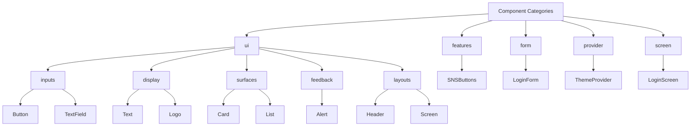
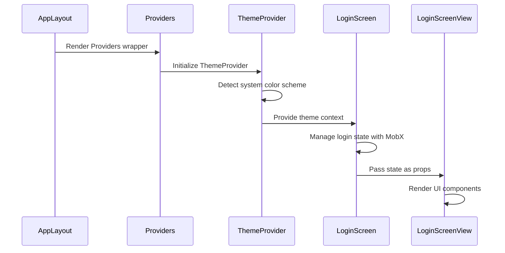
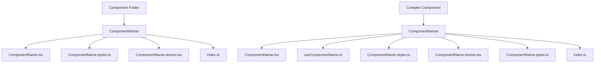

# Component Architecture

<cite>
**Referenced Files in This Document**   
- [components/index.ts](file://components/index.ts)
- [components/ui/index.ts](file://components/ui/index.ts)
- [components/ui/display/ComponentShowcase/ComponentShowcase.tsx](file://components/ui/display/ComponentShowcase/ComponentShowcase.tsx)
- [components/ui/inputs/index.ts](file://components/ui/inputs/index.ts)
- [components/ui/display/index.ts](file://components/ui/display/index.ts)
- [components/ui/layouts/index.ts](file://components/ui/layouts/index.ts)
- [components/ui/surfaces/index.ts](file://components/ui/surfaces/index.ts)
- [components/features/index.ts](file://components/features/index.ts)
- [components/form/index.ts](file://components/form/index.ts)
- [components/provider/index.tsx](file://components/provider/index.tsx)
- [components/screen/index.ts](file://components/screen/index.ts)
- [components/ui/layouts/Screen/index.ts](file://components/ui/layouts/Screen/index.ts)
- [components/ui/layouts/Screen/Screen.tsx](file://components/ui/layouts/Screen/Screen.tsx)
- [components/features/SNSButtons/SNSButtons.tsx](file://components/features/SNSButtons/SNSButtons.tsx)
- [components/form/LoginForm/LoginForm.tsx](file://components/form/LoginForm/LoginForm.tsx)
- [components/screen/LoginScreen/LoginScreen.tsx](file://components/screen/LoginScreen/LoginScreen.tsx)
- [components/provider/ThemeProvider/ThemeProvider.tsx](file://components/provider/ThemeProvider/ThemeProvider.tsx)
- [src/app/_layout.tsx](file://src/app/_layout.tsx)
- [constants/theme.ts](file://constants/theme.ts)
- [hooks/useTheme.ts](file://hooks/useTheme.ts)
- [unistyles.ts](file://unistyles.ts)
- [README.md](file://README.md)
</cite>

## Table of Contents

1. [Component Architecture Overview](#component-architecture-overview)
2. [Component Categories and Roles](#component-categories-and-roles)
3. [Architectural Patterns](#architectural-patterns)
4. [File Structure and Naming Conventions](#file-structure-and-naming-conventions)
5. [Component Composition and Export Patterns](#component-composition-and-export-patterns)
6. [Common Issues and Best Practices](#common-issues-and-best-practices)

## Component Architecture Overview

The Plate application implements an atomic design structure inspired by Material UI (MUI) standards, organizing components into a hierarchical system that promotes reusability, maintainability, and clear responsibility separation. The architecture follows MUI's categorization system while adapting it to the specific needs of the application. Components are organized into five main categories: ui, features, form, provider, and screen, each serving distinct purposes in the application ecosystem. This structure enables developers to quickly locate components based on their function and promotes consistency across the codebase. The design philosophy emphasizes clear separation between presentation and logic, with container components managing state and presentation components focusing solely on rendering UI elements.

**Section sources**

- [README.md](file://README.md#L268-L559)
- [components/index.ts](file://components/index.ts#L1-L5)

## Component Categories and Roles

The component architecture is organized into five distinct categories, each with specific responsibilities and use cases. The **ui** category contains MUI-standard reusable components that are project-independent and focused solely on UI/UX presentation without business logic. These are further subdivided into inputs (Button, TextField), display (Text, Logo), surfaces (Card, List), feedback (Alert, Toast), and layouts (Header, Screen). The **features** category houses project-specific components that may include domain logic and external service integrations, such as SNSButtons for social login functionality. The **form** category contains form components that combine input elements with validation logic, like the LoginForm that orchestrates email and password fields. The **provider** category manages global state and context, including the ThemeProvider for theme management. Finally, the **screen** category contains page-level components that represent complete views in the application, such as LoginScreen, which combines multiple components to create a full user interface.



**Diagram sources**

- [README.md](file://README.md#L274-L328)
- [components/index.ts](file://components/index.ts#L1-L5)

**Section sources**

- [README.md](file://README.md#L332-L385)
- [components/index.ts](file://components/index.ts#L1-L5)

## Architectural Patterns

The application implements several key architectural patterns to ensure maintainability and scalability. The container/presentation pattern is used throughout the codebase, separating components that manage state from those responsible for rendering. For example, LoginScreen acts as a container component that manages login state using MobX observables, while LoginScreenView serves as the presentation component that receives state as props and renders the UI. The provider pattern is implemented for theme management through the ThemeProvider, which uses React Context to make theme information available to all components in the application. This pattern allows for global state management without prop drilling. The application also follows a composition pattern where complex components are built by combining simpler ones, such as the SNSButtons component which composes multiple Button components with specific styling for different social platforms. The use of compound components is evident in elements like Button, which exposes subcomponents like Button.Label for more granular control over rendering.



**Diagram sources**

- [src/app/\_layout.tsx](file://src/app/_layout.tsx#L35-L43)
- [components/provider/ThemeProvider/ThemeProvider.tsx](file://components/provider/ThemeProvider/ThemeProvider.tsx#L31-L115)
- [components/screen/LoginScreen/LoginScreen.tsx](file://components/screen/LoginScreen/LoginScreen.tsx#L12-L27)

**Section sources**

- [components/provider/ThemeProvider/ThemeProvider.tsx](file://components/provider/ThemeProvider/ThemeProvider.tsx#L16-L132)
- [components/screen/LoginScreen/LoginScreen.tsx](file://components/screen/LoginScreen/LoginScreen.tsx#L12-L30)
- [components/features/SNSButtons/SNSButtons.tsx](file://components/features/SNSButtons/SNSButtons.tsx#L16-L61)

## File Structure and Naming Conventions

The component architecture follows strict naming conventions and file structure patterns to ensure consistency across the codebase. Category folders under the components directory use lowercase names (ui, features, form, provider, screen), while component folders use PascalCase (Button, LoginForm, LoginScreen). This distinction helps quickly identify the type of entity being referenced. Each component resides in its own folder named after the component using PascalCase, containing the main component file (ComponentName.tsx), optional style file (ComponentName.styles.ts), Storybook documentation (ComponentName.stories.tsx), and an index.ts file for exports. The index.ts files follow a standardized pattern, exporting the main component and any associated types. For simple components, the structure includes only the necessary files, while more complex components may include additional files for hooks, types, or styles. The ui category further organizes components into subcategories (inputs, display, surfaces, etc.) following the MUI standard, making it easy to locate components based on their function.



**Diagram sources**

- [README.md](file://README.md#L416-L438)
- [components/ui/inputs/Button/Button.tsx](file://components/ui/inputs/Button/Button.tsx#L1-L91)

**Section sources**

- [README.md](file://README.md#L388-L413)
- [components/ui/inputs/index.ts](file://components/ui/inputs/index.ts#L1-L6)

## Component Composition and Export Patterns

The component architecture employs a systematic approach to composition and export patterns that enhances reusability and maintainability. Each category folder contains an index.ts file that exports all components within that category, enabling clean imports from higher-level modules. The main components/index.ts file re-exports all category exports, providing a single entry point for importing any component in the application. Components are designed with composition in mind, allowing for flexible combination of simpler elements to create more complex interfaces. For example, the LoginForm component composes TextField components for input fields within a Card container, demonstrating how atomic components can be combined to create form-specific functionality. The export pattern follows a consistent structure where the main component is exported as a named export, while types and interfaces are also exported for type safety. Some components implement compound patterns, like the Button component which exposes a Button.Label subcomponent, allowing for more sophisticated composition while maintaining a clean API.

```mermaid
graph TD
A[components/index.ts] --> B[export * from './ui']
A --> C[export * from './features']
A --> D[export * from './form']
A --> E[export * from './provider']
A --> F[export * from './screen']
B --> G[ui/index.ts]
G --> H[export * from './inputs']
G --> I[export * from './display']
G --> J[export * from './surfaces']
G --> K[export * from './layouts']
H --> L[inputs/index.ts]
L --> M[export { Button } from './Button']
L --> N[export { TextField } from './TextField']
```

**Diagram sources**

- [components/index.ts](file://components/index.ts#L1-L5)
- [components/ui/index.ts](file://components/ui/index.ts#L1-L5)
- [components/ui/inputs/index.ts](file://components/ui/inputs/index.ts#L1-L6)

**Section sources**

- [components/index.ts](file://components/index.ts#L1-L5)
- [components/ui/index.ts](file://components/ui/index.ts#L1-L5)
- [components/form/LoginForm/LoginForm.tsx](file://components/form/LoginForm/LoginForm.tsx#L18-L53)

## Common Issues and Best Practices

When working with the component architecture, several common issues may arise that developers should be aware of. One frequent challenge is determining the appropriate category for a new component, which can be resolved by following the decision tree outlined in the documentation: reusable components belong in ui, project-specific features go in features, form-related components belong in form, global state providers go in provider, and complete pages go in screen. Another common issue is improper component composition, such as creating overly complex components that violate the single responsibility principle. Best practices include keeping components focused on a single purpose, using the container/presentation pattern to separate concerns, and leveraging the existing category structure rather than creating new categories. When adding new components, developers should follow the established naming conventions and file structure patterns, create appropriate Storybook documentation, and ensure proper type definitions are exported. The architecture is designed to be extensible, allowing for new categories to be added when necessary, but existing categories should be utilized whenever possible to maintain consistency.

**Section sources**

- [README.md](file://README.md#L490-L531)
- [components/ui/display/ComponentShowcase/ComponentShowcase.tsx](file://components/ui/display/ComponentShowcase/ComponentShowcase.tsx#L36-L100)
