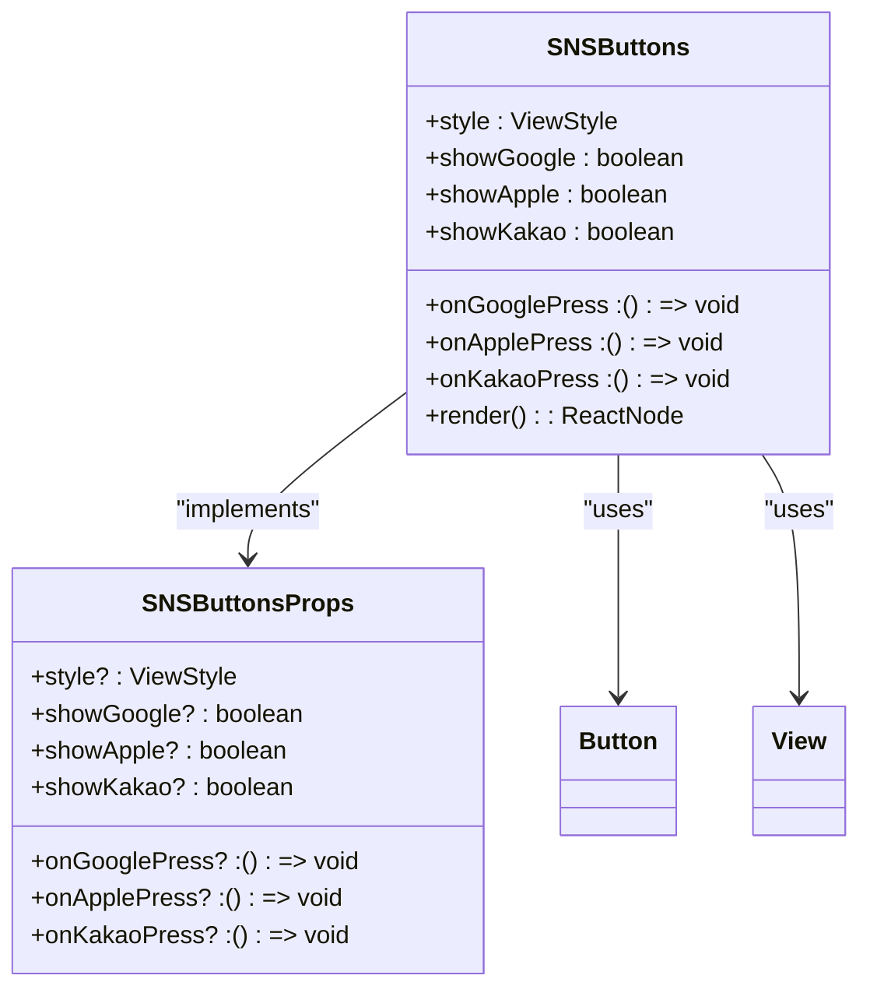
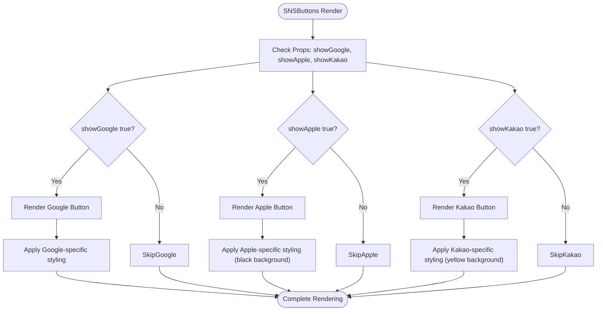
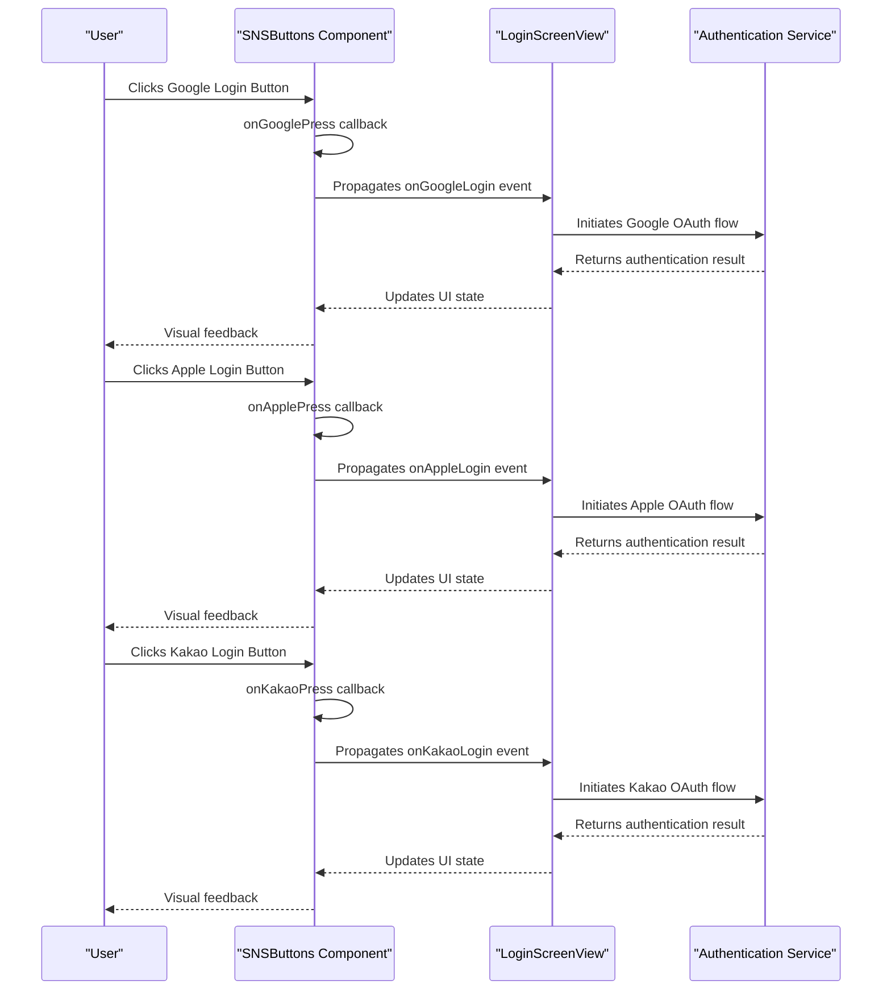
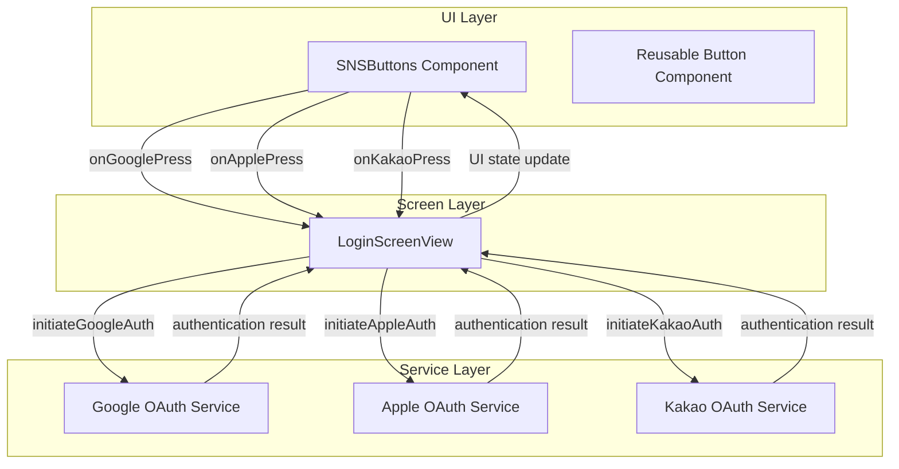
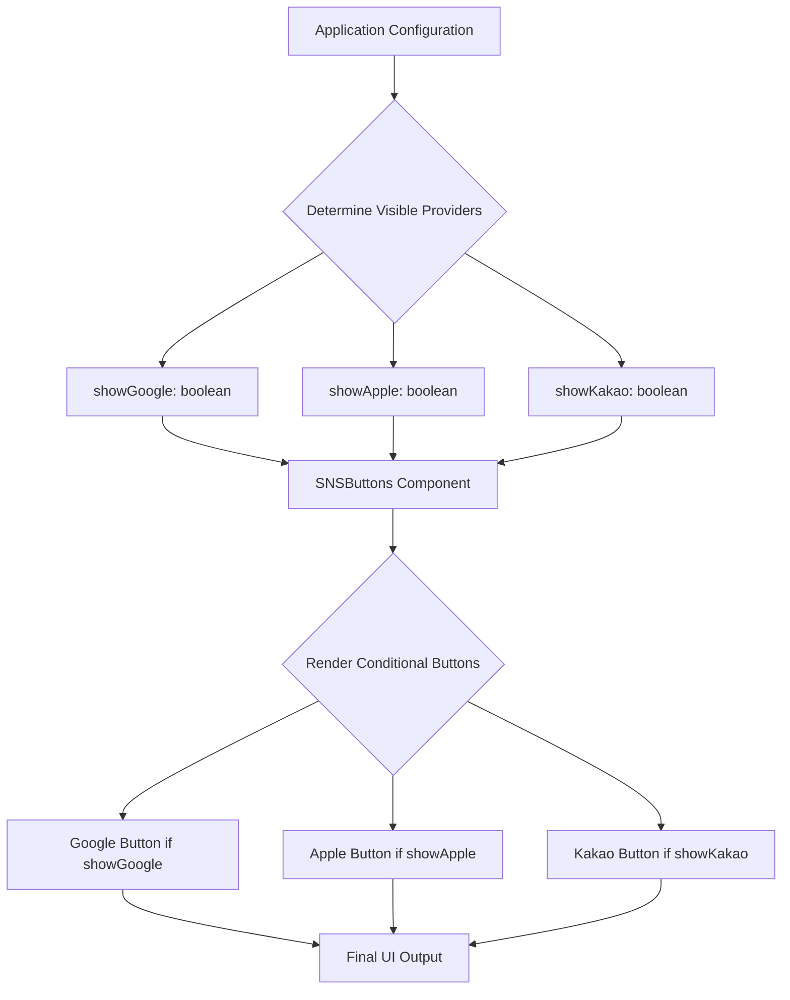

# Feature Components

<cite>
**Referenced Files in This Document**   
- [SNSButtons.tsx](file://components/features/SNSButtons/SNSButtons.tsx)
- [SNSButtons.stories.tsx](file://components/features/SNSButtons/SNSButtons.stories.tsx)
- [LoginScreenView.tsx](file://components/screen/LoginScreen/LoginScreenView.tsx)
- [LoginScreen.tsx](file://components/screen/LoginScreen/LoginScreen.tsx)
- [LoginScreen.stories.tsx](file://components/screen/LoginScreen/LoginScreen.stories.tsx)
</cite>

## Table of Contents
1. [Introduction](#introduction)
2. [Feature Components Overview](#feature-components-overview)
3. [SNSButtons Component Architecture](#snsbuttons-component-architecture)
4. [Implementation and Integration](#implementation-and-integration)
5. [Configuration and Usage Patterns](#configuration-and-usage-patterns)
6. [Extending the Feature Component System](#extending-the-feature-component-system)
7. [Conclusion](#conclusion)

## Introduction
This document provides comprehensive documentation for the feature components in the Plate application, with a primary focus on the SNSButtons component. Feature components represent project-specific elements that encapsulate domain logic and integrate with external services, serving as a bridge between reusable UI components and business requirements. The SNSButtons component exemplifies this pattern by implementing social authentication flows for Google, Apple, and Kakao providers while maintaining separation between UI rendering and OAuth logic.

**Section sources**
- [SNSButtons.tsx](file://components/features/SNSButtons/SNSButtons.tsx#L1-L81)
- [LoginScreenView.tsx](file://components/screen/LoginScreen/LoginScreenView.tsx#L1-L150)

## Feature Components Overview
Feature components in the Plate application are specialized elements designed to encapsulate domain-specific functionality and integrate with external services. Unlike reusable UI components found in the `components/ui` directory, feature components contain business logic and API integrations that are specific to the application's requirements. These components serve as intermediaries between generic UI elements and the application's core functionality, providing a structured approach to implementing complex features.

The key characteristics of feature components include:
- Encapsulation of domain logic and business rules
- Integration with external services and APIs
- Configuration options for visibility and behavior
- Event handling mechanisms for user interactions
- Separation of concerns between presentation and functionality

Feature components are organized within the `components/features` directory and are designed to be imported and used by higher-level screen components. They differ from reusable UI components by containing application-specific logic rather than generic presentation elements.

**Section sources**
- [SNSButtons.tsx](file://components/features/SNSButtons/SNSButtons.tsx#L1-L81)
- [LoginScreenView.tsx](file://components/screen/LoginScreen/LoginScreenView.tsx#L1-L150)

## SNSButtons Component Architecture

### Component Structure and Design
The SNSButtons component implements a clean separation between UI rendering and authentication logic, following React best practices for component design. The component is implemented as a functional component with TypeScript interfaces defining its props and behavior.

**Diagram sources**
- [SNSButtons.tsx](file://components/features/SNSButtons/SNSButtons.tsx#L6-L13)
- [SNSButtons.tsx](file://components/features/SNSButtons/SNSButtons.tsx#L16-L61)

### Separation of UI and Logic
The SNSButtons component maintains a clear separation between its user interface and authentication logic. The UI rendering is handled entirely within the component's JSX structure, while the authentication logic is delegated to callback functions passed as props. This design pattern allows for complete decoupling of the visual presentation from the authentication implementation.

The component uses conditional rendering to control the visibility of individual social login buttons based on the `showGoogle`, `showApple`, and `showKakao` props. Each button is implemented using the reusable Button component from the UI library, with specific styling applied to match the branding requirements of each social provider.

**Diagram sources**
- [SNSButtons.tsx](file://components/features/SNSButtons/SNSButtons.tsx#L27-L58)
- [SNSButtons.tsx](file://components/features/SNSButtons/SNSButtons.tsx#L63-L78)

### Event Handling Mechanism
The SNSButtons component implements an event-driven architecture for handling user interactions with social login buttons. The component accepts callback functions as props (`onGooglePress`, `onApplePress`, `onKakaoPress`) which are triggered when the corresponding buttons are pressed.

**Diagram sources**
- [SNSButtons.tsx](file://components/features/SNSButtons/SNSButtons.tsx#L31-L32)
- [SNSButtons.tsx](file://components/features/SNSButtons/SNSButtons.tsx#L42-L43)
- [SNSButtons.tsx](file://components/features/SNSButtons/SNSButtons.tsx#L53-L54)
- [LoginScreenView.tsx](file://components/screen/LoginScreen/LoginScreenView.tsx#L17-L19)

**Section sources**
- [SNSButtons.tsx](file://components/features/SNSButtons/SNSButtons.tsx#L7-L9)
- [LoginScreenView.tsx](file://components/screen/LoginScreen/LoginScreenView.tsx#L16-L19)

## Implementation and Integration

### Integration with Authentication Services
The SNSButtons component integrates with external authentication services through a well-defined interface that separates the UI from the authentication implementation. When a user interacts with a social login button, the component triggers the corresponding callback function, which is implemented by the parent component (typically a screen-level component).

The LoginScreenView component serves as the integration point between the SNSButtons component and the authentication services. It receives the callback functions as props and implements the actual OAuth flows for each provider. This architecture allows for complete separation of concerns, where the SNSButtons component focuses solely on UI presentation while the authentication logic is managed at the screen level.

**Diagram sources**
- [SNSButtons.tsx](file://components/features/SNSButtons/SNSButtons.tsx#L7-L9)
- [LoginScreenView.tsx](file://components/screen/LoginScreen/LoginScreenView.tsx#L16-L19)

### State Management Pattern
The Plate application employs a state management pattern where screen-level components handle authentication state and propagate it to feature components through props. The LoginScreen component uses MobX for state management, maintaining observables for email and password fields, while the LoginScreenView component receives these values as props.

This pattern ensures that feature components like SNSButtons remain stateless and focused on their primary responsibility of rendering UI elements and handling user interactions. The state management is centralized at the screen level, making it easier to coordinate multiple feature components and maintain consistency across the user interface.

**Section sources**
- [LoginScreen.tsx](file://components/screen/LoginScreen/LoginScreen.tsx#L1-L29)
- [LoginScreenView.tsx](file://components/screen/LoginScreen/LoginScreenView.tsx#L11-L22)

## Configuration and Usage Patterns

### Visibility Configuration
The SNSButtons component provides flexible configuration options for controlling the visibility of individual social login buttons. The `showGoogle`, `showApple`, and `showKakao` props allow developers to selectively display or hide specific authentication options based on application requirements or user preferences.

By default, all social login buttons are visible (default value of `true`), but this behavior can be overridden when instantiating the component. This configuration system enables dynamic control over the authentication interface, allowing for scenarios such as:
- Region-specific authentication options
- A/B testing of different login flows
- Progressive feature rollout
- User preference-based customization

**Diagram sources**
- [SNSButtons.tsx](file://components/features/SNSButtons/SNSButtons.tsx#L11-L13)
- [SNSButtons.tsx](file://components/features/SNSButtons/SNSButtons.tsx#L21-L23)

### Styling and Theming
The SNSButtons component implements provider-specific styling to match the branding guidelines of each social authentication provider. The component uses React Native's StyleSheet to define styles for each button type:
- Google: Bordered style with default button styling
- Apple: Solid style with black background (#000000)
- Kakao: Solid style with yellow background (#FEE500)

These styles are defined within the component and applied conditionally based on the button type. The component also accepts a `style` prop that allows for additional styling to be applied at the container level, enabling integration with the application's overall design system.

**Section sources**
- [SNSButtons.tsx](file://components/features/SNSButtons/SNSButtons.tsx#L63-L78)

## Extending the Feature Component System

### Adding New Social Providers
The SNSButtons component architecture is designed to be extensible, allowing for the addition of new social authentication providers with minimal changes to the existing codebase. To add a new provider (e.g., Facebook, Twitter, or Microsoft), developers would need to:

1. Add a new prop to the SNSButtonsProps interface for the provider's callback function
2. Add a new prop for controlling the visibility of the provider's button
3. Implement the button rendering with appropriate styling and branding
4. Update documentation and storybook examples

This extensibility is achieved through the component's modular design, where each social login option is implemented as an independent conditional rendering block.

### Best Practices for Feature Component Development
When developing new feature components for the Plate application, consider the following best practices:
- Maintain clear separation between UI and business logic
- Use TypeScript interfaces to define component props and ensure type safety
- Implement configurable visibility and behavior options
- Leverage reusable UI components from the component library
- Follow consistent naming conventions and code structure
- Provide comprehensive documentation and storybook examples
- Implement error handling and edge case management
- Ensure accessibility compliance

These practices ensure that feature components remain maintainable, testable, and consistent with the overall architecture of the application.

**Section sources**
- [SNSButtons.tsx](file://components/features/SNSButtons/SNSButtons.tsx#L6-L13)
- [SNSButtons.stories.tsx](file://components/features/SNSButtons/SNSButtons.stories.tsx#L1-L108)

## Conclusion
The SNSButtons component exemplifies the feature component pattern in the Plate application, providing a robust solution for implementing social authentication flows while maintaining separation of concerns. By encapsulating domain logic and integrating with external services, feature components like SNSButtons serve as essential building blocks for complex application functionality.

The component's architecture demonstrates effective patterns for UI/logic separation, event handling, and configuration management. Its integration with the LoginScreenView component illustrates how feature components fit into the broader application architecture, serving as specialized elements that bridge reusable UI components with business requirements.

As the application evolves, the extensible design of the SNSButtons component will facilitate the addition of new authentication providers and adaptation to changing requirements, ensuring the continued effectiveness of the feature component system.

**Section sources**
- [SNSButtons.tsx](file://components/features/SNSButtons/SNSButtons.tsx#L1-L81)
- [LoginScreenView.tsx](file://components/screen/LoginScreen/LoginScreenView.tsx#L1-L150)