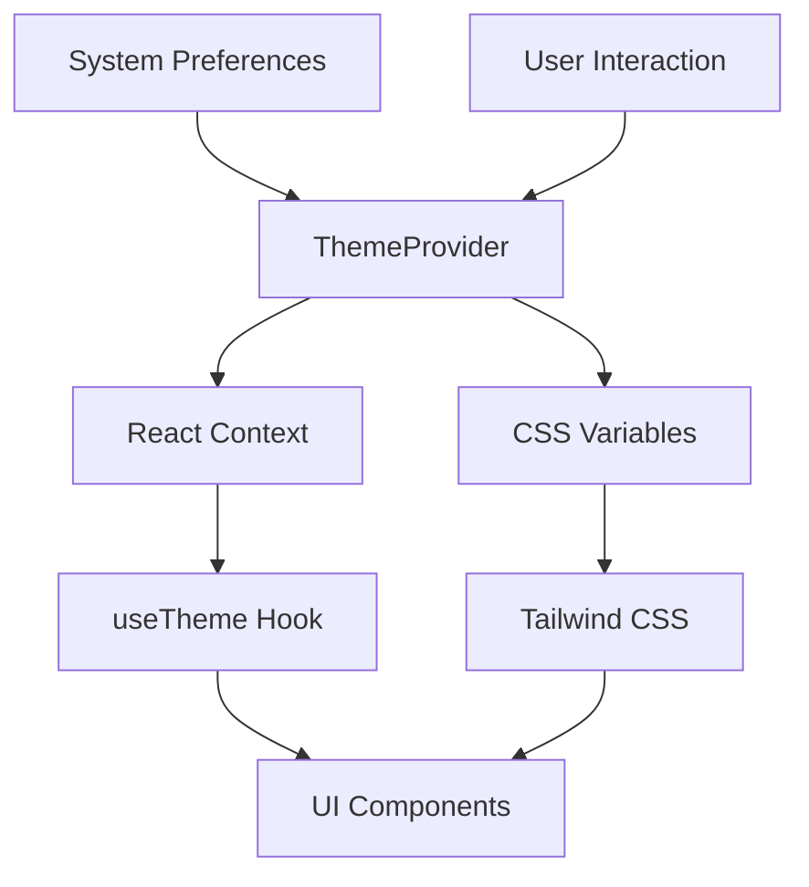
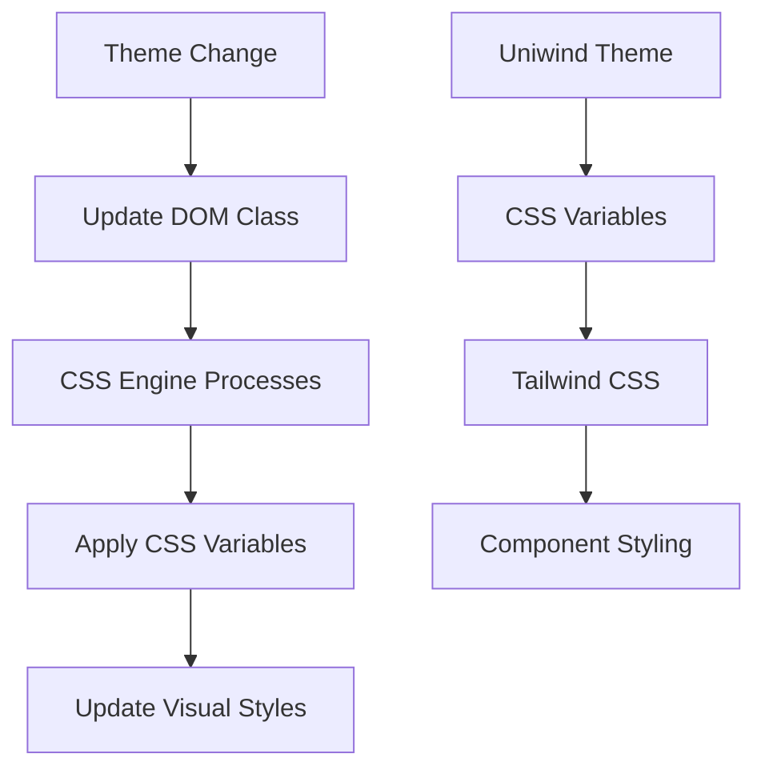
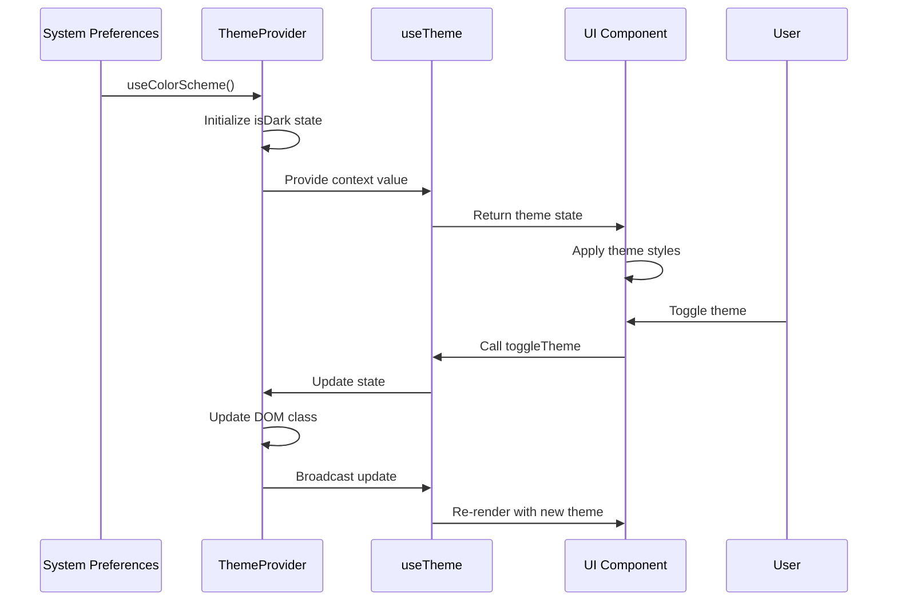
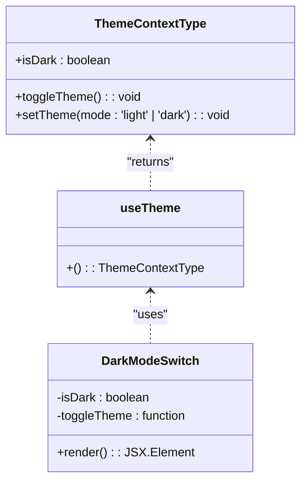

# Provider Components

<cite>
**Referenced Files in This Document**   
- [ThemeProvider.tsx](file://components/provider/ThemeProvider/ThemeProvider.tsx)
- [useTheme.ts](file://hooks/useTheme.ts)
- [unistyles.ts](file://unistyles.ts)
- [DarkModeSwitch.tsx](file://components/ui/inputs/DarkModeSwitch/DarkModeSwitch.tsx)
- [theme.ts](file://constants/theme.ts)
- [globals.css](file://globals.css)
</cite>

## Table of Contents

1. [Introduction](#introduction)
2. [Theme Provider Architecture](#theme-provider-architecture)
3. [Context Implementation](#context-implementation)
4. [CSS Variable Integration](#css-variable-integration)
5. [Theme Data Flow](#theme-data-flow)
6. [Dark/Light Mode Toggling](#darklight-mode-toggling)
7. [System Preference Detection](#system-preference-detection)
8. [CSS-in-JS with Uniwind](#css-in-js-with-uniwind)
9. [Consuming Theme Context](#consuming-theme-context)
10. [Extending Global State](#extending-global-state)
11. [Performance Considerations](#performance-considerations)
12. [Best Practices](#best-practices)

## Introduction

The Plate application implements a sophisticated theme management system using React Context for global state management. The ThemeProvider component serves as the central mechanism for managing dark/light mode preferences across the application. This documentation details the architecture and implementation of the theme system, focusing on the integration of React Context, CSS variables, and the Uniwind CSS-in-JS solution. The system supports automatic detection of system preferences, manual theme toggling, and seamless integration with Tailwind CSS for consistent styling across components.

## Theme Provider Architecture

The theme system in the Plate application follows a layered architecture that combines React Context for state management with CSS variables for styling. The ThemeProvider component wraps the application and provides theme state to all child components through React Context. This architecture enables global access to theme information while maintaining performance through efficient state updates. The system integrates with Uniwind, a CSS-in-JS solution that converts theme definitions into CSS variables, allowing the browser's CSS engine to handle theme changes rather than relying on JavaScript processing.

**Diagram sources**

- [ThemeProvider.tsx](file://components/provider/ThemeProvider/ThemeProvider.tsx#L1-L132)
- [useTheme.ts](file://hooks/useTheme.ts#L1-L41)

**Section sources**

- [ThemeProvider.tsx](file://components/provider/ThemeProvider/ThemeProvider.tsx#L1-L132)
- [unistyles.ts](file://unistyles.ts#L1-L445)

## Context Implementation

The ThemeProvider implements React Context to manage theme state globally. It creates a context object with the ThemeContextType interface that defines the shape of the theme data, including the isDark boolean flag, toggleTheme function, and setTheme function. The provider component initializes the theme state based on either the initialTheme prop or the system's color scheme preference. The context value is then made available to all descendant components through the ThemeContext.Provider component, enabling access to theme state and manipulation functions throughout the component tree.

**Section sources**

- [ThemeProvider.tsx](file://components/provider/ThemeProvider/ThemeProvider.tsx#L10-L18)
- [ThemeProvider.tsx](file://components/provider/ThemeProvider/ThemeProvider.tsx#L110-L114)

## CSS Variable Integration

The theme system integrates with CSS variables to enable efficient theme switching. When the theme changes, the system updates the DOM by adding or removing the 'dark' class from the documentElement. This approach leverages Tailwind CSS's @variant dark directive, allowing CSS rules to respond to the presence of the dark class. The Uniwind library automatically converts theme definitions into CSS variables, which are then used by Tailwind CSS to apply appropriate styles. This integration eliminates the need for heavy JavaScript processing during theme changes, as the browser's CSS engine handles the style updates.

**Diagram sources**

- [ThemeProvider.tsx](file://components/provider/ThemeProvider/ThemeProvider.tsx#L50-L58)
- [globals.css](file://globals.css#L1-L7)

**Section sources**

- [ThemeProvider.tsx](file://components/provider/ThemeProvider/ThemeProvider.tsx#L50-L92)
- [unistyles.ts](file://unistyles.ts#L25-L239)

## Theme Data Flow

The data flow for theme management begins with system preference detection using React Native's useColorScheme hook. This information is used to initialize the theme state in the ThemeProvider. When the theme changes—either through user interaction or system preference changes—the state update triggers a re-render of the context provider. The updated context value propagates down to all consuming components through the useTheme hook. Components that use the theme context automatically re-render with the updated theme information, ensuring consistent appearance across the application. The integration with Uniwind ensures that CSS variables are updated simultaneously, providing a seamless visual transition.

**Diagram sources**

- [ThemeProvider.tsx](file://components/provider/ThemeProvider/ThemeProvider.tsx#L35-L49)
- [useTheme.ts](file://hooks/useTheme.ts#L19-L40)

**Section sources**

- [ThemeProvider.tsx](file://components/provider/ThemeProvider/ThemeProvider.tsx#L35-L114)
- [useTheme.ts](file://hooks/useTheme.ts#L19-L40)

## Dark/Light Mode Toggling

The theme system provides two functions for managing dark/light mode: toggleTheme and setTheme. The toggleTheme function inverts the current theme state, switching between dark and light modes. The setTheme function allows explicit setting of the theme to either 'light' or 'dark' mode. Both functions update the isDark state and modify the DOM by adding or removing the 'dark' class from the documentElement. This DOM manipulation triggers CSS rules that depend on the dark variant, ensuring immediate visual feedback. The functions are exposed through the context value, making them accessible to any component within the provider's scope.

**Section sources**

- [ThemeProvider.tsx](file://components/provider/ThemeProvider/ThemeProvider.tsx#L61-L93)
- [useTheme.ts](file://hooks/useTheme.ts#L27-L33)

## System Preference Detection

The ThemeProvider automatically detects the user's system preference for dark or light mode using React Native's useColorScheme hook. During initialization, the component checks for an initialTheme prop; if not provided, it falls back to the system's color scheme preference. This ensures that the application respects the user's system-wide theme settings by default. The useEffect hook in the ThemeProvider monitors both the initialTheme prop and the systemColorScheme, updating the component's state accordingly. This automatic detection provides a seamless user experience, as the application adapts to system preferences without requiring manual configuration.

**Section sources**

- [ThemeProvider.tsx](file://components/provider/ThemeProvider/ThemeProvider.tsx#L39-L49)
- [useTheme.ts](file://hooks/useTheme.ts#L21-L22)

## CSS-in-JS with Uniwind

The Plate application uses Uniwind as its CSS-in-JS solution, integrating it with the theme system for efficient styling. Uniwind converts theme definitions into CSS variables, which are then consumed by Tailwind CSS. The unistyles.ts file defines comprehensive design tokens for both light and dark themes, including color scales, spacing, typography, and shadows. These tokens are registered with Uniwind and made available throughout the application. The integration allows components to access theme-aware styles while maintaining the performance benefits of CSS variables. The system supports both platform-specific styling and responsive design through Uniwind's variant system.

**Section sources**

- [unistyles.ts](file://unistyles.ts#L1-L445)
- [useTheme.ts](file://hooks/useTheme.ts#L7-L8)

## Consuming Theme Context

Components consume the theme context through the useTheme hook, which provides access to the current theme state and manipulation functions. The hook validates that it is used within a ThemeProvider context, throwing an error if used incorrectly. Components can use the isDark boolean to conditionally apply styles or render different content based on the current theme. The toggleTheme and setTheme functions allow components to modify the global theme state, triggering updates across the entire application. The DarkModeSwitch component demonstrates this pattern by using the isDark value to determine which icon to display and calling toggleTheme when pressed.

**Diagram sources**

- [ThemeProvider.tsx](file://components/provider/ThemeProvider/ThemeProvider.tsx#L10-L14)
- [useTheme.ts](file://hooks/useTheme.ts#L10-L15)
- [DarkModeSwitch.tsx](file://components/ui/inputs/DarkModeSwitch/DarkModeSwitch.tsx#L13-L14)

**Section sources**

- [useTheme.ts](file://hooks/useTheme.ts#L19-L40)
- [DarkModeSwitch.tsx](file://components/ui/inputs/DarkModeSwitch/DarkModeSwitch.tsx#L1-L33)

## Extending Global State

While the current implementation focuses on theme management, the provider pattern can be extended to manage additional global states. Multiple context providers can be composed to manage different aspects of global state, such as user preferences, localization settings, or application configuration. The ThemeProvider pattern demonstrates best practices for context implementation, including proper typing, error handling for incorrect usage, and efficient state updates. Future extensions could include additional providers for features like language selection, accessibility settings, or user authentication state, all following the same architectural principles.

**Section sources**

- [ThemeProvider.tsx](file://components/provider/ThemeProvider/ThemeProvider.tsx#L16-L18)
- [useTheme.ts](file://hooks/useTheme.ts#L10-L15)

## Performance Considerations

The theme system is designed with performance in mind, leveraging CSS variables to minimize JavaScript overhead during theme changes. By updating DOM classes rather than re-rendering components, the system allows the browser's CSS engine to handle style updates efficiently. The use of React Context is optimized by memoizing the context value object, preventing unnecessary re-renders of consuming components. The integration with Uniwind ensures that theme changes are processed at the CSS level, reducing the performance impact of theme switching. For components that don't need to respond to theme changes, the system avoids unnecessary re-renders by allowing selective consumption of context values.

**Section sources**

- [ThemeProvider.tsx](file://components/provider/ThemeProvider/ThemeProvider.tsx#L61-L93)
- [unistyles.ts](file://unistyles.ts#L4071-L4180)

## Best Practices

The theme implementation follows several best practices for React context and global state management. The context is properly typed using TypeScript interfaces, ensuring type safety throughout the application. The useTheme hook includes validation to prevent usage outside of the provider, improving developer experience. The system respects system preferences by default while allowing user override, balancing automation with user control. The separation of theme logic from presentation components promotes reusability and maintainability. The integration with established libraries like Tailwind CSS and Uniwind leverages community best practices for styling and theme management.

**Section sources**

- [ThemeProvider.tsx](file://components/provider/ThemeProvider/ThemeProvider.tsx#L125-L130)
- [useTheme.ts](file://hooks/useTheme.ts#L25-L26)
