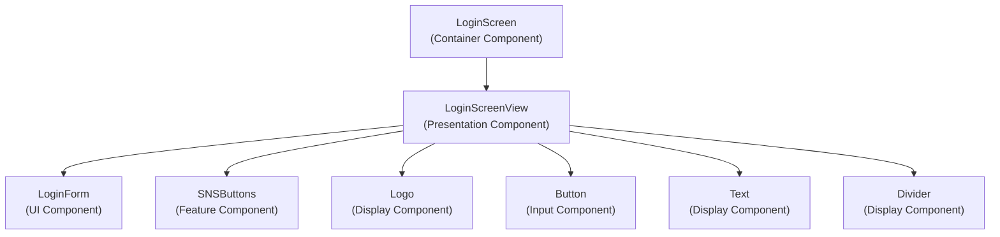
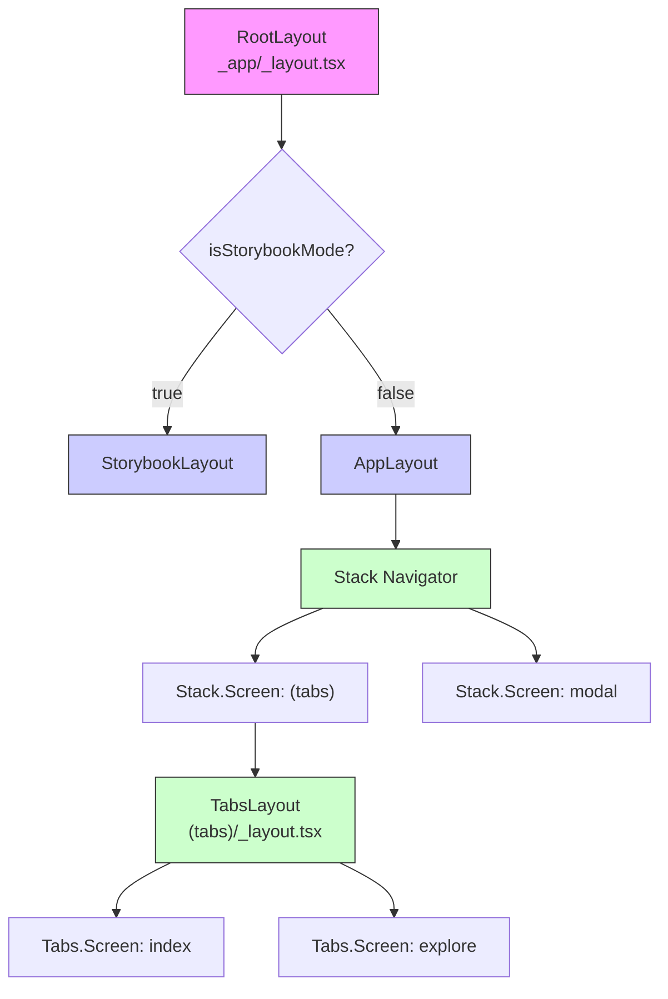
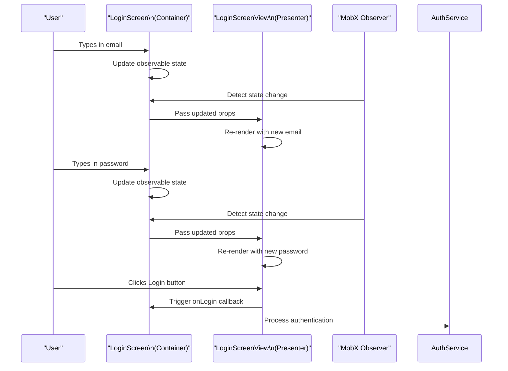
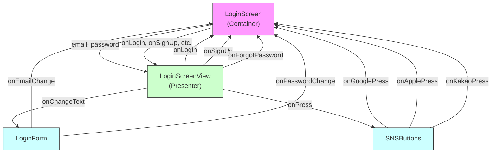

# Screen Components

<cite>
**Referenced Files in This Document**   
- [LoginScreen.tsx](file://components/screen/LoginScreen/LoginScreen.tsx)
- [LoginScreenView.tsx](file://components/screen/LoginScreen/LoginScreenView.tsx)
- [LoginForm.tsx](file://components/form/LoginForm/LoginForm.tsx)
- [SNSButtons.tsx](file://components/features/SNSButtons/SNSButtons.tsx)
- [Screen.tsx](file://components/ui/layouts/Screen/Screen.tsx)
- [ScreenView.tsx](file://components/ui/layouts/Screen/ScreenView.tsx)
- [_layout.tsx](file://src/app/_layout.tsx)
- [(tabs)/_layout.tsx](file://src/app/(tabs)/_layout.tsx)
</cite>

## Table of Contents

1. [Introduction](#introduction)
2. [Core Composition of Screen Components](#core-composition-of-screen-components)
3. [Container/Presenter Pattern Implementation](#containerpresenter-pattern-implementation)
4. [Navigation and Routing Integration](#navigation-and-routing-integration)
5. [State Management with MobX](#state-management-with-mobx)
6. [Layout and Safe Area Handling](#layout-and-safe-area-handling)
7. [Data Flow and Prop Drilling](#data-flow-and-prop-drilling)
8. [Best Practices for Screen Composition](#best-practices-for-screen-composition)
9. [Performance Optimization](#performance-optimization)
10. [Accessibility Considerations](#accessibility-considerations)

## Introduction

Screen components in the Plate application represent complete page-level units that orchestrate multiple UI and feature components into cohesive user experiences. These components serve as the primary interface between navigation routes and the underlying application functionality, combining presentation logic with state management to deliver fully functional pages. The LoginScreen serves as a prime example of this architectural pattern, demonstrating how form components, social login buttons, and layout structures are composed into a unified authentication interface.

## Core Composition of Screen Components

Screen components function as complete page-level containers that integrate various UI elements into a unified experience. The LoginScreen exemplifies this composition by combining the LoginForm and SNSButtons components into a cohesive authentication interface. This hierarchical structure enables separation of concerns while maintaining a clear parent-child relationship between the screen and its constituent parts. The screen component acts as the orchestrator, managing the overall layout, state, and interactions between its child components.



**Diagram sources**

- [LoginScreen.tsx](file://components/screen/LoginScreen/LoginScreen.tsx)
- [LoginScreenView.tsx](file://components/screen/LoginScreen/LoginScreenView.tsx)
- [LoginForm.tsx](file://components/form/LoginForm/LoginForm.tsx)
- [SNSButtons.tsx](file://components/features/SNSButtons/SNSButtons.tsx)

**Section sources**

- [LoginScreen.tsx](file://components/screen/LoginScreen/LoginScreen.tsx#L1-L30)
- [LoginScreenView.tsx](file://components/screen/LoginScreen/LoginScreenView.tsx#L1-L151)

## Container/Presenter Pattern Implementation

The Plate application implements the container/presenter pattern through the separation of LoginScreen and LoginScreenView components. The LoginScreen acts as the container component, responsible for state management and business logic, while LoginScreenView serves as the presenter, handling only the visual representation and user interface. This architectural decision promotes reusability and testability by isolating stateful logic from presentation concerns.

The container component manages the authentication state using MobX observables, while the presenter component receives this state as immutable props. This unidirectional data flow ensures predictable state changes and simplifies debugging. The pattern also facilitates easier UI testing, as the presenter component can be tested in isolation with mocked data without requiring the full state management infrastructure.

```mermaid
classDiagram
class LoginScreen {
+observable email : string
+observable password : string
-loginState : object
+observer wrapper
}
class LoginScreenView {
+email : string
+password : string
+onLogin : function
+onSignUp : function
+onForgotPassword : function
+onGoogleLogin : function
+onAppleLogin : function
+onKakaoLogin : function
+style : ViewStyle
}
LoginScreen --> LoginScreenView : "passes state and callbacks"
LoginScreenView ..> LoginForm : "contains"
LoginScreenView ..> SNSButtons : "contains"
note right of LoginScreen
Container component with MobX state management
Handles business logic and state persistence
end note
note right of LoginScreenView
Presenter component with pure UI rendering
Receives all data as immutable props
end note
```

**Diagram sources**

- [LoginScreen.tsx](file://components/screen/LoginScreen/LoginScreen.tsx#L1-L30)
- [LoginScreenView.tsx](file://components/screen/LoginScreen/LoginScreenView.tsx#L1-L151)

**Section sources**

- [LoginScreen.tsx](file://components/screen/LoginScreen/LoginScreen.tsx#L1-L30)
- [LoginScreenView.tsx](file://components/screen/LoginScreen/LoginScreenView.tsx#L1-L151)

## Navigation and Routing Integration

Screen components are tightly integrated with the Expo Router system, which organizes the application's navigation structure within the src/app/ directory. The routing configuration in \_layout.tsx establishes the application's navigation hierarchy, defining stack navigators and tab-based navigation patterns. Each screen component corresponds to a specific route in the file-based routing system, enabling intuitive navigation and URL management.

The Expo Router integration allows for declarative navigation configuration through component options, such as header visibility and presentation styles. Modal screens can be defined with specific presentation options, while tab-based navigation is configured through the (tabs)/\_layout.tsx file. This file-based routing approach eliminates the need for manual route configuration and provides automatic code splitting based on the route structure.



**Diagram sources**

- [\_layout.tsx](file://src/app/_layout.tsx#L1-L44)
- [(tabs)/\_layout.tsx](<file://src/app/(tabs)/_layout.tsx#L1-L32>)

**Section sources**

- [\_layout.tsx](file://src/app/_layout.tsx#L1-L44)
- [(tabs)/\_layout.tsx](<file://src/app/(tabs)/_layout.tsx#L1-L32>)

## State Management with MobX

The Plate application employs MobX for state management, implementing the observer pattern to create reactive screen components. The LoginScreen component demonstrates this approach by wrapping itself with the observer higher-order component, which automatically tracks observable state changes and triggers re-renders when necessary. This reactive programming model simplifies state management by eliminating the need for manual subscription and notification patterns.

MobX observables are used to manage form state within the LoginScreen component, creating a reactive data flow from the container to the presenter. The observable state is created using React.useState with MobX's observable function, ensuring that changes to the email and password fields are automatically detected and propagated through the component tree. This approach provides a seamless integration between React's component lifecycle and MobX's reactivity system.



**Diagram sources**

- [LoginScreen.tsx](file://components/screen/LoginScreen/LoginScreen.tsx#L1-L30)
- [LoginScreenView.tsx](file://components/screen/LoginScreen/LoginScreenView.tsx#L1-L151)

**Section sources**

- [LoginScreen.tsx](file://components/screen/LoginScreen/LoginScreen.tsx#L1-L30)

## Layout and Safe Area Handling

Screen components utilize the Screen layout component to properly handle safe areas across different devices and platforms. The Screen component wraps the ScreenView component with MobX's observer pattern, preparing for future state integration while maintaining the current presentation functionality. The ScreenView implementation uses react-native-safe-area-context to automatically adjust padding based on device insets, ensuring content is properly positioned within the safe area boundaries.

The layout system provides configurable options for safe area handling, allowing developers to selectively enable or disable safe area insets for specific edges. This flexibility is crucial for creating immersive experiences while maintaining accessibility and usability. The Screen component also manages StatusBar appearance automatically based on the current theme, providing a consistent visual experience across the application.

```mermaid
classDiagram
class Screen {
+ScreenProps
+observer wrapper
}
class ScreenView {
+ScreenViewProps
+useSafeArea : boolean
+safeAreaEdges : object
+statusBarStyle : string
+backgroundColor : string
}
class SafeAreaView {
+className : string
+edges : string[]
}
Screen --> ScreenView : "wraps with observer"
ScreenView --> SafeAreaView : "uses for insets"
ScreenView --> StatusBar : "controls appearance"
ScreenView --> View : "main container"
note right of ScreenView
Manages safe area insets through useSafeAreaInsets hook
Automatically adjusts padding for device notches and sensors
end note
note right of SafeAreaView
Wrapper around react-native-safe-area-context
Provides Uniwind className support
end note
```

**Diagram sources**

- [Screen.tsx](file://components/ui/layouts/Screen/Screen.tsx#L1-L13)
- [ScreenView.tsx](file://components/ui/layouts/Screen/ScreenView.tsx#L1-L57)
- [SafeAreaView.tsx](file://components/ui/layouts/SafeAreaView/SafeAreaView.tsx#L1-L15)

**Section sources**

- [Screen.tsx](file://components/ui/layouts/Screen/Screen.tsx#L1-L13)
- [ScreenView.tsx](file://components/ui/layouts/Screen/ScreenView.tsx#L1-L57)

## Data Flow and Prop Drilling

The data flow between screen components and their children follows a unidirectional pattern, with props being passed from parent to child components. The LoginScreen component manages the authentication state and passes relevant data and callbacks to the LoginScreenView component through props. This prop drilling pattern ensures that state remains centralized in the container component while allowing the presenter component to remain pure and testable.

Event handling is implemented through callback functions passed as props, enabling child components to communicate with their parents without creating tight coupling. The LoginScreenView component receives callbacks for various authentication actions, such as onLogin, onSignUp, and onForgotPassword, which are implemented in the LoginScreen container. This approach maintains separation of concerns while enabling rich user interactions.



**Diagram sources**

- [LoginScreen.tsx](file://components/screen/LoginScreen/LoginScreen.tsx#L1-L30)
- [LoginScreenView.tsx](file://components/screen/LoginScreen/LoginScreenView.tsx#L1-L151)
- [LoginForm.tsx](file://components/form/LoginForm/LoginForm.tsx#L1-L63)
- [SNSButtons.tsx](file://components/features/SNSButtons/SNSButtons.tsx#L1-L82)

**Section sources**

- [LoginScreen.tsx](file://components/screen/LoginScreen/LoginScreen.tsx#L1-L30)
- [LoginScreenView.tsx](file://components/screen/LoginScreen/LoginScreenView.tsx#L1-L151)

## Best Practices for Screen Composition

Effective screen composition in the Plate application follows several key best practices. First, components are organized by responsibility, with clear separation between container and presenter components. This separation enables better code organization and facilitates testing by isolating state management from UI rendering. Second, the application leverages the index.ts pattern for clean imports, allowing components to be imported from their parent directory without specifying individual file paths.

Third, the application maintains consistent prop naming conventions and type definitions across components, enhancing code readability and reducing errors. The use of TypeScript interfaces for component props ensures type safety and provides better developer tooling support. Finally, the application follows the single responsibility principle, with each component focusing on a specific aspect of the user interface, whether it's form input, social login buttons, or layout management.

## Performance Optimization

Screen components are optimized for performance through several strategies. The use of MobX's observer pattern ensures that components only re-render when their observed state actually changes, minimizing unnecessary re-renders. The separation of container and presenter components allows for more granular control over re-renders, as the presenter component can be optimized independently of the state management logic.

Additionally, the application leverages React's memoization capabilities through the observer higher-order component, preventing re-renders when props remain unchanged. The layout system is designed to minimize re-renders of expensive operations, such as safe area calculations, by caching results and only updating when necessary. These optimizations collectively contribute to a smooth user experience, even on lower-end devices.

## Accessibility Considerations

Screen components in the Plate application incorporate several accessibility features to ensure inclusivity. The layout system properly handles safe areas, preventing content from being obscured by device notches or sensors, which benefits users with visual impairments. The use of semantic component names and proper hierarchy enhances screen reader navigation and comprehension.

Interactive elements, such as buttons and form inputs, follow accessibility best practices by providing appropriate labels and feedback. The application's theming system supports both light and dark modes, accommodating users with different visual preferences and sensitivities. Additionally, the consistent layout and navigation patterns across screens reduce cognitive load for users with cognitive disabilities, making the application easier to learn and use.
