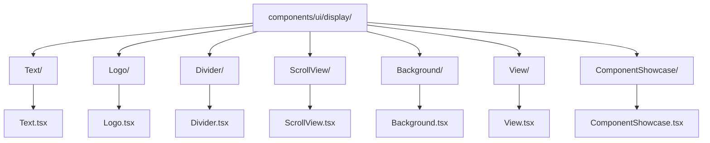
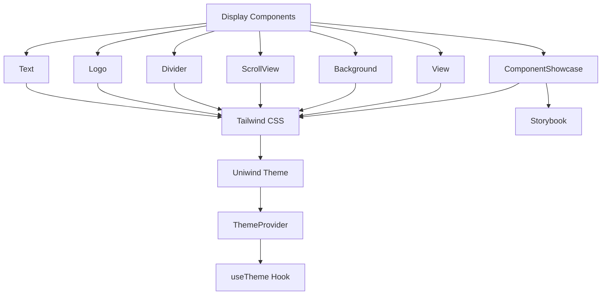
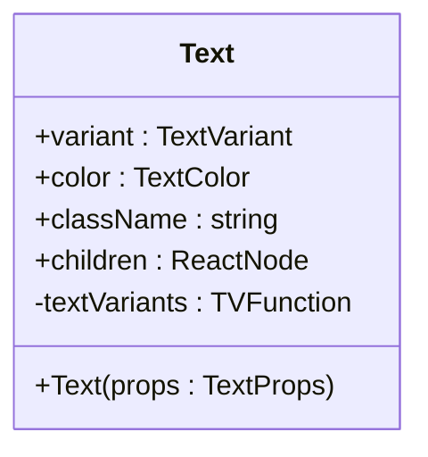
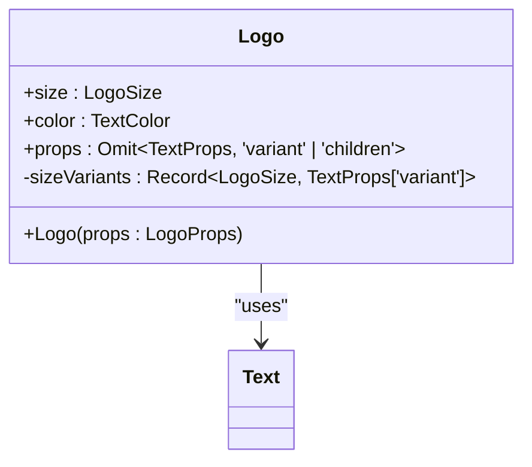
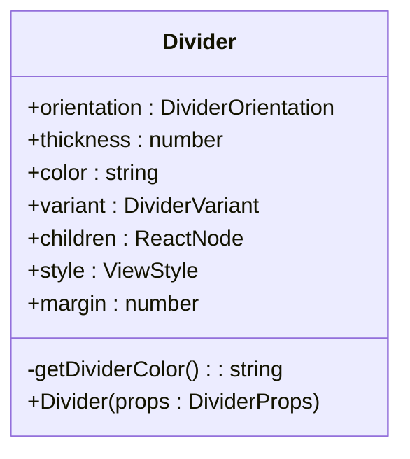
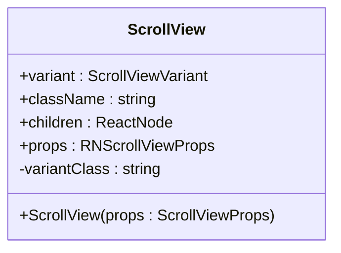
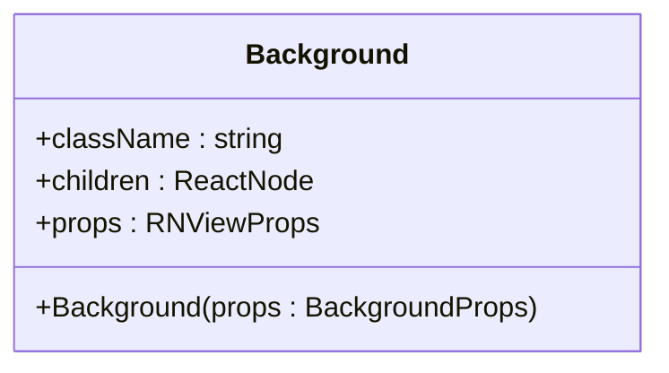
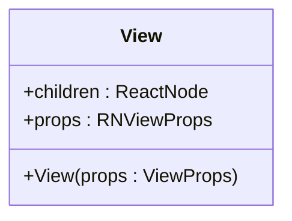
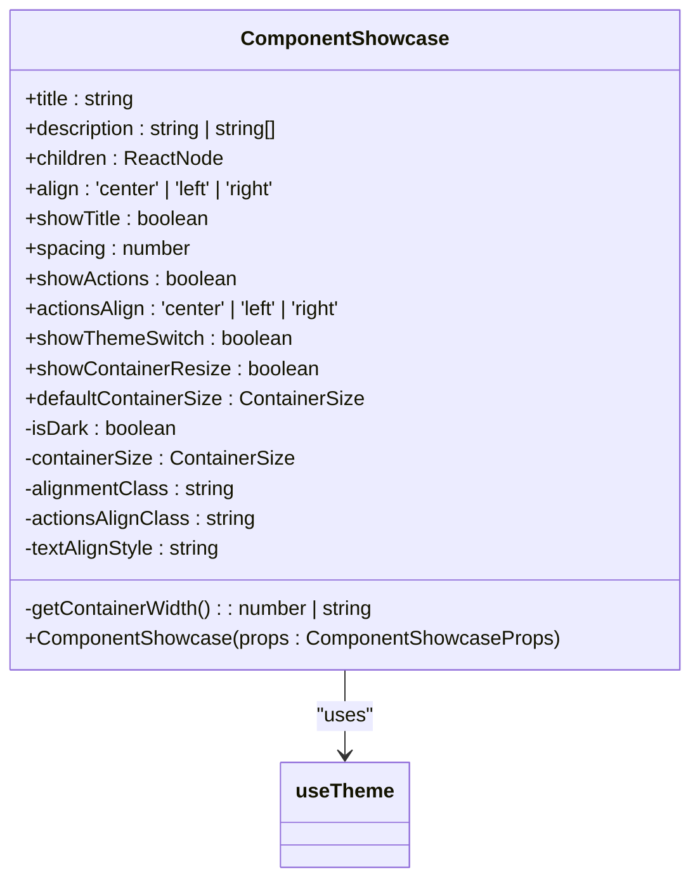
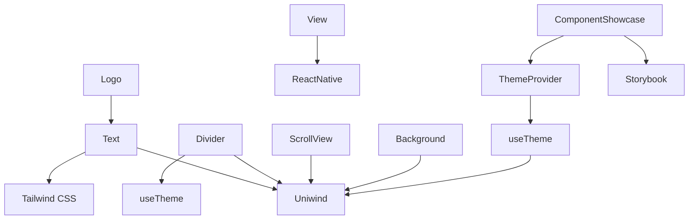

# Display

<cite>
**Referenced Files in This Document**   
- [Text.tsx](file://components/ui/display/Text/Text.tsx)
- [Logo.tsx](file://components/ui/display/Logo/Text.tsx)
- [Divider.tsx](file://components/ui/display/Divider/Divider.tsx)
- [ScrollView.tsx](file://components/ui/display/ScrollView/ScrollView.tsx)
- [Background.tsx](file://components/ui/display/Background/Background.tsx)
- [View.tsx](file://components/ui/display/View/View.tsx)
- [ComponentShowcase.tsx](file://components/ui/display/ComponentShowcase/ComponentShowcase.tsx)
- [LoginScreen.tsx](file://components/screen/LoginScreen/LoginScreen.tsx)
- [ThemeProvider.tsx](file://components/provider/ThemeProvider/ThemeProvider.tsx)
- [useTheme.ts](file://hooks/useTheme.ts)
- [Text.stories.tsx](file://components/ui/display/Text/Text.stories.tsx)
- [ComponentShowcase.stories.tsx](file://components/ui/display/ComponentShowcase/ComponentShowcase.stories.tsx)
- [unistyles.ts](file://unistyles.ts)
- [theme.ts](file://constants/theme.ts)
</cite>

## Table of Contents

1. [Introduction](#introduction)
2. [Project Structure](#project-structure)
3. [Core Components](#core-components)
4. [Architecture Overview](#architecture-overview)
5. [Detailed Component Analysis](#detailed-component-analysis)
6. [Dependency Analysis](#dependency-analysis)
7. [Performance Considerations](#performance-considerations)
8. [Troubleshooting Guide](#troubleshooting-guide)
9. [Conclusion](#conclusion)

## Introduction

The Display components in the Plate application are foundational UI elements designed to present static content and visual structures across the interface. These components include Text for typography, Logo for brand identity, Divider for visual separation, ScrollView for scrollable content containers, Background for themed backgrounds, View as a layout primitive, and ComponentShowcase for development and documentation purposes. Built using React Native with Tailwind CSS and Uniwind for styling, these components support responsive design, theme switching, accessibility, and integration with Storybook for visual testing. This documentation details their implementation, usage, and best practices.

## Project Structure

The Display components are organized under the `components/ui/display/` directory, following a consistent structure where each component has its own folder containing the main implementation file, stories for Storybook, and an index file for exports. These components are part of a larger UI library that separates concerns into categories such as inputs, surfaces, layouts, and feedback. The display components are specifically responsible for rendering non-interactive content and visual elements.

**Diagram sources**

- [Text.tsx](file://components/ui/display/Text/Text.tsx)
- [Logo.tsx](file://components/ui/display/Logo/Logo.tsx)
- [Divider.tsx](file://components/ui/display/Divider/Divider.tsx)
- [ScrollView.tsx](file://components/ui/display/ScrollView/ScrollView.tsx)
- [Background.tsx](file://components/ui/display/Background/Background.tsx)
- [View.tsx](file://components/ui/display/View/View.tsx)
- [ComponentShowcase.tsx](file://components/ui/display/ComponentShowcase/ComponentShowcase.tsx)

**Section sources**

- [Text.tsx](file://components/ui/display/Text/Text.tsx)
- [Logo.tsx](file://components/ui/display/Logo/Logo.tsx)
- [Divider.tsx](file://components/ui/display/Divider/Divider.tsx)
- [ScrollView.tsx](file://components/ui/display/ScrollView/ScrollView.tsx)
- [Background.tsx](file://components/ui/display/Background/Background.tsx)
- [View.tsx](file://components/ui/display/View/View.tsx)
- [ComponentShowcase.tsx](file://components/ui/display/ComponentShowcase/ComponentShowcase.tsx)

## Core Components

The core Display components are purpose-built for presenting static content and visual elements. Each component leverages Tailwind CSS and Uniwind for styling, supports theme switching via ThemeProvider, and integrates with Storybook for visual testing. These components are used throughout the application, particularly in screens like LoginScreen, to ensure consistent presentation and responsiveness across platforms.

**Section sources**

- [Text.tsx](file://components/ui/display/Text/Text.tsx)
- [Logo.tsx](file://components/ui/display/Logo/Logo.tsx)
- [Divider.tsx](file://components/ui/display/Divider/Divider.tsx)
- [ScrollView.tsx](file://components/ui/display/ScrollView/ScrollView.tsx)
- [Background.tsx](file://components/ui/display/Background/Background.tsx)
- [View.tsx](file://components/ui/display/View/View.tsx)
- [ComponentShowcase.tsx](file://components/ui/display/ComponentShowcase/ComponentShowcase.tsx)

## Architecture Overview

The Display components are built on a modular architecture that separates concerns between presentation, styling, and behavior. They rely on Uniwind for theme-aware styling, use Tailwind CSS for responsive layouts, and integrate with React Native's core components. The ThemeProvider enables dynamic theme switching, while Storybook provides a development environment for visual testing. These components are designed to be composable, reusable, and accessible.

**Diagram sources**

- [Text.tsx](file://components/ui/display/Text/Text.tsx)
- [Logo.tsx](file://components/ui/display/Logo/Logo.tsx)
- [Divider.tsx](file://components/ui/display/Divider/Divider.tsx)
- [ScrollView.tsx](file://components/ui/display/ScrollView/ScrollView.tsx)
- [Background.tsx](file://components/ui/display/Background/Background.tsx)
- [View.tsx](file://components/ui/display/View/View.tsx)
- [ComponentShowcase.tsx](file://components/ui/display/ComponentShowcase/ComponentShowcase.tsx)
- [ThemeProvider.tsx](file://components/provider/ThemeProvider/ThemeProvider.tsx)
- [useTheme.ts](file://hooks/useTheme.ts)

## Detailed Component Analysis

### Text Analysis

The Text component is a typography primitive that supports multiple variants (h1-h6, body1, body2, caption, overline, label) and color options (foreground, primary, secondary, success, warning, danger, default). It uses Tailwind Variants (tv) to define styles based on these props, ensuring consistent typography across the application. The component is accessible and supports screen readers through semantic text hierarchy.

**Diagram sources**

- [Text.tsx](file://components/ui/display/Text/Text.tsx)

**Section sources**

- [Text.tsx](file://components/ui/display/Text/Text.tsx)
- [Text.stories.tsx](file://components/ui/display/Text/Text.stories.tsx)

### Logo Analysis

The Logo component is a specialized Text component that displays the brand name "플레이트" with predefined size variants (sm, md, lg). It inherits styling from the Text component and uses size-based variants to map to appropriate heading levels (h6, h3, h1). The component supports color customization and is designed to maintain brand consistency across the application.

**Diagram sources**

- [Logo.tsx](file://components/ui/display/Logo/Logo.tsx)

**Section sources**

- [Logo.tsx](file://components/ui/display/Logo/Logo.tsx)

### Divider Analysis

The Divider component creates visual separation between content sections. It supports horizontal and vertical orientations, multiple variants (default, subtle, strong), customizable thickness, color, and margin. When children are provided, it renders a text divider with lines on both sides. The component uses theme-aware colors and supports dynamic theme switching through the useTheme hook.

**Diagram sources**

- [Divider.tsx](file://components/ui/display/Divider/Divider.tsx)

**Section sources**

- [Divider.tsx](file://components/ui/display/Divider/Divider.tsx)

### ScrollView Analysis

The ScrollView component is a wrapper around React Native's ScrollView that supports themed backgrounds through variant-based styling. It accepts a variant prop (default, content1, content2, content3, content4) to apply different background colors defined in the Uniwind theme. This component is used to create scrollable content areas with consistent visual styling.

**Diagram sources**

- [ScrollView.tsx](file://components/ui/display/ScrollView/ScrollView.tsx)

**Section sources**

- [ScrollView.tsx](file://components/ui/display/ScrollView/ScrollView.tsx)

### Background Analysis

The Background component is a container that applies the application's background color from the Uniwind theme. It uses the `bg-background` Tailwind class to ensure consistent theming across different screens and components. This component is often used as a root container to establish the visual base for a screen or section.

**Diagram sources**

- [Background.tsx](file://components/ui/display/Background/Background.tsx)

**Section sources**

- [Background.tsx](file://components/ui/display/Background/Background.tsx)

### View Analysis

The View component is a foundational layout primitive that wraps React Native's View. It provides a consistent interface for layout containers and supports all standard View props. This component serves as the base building block for more complex UI structures and is used extensively throughout the application.

**Diagram sources**

- [View.tsx](file://components/ui/display/View/View.tsx)

**Section sources**

- [View.tsx](file://components/ui/display/View/View.tsx)

### ComponentShowcase Analysis

The ComponentShowcase component is a development tool used in Storybook to demonstrate and test UI components. It provides controls for theme switching, container resizing, alignment, and spacing. This component renders a title, description, and the component being showcased within a resizable container, making it ideal for visual testing and documentation.

**Diagram sources**

- [ComponentShowcase.tsx](file://components/ui/display/ComponentShowcase/ComponentShowcase.tsx)

**Section sources**

- [ComponentShowcase.tsx](file://components/ui/display/ComponentShowcase/ComponentShowcase.tsx)
- [ComponentShowcase.stories.tsx](file://components/ui/display/ComponentShowcase/ComponentShowcase.stories.tsx)

## Dependency Analysis

The Display components depend on several core systems within the application, including the Uniwind theming system, Tailwind CSS for styling, and React Native's core components. They integrate with the ThemeProvider for dynamic theme switching and use the useTheme hook to access theme state. These components are also used by higher-level components such as screens and forms, creating a dependency hierarchy that flows from primitive display elements to complex UI structures.

**Diagram sources**

- [Text.tsx](file://components/ui/display/Text/Text.tsx)
- [Logo.tsx](file://components/ui/display/Logo/Logo.tsx)
- [Divider.tsx](file://components/ui/display/Divider/Divider.tsx)
- [ScrollView.tsx](file://components/ui/display/ScrollView/ScrollView.tsx)
- [Background.tsx](file://components/ui/display/Background/Background.tsx)
- [View.tsx](file://components/ui/display/View/View.tsx)
- [ComponentShowcase.tsx](file://components/ui/display/ComponentShowcase/ComponentShowcase.tsx)
- [ThemeProvider.tsx](file://components/provider/ThemeProvider/ThemeProvider.tsx)
- [useTheme.ts](file://hooks/useTheme.ts)
- [unistyles.ts](file://unistyles.ts)

**Section sources**

- [Text.tsx](file://components/ui/display/Text/Text.tsx)
- [Logo.tsx](file://components/ui/display/Logo/Logo.tsx)
- [Divider.tsx](file://components/ui/display/Divider/Divider.tsx)
- [ScrollView.tsx](file://components/ui/display/ScrollView/ScrollView.tsx)
- [Background.tsx](file://components/ui/display/Background/Background.tsx)
- [View.tsx](file://components/ui/display/View/View.tsx)
- [ComponentShowcase.tsx](file://components/ui/display/ComponentShowcase/ComponentShowcase.tsx)
- [ThemeProvider.tsx](file://components/provider/ThemeProvider/ThemeProvider.tsx)
- [useTheme.ts](file://hooks/useTheme.ts)

## Performance Considerations

When using Display components, consider the following performance best practices:

- Avoid unnecessary nesting of View components, as each creates a new layer in the native view hierarchy
- Use memoization for components that render frequently with the same props
- Minimize the use of inline styles in favor of predefined Tailwind classes
- Be cautious with ScrollView when rendering large lists; consider using FlatList for better performance
- Use the ComponentShowcase only in development environments to avoid bundle size bloat in production
- Optimize theme switching by ensuring only necessary components re-render when the theme changes

**Section sources**

- [View.tsx](file://components/ui/display/View/View.tsx)
- [ScrollView.tsx](file://components/ui/display/ScrollView/ScrollView.tsx)
- [ComponentShowcase.tsx](file://components/ui/display/ComponentShowcase/ComponentShowcase.tsx)

## Troubleshooting Guide

Common issues with Display components and their solutions:

- **Theme not applying**: Ensure ThemeProvider is properly wrapped around the application root
- **Text not rendering correctly**: Verify font files are properly loaded and referenced in the app configuration
- **ScrollView not scrolling**: Check if the content exceeds the container size and ensure no conflicting styles are preventing scrolling
- **Divider color not changing**: Confirm that the color prop is correctly passed and that theme colors are properly defined in unistyles.ts
- **ComponentShowcase not displaying controls**: Verify that the component is being used within a Storybook environment with proper decorators

**Section sources**

- [ThemeProvider.tsx](file://components/provider/ThemeProvider/ThemeProvider.tsx)
- [useTheme.ts](file://hooks/useTheme.ts)
- [Text.tsx](file://components/ui/display/Text/Text.tsx)
- [Divider.tsx](file://components/ui/display/Divider/Divider.tsx)
- [ComponentShowcase.tsx](file://components/ui/display/ComponentShowcase/ComponentShowcase.tsx)

## Conclusion

The Display components in the Plate application provide a robust foundation for presenting static content and visual elements. Through consistent use of Tailwind CSS, Uniwind theming, and React Native primitives, these components ensure a cohesive and accessible user interface. Their integration with Storybook enables effective development and testing, while their modular design promotes reusability and maintainability. By following the documented best practices for performance and accessibility, developers can create high-quality user experiences across all platforms.
