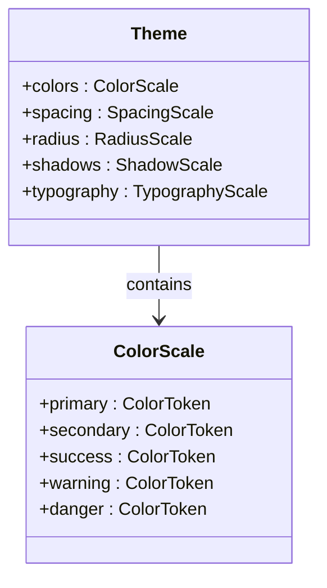

# Feedback

<cite>
**Referenced Files in This Document**   
- [index.ts](file://components/ui/feedback/index.ts)
- [unistyles.ts](file://unistyles.ts)
- [Button.tsx](file://components/ui/inputs/Button/Button.tsx)
- [package.json](file://package.json)
- [globals.css](file://globals.css)
</cite>

## Table of Contents

1. [Current Status of Feedback Components](#current-status-of-feedback-components)
2. [External Library Integration](#external-library-integration)
3. [Theming Infrastructure](#theming-infrastructure)
4. [Potential Use Cases](#potential-use-cases)
5. [Future Implementation Guidance](#future-implementation-guidance)
6. [Design System Alignment](#design-system-alignment)

## Current Status of Feedback Components

The feedback component category currently exists as a placeholder in the codebase. The `components/ui/feedback/index.ts` file contains only a comment indicating that feedback components such as Alert, Toast, and Skeleton are planned for future implementation.

No concrete feedback components (Toast, Snackbar, LoadingSpinner, ActivityIndicator) have been implemented within the local codebase. The directory structure shows the intentional organization of components by atomic design principles, with the feedback category already established in the component hierarchy despite lacking actual implementations.

**Section sources**

- [index.ts](file://components/ui/feedback/index.ts#L1-L2)

## External Library Integration

The application leverages the `heroui-native` library as its primary UI component framework, which likely includes feedback components that can be utilized. This is evidenced by multiple imports of components from `heroui-native` across various files in the codebase, including direct usage of Button components from this library.

The `package.json` file confirms `heroui-native` as a dependency, and the `globals.css` file imports styles from this library, indicating deep integration. The component architecture follows a pattern of wrapping external library components with enhanced functionality, as demonstrated by the Button component implementation that wraps `heroui-native`'s Button with additional features like icon support.

This architectural approach suggests that feedback components should follow the same pattern: utilizing `heroui-native`'s native feedback components while potentially extending them with application-specific functionality or styling when necessary.

**Section sources**

- [package.json](file://package.json#L86)
- [globals.css](file://globals.css#L4)
- [Button.tsx](file://components/ui/inputs/Button/Button.tsx#L1)

## Theming Infrastructure

The application has a comprehensive theming system in place that would support future feedback component implementation. The `unistyles.ts` file defines a complete theme configuration with color scales, spacing, border radii, shadows, and typography tokens that follow a systematic design language.

The theme includes semantic color definitions (primary, secondary, success, warning, danger) that are essential for feedback components to convey appropriate information states. These design tokens ensure that any future feedback components will automatically inherit the application's visual language and support both light and dark modes.

**Diagram sources**

- [unistyles.ts](file://unistyles.ts#L5-L445)

**Section sources**

- [unistyles.ts](file://unistyles.ts#L5-L445)

## Potential Use Cases

Feedback components would serve several critical user experience functions within the application:

- **Login Success/Failure Indication**: Displaying toast notifications or alerts to confirm successful login or communicate authentication failures
- **Network Activity**: Using loading spinners or activity indicators during API calls, form submissions, or data loading operations
- **Form Validation**: Showing inline feedback for form field validation errors or successful submissions
- **Action Confirmations**: Presenting snackbars or toasts to confirm user actions like booking a class or updating preferences
- **Error States**: Displaying error messages or alerts when network connectivity issues or server errors occur

These use cases align with the application's purpose as a fitness reservation and class management system, where timely feedback about booking status, login attempts, and network operations is essential for user confidence and experience.

## Future Implementation Guidance

When implementing feedback components in the future, the following guidance should be followed to maintain consistency with the existing architecture:

1. **Follow Atomic Design Structure**: Place new components within the established `components/ui/feedback/` directory following the same pattern as other component categories
2. **Leverage heroui-native**: Utilize existing feedback components from the `heroui-native` library as base implementations, wrapping them when additional functionality is needed
3. **Implement Compound Components**: Follow the pattern established by Button and other components, using compound component patterns where appropriate
4. **Support Theme Integration**: Ensure all feedback components respect the application's theme configuration and color tokens
5. **Maintain TypeScript Interfaces**: Define clear TypeScript interfaces for component props following the established patterns
6. **Include Storybook Documentation**: Create Storybook stories for new components to ensure proper documentation and testing

The implementation should prioritize the most critical feedback components first, such as Toast/Alert for error and success messaging, followed by loading indicators for network operations.

## Design System Alignment

Any future feedback components must align with the established atomic design system and theming infrastructure. The current component architecture demonstrates a clear pattern of:

- Using `tailwind-variants` (tv) for styling with theme-aware class names
- Implementing compound components where needed
- Extending external library components with enhanced functionality
- Maintaining consistent TypeScript interfaces
- Supporting both light and dark themes through the unified theme system

New feedback components should follow these same principles to ensure visual and functional consistency across the application. The existing design tokens in `unistyles.ts` provide all necessary styling primitives, eliminating the need for custom styling and ensuring coherence with the overall design language.

**Section sources**

- [unistyles.ts](file://unistyles.ts#L5-L445)
- [Button.tsx](file://components/ui/inputs/Button/Button.tsx#L1-L91)
