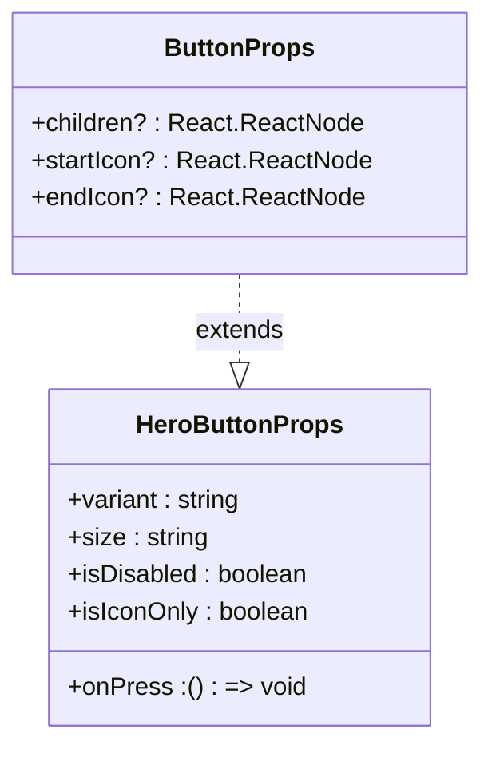
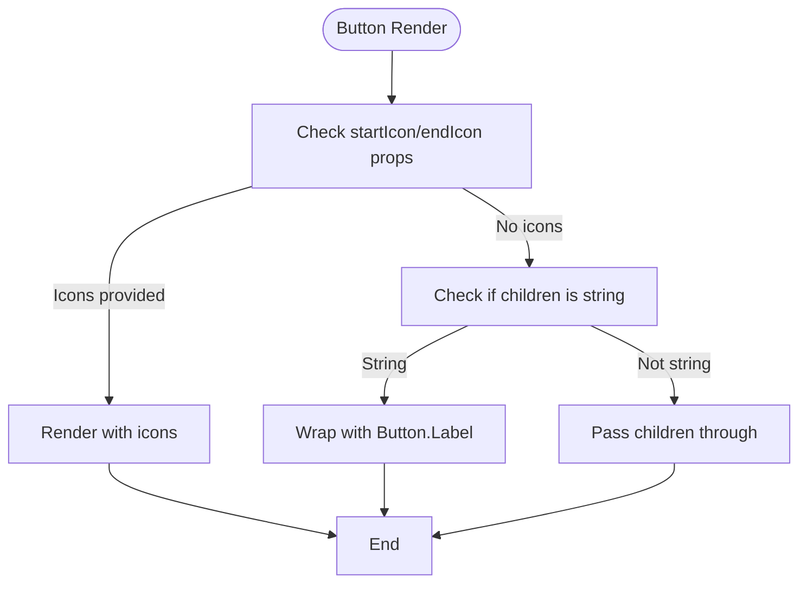
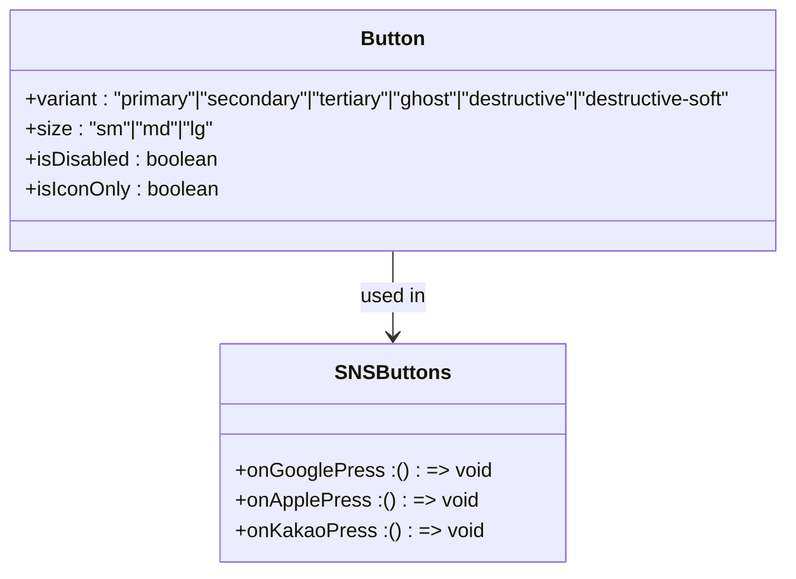
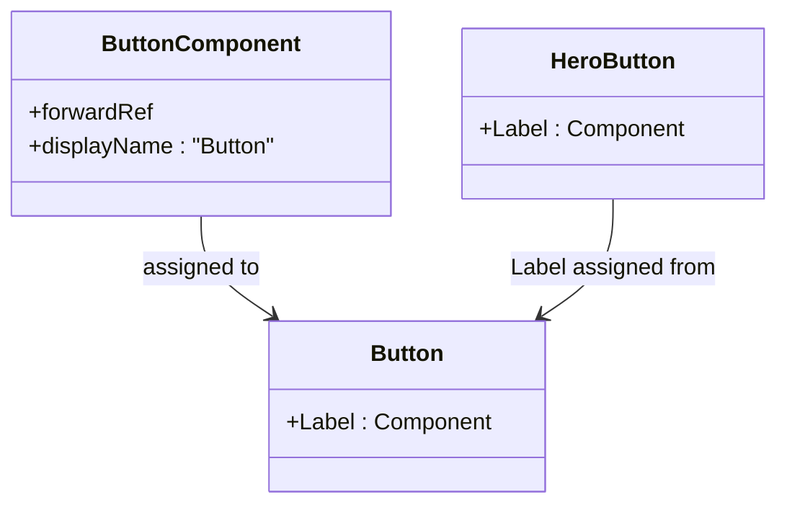

# Button

<cite>
**Referenced Files in This Document**   
- [Button.tsx](file://components/ui/inputs/Button/Button.tsx)
- [Button.stories.tsx](file://components/ui/inputs/Button/Button.stories.tsx)
- [index.ts](file://components/ui/inputs/Button/index.ts)
</cite>

## Table of Contents
1. [Introduction](#introduction)
2. [Core Properties](#core-properties)
3. [Rendering Cases](#rendering-cases)
4. [Usage Examples](#usage-examples)
5. [Compound Component Pattern](#compound-component-pattern)
6. [Accessibility and Theming](#accessibility-and-theming)
7. [Common Issues and Best Practices](#common-issues-and-best-practices)
8. [Performance Considerations](#performance-considerations)

## Introduction
The Button component in the Plate application serves as an enhanced wrapper around the heroui-native Button, providing additional functionality and improved developer experience. This component extends the base Button with support for icons and implements a compound component pattern to maintain consistency across the application. The Button component is designed to be flexible, supporting various rendering patterns while maintaining accessibility and responsive behavior across platforms.

**Section sources**
- [Button.tsx](file://components/ui/inputs/Button/Button.tsx#L1-L90)

## Core Properties
The ButtonProps interface extends the base HeroButtonProps while adding specific enhancements for icon support and children handling. The interface includes three key properties:

- **children**: Optional React.ReactNode that represents the content within the button
- **startIcon**: Optional React.ReactNode displayed before the label text
- **endIcon**: Optional React.ReactNode displayed after the label text

These properties enable flexible composition patterns while maintaining type safety. The ButtonProps interface uses Omit to exclude the children property from HeroButtonProps, allowing for custom children handling logic within the component.

**Diagram sources**
- [Button.tsx](file://components/ui/inputs/Button/Button.tsx#L7-L12)

**Section sources**
- [Button.tsx](file://components/ui/inputs/Button/Button.tsx#L7-L12)

## Rendering Cases
The Button component implements three distinct rendering cases based on the provided props and children type. These cases ensure proper rendering behavior while maintaining consistency across different usage patterns.

### Case 1: Icon Props Provided
When either startIcon or endIcon props are provided, the component renders both the icon elements and the children content. String children are automatically wrapped with Button.Label for consistent styling.

### Case 2: String Children
When no icon props are provided but the children are a string, the component automatically wraps the string content with Button.Label to ensure proper typography and styling.

### Case 3: Manual Composition
When neither icon props are provided nor the children are a string, the component passes through the children as-is, allowing for manual composition with full control over the button's content structure.

**Diagram sources**
- [Button.tsx](file://components/ui/inputs/Button/Button.tsx#L50-L79)

**Section sources**
- [Button.tsx](file://components/ui/inputs/Button/Button.tsx#L50-L79)

## Usage Examples
The Button component supports various usage patterns demonstrated in the application's codebase. These examples showcase different variants, sizes, and icon placements.

### Variant Examples
The component supports multiple visual variants including primary, secondary, tertiary, ghost, destructive, and destructive-soft. These variants provide different visual treatments for various contexts within the application.

### Size Examples
Three size options are available: small (sm), medium (md), and large (lg). These sizes ensure consistent spacing and typography across different use cases.

### Icon Combination Examples
The component supports various icon placement patterns:
- startIcon only
- endIcon only
- Both startIcon and endIcon
- Manual composition with Button.Label

**Diagram sources**
- [Button.stories.tsx](file://components/ui/inputs/Button/Button.stories.tsx#L29-L196)
- [SNSButtons.tsx](file://components/features/SNSButtons/SNSButtons.tsx#L15-L60)

**Section sources**
- [Button.stories.tsx](file://components/ui/inputs/Button/Button.stories.tsx#L29-L196)
- [SNSButtons.tsx](file://components/features/SNSButtons/SNSButtons.tsx#L15-L60)

## Compound Component Pattern
The Button component implements the compound component pattern by assigning Button.Label from HeroButton.Label. This pattern allows for flexible composition while maintaining a consistent API and styling across the application.

The implementation uses Object.assign to combine the ButtonComponent with the Label property, creating a single export that provides both the main component and its subcomponents. This approach enables developers to use the component in different ways while ensuring consistent behavior and styling.

**Diagram sources**
- [Button.tsx](file://components/ui/inputs/Button/Button.tsx#L85-L87)

**Section sources**
- [Button.tsx](file://components/ui/inputs/Button/Button.tsx#L85-L87)

## Accessibility and Theming
The Button component maintains accessibility standards through proper semantic structure and keyboard navigation support from the underlying heroui-native Button. The component supports theming via CSS variables and responsive behavior across different screen sizes and device types.

Theming is implemented through the application's styling system, allowing for consistent appearance across light and dark modes. The component responds appropriately to platform-specific accessibility settings and maintains proper focus states for keyboard navigation.

**Section sources**
- [Button.tsx](file://components/ui/inputs/Button/Button.tsx#L1-L90)
- [Button.stories.tsx](file://components/ui/inputs/Button/Button.stories.tsx#L1-L196)

## Common Issues and Best Practices
When using the Button component, developers should be aware of common issues related to icon sizing and alignment across platforms. Proper icon sizing ensures consistent appearance, while correct alignment maintains visual harmony with text content.

Best practices include:
- Using the appropriate variant for the context
- Maintaining consistent icon sizes
- Ensuring sufficient contrast for accessibility
- Using the compound component pattern for complex compositions
- Following atomic design principles when extending the component

**Section sources**
- [Button.tsx](file://components/ui/inputs/Button/Button.tsx#L1-L90)
- [Button.stories.tsx](file://components/ui/inputs/Button/Button.stories.tsx#L1-L196)

## Performance Considerations
The Button component is optimized for render performance through the use of React.forwardRef and memoization patterns. The component avoids unnecessary re-renders by properly handling props and maintaining a stable reference.

When extending the component, developers should maintain these performance optimizations by avoiding inline function definitions in props and ensuring proper memoization of complex children. The component's lightweight wrapper approach ensures minimal performance overhead compared to using the base heroui-native Button directly.

**Section sources**
- [Button.tsx](file://components/ui/inputs/Button/Button.tsx#L48-L80)
- [Button.stories.tsx](file://components/ui/inputs/Button/Button.stories.tsx#L1-L196)