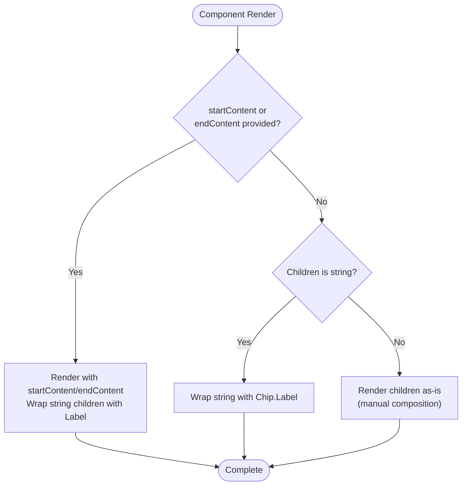
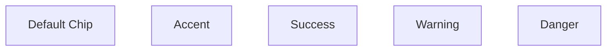

# Chip

<cite>
**Referenced Files in This Document**   
- [Chip.tsx](file://components/ui/inputs/Chip/Chip.tsx)
- [Chip.stories.tsx](file://components/ui/inputs/Chip/Chip.stories.tsx)
- [unistyles.ts](file://unistyles.ts)
- [index.ts](file://components/ui/inputs/Chip/index.ts)
</cite>

## Table of Contents

1. [Introduction](#introduction)
2. [Core Properties](#core-properties)
3. [Rendering Logic](#rendering-logic)
4. [Usage Examples](#usage-examples)
5. [Theming and Styling](#theming-and-styling)
6. [Accessibility and Interaction](#accessibility-and-interaction)
7. [Performance Considerations](#performance-considerations)
8. [Best Practices](#best-practices)

## Introduction

The Chip component in the Plate application serves as a compact visual element for displaying attributes, filters, or actions. It is an enhanced wrapper around the heroui-native Chip component, providing additional features such as icon support through startContent and endContent props, automatic text wrapping with Chip.Label, and full support for compound component patterns. The component is designed to be flexible, supporting various configurations for different use cases including filter systems, tag displays, and action indicators.

**Section sources**

- [Chip.tsx](file://components/ui/inputs/Chip/Chip.tsx#L15-L46)

## Core Properties

The Chip component accepts a comprehensive set of properties that control its appearance and behavior. The ChipProps interface extends the native HeroChipProps while adding specific enhancements for this implementation.

### Primary Properties

- **variant**: Controls the visual style of the chip with options including primary, secondary, tertiary, and soft
- **color**: Determines the color scheme from the theme palette (accent, success, warning, danger)
- **size**: Specifies the dimensions with small (sm), medium (md), and large (lg) options
- **radius**: Controls the border radius using predefined theme values
- **disabled**: Applies disabled styling and interaction restrictions when true

### Content Placement

- **startContent**: Accepts React nodes to display before the label (icons, avatars, indicators)
- **endContent**: Accepts React nodes to display after the label (close buttons, badges, indicators)
- **children**: The main content of the chip, which can be text or arbitrary React elements

The component automatically wraps string children with Chip.Label for consistent typography styling, while allowing manual composition for advanced use cases.

**Section sources**

- [Chip.tsx](file://components/ui/inputs/Chip/Chip.tsx#L7-L12)

## Rendering Logic

The Chip component implements a three-case rendering strategy to handle different content configurations efficiently.

**Diagram sources**

- [Chip.tsx](file://components/ui/inputs/Chip/Chip.tsx#L50-L80)

The rendering logic prioritizes convenience for common use cases while maintaining flexibility for advanced scenarios. When startContent or endContent is provided, the component automatically arranges the content with proper spacing. For string children without additional content, it automatically wraps the text with Chip.Label to ensure consistent typography. When manual composition is needed, the component passes children through directly, allowing full control over the internal structure.

**Section sources**

- [Chip.tsx](file://components/ui/inputs/Chip/Chip.tsx#L48-L80)

## Usage Examples

The Chip component supports various configurations for different use cases, as demonstrated in the component stories.

### Basic Configuration

**Diagram sources**

- [Chip.stories.tsx](file://components/ui/inputs/Chip/Chip.stories.tsx#L38-L42)

### Variants and Sizes

The component supports multiple variants (primary, secondary, tertiary, soft) and sizes (sm, md, lg), allowing for visual hierarchy in interfaces. The size property affects padding, font size, and overall dimensions to maintain visual consistency across different contexts.

### Icon Integration

Chips can include icons or other content at the start or end positions:

- **startContent**: Typically used for icons that represent the chip's meaning (stars, checkmarks, etc.)
- **endContent**: Commonly used for interactive elements like close buttons in filter chips

### Compound Component Pattern

For advanced use cases, the component supports manual composition using the Chip.Label subcomponent, allowing precise control over content arrangement and styling.

**Section sources**

- [Chip.stories.tsx](file://components/ui/inputs/Chip/Chip.stories.tsx#L30-L200)

## Theming and Styling

The Chip component integrates with the application's theming system through CSS variables and theme tokens defined in unistyles.ts. The component inherits its styling from the heroui-native implementation while respecting the application's design tokens for spacing, radius, and typography.

### Theme Integration

- Colors are mapped from the theme palette (accent, success, warning, danger)
- Spacing follows the application's spacing scale (based on 4px increments)
- Border radius uses predefined theme values (sm: 4px, md: 6px, lg: 8px)
- Typography inherits from the global typography tokens

The component responds to both light and dark themes, automatically adjusting colors and contrasts for optimal readability in different environments.

**Section sources**

- [unistyles.ts](file://unistyles.ts#L245-L277)
- [Chip.tsx](file://components/ui/inputs/Chip/Chip.tsx#L1-L90)

## Accessibility and Interaction

The Chip component includes several features to ensure accessibility and proper user interaction:

- **Keyboard Navigation**: Chips are focusable and can be activated using keyboard input
- **Screen Reader Support**: Proper ARIA attributes are applied based on the chip's role
- **Touch Targets**: Adequate sizing ensures comfortable interaction on touch devices
- **Visual Feedback**: Provides hover and press states for interactive chips
- **Disabled State**: Reduces opacity to 0.5 when disabled, following the application's opacity tokens

For filter chips with close buttons, the endContent typically includes an interactive element that requires proper focus management and keyboard accessibility.

**Section sources**

- [Chip.tsx](file://components/ui/inputs/Chip/Chip.tsx#L50-L80)
- [unistyles.ts](file://unistyles.ts#L395-L399)

## Performance Considerations

When rendering large sets of chips, several performance considerations should be addressed:

- **Memoization**: Consider memoizing chip components in lists to prevent unnecessary re-renders
- **Virtualization**: For very large collections, implement virtual scrolling to render only visible items
- **Batch Updates**: When updating multiple chips simultaneously, batch state changes to minimize re-renders
- **Image Optimization**: When using avatars or images within chips, ensure they are properly sized and cached

The component's lightweight implementation and efficient rendering logic make it suitable for most use cases, but performance monitoring is recommended when displaying more than 50 chips simultaneously.

**Section sources**

- [Chip.tsx](file://components/ui/inputs/Chip/Chip.tsx#L48-L80)

## Best Practices

### Filter Systems

When implementing filter chips:

- Use the endContent prop for close/remove buttons
- Apply the primary variant for selected filters
- Consider animation when adding/removing filters
- Ensure adequate spacing between chips in filter groups

### Tag Displays

For tag displays:

- Use the soft variant for a subtle appearance
- Implement consistent color coding based on category
- Consider truncation for long tag names
- Provide tooltips for truncated content

### General Recommendations

- Use consistent sizing within a single context
- Limit the number of variants used in a single view
- Ensure sufficient contrast between text and background
- Test across different screen sizes and orientations
- Consider touch target size on mobile devices

**Section sources**

- [Chip.stories.tsx](file://components/ui/inputs/Chip/Chip.stories.tsx#L149-L197)
- [Chip.tsx](file://components/ui/inputs/Chip/Chip.tsx#L7-L12)
