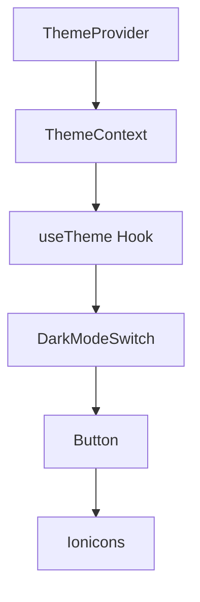
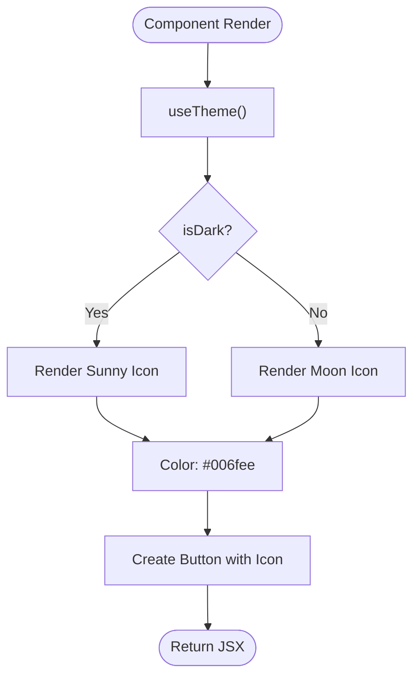

# DarkModeSwitch

<cite>
**Referenced Files in This Document**   
- [DarkModeSwitch.tsx](file://components/ui/inputs/DarkModeSwitch/DarkModeSwitch.tsx)
- [DarkModeSwitch.stories.tsx](file://components/ui/inputs/DarkModeSwitch/DarkModeSwitch.stories.tsx)
- [useTheme.ts](file://hooks/useTheme.ts)
- [ThemeProvider.tsx](file://components/provider/ThemeProvider/ThemeProvider.tsx)
- [theme.ts](file://constants/theme.ts)
</cite>

## Table of Contents

1. [Introduction](#introduction)
2. [Core Components](#core-components)
3. [Architecture Overview](#architecture-overview)
4. [Detailed Component Analysis](#detailed-component-analysis)
5. [Usage Examples](#usage-examples)
6. [Accessibility Considerations](#accessibility-considerations)
7. [Theming and Styling](#theming-and-styling)
8. [Common Issues and Best Practices](#common-issues-and-best-practices)
9. [Conclusion](#conclusion)

## Introduction

The DarkModeSwitch component is a UI element designed to toggle between light and dark themes within the Plate application. It leverages the global theme context through the useTheme hook to access the current theme state and provides a seamless interface for users to switch between visual modes. This documentation details its implementation, integration, and best practices for usage.

## Core Components

The DarkModeSwitch component is a stateless functional component that renders a button with an icon representing the current theme mode. It uses the useTheme hook to access the theme context and toggle the theme upon interaction.

**Section sources**

- [DarkModeSwitch.tsx](file://components/ui/inputs/DarkModeSwitch/DarkModeSwitch.tsx#L5-L7)
- [DarkModeSwitch.tsx](file://components/ui/inputs/DarkModeSwitch/DarkModeSwitch.tsx#L9-L29)

## Architecture Overview

The DarkModeSwitch operates within a theme management system that uses React's Context API to provide theme state across the application. The ThemeProvider component wraps the application and exposes the current theme state and functions to modify it via the useTheme hook.



**Diagram sources**

- [ThemeProvider.tsx](file://components/provider/ThemeProvider/ThemeProvider.tsx#L16-L18)
- [useTheme.ts](file://hooks/useTheme.ts#L10-L15)

## Detailed Component Analysis

### DarkModeSwitch Analysis

The DarkModeSwitch component is a simple yet effective implementation of a theme toggler. It accepts an optional className prop for additional styling and uses the useTheme hook to access the isDark boolean and toggleTheme function.

#### Implementation Details



**Diagram sources**

- [DarkModeSwitch.tsx](file://components/ui/inputs/DarkModeSwitch/DarkModeSwitch.tsx#L13-L27)

#### Props Interface

The DarkModeSwitchProps interface defines a single optional property:

- **className**: Optional string for additional Tailwind CSS classes to apply to the button

This minimal interface allows for flexible styling while maintaining a focused purpose.

**Section sources**

- [DarkModeSwitch.tsx](file://components/ui/inputs/DarkModeSwitch/DarkModeSwitch.tsx#L5-L7)

#### Theme Integration

The component integrates with the theme system through the useTheme hook, which returns an object containing:

- **isDark**: Boolean indicating if the current theme is dark
- **toggleTheme**: Function to switch between light and dark themes
- **setTheme**: Function to explicitly set the theme mode

The hook abstracts the underlying theme management, providing a clean API for components to interact with the theme system.

**Section sources**

- [useTheme.ts](file://hooks/useTheme.ts#L10-L15)

## Usage Examples

The DarkModeSwitch is typically placed in application headers or settings panels where users expect to find theme controls. It can be used directly without any props for default behavior, or with a className prop to customize its appearance.

Example usage in a header component:

```tsx
<Header>
	<Logo />
	<Spacer />
	<DarkModeSwitch className="mr-4" />
</Header>
```

The component is also documented in Storybook, providing visual examples of its appearance in different contexts.

**Section sources**

- [DarkModeSwitch.stories.tsx](file://components/ui/inputs/DarkModeSwitch/DarkModeSwitch.stories.tsx#L5-L38)

## Accessibility Considerations

While the current implementation does not include explicit accessibility attributes, best practices would suggest adding appropriate ARIA labels to the button element to ensure screen reader users understand its function. The button should have an accessible name such as "Toggle dark mode" or "Switch to dark theme" depending on the current state.

The touch target size is determined by the Button component's "sm" size, which should meet minimum accessibility requirements for touch interfaces. The visual contrast between the icon and background is maintained through the color selection logic, ensuring visibility in both light and dark modes.

**Section sources**

- [DarkModeSwitch.tsx](file://components/ui/inputs/DarkModeSwitch/DarkModeSwitch.tsx#L16-L21)

## Theming and Styling

The DarkModeSwitch uses dynamic styling based on the current theme to provide visual feedback to users. The icon color changes depending on the theme:

- In dark mode: Orange (#f5a524) for the sunny icon
- In light mode: Blue (#006fee) for the moon icon

This color scheme provides a clear visual indication of the current theme while maintaining aesthetic harmony with the overall design system. The component leverages Tailwind CSS classes through the className prop, allowing for easy integration with the application's styling conventions.

The use of the "ghost" variant and "isIconOnly" properties from the Button component ensures a clean, minimal appearance that doesn't distract from its primary function.

**Section sources**

- [DarkModeSwitch.tsx](file://components/ui/inputs/DarkModeSwitch/DarkModeSwitch.tsx#L17-L26)

## Common Issues and Best Practices

### Common Issues

1. **Icon Visibility**: In some themes, the icon colors might not provide sufficient contrast against certain backgrounds. This can be addressed by adjusting the color values in the component or using different icons.
2. **Provider Context**: The component will throw an error if used outside of a ThemeProvider. Ensure the ThemeProvider wraps all components that use the useTheme hook.
3. **State Synchronization**: When multiple instances of DarkModeSwitch are present, they should all reflect the same theme state. The context-based approach ensures this synchronization.

### Best Practices

1. **Placement**: Position the DarkModeSwitch in a consistent location across the application, typically in the header or navigation bar.
2. **Customization**: Use the className prop to adjust spacing and positioning without modifying the component's core functionality.
3. **Testing**: Verify the component's appearance in both light and dark modes to ensure visual consistency.
4. **Accessibility**: Consider adding aria-label attributes to improve screen reader experience.

**Section sources**

- [DarkModeSwitch.tsx](file://components/ui/inputs/DarkModeSwitch/DarkModeSwitch.tsx#L9-L29)
- [useTheme.ts](file://hooks/useTheme.ts#L18-L40)
- [ThemeProvider.tsx](file://components/provider/ThemeProvider/ThemeProvider.tsx#L124-L130)

## Conclusion

The DarkModeSwitch component provides a simple and effective way to toggle between light and dark themes in the Plate application. By leveraging the global theme context and the useTheme hook, it maintains a clean separation of concerns while providing a user-friendly interface for theme management. Its implementation follows the stateless component pattern common in the application, making it easy to use and maintain. With proper placement and minimal customization, it enhances the user experience by providing immediate visual feedback and control over the application's appearance.
