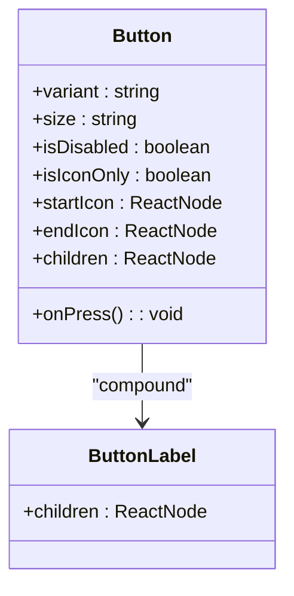
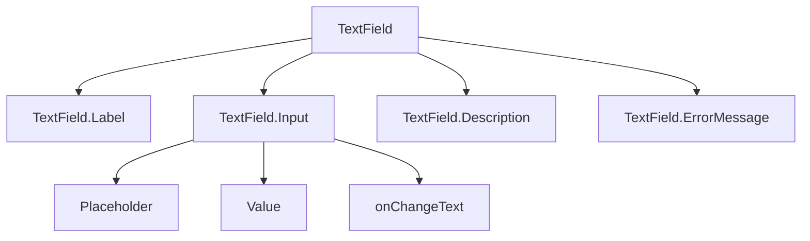
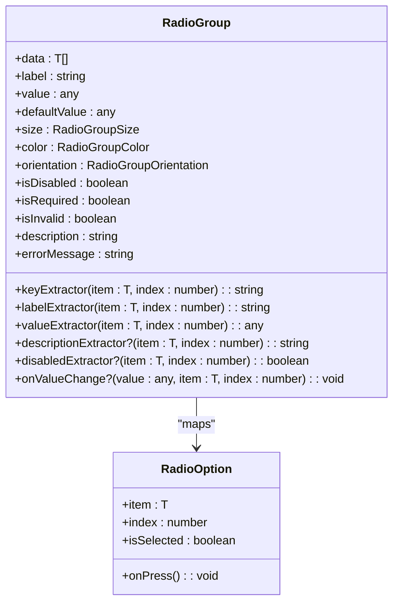
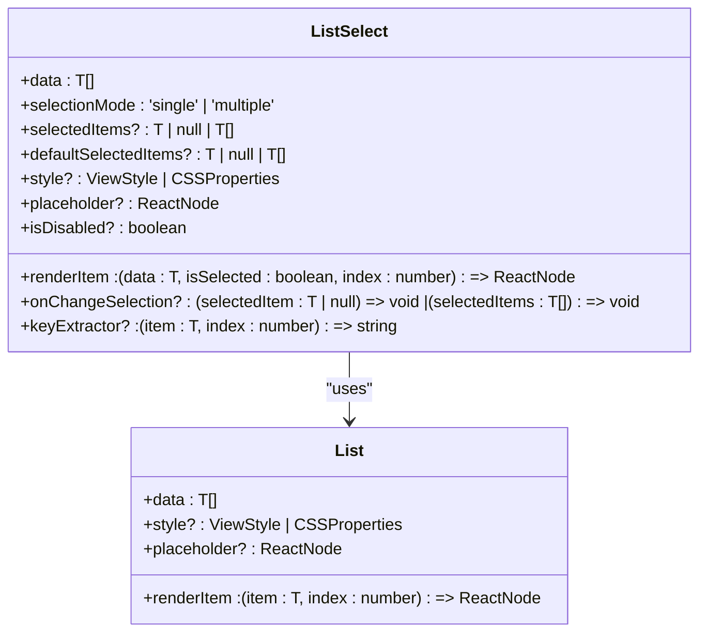
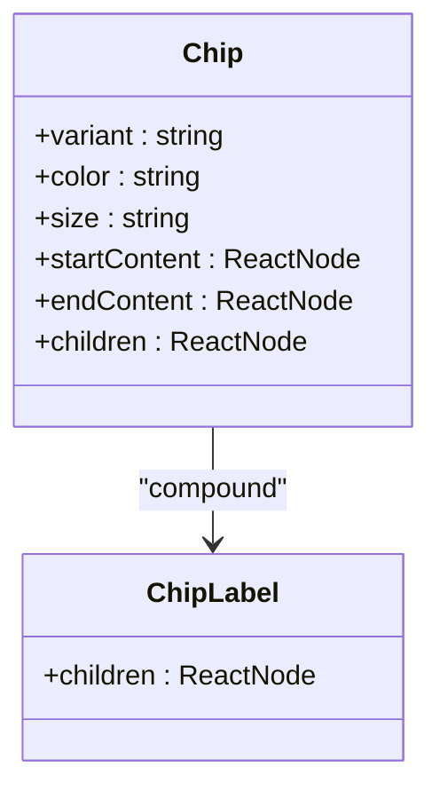
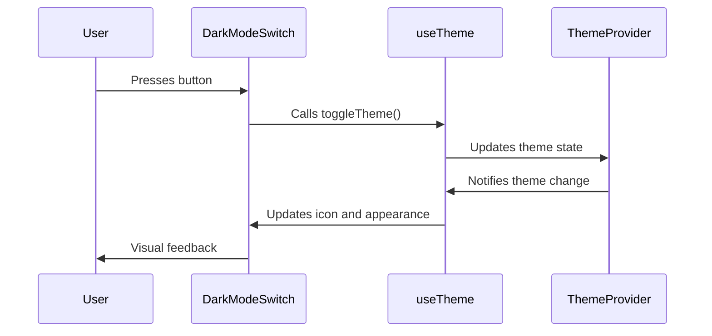

# Inputs

<cite>
**Referenced Files in This Document**   
- [Button.tsx](file://components/ui/inputs/Button/Button.tsx)
- [Button.stories.tsx](file://components/ui/inputs/Button/Button.stories.tsx)
- [TextField.tsx](file://components/ui/inputs/TextField/TextField.tsx)
- [TextField.stories.tsx](file://components/ui/inputs/TextField/TextField.stories.tsx)
- [RadioGroup.tsx](file://components/ui/inputs/RadioGroup/RadioGroup.tsx)
- [RadioGroup.styles.ts](file://components/ui/inputs/RadioGroup/RadioGroup.styles.ts)
- [RadioGroup.stories.tsx](file://components/ui/inputs/RadioGroup/RadioGroup.stories.tsx)
- [ListSelect.tsx](file://components/ui/inputs/ListSelect/ListSelect.tsx)
- [ListSelect.web.tsx](file://components/ui/inputs/ListSelect/ListSelect.web.tsx)
- [ListSelect.stories.tsx](file://components/ui/inputs/ListSelect/ListSelect.stories.tsx)
- [Chip.tsx](file://components/ui/inputs/Chip/Chip.tsx)
- [Chip.stories.tsx](file://components/ui/inputs/Chip/Chip.stories.tsx)
- [DarkModeSwitch.tsx](file://components/ui/inputs/DarkModeSwitch/DarkModeSwitch.tsx)
- [DarkModeSwitch.stories.tsx](file://components/ui/inputs/DarkModeSwitch/DarkModeSwitch.stories.tsx)
- [LoginForm.tsx](file://components/form/LoginForm/LoginForm.tsx)
- [unistyles.ts](file://unistyles.ts)
- [useTheme.ts](file://hooks/useTheme.ts)
</cite>

## Table of Contents

1. [Introduction](#introduction)
2. [Core Components](#core-components)
3. [Button](#button)
4. [TextField](#textfield)
5. [RadioGroup](#radiogroup)
6. [ListSelect](#listselect)
7. [Chip](#chip)
8. [DarkModeSwitch](#darkmodeswitch)
9. [Form Integration](#form-integration)
10. [State Management](#state-management)
11. [Accessibility and Theming](#accessibility-and-theming)
12. [Performance and Best Practices](#performance-and-best-practices)

## Introduction

The Inputs category in the Plate application encompasses a collection of UI components designed to capture user interactions and manage form state. These components are built following atomic design principles and are located in the `components/ui/inputs/` directory. Each input component is designed to be reusable, accessible, and themable, with support for both controlled and uncontrolled state patterns. The components leverage the heroui-native library as a foundation, extending its functionality with additional features such as compound patterns, enhanced theming via CSS variables, and integration with MobX for state management.

**Section sources**

- [README.md](file://README.md#L347-L347)

## Core Components

The Inputs category includes six primary components: Button, TextField, RadioGroup, ListSelect, Chip, and DarkModeSwitch. These components are designed to handle various user input scenarios, from simple actions to complex form interactions. Each component is implemented as a compound component where applicable, allowing for flexible composition and consistent styling. The components are exported through the `components/ui/inputs/index.ts` file, making them easily accessible throughout the application.

**Section sources**

- [README.md](file://README.md#L277-L284)

## Button

The Button component is an enhanced wrapper around the heroui-native Button, providing additional features such as icon support and compound patterns. It supports multiple variants including primary, secondary, tertiary, ghost, destructive, and destructive-soft, as well as different sizes (small, medium, large). The component handles both controlled and uncontrolled states and supports accessibility features such as disabled states and icon-only buttons.

### Props and Variants

The Button component accepts standard ButtonProps from heroui-native, extended with `startIcon` and `endIcon` props for convenient icon placement. The `children` prop is automatically wrapped with `Button.Label` when it is a string, ensuring consistent typography. The component supports compound patterns through the `Button.Label` subcomponent, allowing for advanced compositions.

### Event Handling

The Button component handles press events through the `onPress` prop, which is passed down to the underlying heroui-native Button. It also supports accessibility events and can be disabled using the `isDisabled` prop, which reduces the component's opacity to indicate its non-interactive state.

### Compound Pattern

The Button component implements a compound pattern by assigning the `Button.Label` subcomponent to the main Button component using `Object.assign`. This allows users to compose the Button with custom content while maintaining consistent styling and behavior.

**Diagram sources**

- [Button.tsx](file://components/ui/inputs/Button/Button.tsx#L7-L13)

**Section sources**

- [Button.tsx](file://components/ui/inputs/Button/Button.tsx#L15-L46)
- [Button.stories.tsx](file://components/ui/inputs/Button/Button.stories.tsx#L29-L73)

## TextField

The TextField component is a composite input field that supports labels, descriptions, error messages, and start/end content. It is designed to work seamlessly with form validation and provides a consistent interface for text input across the application. The component is built using a compound pattern, exposing subcomponents such as `TextField.Label`, `TextField.Input`, `TextField.Description`, and `TextField.ErrorMessage`.

### Props and Variants

The TextField component extends the base TextFieldRootProps from heroui-native with custom `variant` (default, outlined), `size` (sm, md, lg), and additional props for content placement. It supports both prop-based configuration and direct child composition, allowing for maximum flexibility in usage.

### Form Integration

The TextField component is extensively used in form components such as the LoginForm, where it captures user credentials. It integrates with MobX state management through the use of observable state objects, allowing for reactive updates to the form UI.

**Diagram sources**

- [TextField.tsx](file://components/ui/inputs/TextField/TextField.tsx#L23-L38)

**Section sources**

- [TextField.tsx](file://components/ui/inputs/TextField/TextField.tsx#L14-L38)
- [LoginForm.tsx](file://components/form/LoginForm/LoginForm.tsx#L25-L50)

## RadioGroup

The RadioGroup component provides a set of mutually exclusive options, allowing users to select one option from a list. It supports horizontal and vertical orientations, multiple sizes, and various color schemes. The component is designed to work with arrays of data, using extractor functions to determine keys, labels, and values for each option.

### Props and Variants

The RadioGroup component accepts a `data` array and several extractor functions (`keyExtractor`, `labelExtractor`, `valueExtractor`) to map the data to UI elements. It supports controlled and uncontrolled state patterns through `value` and `defaultValue` props, with state changes handled by the `onValueChange` callback.

### Event Handling

The RadioGroup component manages selection state internally, with animations for visual feedback. It uses react-native-reanimated to create smooth transitions when options are selected, enhancing the user experience. The component also supports accessibility features such as screen reader announcements and keyboard navigation.

**Diagram sources**

- [RadioGroup.tsx](file://components/ui/inputs/RadioGroup/RadioGroup.tsx#L41-L71)

**Section sources**

- [RadioGroup.tsx](file://components/ui/inputs/RadioGroup/RadioGroup.tsx#L31-L71)
- [RadioGroup.styles.ts](file://components/ui/inputs/RadioGroup/RadioGroup.styles.ts#L7-L139)

## ListSelect

The ListSelect component provides a selectable list interface that supports both single and multiple selection modes. It is built on top of the List component and uses Pressable for touch interactions on mobile platforms, with a web-specific implementation using HTML buttons for better accessibility.

### Props and Variants

The ListSelect component is implemented as a union type with `ListSelectSingleProps` and `ListSelectMultipleProps`, allowing for type-safe configuration based on the selection mode. It supports controlled and uncontrolled state patterns, with `selectedItems` and `defaultSelectedItems` props for state management.

### Platform-Specific Rendering

The component has separate implementations for web and native platforms, with `ListSelect.web.tsx` using HTML buttons and CSS styles for web-specific behavior. This ensures optimal performance and accessibility across different platforms while maintaining a consistent API.

**Diagram sources**

- [ListSelect.tsx](file://components/ui/inputs/ListSelect/ListSelect.tsx#L7-L35)

**Section sources**

- [ListSelect.tsx](file://components/ui/inputs/ListSelect/ListSelect.tsx#L5-L35)
- [ListSelect.web.tsx](file://components/ui/inputs/ListSelect/ListSelect.web.tsx#L4-L34)

## Chip

The Chip component is a compact element that represents an input, attribute, or action. It supports various variants and colors, making it suitable for tags, filters, and other interactive elements. The component follows the same pattern as Button and TextField, with support for start and end content and compound patterns.

### Props and Variants

The Chip component extends the base ChipProps from heroui-native with `startContent` and `endContent` props for icon placement. It supports the same variant and color system as other components, ensuring visual consistency across the application.

### Usage Examples

Chips are commonly used for displaying selected filters or tags, with the ability to remove items using an end content icon. The component's compound pattern allows for custom compositions, such as adding status indicators or avatars within the chip.

**Diagram sources**

- [Chip.tsx](file://components/ui/inputs/Chip/Chip.tsx#L7-L13)

**Section sources**

- [Chip.tsx](file://components/ui/inputs/Chip/Chip.tsx#L15-L46)
- [Chip.stories.tsx](file://components/ui/inputs/Chip/Chip.stories.tsx#L29-L198)

## DarkModeSwitch

The DarkModeSwitch component provides a toggle for switching between light and dark themes. It is implemented as a simple button with an icon that changes based on the current theme state. The component integrates with the application's theme context, using the `useTheme` hook to access and modify the theme state.

### Props and Variants

The DarkModeSwitch component accepts a `className` prop for additional styling, allowing it to be customized for different contexts. It uses the `Ionicons` library for its icons, displaying a moon icon in light mode and a sun icon in dark mode.

### Theme Integration

The component leverages the `useTheme` hook from the `hooks/useTheme.ts` file, which provides access to the current theme state and functions for toggling and setting the theme. This ensures consistent theme management across the application.

**Diagram sources**

- [DarkModeSwitch.tsx](file://components/ui/inputs/DarkModeSwitch/DarkModeSwitch.tsx#L6-L8)

**Section sources**

- [DarkModeSwitch.tsx](file://components/ui/inputs/DarkModeSwitch/DarkModeSwitch.tsx#L1-L33)
- [useTheme.ts](file://hooks/useTheme.ts#L10-L40)

## Form Integration

Input components are designed to work together in form contexts, with the LoginForm serving as a primary example. The form uses TextField components for email and password input, with validation and state management handled through MobX observables. The form structure is contained within a Card component, providing visual grouping and consistent spacing.

### LoginForm Example

The LoginForm component demonstrates the integration of multiple input components, using TextField for both email and password fields. It accepts a state object and optional callback functions for handling input changes, allowing for flexible integration with different state management patterns.

**Section sources**

- [LoginForm.tsx](file://components/form/LoginForm/LoginForm.tsx#L7-L62)

## State Management

The input components integrate with MobX for state management, using the `useFormField` hook to connect component state with observable objects. This pattern is implemented in the MobX-wrapped versions of components such as RadioGroup and ListSelect, which are exported as `ObservedRadioGroup` and `ObservedListSelect`.

### MobX Integration

The MobX integration follows a consistent pattern across components, with the main component wrapped in the `observer` higher-order component. The `useFormField` hook is used to create a local state object that is synchronized with the parent state, ensuring reactive updates to the UI.

**Section sources**

- [RadioGroup.tsx](file://components/ui/inputs/RadioGroup/RadioGroup.tsx#L74-L77)
- [ListSelect.tsx](file://components/ui/inputs/ListSelect/ListSelect.tsx#L1-L124)

## Accessibility and Theming

All input components are designed with accessibility in mind, supporting screen readers, keyboard navigation, and proper ARIA attributes. They integrate with the application's theming system, using CSS variables defined in `unistyles.ts` for consistent styling across light and dark modes.

### CSS Variables

The theming system uses CSS variables to define colors, spacing, and typography, allowing for easy customization and theme switching. The variables are defined in the `unistyles.ts` file and applied through className props, ensuring consistent styling across components.

### Responsive Behavior

Components are designed to be responsive, adapting their layout and appearance based on screen size and orientation. The RadioGroup component, for example, supports both horizontal and vertical orientations, allowing it to be used in different layout contexts.

**Section sources**

- [unistyles.ts](file://unistyles.ts#L26-L443)
- [RadioGroup.tsx](file://components/ui/inputs/RadioGroup/RadioGroup.tsx#L49-L49)

## Performance and Best Practices

The input components are optimized for performance, with careful management of re-renders and efficient event handling. The use of memoization and useCallback hooks ensures that callback functions are not recreated on every render, while the compound pattern reduces the need for prop drilling.

### Validation Patterns

Validation is handled through props such as `isInvalid` and `errorMessage`, allowing for both synchronous and asynchronous validation patterns. The components provide visual feedback for validation states, with error messages displayed below the input field.

### Extending Components

New input components can be created by following the existing patterns, extending heroui-native components and adding custom functionality as needed. The atomic design principles ensure that new components can be easily integrated with existing ones, maintaining consistency across the application.

**Section sources**

- [Button.tsx](file://components/ui/inputs/Button/Button.tsx#L48-L80)
- [TextField.tsx](file://components/ui/inputs/TextField/TextField.tsx#L77-L142)
