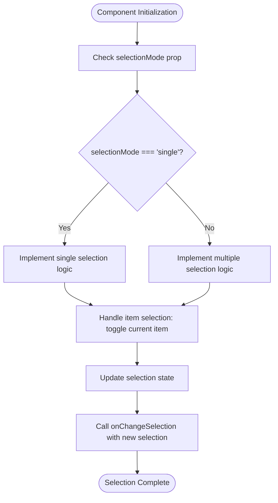

# ListSelect

<cite>
**Referenced Files in This Document**   
- [ListSelect.tsx](file://components/ui/inputs/ListSelect/ListSelect.tsx)
- [ListSelect.web.tsx](file://components/ui/inputs/ListSelect/ListSelect.web.tsx)
- [ListSelect.stories.tsx](file://components/ui/inputs/ListSelect/ListSelect.stories.tsx)
- [index.tsx](file://components/ui/inputs/ListSelect/index.tsx)
- [List.tsx](file://components/ui/surfaces/List/List.tsx)
- [ListItem.tsx](file://components/ui/surfaces/ListItem/ListItem.tsx)
- [useFormField.ts](file://hooks/useFormField.ts)
</cite>

## Table of Contents
1. [Introduction](#introduction)
2. [Core Type System](#core-type-system)
3. [Selection Mode Implementation](#selection-mode-implementation)
4. [State Management](#state-management)
5. [Key Management with keyExtractor](#key-management-with-keyextractor)
6. [Integration with List Surface](#integration-with-list-surface)
7. [Platform-Specific Implementation](#platform-specific-implementation)
8. [Accessibility and Theming](#accessibility-and-theming)
9. [Usage Examples](#usage-examples)
10. [Common Issues and Best Practices](#common-issues-and-best-practices)

## Introduction

The ListSelect component in the Plate application provides a flexible selection interface for choosing items from a list. It supports both single and multiple selection modes, making it suitable for various use cases such as form inputs, filters, and navigation menus. The component is built on top of the List surface component and uses Pressable for item interaction on native platforms, while using button elements for web implementation. It offers comprehensive control over selection behavior, rendering, and state management, with support for both controlled and uncontrolled usage patterns.

**Section sources**
- [ListSelect.stories.tsx](file://components/ui/inputs/ListSelect/ListSelect.stories.tsx#L1-L189)

## Core Type System

The ListSelect component implements a sophisticated type system using TypeScript to provide type safety and flexibility. It defines two primary interfaces: ListSelectSingleProps and ListSelectMultipleProps, which are combined into a union type ListSelectProps.

The ListSelectSingleProps interface defines the properties for single selection mode, including data, renderItem, selectionMode, onChangeSelection, selectedItems, defaultSelectedItems, keyExtractor, style, placeholder, and isDisabled. The onChangeSelection callback receives either the selected item or null, while selectedItems accepts a single item or null.

The ListSelectMultipleProps interface defines the properties for multiple selection mode, with onChangeSelection receiving an array of selected items and selectedItems accepting an array of items. Both interfaces share common properties but differ in their selection handling signatures.

The union type ListSelectProps combines both interfaces, allowing the component to accept either single or multiple selection props. This type system enables TypeScript to provide appropriate autocomplete and type checking based on the selectionMode value.

**Diagram sources**
- [ListSelect.tsx](file://components/ui/inputs/ListSelect/ListSelect.tsx#L6-L34)
- [ListSelect.web.tsx](file://components/ui/inputs/ListSelect/ListSelect.web.tsx#L5-L33)

**Section sources**
- [ListSelect.tsx](file://components/ui/inputs/ListSelect/ListSelect.tsx#L6-L34)

## Selection Mode Implementation

The ListSelect component implements selection mode through the selectionMode prop, which accepts either 'single' or 'multiple' values. This prop determines the behavior of the component and the type of selection that is allowed.

In single selection mode, only one item can be selected at a time. When a new item is selected, any previously selected item is automatically deselected. This mode is suitable for scenarios where users need to choose one option from a list, such as selecting a category or preference.

In multiple selection mode, users can select multiple items simultaneously. Each item can be toggled independently, allowing for complex selection patterns. This mode is useful for scenarios where users need to select multiple options, such as choosing tags, filters, or recipients.

The component uses function overloading to provide type-safe implementations for both selection modes. When selectionMode is set to 'single', the component expects single selection props and callbacks. When set to 'multiple', it expects multiple selection props and callbacks. This ensures that developers receive appropriate type checking and autocomplete based on their chosen selection mode.

**Diagram sources**
- [ListSelect.tsx](file://components/ui/inputs/ListSelect/ListSelect.tsx#L42-L186)
- [ListSelect.web.tsx](file://components/ui/inputs/ListSelect/ListSelect.web.tsx#L41-L193)

**Section sources**
- [ListSelect.tsx](file://components/ui/inputs/ListSelect/ListSelect.tsx#L42-L186)

## State Management

The ListSelect component implements a comprehensive state management system that supports both controlled and uncontrolled usage patterns. It maintains internal state for selection when the component is used in uncontrolled mode, while also supporting external state management in controlled mode.

The component uses React's useState hook to manage internal selection state through the internalSelectedItems state variable. This state is initialized based on the defaultSelectedItems prop, which provides initial selection values. For single selection mode, the initial state is an array containing the default selected item (if provided), while for multiple selection mode, it's the array of default selected items.

The component determines the current selection state through the getSelectedItems function, which checks whether controlled state (via selectedItems prop) is provided. If controlled state is available, it takes precedence over internal state. This allows developers to choose between controlled and uncontrolled patterns based on their application's state management needs.

When an item is pressed, the handleItemPress function updates the selection state accordingly. In single selection mode, it toggles the selection of the pressed item, deselecting any previously selected item. In multiple selection mode, it toggles the selection state of the pressed item while preserving other selections. The state update is conditional on whether the component is in controlled mode - internal state is only updated when no controlled selectedItems prop is provided.

**Diagram sources**
- [ListSelect.tsx](file://components/ui/inputs/ListSelect/ListSelect.tsx#L59-L186)
- [ListSelect.web.tsx](file://components/ui/inputs/ListSelect/ListSelect.web.tsx#L58-L193)

**Section sources**
- [ListSelect.tsx](file://components/ui/inputs/ListSelect/ListSelect.tsx#L59-L186)

## Key Management with keyExtractor

The ListSelect component provides flexible key management through the keyExtractor prop, which allows developers to specify how items should be identified and compared. This is crucial for accurate selection tracking, especially when dealing with complex objects or when object references may change.

The keyExtractor function accepts an item and its index, returning a unique string identifier for that item. When provided, the component uses these keys to determine selection status rather than relying on object reference equality. This is particularly important in scenarios where data is refreshed from an API or when objects are recreated, as it ensures that selections persist even when object references change.

The isItemSelected function implements the selection checking logic, using keyExtractor when available. It finds the index of each selected item in the data array and compares the extracted keys. If keyExtractor is not provided, the component falls back to direct object reference comparison using the === operator.

This dual approach to item identification provides both flexibility and reliability. Developers can use keyExtractor for robust selection management based on business identifiers (such as database IDs), while the fallback to reference comparison ensures basic functionality without additional configuration.

**Diagram sources**
- [ListSelect.tsx](file://components/ui/inputs/ListSelect/ListSelect.tsx#L82-L102)
- [ListSelect.web.tsx](file://components/ui/inputs/ListSelect/ListSelect.web.tsx#L81-L101)

**Section sources**
- [ListSelect.tsx](file://components/ui/inputs/ListSelect/ListSelect.tsx#L82-L102)

## Integration with List Surface

The ListSelect component is built on top of the List surface component, leveraging its rendering capabilities while adding selection functionality. It wraps the List component and enhances it with selection state management and item interaction handling.

The component passes its data and placeholder props directly to the List component, ensuring consistent rendering behavior. It also forwards the style and other layout-related props to maintain visual consistency with other List components in the application.

For item rendering, ListSelect intercepts the List's renderItem function and wraps each item with interactive elements. On native platforms, it uses Pressable components to provide touch feedback and handle press events. On web, it uses button elements with appropriate styling to ensure accessibility and consistent behavior across browsers.

The integration preserves all the functionality of the underlying List component, including horizontal/vertical orientation, gap settings, and content container styling. This allows ListSelect to inherit the responsive behavior and layout capabilities of the List component while adding the selection functionality on top.

**Diagram sources**
- [ListSelect.tsx](file://components/ui/inputs/ListSelect/ListSelect.tsx#L171-L186)
- [ListSelect.web.tsx](file://components/ui/inputs/ListSelect/ListSelect.web.tsx#L170-L193)
- [List.tsx](file://components/ui/surfaces/List/List.tsx#L17-L57)

**Section sources**
- [ListSelect.tsx](file://components/ui/inputs/ListSelect/ListSelect.tsx#L171-L186)

## Platform-Specific Implementation

The ListSelect component provides platform-specific implementations through separate files for native and web platforms: ListSelect.tsx for native and ListSelect.web.tsx for web. This allows for optimized rendering and interaction patterns on each platform while maintaining a consistent API.

The native implementation (ListSelect.tsx) uses React Native's Pressable component for item interaction. Pressable provides built-in touch feedback, press state management, and accessibility features that are appropriate for mobile platforms. It integrates with React Native's gesture system and provides a native feel on both iOS and Android.

The web implementation (ListSelect.web.tsx) uses HTML button elements for item interaction. This ensures proper accessibility, keyboard navigation, and browser default behaviors. The button elements are styled to remove default browser styling while maintaining appropriate cursor and focus states. The implementation also handles disabled states appropriately for web accessibility.

Both implementations share the same core logic for selection management, state handling, and type definitions, ensuring consistent behavior across platforms. The differences are limited to the rendering layer and interaction components, allowing developers to use the same API regardless of the target platform.

**Diagram sources**
- [ListSelect.tsx](file://components/ui/inputs/ListSelect/ListSelect.tsx)
- [ListSelect.web.tsx](file://components/ui/inputs/ListSelect/ListSelect.web.tsx)

**Section sources**
- [ListSelect.tsx](file://components/ui/inputs/ListSelect/ListSelect.tsx)
- [ListSelect.web.tsx](file://components/ui/inputs/ListSelect/ListSelect.web.tsx)

## Accessibility and Theming

The ListSelect component incorporates accessibility features and theming capabilities to ensure usability and visual consistency across different contexts. It follows platform-specific accessibility guidelines and supports theming through CSS variables and component composition.

For accessibility, the component ensures proper focus management and screen reader support. On web, the use of button elements provides built-in accessibility features such as keyboard navigation, focus states, and appropriate ARIA roles. The component also respects the isDisabled prop, which prevents interaction and conveys the disabled state to assistive technologies.

The component supports theming through integration with the application's styling system. It accepts a style prop that allows for custom styling, and it works with the application's CSS variables for consistent appearance. The ListItem component, commonly used with ListSelect, supports different variants (default, card, simple) and sizes (sm, md, lg), enabling flexible visual design.

The component also respects platform conventions for selection indicators. Selected items are visually distinguished through styling applied by the renderItem function, typically using the isSelected boolean parameter to conditionally apply styles. This allows developers to implement theme-aware selection visuals that match the application's design language.

**Section sources**
- [ListItem.tsx](file://components/ui/surfaces/ListItem/ListItem.tsx#L11-L25)

## Usage Examples

The ListSelect component provides practical examples in its Storybook documentation, demonstrating both single and multiple selection modes with various configurations.

In single selection mode, the component is used to select one item from a list of users. The example shows how to manage selection state with useState and display the selected user's information. The renderItem function uses the ListItem component with title and description props, passing the isSelected state to visually indicate the selected item.

In multiple selection mode, the component allows selecting multiple users simultaneously. The example demonstrates how the selection state is maintained as an array, with the count of selected users displayed above the list. The selection behavior allows toggling items on and off independently.

The examples also showcase additional features such as default selection values, custom rendering, and disabled states. The default selection example shows how to pre-select an item using the selectedItems prop, while the custom rendering example demonstrates how to create custom item layouts with conditional styling based on selection state.

**Diagram sources**
- [ListSelect.stories.tsx](file://components/ui/inputs/ListSelect/ListSelect.stories.tsx#L44-L188)

**Section sources**
- [ListSelect.stories.tsx](file://components/ui/inputs/ListSelect/ListSelect.stories.tsx#L44-L188)

## Common Issues and Best Practices

When using the ListSelect component, several common issues and best practices should be considered to ensure optimal performance and user experience.

For performance with large datasets, it's recommended to implement virtualization or pagination when dealing with hundreds or thousands of items. The component renders all items at once, which can impact performance on lower-end devices. Consider using windowing techniques or loading data incrementally for large lists.

Proper key management is crucial for maintaining selection integrity. When working with dynamic data that may change references, always provide a keyExtractor function that returns stable identifiers (such as database IDs) rather than relying on object references. This prevents unintended deselection when data is refreshed.

For selection state synchronization, prefer controlled components when the selection state needs to be shared across multiple components or persisted in a global state management system. Use uncontrolled components with defaultSelectedItems for simpler use cases where the selection state is local to the component.

When rendering complex items, optimize the renderItem function to avoid unnecessary re-renders. Use React.memo for complex item components and ensure that the selection state is the only dependency that should trigger re-renders.

For form integration, the MobX-enhanced version of ListSelect (ObservedListSelect) provides seamless integration with form state management systems. It automatically synchronizes selection state with MobX observables, reducing boilerplate code for form handling.

**Section sources**
- [index.tsx](file://components/ui/inputs/ListSelect/index.tsx#L44-L110)
- [useFormField.ts](file://hooks/useFormField.ts#L12-L45)