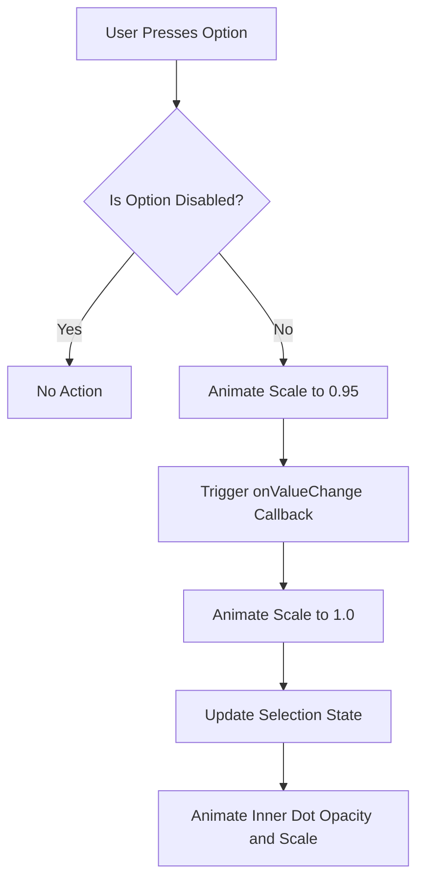
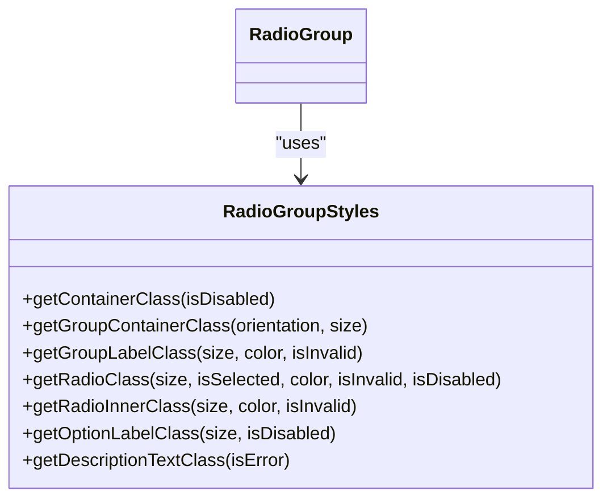

# RadioGroup

<cite>
**Referenced Files in This Document**   
- [RadioGroup.tsx](file://components/ui/inputs/RadioGroup/RadioGroup.tsx)
- [RadioGroup.web.tsx](file://components/ui/inputs/RadioGroup/RadioGroup.web.tsx)
- [RadioGroup.styles.ts](file://components/ui/inputs/RadioGroup/RadioGroup.styles.ts)
- [index.tsx](file://components/ui/inputs/RadioGroup/index.tsx)
- [RadioGroup.stories.tsx](file://components/ui/inputs/RadioGroup/RadioGroup.stories.tsx)
</cite>

## Table of Contents

1. [Introduction](#introduction)
2. [Core Properties](#core-properties)
3. [State Management](#state-management)
4. [Visual Feedback and Animation](#visual-feedback-and-animation)
5. [Accessibility Implementation](#accessibility-implementation)
6. [Theming and Styling](#theming-and-styling)
7. [Usage Examples](#usage-examples)
8. [Common Issues and Best Practices](#common-issues-and-best-practices)
9. [Performance Considerations](#performance-considerations)

## Introduction

The RadioGroup component in the Plate application provides a user interface for selecting a single option from a list of mutually exclusive choices. It supports visual feedback through animated transitions and offers comprehensive customization options for size, color, orientation, and styling. The component is designed to work across platforms with separate implementations for React Native and web environments, ensuring consistent behavior and appearance.

The RadioGroup supports both controlled and uncontrolled state patterns and integrates with MobX for reactive state management. It includes accessibility features such as proper ARIA roles and states, and provides error handling with visual indicators for invalid states. The component uses extractor functions to handle diverse data structures, making it flexible for various use cases.

**Section sources**

- [RadioGroup.tsx](file://components/ui/inputs/RadioGroup/RadioGroup.tsx#L40-L70)
- [RadioGroup.web.tsx](file://components/ui/inputs/RadioGroup/RadioGroup.web.tsx#L13-L43)

## Core Properties

The RadioGroup component accepts a comprehensive set of properties to control its appearance, behavior, and functionality. These properties are defined in the RadioGroupProps interface and include data configuration, visual styling, and interaction controls.

The component requires a data array containing the options to be displayed, along with three essential extractor functions: keyExtractor, labelExtractor, and valueExtractor. These functions allow the component to work with any data structure by specifying how to extract the unique key, display label, and underlying value for each option.

Visual properties include size ('sm', 'md', 'lg'), color ('default', 'primary', 'secondary', 'success', 'warning', 'danger'), and orientation ('horizontal', 'vertical'). The component also supports optional label, description, and error message display, with built-in required field indicators.

State control is managed through value and defaultValue props, enabling both controlled and uncontrolled usage patterns. Additional boolean flags control disabled, required, and invalid states, with corresponding visual feedback.

**Section sources**

- [RadioGroup.tsx](file://components/ui/inputs/RadioGroup/RadioGroup.tsx#L40-L70)
- [RadioGroup.web.tsx](file://components/ui/inputs/RadioGroup/RadioGroup.web.tsx#L13-L43)

## State Management

The RadioGroup component implements a flexible state management system that supports both controlled and uncontrolled patterns. In the uncontrolled mode, the component manages its internal state using React's useState hook, with the initial value set through the defaultValue prop.

For controlled usage, the component accepts a value prop that determines the currently selected option. When a new option is selected, the onValueChange callback is triggered, allowing the parent component to update the state accordingly. This pattern enables external state management and integration with form libraries.

The component also provides MobX integration through the MobxRadioGroupProps interface and the observer HOC. This implementation connects the RadioGroup to MobX stores, automatically updating when the observed state changes. The MobX version uses useFormField hook to create a local state reference and automatically handles value changes through MobX actions.

The RadioGroupRef interface exposes imperative methods (setValue, getValue, focus, blur) for programmatic control, allowing external components to interact with the radio group beyond the standard props and callbacks.

**Section sources**

- [RadioGroup.tsx](file://components/ui/inputs/RadioGroup/RadioGroup.tsx#L113-L138)
- [index.tsx](file://components/ui/inputs/RadioGroup/index.tsx#L20-L43)

## Visual Feedback and Animation

The RadioGroup component provides smooth visual feedback through animated transitions powered by react-native-reanimated. On React Native platforms, the selection animation includes both scale and opacity transformations to create a responsive and engaging user experience.

When an option is selected, the inner dot of the radio button animates with opacity and scale transitions. The opacity animates from 0 to 1 with a duration of 200ms and a bezier easing curve (0.4, 0, 0.2, 1), creating a smooth fade-in effect. Simultaneously, the scale interpolates from 0.3 to 1, producing a subtle "pop" effect that draws attention to the selection.

For user interaction feedback, the entire radio option scales down to 0.95 when pressed and then returns to its original size, providing tactile feedback that the selection has been registered. This press animation has a duration of 100ms for both the press and release phases.

On web platforms, the component uses CSS transitions with a 0.2s ease timing function to animate border color changes and inner dot appearance. The web implementation also includes cursor changes to "not-allowed" for disabled options, enhancing the visual feedback.

**Diagram sources **

- [RadioGroup.tsx](file://components/ui/inputs/RadioGroup/RadioGroup.tsx#L148-L186)
- [RadioGroup.web.tsx](file://components/ui/inputs/RadioGroup/RadioGroup.web.tsx#L170-L197)

## Accessibility Implementation

The RadioGroup component implements comprehensive accessibility features to ensure usability for all users, including those using assistive technologies. The component follows WAI-ARIA guidelines for radio group patterns, providing proper semantic structure and state information.

Each radio option is implemented with the appropriate accessibilityRole "radio" and includes accessibilityState with checked and disabled properties that reflect the current state. The accessibilityLabel is set to the extracted label text, ensuring screen readers can properly announce each option.

The component maintains proper keyboard navigation, allowing users to move between options using arrow keys and select with the space bar. The web implementation exposes focus and blur methods through the ref, enabling programmatic focus management.

For required fields, the component displays a visual indicator (\*) and communicates the required state through ARIA attributes. Error states are communicated both visually and through appropriate ARIA properties, ensuring users are aware of validation issues.

The component also respects the user's reduced motion preferences by potentially scaling back animations, though this specific implementation detail would depend on the application's global accessibility settings.

**Section sources**

- [RadioGroup.tsx](file://components/ui/inputs/RadioGroup/RadioGroup.tsx#L210-L216)
- [RadioGroup.web.tsx](file://components/ui/inputs/RadioGroup/RadioGroup.web.tsx#L223-L234)

## Theming and Styling

The RadioGroup component implements a flexible theming system that integrates with the application's design system through CSS variables and Uniwind utility classes. The styling approach differs between React Native and web platforms while maintaining visual consistency.

On React Native, the component uses Uniwind helper functions (getContainerClass, getGroupContainerClass, etc.) that return class strings based on component state and props. These helper functions are defined in RadioGroup.styles.ts and use the application's theme values to determine colors, spacing, and typography.

The web implementation uses inline CSS properties with theme values from useTheme hook. Size, spacing, and color values are calculated based on the component's props and the current theme, ensuring consistency across the application.

Both implementations support the full range of color variants (default, primary, secondary, success, warning, danger) and size variants (sm, md, lg). The styling system handles state-specific styles for disabled, selected, and invalid states, with appropriate opacity changes and color adjustments.

The component accepts className and style props for additional customization, allowing developers to extend the default styling without modifying the core component.

**Diagram sources **

- [RadioGroup.styles.ts](file://components/ui/inputs/RadioGroup/RadioGroup.styles.ts#L6-L115)
- [RadioGroup.tsx](file://components/ui/inputs/RadioGroup/RadioGroup.tsx#L124-L130)

## Usage Examples

The RadioGroup component can be configured in various ways to suit different use cases, as demonstrated in the component stories. These examples illustrate the component's flexibility in terms of size, color, orientation, and state management.

For basic usage, the component can be configured with a simple data array and the three required extractor functions. The Sizes story demonstrates the three available size variants (sm, md, lg), showing how the component adapts its spacing and typography accordingly.

The Colors story showcases the six available color variants, from the default neutral appearance to semantic colors like success, warning, and danger. The Orientations story demonstrates both vertical (default) and horizontal layouts, with appropriate wrapping behavior for horizontal layouts with many options.

The States story illustrates various component states, including normal selection, disabled groups, and individual disabled options. The WithDescription story shows how to add helper text at both the group and individual option levels.

The Interactive and ControlledExample stories demonstrate the two state management patterns. The interactive example uses local component state, while the controlled example shows external state management with a callback to update the parent component's state.

**Section sources**

- [RadioGroup.stories.tsx](file://components/ui/inputs/RadioGroup/RadioGroup.stories.tsx#L97-L476)

## Common Issues and Best Practices

When using the RadioGroup component, several common issues may arise that can be addressed through proper implementation practices. One frequent issue is incorrect item selection due to improper keyExtractor implementation. The keyExtractor function must return a unique string for each item, as duplicate keys can cause unexpected selection behavior.

For disabled states, developers should ensure consistent handling between the isDisabled prop (which disables the entire group) and the disabledExtractor function (which allows individual option disabling). When using disabledExtractor, it's important to provide visual feedback through appropriate styling.

Error state presentation should include both the isInvalid prop and errorMessage to provide comprehensive feedback. The component will display the error message in the designated error color, but developers should also ensure the surrounding form context reflects the error state.

Best practices include providing meaningful labels and ensuring sufficient contrast between text and background colors. For accessibility, always include descriptive labels and consider the reading order of screen readers.

When customizing the component, it's recommended to use the provided className and style props rather than modifying the core component files. This approach maintains consistency with the design system while allowing necessary customization.

**Section sources**

- [RadioGroup.tsx](file://components/ui/inputs/RadioGroup/RadioGroup.tsx#L158-L162)
- [RadioGroup.stories.tsx](file://components/ui/inputs/RadioGroup/RadioGroup.stories.tsx#L379-L399)

## Performance Considerations

The RadioGroup component is designed with performance in mind, particularly when handling large data sets. The implementation uses React.memo and useCallback hooks to prevent unnecessary re-renders and function recreations.

For large data sets, the component's performance can be optimized by ensuring the data prop is memoized when possible, preventing unnecessary re-renders when the parent component updates. The use of stable keys through the keyExtractor function also helps React's reconciliation process.

The animation system is optimized through react-native-reanimated, which runs animations on the UI thread rather than the JavaScript thread, preventing jank during interactions. The web implementation uses CSS transitions for smooth animations without JavaScript overhead.

When implementing the extractor functions, it's important to ensure they are performant, as they are called for each item during rendering. For complex extractions, consider memoizing the results or preprocessing the data before passing it to the component.

For very large data sets, consider implementing virtualization or pagination, though this would require a custom implementation beyond the base RadioGroup component.

**Section sources**

- [RadioGroup.tsx](file://components/ui/inputs/RadioGroup/RadioGroup.tsx#L130-L139)
- [RadioGroup.web.tsx](file://components/ui/inputs/RadioGroup/RadioGroup.web.tsx#L123-L132)
