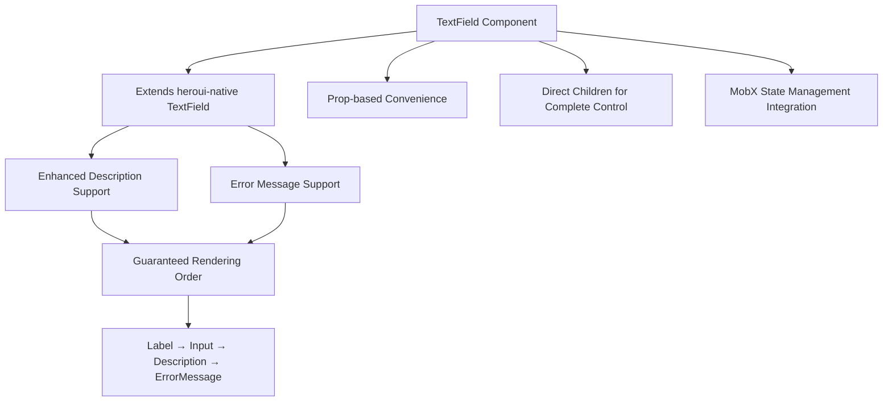
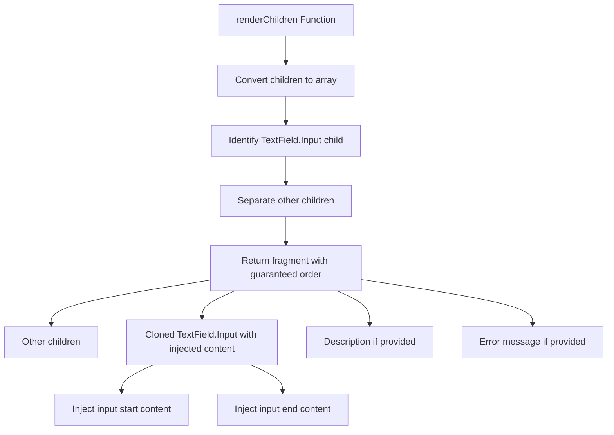
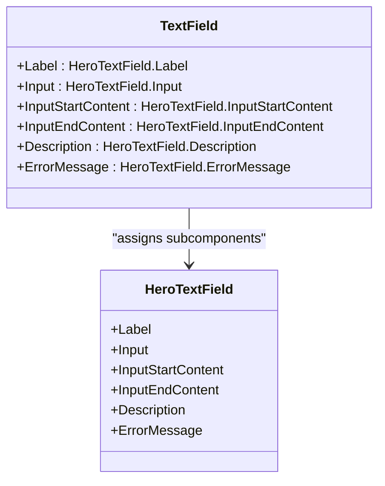
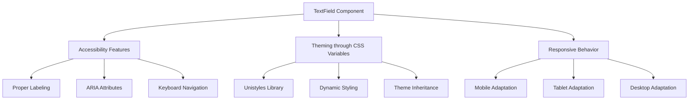
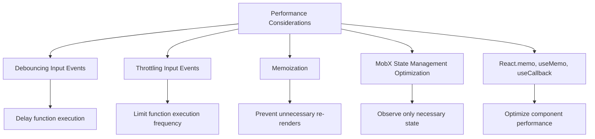

# TextField

<cite>
**Referenced Files in This Document**   
- [TextField.tsx](file://components/ui/inputs/TextField/TextField.tsx)
- [index.tsx](file://components/ui/inputs/TextField/index.tsx)
- [LoginForm.tsx](file://components/form/LoginForm/LoginForm.tsx)
- [TextField.stories.tsx](file://components/ui/inputs/TextField/TextField.stories.tsx)
</cite>

## Table of Contents
1. [Introduction](#introduction)
2. [Core Functionality](#core-functionality)
3. [TextFieldProps Interface](#textfieldprops-interface)
4. [Usage Patterns](#usage-patterns)
5. [Component Composition and Rendering Logic](#component-composition-and-rendering-logic)
6. [Compound Component Implementation](#compound-component-implementation)
7. [Integration with LoginForm](#integration-with-loginform)
8. [Accessibility and Theming](#accessibility-and-theming)
9. [Common Issues and Best Practices](#common-issues-and-best-practices)
10. [Performance Considerations](#performance-considerations)

## Introduction

The TextField component in the Plate application serves as a UI container that extends the heroui-native TextField with enhanced description and error message support. It provides a flexible and reusable input field component that can be easily integrated into various forms throughout the application. The component is designed to support both prop-based convenience and direct children for complete control, allowing developers to choose the most appropriate approach for their specific use case.

The TextField component is part of a larger ecosystem of UI components and follows the compound component pattern, where the main component is assigned subcomponents like Label, Input, Description, and ErrorMessage from the HeroTextField. This design enables a clean and intuitive API for building complex input fields with minimal boilerplate code.

**Section sources**
- [TextField.tsx](file://components/ui/inputs/TextField/TextField.tsx#L1-L178)

## Core Functionality

The TextField component functions as a UI container that wraps the heroui-native TextField component, adding support for enhanced description and error message display. It ensures a guaranteed rendering order of Label → Input → Description → ErrorMessage, which follows the heroui-native standard structure. This consistent ordering improves accessibility and user experience by providing a predictable layout for input fields.

The component supports two primary usage patterns: prop-based convenience and direct children for complete control. The prop-based approach allows developers to pass description and error message content directly through props, while the direct children approach provides more granular control over the component's structure and styling. This dual approach makes the TextField component versatile and adaptable to various design requirements.

The TextField component also integrates with MobX state management through the useFormField hook, enabling seamless form integration and state synchronization. This integration allows the component to automatically handle value changes and update the form state accordingly, reducing the need for manual state management in parent components.



**Diagram sources**
- [TextField.tsx](file://components/ui/inputs/TextField/TextField.tsx#L44-L45)

## TextFieldProps Interface

The TextFieldProps interface extends the TextFieldRootProps from heroui-native with custom variant, size, inputStartContent, inputEndContent, description, and errorMessage props. These additional props provide enhanced functionality and styling options for the TextField component.

The interface includes the following custom props:

- **variant**: Optional TextFieldVariant type that can be 'default' or 'outlined', allowing for different visual styles of the input field.
- **size**: Optional TextFieldSize type that can be 'sm', 'md', or 'lg', enabling responsive sizing of the input field.
- **inputStartContent**: Optional React.ReactNode that renders content at the start of the input field, such as icons or buttons.
- **inputStartContentProps**: Optional Omit<TextFieldInputStartContentProps, 'children'> that provides additional props for the input start content.
- **inputEndContent**: Optional React.ReactNode that renders content at the end of the input field, such as clear buttons or dropdown indicators.
- **inputEndContentProps**: Optional Omit<TextFieldInputEndContentProps, 'children'> that provides additional props for the input end content.
- **description**: Optional React.ReactNode that displays a description below the input field.
- **descriptionProps**: Optional Omit<TextFieldDescriptionProps, 'children'> that provides additional props for the description.
- **errorMessage**: Optional React.ReactNode that displays an error message below the input field when in an invalid state.
- **errorMessageProps**: Optional Omit<TextFieldErrorMessageProps, 'children'> that provides additional props for the error message.

The TextFieldProps interface also extends MobxProps<T>, enabling integration with MobX state management for seamless form handling.

**Section sources**
- [TextField.tsx](file://components/ui/inputs/TextField/TextField.tsx#L22-L37)
- [index.tsx](file://components/ui/inputs/TextField/index.tsx#L21-L23)

## Usage Patterns

The TextField component supports two primary usage patterns: prop-based convenience and direct children for complete control. These patterns provide flexibility in how developers can use the component, depending on their specific needs and preferences.

### Prop-based Convenience

The prop-based convenience pattern allows developers to pass description and error message content directly through props. This approach is ideal for simple use cases where minimal customization is required. Here's an example of using the prop-based pattern:

```tsx
<TextField
  inputStartContent={<Icon />}
  inputEndContent={<Button />}
  description="We'll never share your email"
  errorMessage="Invalid email address"
>
  <TextField.Label>Email</TextField.Label>
  <TextField.Input placeholder="Enter email" />
</TextField>
```

This pattern is convenient for quickly adding common elements to the input field without the need for additional markup. It reduces boilerplate code and makes the component easier to use for basic scenarios.

### Direct Children for Complete Control

The direct children pattern provides complete control over the component's structure and styling. This approach is ideal for complex use cases where fine-grained customization is required. Here's an example of using the direct children pattern:

```tsx
<TextField>
  <TextField.Label>Email</TextField.Label>
  <TextField.Input placeholder="Enter email">
    <TextField.InputStartContent><Icon /></TextField.InputStartContent>
    <TextField.InputEndContent><Button /></TextField.InputEndContent>
  </TextField.Input>
  <TextField.Description>We'll never share your email</TextField.Description>
  <TextField.ErrorMessage>Invalid email</TextField.ErrorMessage>
</TextField>
```

This pattern allows developers to customize each part of the input field independently, providing maximum flexibility in design and functionality. It's particularly useful when integrating with complex forms or when specific styling requirements need to be met.

The choice between these two patterns depends on the specific use case and the level of customization required. For simple forms, the prop-based pattern is often sufficient, while more complex scenarios may benefit from the direct children approach.

**Section sources**
- [TextField.tsx](file://components/ui/inputs/TextField/TextField.tsx#L47-L75)

## Component Composition and Rendering Logic

The TextField component's internal logic for rendering children follows a guaranteed order of Label → Input → Description → ErrorMessage. This order is enforced through the renderChildren function, which processes the component's children and ensures they are rendered in the correct sequence.

The renderChildren function works by first converting the children prop to an array using React.Children.toArray. It then identifies the TextField.Input child and separates it from other children. The function returns a fragment containing the other children, followed by the cloned TextField.Input child with injected input start and end content, and finally the description and error message elements if they are provided.

This rendering logic ensures that the component maintains a consistent structure and appearance, regardless of how the children are ordered in the JSX. It also allows for the seamless integration of additional content, such as icons or buttons, at the start and end of the input field.

The component uses React.cloneElement to inject value and onChangeText props into the TextField.Input child when used with MobX state management. This allows the component to automatically handle value changes and update the form state accordingly, reducing the need for manual state management in parent components.



**Diagram sources**
- [TextField.tsx](file://components/ui/inputs/TextField/TextField.tsx#L97-L137)

## Compound Component Implementation

The TextField component is implemented as a compound component, where the main component is assigned subcomponents like Label, Input, Description, and ErrorMessage from the HeroTextField. This design pattern enables a clean and intuitive API for building complex input fields with minimal boilerplate code.

The compound component implementation is achieved through the Object.assign method, which assigns the subcomponents to the TextField component. Here's the implementation:

```typescript
export const TextField = Object.assign(TextFieldComponent, {
  Label: HeroTextField.Label,
  Input: HeroTextField.Input,
  InputStartContent: HeroTextField.InputStartContent,
  InputEndContent: HeroTextField.InputEndContent,
  Description: HeroTextField.Description,
  ErrorMessage: HeroTextField.ErrorMessage,
});
```

This approach allows developers to use the subcomponents as static properties of the TextField component, providing a cohesive and discoverable API. For example, TextField.Label can be used to render a label for the input field, while TextField.Input can be used to render the actual input element.

The compound component pattern also enables the re-export of subcomponents for convenience, allowing developers to import them directly from the TextField module. This improves code organization and reduces the need for multiple import statements.



**Diagram sources**
- [TextField.tsx](file://components/ui/inputs/TextField/TextField.tsx#L149-L156)

## Integration with LoginForm

The TextField component is integrated into the LoginForm component, demonstrating its practical usage in a real-world scenario. The LoginForm component uses the TextField component to create input fields for email and password, showcasing the component's flexibility and ease of use.

In the LoginForm component, two TextField instances are used to create the email and password input fields. Each TextField contains a Label and Input subcomponent, with additional props for placeholder text, keyboard type, auto-capitalization, and auto-complete settings. The value and onChangeText props are bound to the form state, enabling two-way data binding and automatic state updates.

Here's an example of how the TextField component is used in the LoginForm:

```tsx
<TextField>
  <TextField.Label>
    <Text>이메일</Text>
  </TextField.Label>
  <TextField.Input
    placeholder="이메일을 입력하세요"
    keyboardType="email-address"
    autoCapitalize="none"
    autoComplete="email"
    value={state.email}
    onChangeText={onEmailChange}
  />
</TextField>

<TextField>
  <TextField.Label>
    <Text>비밀번호</Text>
  </TextField.Label>
  <TextField.Input
    placeholder="비밀번호를 입력하세요"
    secureTextEntry
    autoComplete="password"
    value={state.password}
    onChangeText={onPasswordChange}
  />
</TextField>
```

This integration demonstrates the TextField component's ability to handle common form input scenarios, such as email and password fields, with minimal configuration. The use of the Text component within the Label subcomponent also showcases the component's compatibility with other UI elements in the application.

**Section sources**
- [LoginForm.tsx](file://components/form/LoginForm/LoginForm.tsx#L25-L50)

## Accessibility and Theming

The TextField component supports accessibility features and theming through CSS variables, ensuring a consistent and inclusive user experience across different platforms and devices. The component is designed to be responsive and adaptable to various screen sizes and orientations, providing a seamless experience for users on mobile, tablet, and desktop devices.

Accessibility features include proper labeling of input fields through the Label subcomponent, which improves screen reader support and keyboard navigation. The component also supports ARIA attributes and follows best practices for accessible form design, such as providing clear error messages and descriptions.

Theming is achieved through the use of CSS variables and the Unistyles library, which allows for dynamic styling based on the current theme and color scheme. The component inherits its styling from the parent theme, ensuring consistency with the overall application design. Developers can customize the appearance of the TextField component by modifying the theme variables or by passing custom props to override specific styles.

The component is also responsive across platforms, adapting its layout and behavior based on the device and screen size. For example, on mobile devices, the input field may have a smaller size and different padding compared to desktop devices. This responsiveness ensures that the component looks and functions well on a wide range of devices and screen sizes.



**Diagram sources**
- [TextField.tsx](file://components/ui/inputs/TextField/TextField.tsx#L1-L178)
- [unistyle.txt](file://unistyle.txt#L1926-L8338)

## Common Issues and Best Practices

When using the TextField component, developers may encounter common issues such as content overlap and validation state management. These issues can be addressed through proper configuration and adherence to best practices.

### Content Overlap

Content overlap can occur when the input start or end content is too large or when the description or error message is too long. To prevent content overlap, developers should ensure that the input start and end content is appropriately sized and positioned. Using the inputStartContentProps and inputEndContentProps can help fine-tune the appearance and behavior of these elements.

Additionally, developers should consider using responsive design techniques to adjust the layout and sizing of the input field based on the screen size and orientation. This can help prevent content overlap on smaller screens or when the device is rotated.

### Validation State Management

Validation state management is crucial for providing feedback to users when they enter invalid data. The TextField component supports error message display through the errorMessage prop and the isInvalid state. Developers should ensure that the validation logic is properly implemented and that error messages are clear and concise.

Best practices for validation state management include:
- Providing real-time validation feedback as the user types
- Using clear and specific error messages that explain what went wrong and how to fix it
- Highlighting the input field with a visual indicator when in an invalid state
- Ensuring that the error message is read by screen readers for accessibility

### Best Practices for Form Integration

When integrating the TextField component with MobX state management, developers should follow these best practices:
- Use the useFormField hook to manage form state and synchronize it with the component's value
- Implement proper error handling and validation logic to ensure data integrity
- Use the path prop to specify the location of the form field value in the state tree
- Ensure that the form state is properly initialized and updated to prevent unexpected behavior

By following these best practices, developers can create robust and user-friendly forms that provide a seamless experience for users.

**Section sources**
- [TextField.tsx](file://components/ui/inputs/TextField/TextField.tsx#L1-L178)
- [index.tsx](file://components/ui/inputs/TextField/index.tsx#L1-L95)

## Performance Considerations

When handling rapid input events, the TextField component may experience performance issues due to frequent re-renders. To optimize performance, developers should consider implementing debouncing or throttling for input events, especially when performing expensive operations such as validation or API calls.

Debouncing can be implemented by delaying the execution of a function until after a certain amount of time has passed since the last event. This can help reduce the number of re-renders and improve performance when the user is typing quickly. Throttling, on the other hand, limits the execution of a function to a maximum number of times per second, ensuring that it is called at regular intervals regardless of the input frequency.

Another performance consideration is the use of memoization to prevent unnecessary re-renders of the component. By memoizing the component or its subcomponents, developers can ensure that they only re-render when their props or state have actually changed. This can significantly improve performance, especially in complex forms with many input fields.

Developers should also be mindful of the impact of MobX state management on performance. While MobX provides powerful tools for state synchronization, it can also lead to excessive re-renders if not used properly. To optimize performance, developers should ensure that only the necessary parts of the state are observed and that computed values are used to derive derived state.

Finally, developers should consider using the React.memo higher-order component or the useMemo and useCallback hooks to optimize the performance of the TextField component and its subcomponents. These tools can help prevent unnecessary re-renders and improve the overall performance of the application.



**Diagram sources**
- [index.tsx](file://components/ui/inputs/TextField/index.tsx#L38-L66)