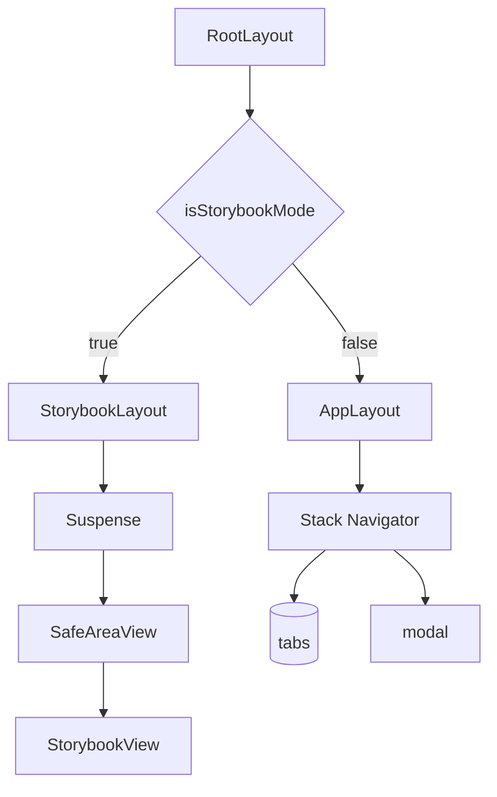
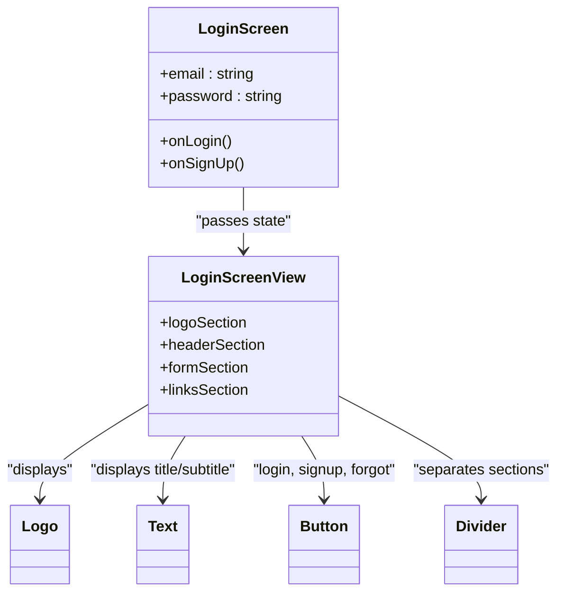
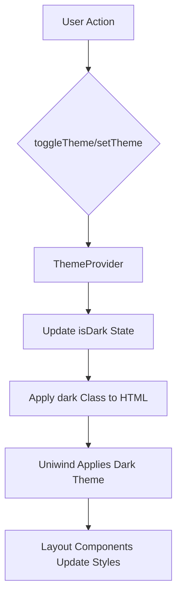

# Layouts

<cite>
**Referenced Files in This Document**   
- [Screen.tsx](file://components/ui/layouts/Screen/Screen.tsx)
- [ScreenView.tsx](file://components/ui/layouts/Screen/ScreenView.tsx)
- [Header.tsx](file://components/ui/layouts/Header/Header.tsx)
- [SafeAreaView.tsx](file://components/ui/layouts/SafeAreaView/SafeAreaView.tsx)
- [_layout.tsx](file://src/app/(tabs)/_layout.tsx)
- [_layout.tsx](file://src/app/_layout.tsx)
- [LoginScreen.tsx](file://components/screen/LoginScreen/LoginScreen.tsx)
- [LoginScreenView.tsx](file://components/screen/LoginScreen/LoginScreenView.tsx)
- [useTheme.ts](file://hooks/useTheme.ts)
- [theme.ts](file://constants/theme.ts)
- [unistyles.ts](file://unistyles.ts)
- [ThemeProvider.tsx](file://components/provider/ThemeProvider/ThemeProvider.tsx)
</cite>

## Table of Contents
1. [Introduction](#introduction)
2. [Core Layout Components](#core-layout-components)
3. [Layout Integration with Expo Router](#layout-integration-with-expo-router)
4. [LoginScreen Composition Example](#loginscreen-composition-example)
5. [Responsive Design and Theming](#responsive-design-and-theming)
6. [Performance and Common Issues](#performance-and-common-issues)
7. [Best Practices](#best-practices)

## Introduction
This document details the layout components used to structure the application’s visual hierarchy and ensure cross-platform compatibility. The primary layout components—Screen, Header, and SafeAreaView—are designed to provide consistent structure, handle device-specific insets, and support theming across platforms. These components are integrated with Expo Router and Uniwind for scalable, maintainable UI development.

## Core Layout Components

### Screen Component
The `Screen` component serves as a root-level container for application screens, wrapping the `ScreenView` component with MobX observer functionality for future state integration. It ensures consistent layout structure and theming across all screens.

The `ScreenView` component implements core layout logic, including safe area handling via `useSafeAreaInsets`, dynamic status bar styling based on theme, and optional edge-specific safe area control. It defaults to applying safe area insets on all edges but allows granular control through the `safeAreaEdges` prop.

**Section sources**
- [Screen.tsx](file://components/ui/layouts/Screen/Screen.tsx#L1-L14)
- [ScreenView.tsx](file://components/ui/layouts/Screen/ScreenView.tsx#L1-L58)

### Header Component
The `Header` component provides navigational consistency across the application. It supports multiple variants (default, transparent, elevated), accepts left and right actions as buttons, and allows custom center content. It integrates with React Navigation’s `NativeStackHeaderProps` and respects safe area insets for status bar height.

Styling is theme-aware via `useTheme`, and platform-specific elevation is applied for the "elevated" variant using React Native’s `Platform.select`. The layout uses a flexible three-section design (left, center, right) with consistent spacing and alignment.

**Section sources**
- [Header.tsx](file://components/ui/layouts/Header/Header.tsx#L1-L178)

### SafeAreaView Component
The `SafeAreaView` component is a thin wrapper around `react-native-safe-area-context`’s `SafeAreaView`, enhanced with Uniwind support via `withUniwind`. It ensures content avoids device notches, status bars, and other screen insets by applying appropriate padding.

Unlike the `Screen` component, `SafeAreaView` is used selectively in layouts where full safe area protection is needed, such as storybook views or modal containers.

**Section sources**
- [SafeAreaView.tsx](file://components/ui/layouts/SafeAreaView/SafeAreaView.tsx#L1-L16)

## Layout Integration with Expo Router

### Root Layout Structure
The root layout at `src/app/_layout.tsx` uses Expo Router’s `Stack` navigator to define top-level navigation. It conditionally renders either the main app layout or a Storybook layout based on environment configuration. The `SafeAreaView` is applied at the root level in the Storybook layout to ensure proper inset handling.

**Diagram sources**
- [_layout.tsx](file://src/app/_layout.tsx#L1-L44)

### Tabs Layout
The `(tabs)/_layout.tsx` file configures the tab-based navigation using Expo Router’s `Tabs` component. It disables the default header (`headerShown: false`) and sets tab bar tint colors based on the current color scheme via `useColorScheme`. This layout serves as the container for tabbed screens like Home and Explore.

**Section sources**
- [_layout.tsx](file://src/app/(tabs)/_layout.tsx#L1-L32)

## LoginScreen Composition Example

### Component Structure
The `LoginScreen` component demonstrates the composition of layout components to create a cohesive user experience. It uses MobX for state management, maintaining `email` and `password` fields in an observable state object. This state is passed down to the presentational `LoginScreenView`.

The `LoginScreenView` renders the UI structure using layout components:
- `View` containers for section grouping
- `ScrollView` for scrollable content
- `Logo`, `Text`, `Button`, and `Divider` for UI elements

It does not directly use `Header` or `Screen` but is intended to be wrapped by them in the navigation stack.

**Diagram sources**
- [LoginScreen.tsx](file://components/screen/LoginScreen/LoginScreen.tsx#L1-L30)
- [LoginScreenView.tsx](file://components/screen/LoginScreen/LoginScreenView.tsx#L1-L151)

**Section sources**
- [LoginScreen.tsx](file://components/screen/LoginScreen/LoginScreen.tsx#L1-L30)
- [LoginScreenView.tsx](file://components/screen/LoginScreen/LoginScreenView.tsx#L1-L151)

## Responsive Design and Theming

### Theming System
The application uses a dual theming system combining Uniwind and CSS variables:
- `unistyles.ts` defines light and dark theme objects with color scales, spacing, typography, and shadows
- `useTheme` hook provides access to the current theme and toggle functionality
- `ThemeProvider` manages theme state and applies the `dark` class to the HTML element on web

Theming is integrated with layout components via `useTheme`, ensuring background colors, text colors, and other visual properties respond to theme changes.

**Diagram sources**
- [useTheme.ts](file://hooks/useTheme.ts#L1-L42)
- [unistyles.ts](file://unistyles.ts#L1-L445)
- [ThemeProvider.tsx](file://components/provider/ThemeProvider/ThemeProvider.tsx#L1-L132)

### Responsive Considerations
Layout components use platform-aware styling (via `Platform.select`) and relative units (flex, Uniwind classes) to ensure responsiveness. Safe area handling is critical for native platforms, while web relies on CSS variables and viewport units.

## Performance and Common Issues

### Layout Jitter on Theme Switch
Rapid theme switching can cause layout jitter due to re-renders triggered by both React state updates and CSS class changes. This is mitigated by:
- Batching theme updates
- Using `useMemo` for derived styles
- Avoiding inline style objects in render

### Safe Area Application Discrepancies
On web, safe area insets may not apply correctly as `react-native-safe-area-context` relies on native APIs. The application addresses this by:
- Using conditional rendering for web-specific layouts
- Relying on CSS environment variables (`env(safe-area-inset-*)`) where possible
- Testing across device types and orientations

**Section sources**
- [ScreenView.tsx](file://components/ui/layouts/Screen/ScreenView.tsx#L1-L58)
- [useSafeAreaInsets](https://docs.expo.dev/versions/latest/react-native-safe-area-context/#usesafeareainsets)

## Best Practices

### Extending Layouts
When creating new layout components:
- Compose existing components (Screen, Header, SafeAreaView)
- Use Uniwind classes for styling
- Support theme-awareness via `useTheme`
- Allow prop-based customization (e.g., `safeAreaEdges`)

### Accessibility
Ensure all layout components:
- Support screen readers
- Maintain proper contrast ratios
- Allow dynamic text sizing
- Provide semantic structure

### Maintainability
- Separate container and presentational logic (e.g., LoginScreen vs LoginScreenView)
- Use TypeScript interfaces for props
- Document component usage in stories (Storybook)
- Centralize design tokens in `unistyles.ts`

**Section sources**
- [unistyles.ts](file://unistyles.ts#L1-L445)
- [theme.ts](file://constants/theme.ts#L1-L50)
- [useTheme.ts](file://hooks/useTheme.ts#L1-L42)