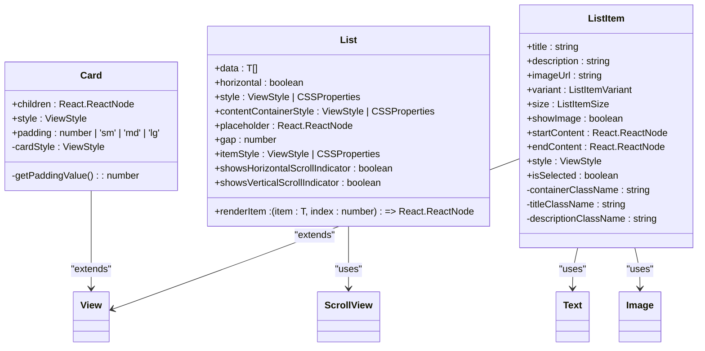
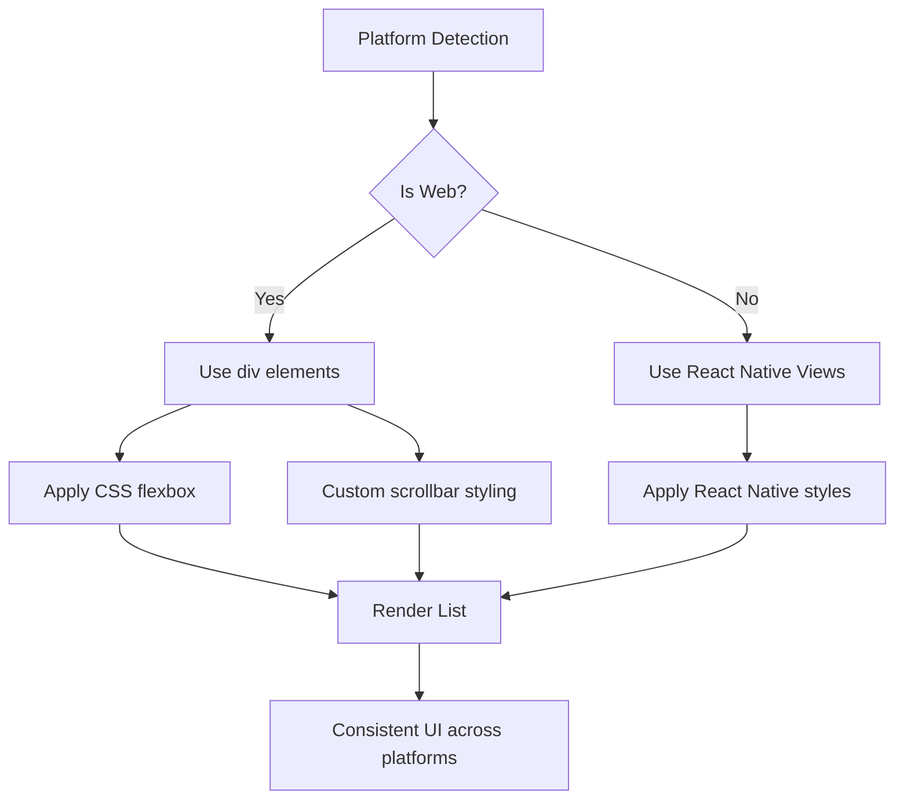
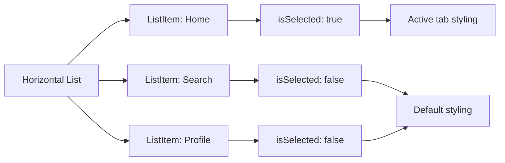

# Surfaces

<cite>
**Referenced Files in This Document**   
- [Card.tsx](file://components/ui/surfaces/Card/Card.tsx)
- [List.tsx](file://components/ui/surfaces/List/List.tsx)
- [List.web.tsx](file://components/ui/surfaces/List/List.web.tsx)
- [ListItem.tsx](file://components/ui/surfaces/ListItem/ListItem.tsx)
- [ListItem.styles.ts](file://components/ui/surfaces/ListItem/ListItem.styles.ts)
- [unistyles.ts](file://unistyles.ts)
</cite>

## Table of Contents
1. [Introduction](#introduction)
2. [Card Component](#card-component)
3. [List and ListItem Components](#list-and-listitem-components)
4. [Styling and Customization](#styling-and-customization)
5. [Composition Patterns](#composition-patterns)
6. [Accessibility Considerations](#accessibility-considerations)
7. [Platform-Specific Implementations](#platform-specific-implementations)
8. [Performance Implications](#performance-implications)
9. [Real-World Examples](#real-world-examples)
10. [Conclusion](#conclusion)

## Introduction
The Surfaces category of UI components provides visually distinct containers for grouping related information and creating hierarchical layouts. This documentation focuses on three core components: Card, List, and ListItem. These components work together to create structured, organized interfaces that enhance user experience through clear visual hierarchy and consistent design patterns. The components leverage the Uniwind utility-first approach and UniStyles theming system to ensure consistency across the application while allowing for flexible customization.

## Card Component

The Card component serves as a fundamental container for grouping related content with a distinct visual appearance. It provides a content1 background with rounded corners, a border, and configurable padding. The component is designed to be a simple wrapper that can contain any type of content, from text and images to interactive elements like buttons.

The Card component accepts several props that control its appearance and behavior:
- `children`: The content to be rendered inside the card
- `style`: Additional inline styles to be applied to the card
- `padding`: Configures the internal padding with options for 'sm', 'md', or 'lg' (default), or a custom numeric value

The padding values are calculated using the UniStyles spacing tokens, where 'sm' corresponds to 8px, 'md' to 16px, and 'lg' to 24px. The card's visual styling is defined by the current theme, with the background color set to theme.colors.content1.DEFAULT, border radius to theme.radius.md, and border color to theme.colors.content3.DEFAULT.

**Section sources**
- [Card.tsx](file://components/ui/surfaces/Card/Card.tsx#L4-L8)
- [Card.tsx](file://components/ui/surfaces/Card/Card.tsx#L16-L49)

## List and ListItem Components

### List Component Architecture
The List component provides a scrollable container for rendering collections of items either vertically or horizontally. It is built on top of React Native's ScrollView component and offers several configuration options:

- `data`: Array of items to be rendered
- `renderItem`: Function that defines how each item should be rendered
- `horizontal`: Boolean flag to enable horizontal layout (default: false)
- `gap`: Controls the spacing between items (default: 8px)
- `showsHorizontalScrollIndicator` and `showsVerticalScrollIndicator`: Control visibility of scroll indicators

The List component handles empty states by optionally rendering a placeholder when the data array is empty. On web platforms, the implementation uses div elements with CSS flexbox for layout, while on native platforms it uses React Native's View and ScrollView components.

**Section sources**
- [List.tsx](file://components/ui/surfaces/List/List.tsx#L3-L14)
- [List.tsx](file://components/ui/surfaces/List/List.tsx#L16-L56)
- [List.web.tsx](file://components/ui/surfaces/List/List.web.tsx#L2-L13)
- [List.web.tsx](file://components/ui/surfaces/List/List.web.tsx#L15-L66)

### ListItem Component Features
The ListItem component is designed to display individual items within a list with a consistent, modern appearance. It supports several configuration options:

- `title`: Primary text content (required)
- `description`: Secondary text content (optional)
- `imageUrl`: URL for an image to be displayed (optional)
- `variant`: Visual style with options for 'default', 'card', or 'simple'
- `size`: Size configuration with options for 'sm', 'md', or 'lg'
- `showImage`: Controls visibility of the image (default: true)
- `startContent` and `endContent`: Custom content to be rendered at the start and end of the item
- `isSelected`: Boolean flag to indicate selection state

The ListItem component uses Uniwind helper functions to generate class strings for styling, which are then applied via the className prop. This approach allows for efficient styling while maintaining compatibility with the utility-first CSS methodology.

**Section sources**
- [ListItem.tsx](file://components/ui/surfaces/ListItem/ListItem.tsx#L13-L24)
- [ListItem.tsx](file://components/ui/surfaces/ListItem/ListItem.tsx#L26-L99)

## Styling and Customization

### CSS Variables and Uniwind Integration
The Surfaces components leverage Uniwind's utility-first approach for styling, which allows for rapid UI development and consistent design patterns. The components use helper functions to generate class strings based on component props and theme values. For example, the ListItem component uses `getContainerClass`, `getTitleClass`, and `getDescriptionClass` functions to determine the appropriate styles based on variant, size, and selection state.

The styling system is theme-aware, with colors and spacing values pulled from the UniStyles theme configuration. This ensures that components automatically adapt to light and dark modes and maintain visual consistency across the application.

### Responsive Behavior
The components are designed to be responsive across different devices and screen sizes. The List component automatically adjusts its layout based on the `horizontal` prop, switching between vertical and horizontal scrolling as needed. The ListItem component's size variants ('sm', 'md', 'lg') provide different height and spacing configurations suitable for various screen densities and user preferences.

The responsive behavior is further enhanced by the UniStyles theme system, which defines spacing, radius, and typography values that scale appropriately across different platforms and screen sizes.

**Diagram sources **
- [Card.tsx](file://components/ui/surfaces/Card/Card.tsx#L4-L8)
- [List.tsx](file://components/ui/surfaces/List/List.tsx#L3-L14)
- [ListItem.tsx](file://components/ui/surfaces/ListItem/ListItem.tsx#L13-L24)

## Composition Patterns

The Surfaces components are designed to be highly composable, allowing developers to create rich, interactive interfaces by combining them with other components. Common composition patterns include:

- Placing Text components inside Cards to create information panels
- Using Buttons within Cards for call-to-action elements
- Combining List and ListItem components to create navigation menus or settings screens
- Using startContent and endContent props in ListItem to add icons, badges, or other interactive elements

The components are designed to work seamlessly with the application's design system, ensuring that composed elements maintain visual consistency and proper spacing. For example, when placing a Button inside a Card, the button's styling automatically adapts to the card's background and follows the design system's color and typography guidelines.

**Section sources**
- [Card.tsx](file://components/ui/surfaces/Card/Card.tsx#L16-L49)
- [ListItem.tsx](file://components/ui/surfaces/ListItem/ListItem.tsx#L26-L99)

## Accessibility Considerations

The Surfaces components include several accessibility features to ensure they are usable by all users:

- The List component uses semantic ScrollView elements on native platforms and div elements on web, providing proper scroll behavior and keyboard navigation
- The ListItem component supports selection state through the isSelected prop, which can be used to convey selection status to assistive technologies
- The components use proper contrast ratios between text and background colors, as defined in the UniStyles theme
- When used with interactive elements like buttons, the components maintain proper focus states and keyboard navigation

For lists that represent navigation or selection interfaces, it's recommended to add appropriate ARIA labels and roles to ensure screen readers can properly interpret the content structure. The ListSelect component, which uses List and ListItem internally, provides additional accessibility features for selection interfaces.

**Section sources**
- [List.tsx](file://components/ui/surfaces/List/List.tsx#L16-L56)
- [ListItem.tsx](file://components/ui/surfaces/ListItem/ListItem.tsx#L26-L99)

## Platform-Specific Implementations

The Surfaces components include platform-specific implementations to ensure optimal performance and user experience across different platforms. The List component has separate implementations for native and web platforms:

- On native platforms, it uses React Native's ScrollView with View containers for items
- On web platforms, it uses div elements with CSS flexbox for layout and custom scrollbar styling

The web implementation includes additional CSS properties to control scrollbar appearance and touch behavior:
- `overflowX` and `overflowY` for precise scroll control
- `msOverflowStyle` and `scrollbarWidth` for consistent scrollbar appearance across browsers
- Custom button styling to ensure proper cursor behavior and accessibility

These platform-specific implementations ensure that the components feel native on each platform while maintaining consistent behavior and appearance.

**Diagram sources **
- [List.tsx](file://components/ui/surfaces/List/List.tsx#L16-L56)
- [List.web.tsx](file://components/ui/surfaces/List/List.web.tsx#L15-L66)

## Performance Implications

When rendering large lists, several performance considerations should be taken into account:

- The List component renders all items at once, which can impact performance with very large datasets. For optimal performance with large lists, consider implementing virtualization or pagination.
- Each ListItem performs style calculations based on its props, which can add up with many items. The use of memoized helper functions helps mitigate this impact.
- Image loading in ListItems should be optimized, especially when displaying many items with images. Consider using lazy loading or placeholder images.
- On web platforms, the use of CSS custom properties and efficient class name generation helps maintain good rendering performance.

For applications that require rendering large datasets, consider using the List component in combination with data virtualization techniques or implementing infinite scrolling with data loading.

**Section sources**
- [List.tsx](file://components/ui/surfaces/List/List.tsx#L16-L56)
- [ListItem.tsx](file://components/ui/surfaces/ListItem/ListItem.tsx#L26-L99)

## Real-World Examples

### Tabbed Navigation Interface
The List and ListItem components are commonly used together to create tabbed navigation interfaces. In this pattern, a horizontal List contains multiple ListItems, each representing a navigation tab. The selected tab is indicated by the isSelected prop, which applies a border and shadow to highlight the active state.

**Diagram sources **
- [List.tsx](file://components/ui/surfaces/List/List.tsx#L16-L56)
- [ListItem.tsx](file://components/ui/surfaces/ListItem/ListItem.tsx#L26-L99)

### Settings Menu
Another common use case is creating settings menus, where a vertical List contains ListItems representing different settings options. Each ListItem can include a title, description, and optional icons or switches. The variant prop can be set to 'simple' to create a clean, minimal appearance suitable for settings interfaces.

The Card component is often used in conjunction with lists to group related settings or to create feature panels within the application. For example, a profile screen might use a Card to contain user information, with a List below it containing navigation options.

**Section sources**
- [List.tsx](file://components/ui/surfaces/List/List.tsx#L16-L56)
- [ListItem.tsx](file://components/ui/surfaces/ListItem/ListItem.tsx#L26-L99)
- [Card.tsx](file://components/ui/surfaces/Card/Card.tsx#L16-L49)

## Conclusion
The Surfaces components—Card, List, and ListItem—provide a robust foundation for creating structured, visually appealing interfaces. By leveraging the Uniwind utility-first approach and UniStyles theming system, these components offer both consistency and flexibility. Their thoughtful design supports common UI patterns like navigation menus and settings screens while providing the tools needed for customization and accessibility. When used according to the guidelines outlined in this documentation, these components help maintain alignment with the overall design system while enabling developers to create engaging user experiences.