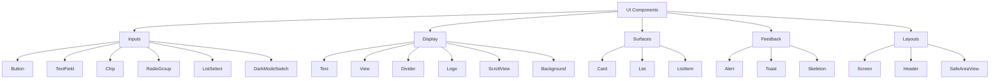
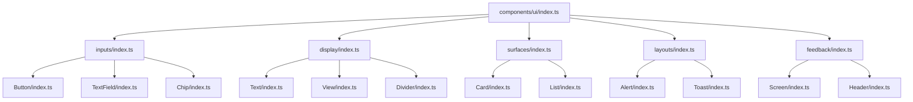

# UI Components

<cite>
**Referenced Files in This Document**   
- [Button.tsx](file://components/ui/inputs/Button/Button.tsx)
- [Button/index.ts](file://components/ui/inputs/Button/index.ts)
- [Text.tsx](file://components/ui/display/Text/Text.tsx)
- [Text/index.ts](file://components/ui/display/Text/index.ts)
- [Card.tsx](file://components/ui/surfaces/Card/Card.tsx)
- [Card/index.ts](file://components/ui/surfaces/Card/index.ts)
- [Screen.tsx](file://components/ui/layouts/Screen/Screen.tsx)
- [ScreenView.tsx](file://components/ui/layouts/Screen/ScreenView.tsx)
- [index.ts](file://components/ui/index.ts)
- [inputs/index.ts](file://components/ui/inputs/index.ts)
- [display/index.ts](file://components/ui/display/index.ts)
- [surfaces/index.ts](file://components/ui/surfaces/index.ts)
- [layouts/index.ts](file://components/ui/layouts/index.ts)
- [useTheme.ts](file://hooks/useTheme.ts)
- [theme.ts](file://constants/theme.ts)
- [unistyles.ts](file://unistyles.ts)
</cite>

## Table of Contents

1. [Introduction](#introduction)
2. [Component Categorization System](#component-categorization-system)
3. [Core Component Categories](#core-component-categories)
4. [Design Philosophy and Separation of Concerns](#design-philosophy-and-separation-of-concerns)
5. [File Structure and Naming Conventions](#file-structure-and-naming-conventions)
6. [Export Mechanisms and Module Organization](#export-mechanisms-and-module-organization)
7. [Practical Implementation Examples](#practical-implementation-examples)
8. [Common Issues and Best Practices](#common-issues-and-best-practices)
9. [Conclusion](#conclusion)

## Introduction

The Plate application implements a comprehensive UI component architecture inspired by Material-UI (MUI) design principles and atomic design methodology. This system organizes components into a structured hierarchy that promotes reusability, consistency, and maintainability across the codebase. The architecture separates pure UI components from business logic, enabling cross-project reuse while maintaining a clean separation of concerns. This document details the implementation of the five core component categories—inputs, display, surfaces, feedback, and layouts—and explains the file structure patterns, naming conventions, and export mechanisms that support this scalable component system.

## Component Categorization System

The UI component library follows a MUI-inspired categorization system based on atomic design principles, organizing components into five distinct categories based on their functional roles within the interface. This taxonomy provides a logical framework for component organization and discovery, ensuring consistency across the codebase.



**Diagram sources**

- [components/ui/inputs/index.ts](file://components/ui/inputs/index.ts)
- [components/ui/display/index.ts](file://components/ui/display/index.ts)
- [components/ui/surfaces/index.ts](file://components/ui/surfaces/index.ts)
- [components/ui/feedback/index.ts](file://components/ui/feedback/index.ts)
- [components/ui/layouts/index.ts](file://components/ui/layouts/index.ts)

**Section sources**

- [components/ui/index.ts](file://components/ui/index.ts)

## Core Component Categories

### Inputs

The inputs category contains interactive components that accept user input and trigger actions. These components serve as the primary interface for user interaction and data entry.

**Section sources**

- [components/ui/inputs/index.ts](file://components/ui/inputs/index.ts)

### Display

Display components are responsible for presenting information to users in a visually consistent manner. These non-interactive elements focus on content presentation and visual hierarchy.

**Section sources**

- [components/ui/display/index.ts](file://components/ui/display/index.ts)

### Surfaces

Surface components create visual containers and boundaries for content, establishing depth and hierarchy through elevation, borders, and backgrounds. They provide structural organization for interface elements.

**Section sources**

- [components/ui/surfaces/index.ts](file://components/ui/surfaces/index.ts)

### Feedback

Feedback components communicate system status and user actions through visual indicators. This category includes loading states, notifications, and error messages that enhance user experience.

**Section sources**

- [components/ui/feedback/index.ts](file://components/ui/feedback/index.ts)

### Layouts

Layout components manage the spatial organization of interface elements, handling screen structure, spacing, and responsive behavior. They provide the foundational structure for views and screens.

**Section sources**

- [components/ui/layouts/index.ts](file://components/ui/layouts/index.ts)

## Design Philosophy and Separation of Concerns

The UI component architecture follows a strict separation between pure UI components and business logic, enabling maximum reusability across different contexts and projects. This design philosophy ensures that components remain focused on presentation concerns while allowing integration with various state management systems.

The architecture leverages theme-based styling through Uniwind and unistyles, abstracting design tokens into a centralized system that supports both light and dark modes. Components consume these tokens through hooks like `useTheme`, maintaining consistency while remaining decoupled from specific styling implementations.

```mermaid
classDiagram
class useTheme {
+theme : UnistyleTheme
+isDark : boolean
+toggleTheme() : void
+setTheme(mode : 'light' | 'dark') : void
}
class Button {
+startIcon? : React.ReactNode
+endIcon? : React.ReactNode
+children? : React.ReactNode
}
class Text {
+variant? : TextVariant
+color? : TextColor
+children? : React.ReactNode
}
class Card {
+padding? : number | 'sm' | 'md' | 'lg'
+children? : React.ReactNode
}
class Screen {
+useSafeArea? : boolean
+safeAreaEdges? : { top? : boolean, bottom? : boolean, left? : boolean, right? : boolean }
+children : React.ReactNode
}
Button --> useTheme : "consumes"
Text --> useTheme : "consumes"
Card --> useTheme : "consumes"
Screen --> useTheme : "consumes"
```

**Diagram sources**

- [hooks/useTheme.ts](file://hooks/useTheme.ts)
- [components/ui/inputs/Button/Button.tsx](file://components/ui/inputs/Button/Button.tsx)
- [components/ui/display/Text/Text.tsx](file://components/ui/display/Text/Text.tsx)
- [components/ui/surfaces/Card/Card.tsx](file://components/ui/surfaces/Card/Card.tsx)
- [components/ui/layouts/Screen/Screen.tsx](file://components/ui/layouts/Screen/Screen.tsx)

**Section sources**

- [hooks/useTheme.ts](file://hooks/useTheme.ts)
- [unistyles.ts](file://unistyles.ts)

## File Structure and Naming Conventions

The component library follows a consistent file structure and naming convention that enhances discoverability and maintainability. Each component resides in a dedicated folder within its respective category, with PascalCase used for component folder names and lowercase for category directories.

The structure implements a clear hierarchy:

- Top-level `components/` directory contains all component groups
- Category directories (`inputs`, `display`, `surfaces`, `layouts`, `feedback`) use lowercase names
- Component folders (e.g., `Button`, `Text`, `Card`) use PascalCase
- Each component folder contains the implementation file, stories file, and index file

This pattern ensures that components are easily locatable while maintaining a logical organization that reflects their functional roles.

**Section sources**

- [components/ui/inputs/Button](file://components/ui/inputs/Button)
- [components/ui/display/Text](file://components/ui/display/Text)
- [components/ui/surfaces/Card](file://components/ui/surfaces/Card)
- [components/ui/layouts/Screen](file://components/ui/layouts/Screen)

## Export Mechanisms and Module Organization

The component library employs a systematic export mechanism using `index.ts` files at multiple levels to create clean import paths and facilitate tree-shaking. This approach enables both granular and bulk imports while maintaining a consistent API surface.

At the category level, `index.ts` files re-export all components within that category:

- `components/ui/inputs/index.ts` exports all input components
- `components/ui/display/index.ts` exports all display components
- `components/ui/surfaces/index.ts` exports all surface components
- `components/ui/layouts/index.ts` exports all layout components

The root `components/ui/index.ts` file aggregates exports from all categories, allowing for unified imports from the UI namespace. This hierarchical export system supports both specific component imports and bulk category imports, providing flexibility for different usage patterns.



**Diagram sources**

- [components/ui/index.ts](file://components/ui/index.ts)
- [components/ui/inputs/index.ts](file://components/ui/inputs/index.ts)
- [components/ui/display/index.ts](file://components/ui/display/index.ts)
- [components/ui/surfaces/index.ts](file://components/ui/surfaces/index.ts)
- [components/ui/layouts/index.ts](file://components/ui/layouts/index.ts)
- [components/ui/feedback/index.ts](file://components/ui/feedback/index.ts)

**Section sources**

- [components/ui/index.ts](file://components/ui/index.ts)
- [components/index.ts](file://components/index.ts)

## Practical Implementation Examples

### Button Component

The Button component demonstrates the implementation of compound components and prop normalization. It wraps a third-party `HeroButton` with enhanced functionality, including automatic `Button.Label` wrapping for string children and support for `startIcon` and `endIcon` props. The component uses `Object.assign` to create a compound component with the `Label` subcomponent.

**Section sources**

- [components/ui/inputs/Button/Button.tsx](file://components/ui/inputs/Button/Button.tsx)
- [components/ui/inputs/Button/index.ts](file://components/ui/inputs/Button/index.ts)

### Text Component

The Text component implements typographic hierarchy through the `tv` (tailwind-variants) utility, supporting multiple variants (h1-h6, body1-body2, caption, etc.) and color schemes. It abstracts typography tokens from the theme system, ensuring consistent text styling across the application.

**Section sources**

- [components/ui/display/Text/Text.tsx](file://components/ui/display/Text/Text.tsx)
- [components/ui/display/Text/index.ts](file://components/ui/display/Text/index.ts)

### Card Component

The Card component exemplifies surface-level styling with configurable padding options (sm, md, lg) that map to theme spacing tokens. It consumes the theme through `useTheme` to access color and spacing values, ensuring consistency with the overall design system.

**Section sources**

- [components/ui/surfaces/Card/Card.tsx](file://components/ui/surfaces/Card/Card.tsx)
- [components/ui/surfaces/Card/index.ts](file://components/ui/surfaces/Card/index.ts)

### Screen Component

The Screen component demonstrates the separation between pure UI and state-integrated components. It exports both `Screen` (with MobX observer) and `ScreenView` (pure UI), allowing for flexible usage patterns. The component handles safe area insets and status bar styling, providing a consistent foundation for application screens.

**Section sources**

- [components/ui/layouts/Screen/Screen.tsx](file://components/ui/layouts/Screen/Screen.tsx)
- [components/ui/layouts/Screen/ScreenView.tsx](file://components/ui/layouts/Screen/ScreenView.tsx)
- [components/ui/layouts/index.ts](file://components/ui/layouts/index.ts)

## Common Issues and Best Practices

### Common Issues

- **Theme token inconsistencies**: Ensure all components use theme tokens from `unistyles.ts` rather than hardcoded values
- **Prop drilling**: Avoid excessive prop passing by creating intermediate wrapper components when needed
- **Bundle size**: Be mindful of tree-shaking implications when using bulk imports
- **Storybook integration**: Maintain up-to-date stories for all components to ensure visual consistency

### Best Practices for Extending the UI Library

1. **Follow existing patterns**: Adhere to the established file structure and naming conventions
2. **Use theme tokens**: Always reference design tokens from the theme system rather than hardcoded values
3. **Document props**: Include comprehensive JSDoc comments for all component props
4. **Create stories**: Implement Storybook stories for visual testing and documentation
5. **Export consistently**: Follow the index file pattern for predictable imports
6. **Separate concerns**: Keep UI components pure and free from business logic
7. **Support accessibility**: Ensure all interactive components meet accessibility standards

**Section sources**

- [components/ui/inputs/Button/Button.tsx](file://components/ui/inputs/Button/Button.tsx)
- [components/ui/display/Text/Text.tsx](file://components/ui/display/Text/Text.tsx)
- [components/ui/surfaces/Card/Card.tsx](file://components/ui/surfaces/Card/Card.tsx)
- [components/ui/layouts/Screen/Screen.tsx](file://components/ui/layouts/Screen/Screen.tsx)

## Conclusion

The Plate application's UI component architecture provides a robust, scalable foundation for building consistent and maintainable user interfaces. By implementing a MUI-inspired categorization system based on atomic design principles, the architecture organizes components into five clear categories—inputs, display, surfaces, feedback, and layouts—each with distinct responsibilities. The strict separation between pure UI components and business logic enables cross-project reusability, while the systematic file structure, naming conventions, and export mechanisms ensure consistency and ease of use. This well-structured approach facilitates efficient development, promotes design consistency, and supports long-term maintainability of the codebase.
