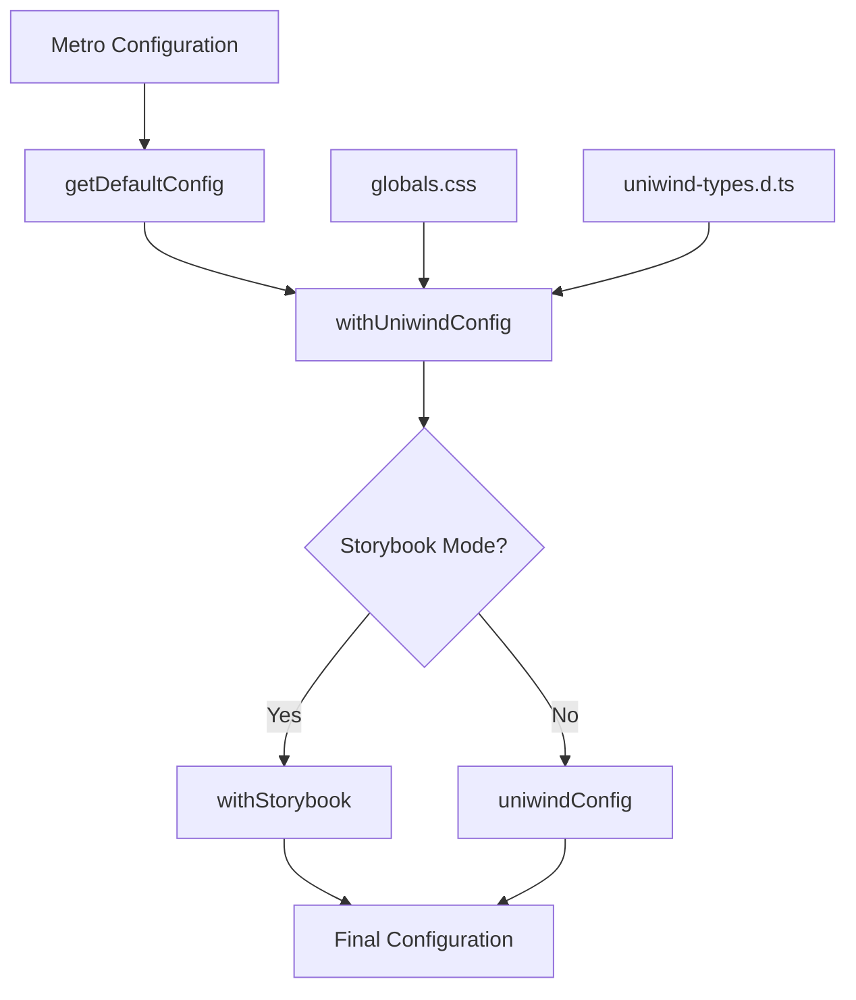
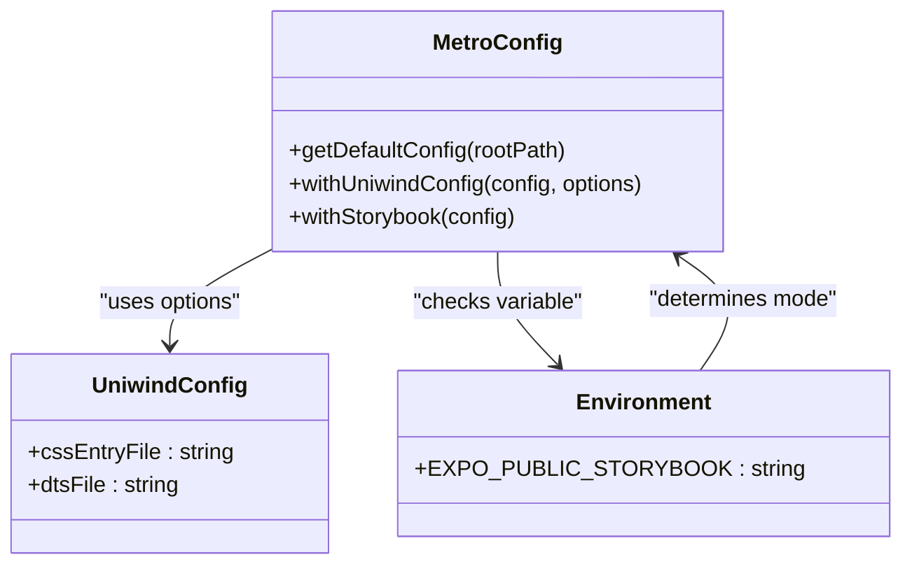
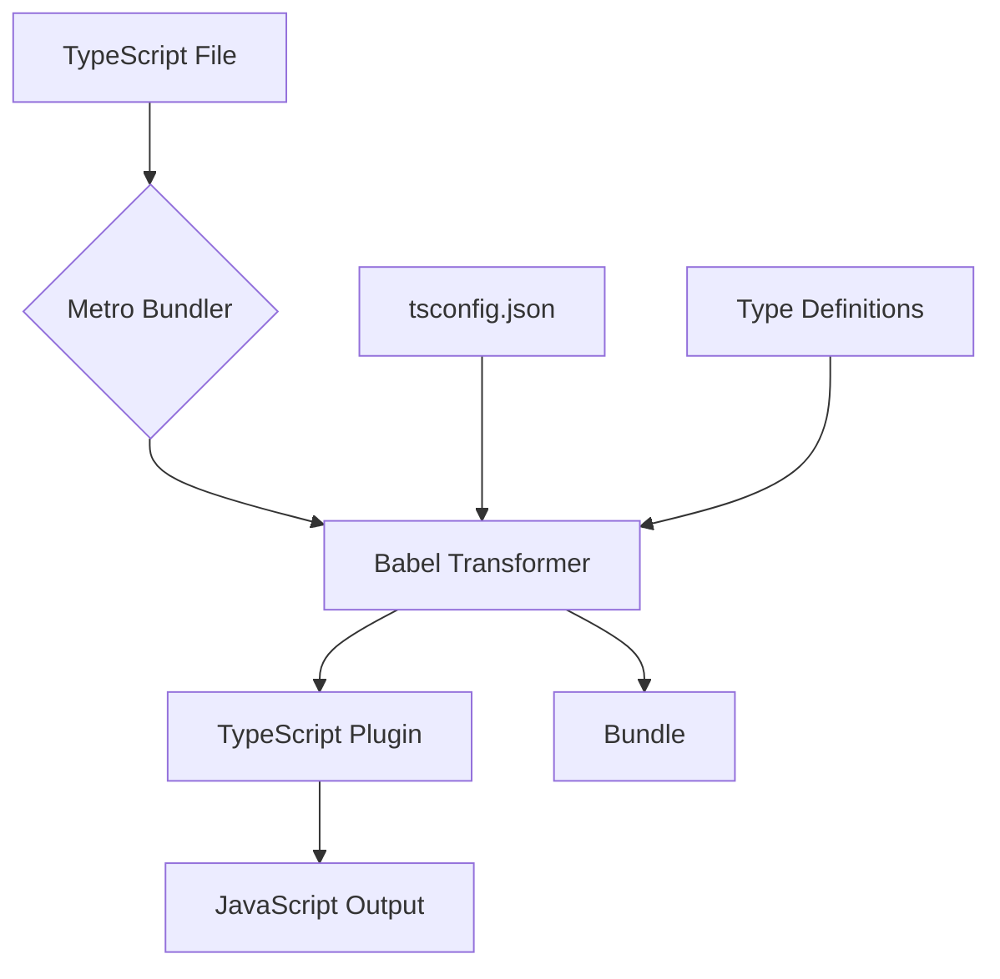
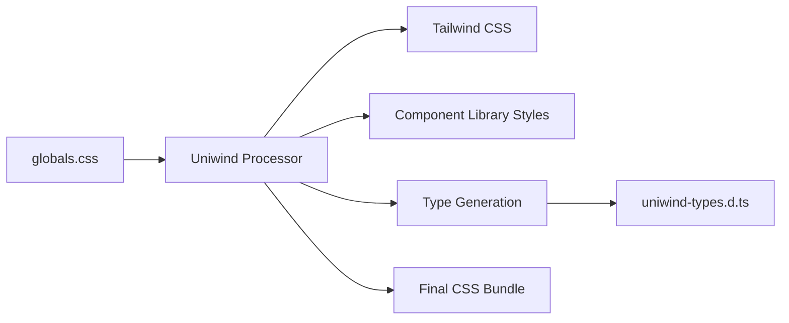
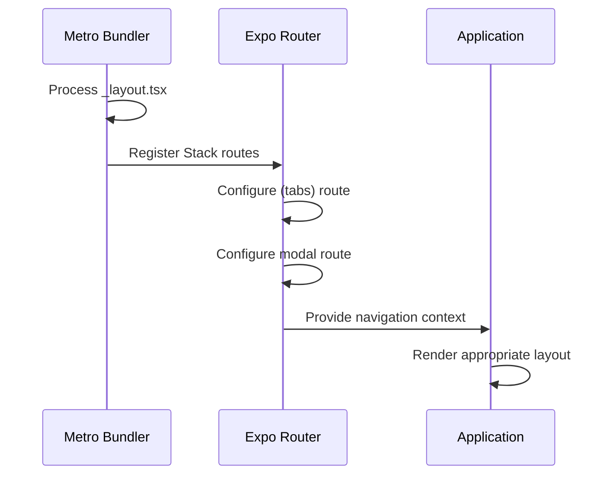

# Bundler Configuration

<cite>
**Referenced Files in This Document**   
- [metro.config.js](file://metro.config.js)
- [package.json](file://package.json)
- [tsconfig.json](file://tsconfig.json)
- [globals.css](file://globals.css)
- [src/app/_layout.tsx](file://src/app/_layout.tsx)
</cite>

## Table of Contents
1. [Introduction](#introduction)
2. [Metro Configuration Overview](#metro-configuration-overview)
3. [Core Configuration Components](#core-configuration-components)
4. [TypeScript Integration](#typescript-integration)
5. [CSS and Styling Configuration](#css-and-styling-configuration)
6. [Asset Handling and Platform-Specific Files](#asset-handling-and-platform-specific-files)
7. [Performance Optimization](#performance-optimization)
8. [Common Issues and Troubleshooting](#common-issues-and-troubleshooting)
9. [Integration with Expo Router](#integration-with-expo-router)
10. [Conclusion](#conclusion)

## Introduction
The Metro bundler configuration in the Plate application serves as the foundation for efficient code compilation, module resolution, and asset processing. This document provides a comprehensive analysis of the `metro.config.js` file and its role in supporting the application's development workflow. The configuration enables critical features such as TypeScript compilation, CSS module processing, and custom file resolution, while integrating with tools like Uniwind for styling and Expo Router for navigation. Understanding this configuration is essential for maintaining optimal build performance, resolving module dependencies correctly, and ensuring consistent behavior across iOS, Android, and web platforms.

**Section sources**
- [metro.config.js](file://metro.config.js#L1-L24)

## Metro Configuration Overview

The Metro configuration in the Plate application follows a modular approach that extends the default Expo configuration while incorporating customizations for specific development needs. The configuration is designed to support both regular application development and Storybook integration, with conditional logic that adapts the bundler setup based on the current environment.

**Diagram sources**
- [metro.config.js](file://metro.config.js#L2-L24)
- [globals.css](file://globals.css#L1-L7)

**Section sources**
- [metro.config.js](file://metro.config.js#L1-L24)
- [package.json](file://package.json#L104)

## Core Configuration Components

The Metro configuration consists of several key components that work together to process the application code and assets. The primary configuration starts with `getDefaultConfig` from Expo, which provides a solid foundation for React Native development. This base configuration is then enhanced with Uniwind integration through the `withUniwindConfig` function, which enables Tailwind CSS functionality within the application.

The configuration also includes conditional logic for Storybook integration, allowing developers to switch between regular application mode and Storybook mode using the `EXPO_PUBLIC_STORYBOOK` environment variable. When Storybook mode is enabled, the configuration applies both Uniwind and Storybook wrappers to ensure proper styling and component isolation during development.

**Diagram sources**
- [metro.config.js](file://metro.config.js#L2-L24)
- [package.json](file://package.json#L104)

**Section sources**
- [metro.config.js](file://metro.config.js#L1-L24)

## TypeScript Integration

The Plate application's Metro configuration seamlessly integrates with TypeScript through the project's `tsconfig.json` file. The TypeScript compiler options are configured to support strict type checking and path aliases, with the `@/*` alias mapping to the project root. This configuration enables clean import statements throughout the codebase and ensures type safety across all components.

The Metro bundler automatically processes TypeScript files through the Babel transformer, which transpiles TypeScript syntax to JavaScript while preserving type information for development tools. This integration allows developers to use modern TypeScript features while maintaining compatibility with the React Native runtime.

**Diagram sources**
- [tsconfig.json](file://tsconfig.json#L1-L17)
- [metro.config.js](file://metro.config.js#L2-L6)

**Section sources**
- [tsconfig.json](file://tsconfig.json#L1-L17)

## CSS and Styling Configuration

The CSS configuration in the Plate application leverages Uniwind to provide a Tailwind CSS-like experience with enhanced performance. The `globals.css` file serves as the entry point for all global styles and imports the necessary dependencies, including Tailwind CSS, Uniwind, and component library styles.

The Metro configuration specifically references this CSS file through the `cssEntryFile` option in `withUniwindConfig`, ensuring that all styling is processed correctly during the bundling phase. This setup enables utility-first styling with automatic type generation for IntelliSense support in development environments.

**Diagram sources**
- [globals.css](file://globals.css#L1-L7)
- [metro.config.js](file://metro.config.js#L10-L16)

**Section sources**
- [globals.css](file://globals.css#L1-L7)
- [metro.config.js](file://metro.config.js#L10-L16)

## Asset Handling and Platform-Specific Files

The Metro configuration supports platform-specific file resolution through Expo's built-in capabilities. While the primary configuration doesn't explicitly define custom resolver rules, it inherits Expo's default behavior for handling platform-specific extensions like `.ios.tsx`, `.android.tsx`, and `.web.tsx`.

This capability is demonstrated in components such as `ListSelect.web.tsx` and `RadioGroup.web.tsx`, which provide web-specific implementations while sharing core functionality with their cross-platform counterparts. The bundler automatically selects the appropriate file based on the target platform, enabling optimized rendering and behavior for each environment.

**Section sources**
- [components/ui/inputs/ListSelect/ListSelect.web.tsx](file://components/ui/inputs/ListSelect/ListSelect.web.tsx)
- [components/ui/inputs/RadioGroup/RadioGroup.web.tsx](file://components/ui/inputs/RadioGroup/RadioGroup.web.tsx)

## Performance Optimization

The Metro configuration includes several performance optimizations to ensure fast development cycles and efficient production builds. The use of Uniwind's optimized transformer reduces bundle size by only including used utility classes, while the conditional Storybook configuration prevents unnecessary processing in regular development mode.

For optimal performance, developers should leverage the provided npm scripts such as `start:clear` and `web:clear` which clear the Metro cache before starting the development server. This helps resolve issues related to stale cache entries and ensures that the latest code changes are properly reflected.

**Section sources**
- [package.json](file://package.json#L34-L63)

## Common Issues and Troubleshooting

Common issues with the Metro bundler configuration typically fall into three categories: module resolution failures, cache-related problems, and styling inconsistencies. Module resolution issues can often be resolved by ensuring proper path aliases in `tsconfig.json` and verifying that all dependencies are correctly installed.

Cache-related problems, such as outdated code or missing imports, can be addressed by clearing the Metro cache using the `--clear` flag in development commands. For persistent issues, completely removing the `.expo` directory and rebuilding the project can resolve deep-seated configuration problems.

Styling inconsistencies, particularly with Uniwind classes, may require regenerating the type definitions by restarting the development server or manually triggering the Uniwind processor. Ensuring that `globals.css` is properly imported in the root layout file also helps maintain consistent styling across the application.

**Section sources**
- [metro.config.js](file://metro.config.js#L8-L24)
- [src/app/_layout.tsx](file://src/app/_layout.tsx#L5)

## Integration with Expo Router

The Metro configuration works in conjunction with Expo Router to enable file-based routing and layout management. The root layout file `_layout.tsx` demonstrates this integration by importing the `Stack` component from `expo-router` and defining route configurations.

The bundler processes these routing definitions during compilation, creating an optimized navigation structure that supports features like modal presentations and tab-based navigation. The unstable_settings export in the layout file further configures routing behavior, demonstrating how the bundler respects application-level routing preferences.

**Diagram sources**
- [src/app/_layout.tsx](file://src/app/_layout.tsx#L1-L44)
- [metro.config.js](file://metro.config.js#L6)

**Section sources**
- [src/app/_layout.tsx](file://src/app/_layout.tsx#L1-L44)

## Conclusion
The Metro bundler configuration in the Plate application provides a robust foundation for development, supporting TypeScript, CSS modules, and platform-specific file resolution through a well-structured configuration. By extending Expo's default configuration with Uniwind integration and Storybook support, the setup enables efficient development workflows across multiple environments. Understanding the configuration's components and their interactions is crucial for maintaining optimal performance and resolving common development issues. The integration with Expo Router further enhances the development experience by providing a seamless connection between bundling and routing functionality.