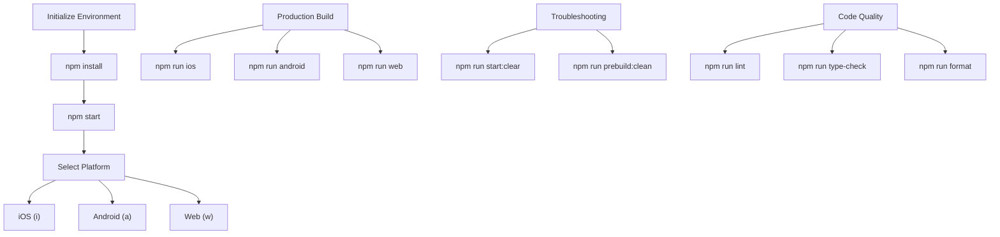

# Environment Setup

<cite>
**Referenced Files in This Document**   
- [package.json](file://package.json)
- [README.md](file://README.md)
- [app.json](file://app.json)
- [babel.config.js](file://babel.config.js)
- [metro.config.js](file://metro.config.js)
- [tsconfig.json](file://tsconfig.json)
</cite>

## Table of Contents

1. [Introduction](#introduction)
2. [Project Dependencies and Scripts](#project-dependencies-and-scripts)
3. [Development Environment Initialization](#development-environment-initialization)
4. [Platform-Specific Requirements](#platform-specific-requirements)
5. [Common Workflows](#common-workflows)
6. [Troubleshooting Common Issues](#troubleshooting-common-issues)
7. [Best Practices for Dependency Management](#best-practices-for-dependency-management)

## Introduction

This document provides comprehensive guidance on setting up the development environment for the Plate application, a cross-platform mobile application supporting iOS, Android, and web platforms. The setup process leverages Expo, a framework and platform for universal React applications, to streamline development across multiple platforms. The environment configuration is primarily defined through package.json, which specifies project dependencies, development scripts, and runtime configurations. This guide details the step-by-step initialization process, platform-specific requirements, common development workflows, and troubleshooting strategies for common setup issues.

**Section sources**

- [package.json](file://package.json#L1-L147)
- [README.md](file://README.md#L1-L674)

## Project Dependencies and Scripts

The package.json file serves as the central configuration for the Plate application, defining all project dependencies, development scripts, and runtime configurations. It specifies both production dependencies required for the application to function and development dependencies used during the development process.

The dependencies section includes essential packages such as Expo (~54.0.13), React (19.1.0), React Native (0.81.5), and various Expo modules for functionality like routing (expo-router), font loading (expo-font), and splash screen management (expo-splash-screen). The development dependencies include tools for code quality assurance such as ESLint (^9.25.0), Prettier (^3.4.2), and TypeScript (~5.9.2), along with Storybook (^9.1.10) for component documentation and testing.

The scripts section defines a comprehensive set of commands for various development tasks. Key scripts include "start" for launching the development server, platform-specific scripts like "ios" and "android" for running on respective platforms, and specialized scripts for tasks like linting, type checking, formatting, and Storybook integration. The configuration also specifies required engine versions, mandating Node.js >=22.0.0 and npm >=10.0.0, ensuring consistency across development environments.

**Section sources**

- [package.json](file://package.json#L1-L147)

## Development Environment Initialization

Initializing the development environment for the Plate application follows a structured process designed to ensure consistency and reliability across development teams. The process begins with installing project dependencies using npm install, which reads the package.json file and installs all specified dependencies.

After dependency installation, developers can start the development server using npm start, which launches the Expo development server with Metro bundler. This command serves the application and enables hot module replacement (HMR) for rapid development. For cases where Metro bundler cache issues arise, the npm run start:clear command is available to clear the cache and restart the server with a fresh bundle.

The app.json file contains essential application configuration, including the app name, version, orientation settings, icon paths, and platform-specific configurations for iOS, Android, and web. It also defines plugins such as expo-router for navigation and expo-splash-screen for splash screen management, along with experimental features like typed routes and React compiler optimization.

**Section sources**

- [package.json](file://package.json#L33-L63)
- [README.md](file://README.md#L18-L44)
- [app.json](file://app.json#L1-L52)

## Platform-Specific Requirements

The Plate application supports multiple platforms, each with specific requirements and setup procedures. For iOS development, a Mac is required along with Xcode for building and running the application on iOS simulators or devices. Android development requires Android Studio or the Android SDK for emulator and device support. Web development has no additional requirements beyond a modern web browser.

The project uses Expo's prebuild functionality to generate native iOS and Android projects from the Expo configuration. The npm run prebuild command creates or updates the ios/ and android/ directories incrementally, while npm run prebuild:clean completely regenerates these directories by first removing existing ones. Platform-specific prebuild commands like npm run prebuild:ios and npm run prebuild:android allow developers to target specific platforms.

The metro.config.js file configures the Metro bundler with Uniwind integration for styling, while babel.config.js sets up Babel with the expo-preset-expo preset. The tsconfig.json file configures TypeScript with strict mode enabled and path aliases for easier imports. These configuration files ensure consistent build processes across platforms and enable advanced features like type safety and optimized styling.

**Section sources**

- [README.md](file://README.md#L143-L221)
- [app.json](file://app.json#L1-L52)
- [babel.config.js](file://babel.config.js#L1-L8)
- [metro.config.js](file://metro.config.js#L1-L25)
- [tsconfig.json](file://tsconfig.json#L1-L17)

## Common Workflows

The Plate application supports several common development workflows through its script configuration. To start development, developers run npm install to install dependencies, followed by npm start to launch the development server. From the Expo CLI interface, they can choose to run the application on iOS (i), Android (a), or web (w) platforms.

For building the application for production, developers use platform-specific commands: npm run ios for iOS, npm run android for Android, and npm run web for web deployment. The project also includes scripts for clearing caches, such as npm run ios:clear and npm run android:clear, which combine cache clearing with platform-specific runs for troubleshooting.

Testing workflows are supported through ESLint and TypeScript checking with npm run lint and npm run type-check respectively. Code formatting is handled by Prettier with npm run format. The project integrates Storybook for component development, with separate workflows for web (npm run storybook) and native platforms (npm run storybook:native).

**Diagram sources**

- [package.json](file://package.json#L33-L63)
- [README.md](file://README.md#L18-L44)

**Section sources**

- [package.json](file://package.json#L33-L63)
- [README.md](file://README.md#L46-L139)

## Troubleshooting Common Issues

Several common issues may arise during environment setup and development, with documented solutions available in the project documentation. The most frequent issue is Metro bundler cache problems, where code changes are not reflected in the running application. This is resolved by running npm run start:clear to clear the Metro cache and restart the development server.

Another common issue is failure to create native projects, often occurring after dependency changes or when first setting up the environment. This is addressed by running npm run prebuild:clean, which completely regenerates the native iOS and Android projects from the Expo configuration. For platform-specific issues, targeted commands like npm run prebuild:ios:clean for iOS or npm run prebuild:android:clean for Android can resolve platform-specific configuration conflicts.

Dependency conflicts and version mismatches are mitigated by the specified engine requirements in package.json, which enforce minimum Node.js and npm versions. When adding new native dependencies via npx expo install, running npm run prebuild:clean ensures proper integration of the new native modules. The comprehensive script reference table in the README provides quick access to all troubleshooting commands.

**Section sources**

- [README.md](file://README.md#L605-L652)

## Best Practices for Dependency Management

Effective dependency management is crucial for maintaining a consistent and reliable development environment across teams. The Plate application enforces specific Node.js and npm versions through the engines field in package.json, ensuring all developers use compatible tooling versions. This prevents issues arising from version mismatches in JavaScript runtime and package management.

When adding new dependencies, particularly those with native components, developers should use npx expo install instead of npm install to ensure proper configuration of native modules. After adding any new dependency, running npm run prebuild:clean ensures the native projects are properly updated to include the new modules.

The project maintains a clear separation between production and development dependencies, with tools like ESLint, Prettier, and Storybook properly scoped to development. Regular updates should be performed carefully, with prebuild:clean executed after any dependency version changes to ensure native configurations remain synchronized. The use of package-lock.json ensures consistent dependency versions across all development environments.

**Section sources**

- [package.json](file://package.json#L29-L32)
- [README.md](file://README.md#L148-L156)
