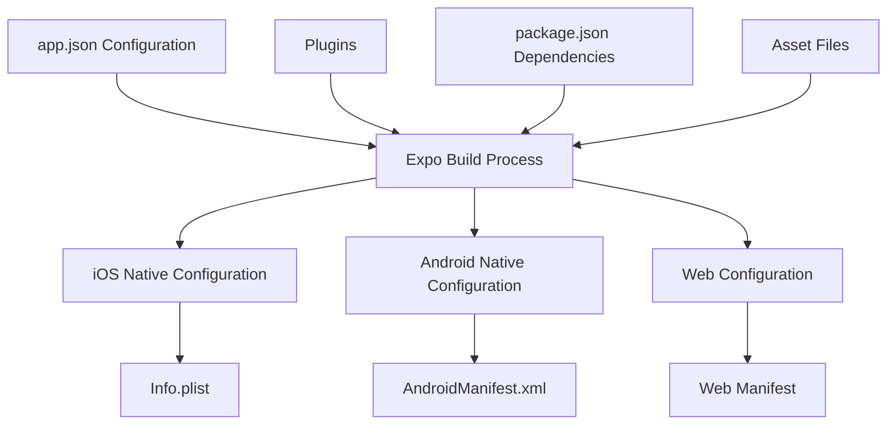
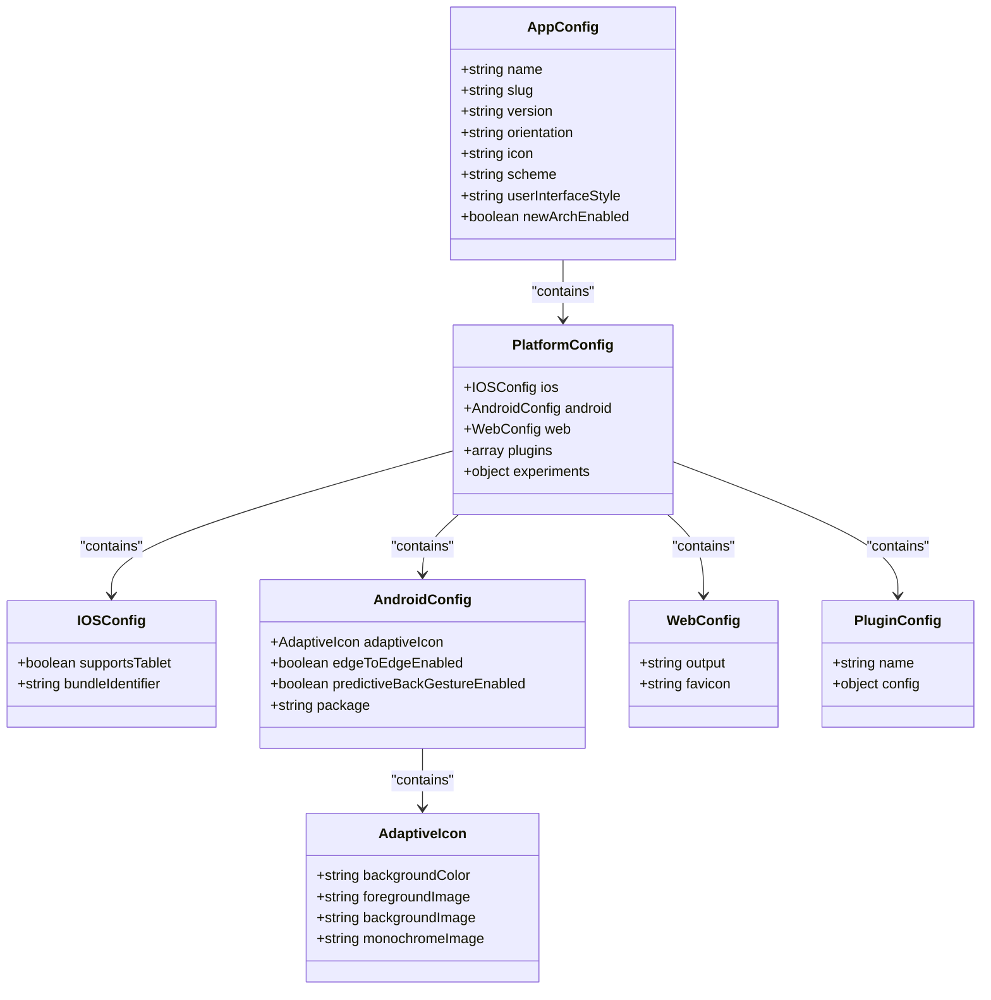
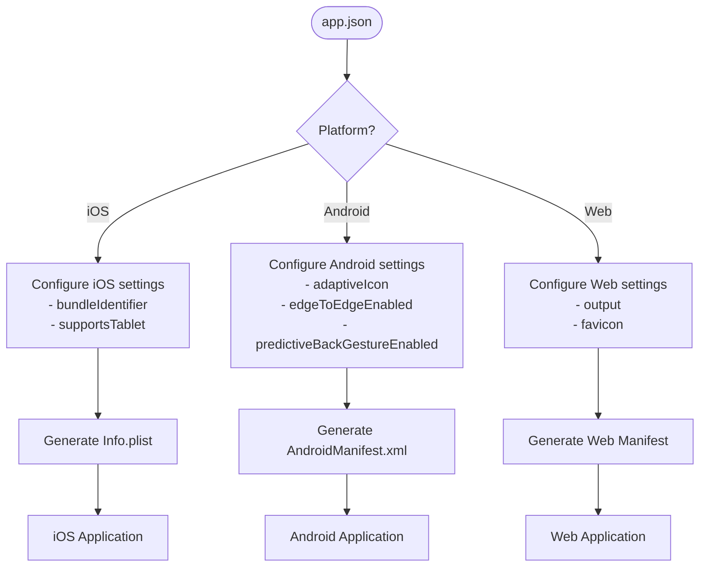
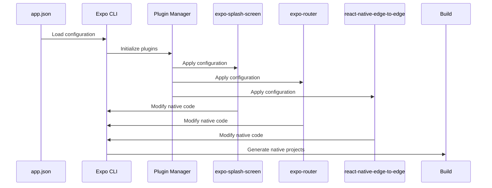
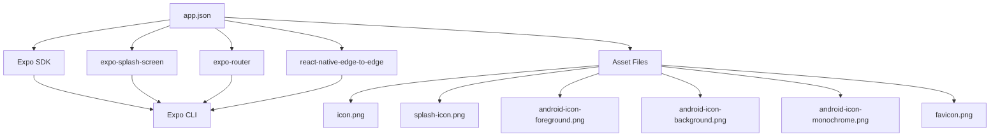

# Expo Configuration

<cite>
**Referenced Files in This Document**   
- [app.json](file://app.json)
- [package.json](file://package.json)
</cite>

## Table of Contents
1. [Introduction](#introduction)
2. [Core Components](#core-components)
3. [Architecture Overview](#architecture-overview)
4. [Detailed Component Analysis](#detailed-component-analysis)
5. [Dependency Analysis](#dependency-analysis)
6. [Performance Considerations](#performance-considerations)
7. [Troubleshooting Guide](#troubleshooting-guide)
8. [Conclusion](#conclusion)

## Introduction
The Expo configuration system in the Plate application is centered around the app.json file, which serves as the primary configuration point for Expo-specific settings. This document provides comprehensive guidance on configuring the application's metadata, visual identity, platform capabilities, and build settings through the app.json configuration file. The configuration system enables developers to define application properties that are used during the build process to generate native iOS and Android applications, as well as web deployments.

**Section sources**
- [app.json](file://app.json#L1-L52)

## Core Components
The core component of the Expo configuration system is the app.json file, which contains the Expo configuration object with properties for app metadata, platform-specific settings, plugins, and experimental features. The configuration defines essential application attributes such as name, version, orientation, and visual assets including icons and splash screens. It also specifies platform-specific configurations for iOS, Android, and web deployments, enabling tailored experiences across different platforms.

The configuration system integrates with Expo's build process to generate native applications with the specified settings, handling the conversion of JSON configuration into native platform manifests (Info.plist for iOS and AndroidManifest.xml for Android). The system supports both basic configuration through the app.json file and advanced configuration through plugins that can modify native code during the prebuild process.

**Section sources**
- [app.json](file://app.json#L1-L52)
- [package.json](file://package.json#L74-L85)

## Architecture Overview
The Expo configuration architecture follows a hierarchical structure with a base configuration in app.json that can be extended through plugins and platform-specific settings. The configuration system operates as a bridge between the React Native application and the native platforms, translating high-level JSON configuration into native platform settings during the build process.

**Diagram sources**
- [app.json](file://app.json#L1-L52)
- [package.json](file://package.json#L74-L85)

## Detailed Component Analysis

### App Configuration Analysis
The app.json configuration in the Plate application defines the core application settings that are used across all platforms. The configuration includes basic metadata such as the app name ("plate"), slug, and version (1.0.0), as well as user interface settings like the default orientation (portrait) and user interface style (automatic for light/dark mode support).

**Diagram sources**
- [app.json](file://app.json#L1-L52)

**Section sources**
- [app.json](file://app.json#L1-L52)

### Platform-Specific Configuration
The app.json file contains platform-specific configuration sections that define settings unique to each target platform. For iOS, the configuration includes the bundle identifier (com.anonymous.plate) and tablet support. For Android, it defines the adaptive icon configuration with separate foreground and background images, background color, and monochrome image for different display contexts.

The Android configuration also enables edge-to-edge display while disabling the predictive back gesture, providing a specific user experience for Android devices. The web configuration specifies static output and the favicon location. These platform-specific settings ensure that the application is properly configured for each target platform with appropriate native behaviors and visual characteristics.

**Diagram sources**
- [app.json](file://app.json#L11-L25)
- [app.json](file://app.json#L26-L29)

**Section sources**
- [app.json](file://app.json#L11-L29)

### Plugin Configuration
The Expo configuration system in Plate utilizes plugins to extend the basic configuration with additional functionality. The configuration includes the expo-router plugin for navigation, the expo-splash-screen plugin with custom configuration for the splash screen appearance, and the react-native-edge-to-edge plugin for Android edge-to-edge display.

The expo-splash-screen plugin configuration demonstrates how plugins can accept parameters to customize their behavior, with settings for the splash image, image width, resize mode, and background colors for both light and dark modes. This plugin-based architecture allows for modular extension of the Expo configuration system without requiring direct modification of native code.

**Diagram sources**
- [app.json](file://app.json#L30-L45)

**Section sources**
- [app.json](file://app.json#L30-L45)

## Dependency Analysis
The Expo configuration system depends on several key components within the Plate application. The primary dependency is the Expo SDK itself, specified in package.json with version ~54.0.13, which provides the build tools and runtime components necessary for processing the app.json configuration.

Additional dependencies include expo-splash-screen for splash screen management, expo-router for navigation, and react-native-edge-to-edge for Android display settings. These dependencies are declared in package.json and are required for the corresponding plugins in app.json to function properly. The configuration system also depends on asset files referenced in the configuration, such as icon and splash screen images, which must be present in the specified paths for successful builds.

**Diagram sources**
- [app.json](file://app.json#L1-L52)
- [package.json](file://package.json#L74-L85)

**Section sources**
- [app.json](file://app.json#L1-L52)
- [package.json](file://package.json#L74-L85)

## Performance Considerations
The Expo configuration system impacts application performance primarily during the build process rather than runtime. The configuration is processed once during the prebuild phase to generate native projects, so its complexity does not affect application startup time or runtime performance.

However, certain configuration choices can indirectly impact performance. For example, the use of adaptive icons on Android requires additional image processing during the build, and large splash screen images can increase application bundle size. The configuration also enables the new architecture (newArchEnabled: true), which can improve runtime performance through the use of the React Native New Architecture features.

## Troubleshooting Guide
Common issues with Expo configuration typically involve missing assets, incorrect plugin configuration, or platform-specific setting conflicts. When encountering build errors related to configuration, verify that all referenced asset files exist in the specified paths and that plugin dependencies are properly installed in package.json.

For issues with platform-specific behavior, check that the configuration values are appropriate for the target platform and that required permissions are properly declared. When modifying configuration, always clean the build cache using expo prebuild --clean to ensure that changes are properly applied. Validate configuration syntax using JSON validation tools to prevent parsing errors during the build process.

**Section sources**
- [app.json](file://app.json#L1-L52)
- [package.json](file://package.json#L58-L63)

## Conclusion
The Expo configuration system in the Plate application provides a comprehensive and flexible way to define application settings across multiple platforms. Through the app.json file, developers can configure essential application metadata, visual identity, platform capabilities, and integrate additional functionality through plugins. The system effectively bridges the gap between the React Native application and native platforms, enabling streamlined development and deployment while maintaining platform-specific customization options.