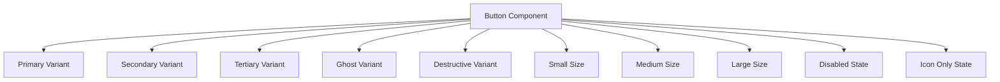
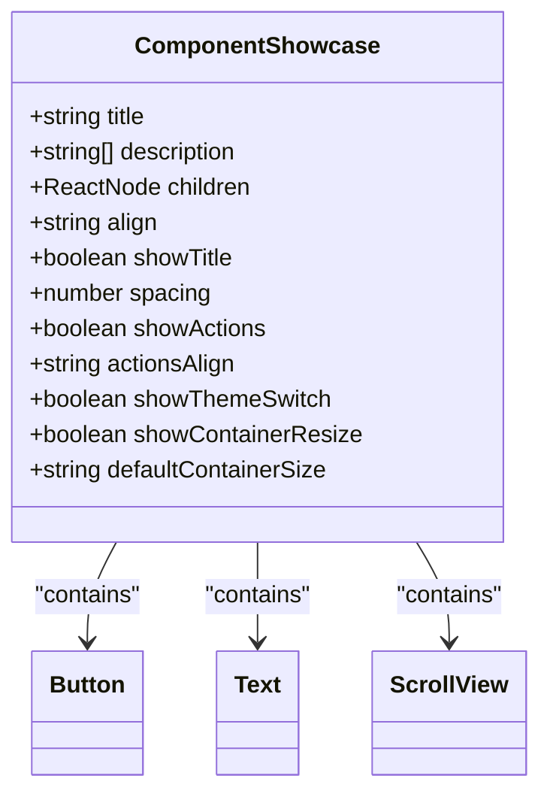

# Development Tools

<cite>
**Referenced Files in This Document**   
- [package.json](file://package.json)
- [README.md](file://README.md)
- [metro.config.js](file://metro.config.js)
- [src/app/_layout.tsx](file://src/app/_layout.tsx)
- [components/ui/display/ComponentShowcase/ComponentShowcase.tsx](file://components/ui/display/ComponentShowcase/ComponentShowcase.tsx)
- [components/ui/display/ComponentShowcase/ComponentShowcase.stories.tsx](file://components/ui/display/ComponentShowcase/ComponentShowcase.stories.tsx)
- [components/ui/inputs/Button/Button.stories.tsx](file://components/ui/inputs/Button/Button.stories.tsx)
- [components/ui/display/Text/Text.stories.tsx](file://components/ui/display/Text/Text.stories.tsx)
- [components/form/LoginForm/LoginForm.stories.tsx](file://components/form/LoginForm/LoginForm.stories.tsx)
- [components/screen/LoginScreen/LoginScreen.stories.tsx](file://components/screen/LoginScreen/LoginScreen.stories.tsx)
- [components/features/SNSButtons/SNSButtons.stories.tsx](file://components/features/SNSButtons/SNSButtons.stories.tsx)
- [components/ui/inputs/TextField/TextField.stories.tsx](file://components/ui/inputs/TextField/TextField.stories.tsx)
</cite>

## Table of Contents

1. [Storybook Integration](#storybook-integration)
2. [Component Development Workflow](#component-development-workflow)
3. [Web and Native Storybook Environments](#web-and-native-storybook-environments)
4. [Practical Examples of Storybook Usage](#practical-examples-of-storybook-usage)
5. [Benefits of Component-Driven Development](#benefits-of-component-driven-development)
6. [Best Practices for Writing Stories](#best-practices-for-writing-stories)

## Storybook Integration

The Plate application integrates Storybook as a comprehensive tool for component development and documentation. Storybook enables developers to build UI components in isolation, test various states, and document usage patterns. The integration supports both web and native environments through a unified configuration that leverages Vite for web development and React Native for mobile platforms.

Storybook is configured through the `package.json` scripts and integrated into the application's routing system via conditional logic in the root layout. When the `EXPO_PUBLIC_STORYBOOK` environment variable is set to `true`, the application loads the Storybook interface instead of the default app layout, allowing seamless switching between development modes.

**Section sources**

- [package.json](file://package.json#L49-L58)
- [README.md](file://README.md#L225-L258)
- [metro.config.js](file://metro.config.js#L8-L23)
- [src/app/\_layout.tsx](file://src/app/_layout.tsx#L11-L42)

## Component Development Workflow

The component development workflow in the Plate application follows a structured approach centered around Storybook. Each component in the `components/` directory has a corresponding `.stories.tsx` file that defines various scenarios and states for testing and documentation. This pattern ensures that components are developed in isolation from the application's business logic, promoting reusability and maintainability.

The workflow begins with creating a new component in the appropriate category folder (`ui/`, `features/`, `form/`, etc.) following the MUI-inspired classification system. Developers then create a story file that demonstrates the component's usage with different props, variants, and states. The stories serve as both documentation and automated test cases, making it easy to verify component behavior during development and refactoring.

Key aspects of the workflow include:

- **Isolated Development**: Components are developed independently of the main application flow
- **State Testing**: Multiple component states are demonstrated in stories (e.g., default, disabled, loading)
- **Prop Exploration**: Storybook controls allow interactive testing of component props
- **Visual Regression**: Changes to components can be visually inspected across all defined scenarios

**Section sources**

- [README.md](file://README.md#L268-L557)
- [components/ui/inputs/Button/Button.stories.tsx](file://components/ui/inputs/Button/Button.stories.tsx#L29-L196)
- [components/ui/display/Text/Text.stories.tsx](file://components/ui/display/Text/Text.stories.tsx#L62-L112)

## Web and Native Storybook Environments

The Plate application supports Storybook in both web and native environments, providing a consistent development experience across platforms. The web version runs on Vite and is accessible through a browser, while the native version integrates directly into the React Native application.

### Web Storybook

The web Storybook environment is launched using the `npm run storybook` command, which starts a development server on port 6006. This environment is ideal for rapid component development and provides features such as:

- Real-time hot module replacement
- Interactive controls for prop manipulation
- Addons for actions, controls, and documentation
- Responsive design testing

### Native Storybook

The native Storybook environment is activated by setting the `EXPO_PUBLIC_STORYBOOK` environment variable to `true`. This mode integrates Storybook directly into the React Native app, allowing developers to test components in the actual mobile environment. The native version can be launched on iOS, Android, or in the Expo Go app using the following commands:

- `npm run storybook:native` - Launch on default device
- `npm run storybook:native:ios` - Launch on iOS simulator
- `npm run storybook:native:android` - Launch on Android emulator

The integration is handled in the root layout component, which conditionally renders either the Storybook interface or the main application based on the environment variable. This approach allows developers to switch between component development and full application testing without code changes.

**Section sources**

- [package.json](file://package.json#L49-L58)
- [README.md](file://README.md#L229-L258)
- [metro.config.js](file://metro.config.js#L8-L23)
- [src/app/\_layout.tsx](file://src/app/_layout.tsx#L11-L42)

## Practical Examples of Storybook Usage

Storybook is used extensively throughout the Plate application to document and test components. The following examples demonstrate practical usage patterns:

### Button Component Stories

The Button component stories showcase various variants, sizes, and states. The stories are organized into categories such as "변형*전체" (All Variants), "크기*전체" (All Sizes), and "상태\_전체" (All States), demonstrating the component's flexibility. Each story renders the button with specific props, allowing developers to see how different configurations affect the appearance and behavior.

**Diagram sources**

- [components/ui/inputs/Button/Button.stories.tsx](file://components/ui/inputs/Button/Button.stories.tsx#L29-L196)

### Text Component Documentation

The Text component stories demonstrate the typography system with various variants (h1-h6, body1, body2, caption, overline) and color options. The stories include both individual examples and comprehensive displays showing all variants together, providing a complete reference for the application's typographic scale.

### Form Component Testing

The LoginForm component stories show how complex form components can be tested in isolation. The stories use MobX observables to demonstrate state management, showing both empty and pre-filled states. This approach allows developers to test form validation, error states, and user interactions without navigating through the application.

### Screen-Level Components

The LoginScreen stories demonstrate how entire screens can be documented and tested. These stories include callback functions that log actions to the console, allowing developers to verify event handling. The stories also show how the screen responds to different input states and user interactions.

**Section sources**

- [components/ui/inputs/Button/Button.stories.tsx](file://components/ui/inputs/Button/Button.stories.tsx#L29-L196)
- [components/ui/display/Text/Text.stories.tsx](file://components/ui/display/Text/Text.stories.tsx#L62-L112)
- [components/form/LoginForm/LoginForm.stories.tsx](file://components/form/LoginForm/LoginForm.stories.tsx#L22-L53)
- [components/screen/LoginScreen/LoginScreen.stories.tsx](file://components/screen/LoginScreen/LoginScreen.stories.tsx#L48-L86)

## Benefits of Component-Driven Development

Component-driven development with Storybook offers several significant benefits for the Plate application:

### Improved Collaboration

Storybook serves as a single source of truth for UI components, bridging the gap between designers and developers. Designers can use the documented components as a reference for design systems, while developers can implement features with confidence that they're using the correct components. The visual nature of Storybook makes it accessible to non-technical stakeholders, facilitating better communication and feedback.

### Enhanced Reusability

By developing components in isolation, the team ensures that each component is self-contained and reusable across different parts of the application. The strict categorization system (ui/, features/, form/, etc.) reinforces this principle by clearly separating generic UI components from project-specific ones.

### Faster Development

Developers can work on UI components without needing to navigate through the application to reach specific screens. This isolation significantly reduces development time, especially for components that appear deep within the application flow. The ability to instantly see changes in Storybook eliminates the need for repetitive navigation and page reloading.

### Better Testing

Storybook encourages comprehensive testing of component states and edge cases. By documenting various scenarios (loading, error, disabled, etc.), the team ensures that components are robust and handle all expected conditions. The visual nature of the stories makes it easy to spot regressions and unintended changes.

### Living Documentation

The stories serve as living documentation that evolves with the codebase. Unlike static documentation that quickly becomes outdated, Storybook stories are maintained alongside the components they document, ensuring accuracy and relevance.

**Section sources**

- [README.md](file://README.md#L534-L557)
- [components/ui/display/ComponentShowcase/ComponentShowcase.tsx](file://components/ui/display/ComponentShowcase/ComponentShowcase.tsx#L35-L207)

## Best Practices for Writing Stories

The Plate application follows several best practices for writing effective Storybook stories:

### Use ComponentShowcase Wrapper

Many stories use the `ComponentShowcase` component as a wrapper, which provides consistent styling and additional features like theme switching and container resizing. This wrapper ensures that all components are presented in a standardized format with proper documentation.

**Diagram sources**

- [components/ui/display/ComponentShowcase/ComponentShowcase.tsx](file://components/ui/display/ComponentShowcase/ComponentShowcase.tsx#L10-L33)
- [components/ui/display/ComponentShowcase/ComponentShowcase.stories.tsx](file://components/ui/display/ComponentShowcase/ComponentShowcase.stories.tsx#L64-L162)

### Comprehensive State Coverage

Stories should cover all relevant component states, including:

- Default state
- Disabled state
- Loading state (if applicable)
- Error state
- Various size and variant combinations

### Descriptive Story Names

Story names should clearly describe the scenario being demonstrated. The Plate application uses Korean naming conventions in the provided examples (e.g., "변형*전체", "크기*전체"), but English names would follow a similar pattern (e.g., "All Variants", "All Sizes").

### Interactive Controls

For components with multiple props, use Storybook's argTypes to create interactive controls. This allows users to dynamically change props and see the effects in real-time, making the documentation more engaging and useful.

### Realistic Data

Use realistic data in stories to demonstrate how components will appear in the actual application. For form components, use plausible placeholder text and example values.

### Documentation in Meta

Use the `meta` object to provide comprehensive documentation, including:

- Component description
- Prop descriptions
- Usage guidelines
- Accessibility information

### Consistent Structure

Follow a consistent structure for stories, typically organizing them by category (variants, sizes, states) and providing both individual examples and comprehensive displays.

**Section sources**

- [components/ui/display/ComponentShowcase/ComponentShowcase.stories.tsx](file://components/ui/display/ComponentShowcase/ComponentShowcase.stories.tsx#L64-L162)
- [components/ui/inputs/TextField/TextField.stories.tsx](file://components/ui/inputs/TextField/TextField.stories.tsx#L28-L82)
- [components/features/SNSButtons/SNSButtons.stories.tsx](file://components/features/SNSButtons/SNSButtons.stories.tsx#L36-L108)
