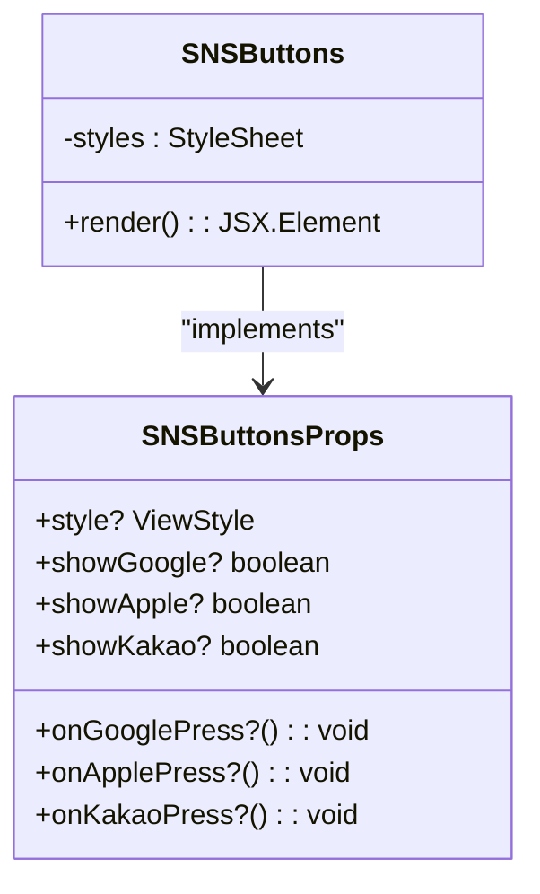
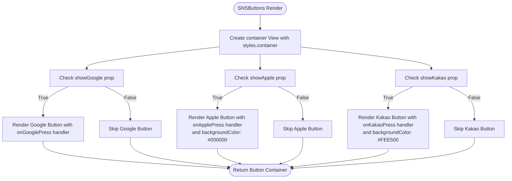
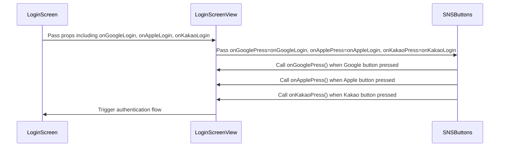

# Feature Components

<cite>
**Referenced Files in This Document**   
- [SNSButtons.tsx](file://components/features/SNSButtons/SNSButtons.tsx)
- [SNSButtons.stories.tsx](file://components/features/SNSButtons/SNSButtons.stories.tsx)
- [LoginScreen.tsx](file://components/screen/LoginScreen/LoginScreen.tsx)
- [LoginScreenView.tsx](file://components/screen/LoginScreen/LoginScreenView.tsx)
</cite>

## SNSButtons Component

The SNSButtons component is a feature-level UI component designed to provide social login functionality through Google, Apple, and Kakao providers. This component serves as a reusable social login interface that can be integrated into various authentication flows within the application.

The component is implemented as a React functional component with TypeScript, accepting a well-defined interface of props that control both behavior and visibility. It leverages the Button component from the UI library to maintain consistent styling and interaction patterns across the application.

**Section sources**
- [SNSButtons.tsx](file://components/features/SNSButtons/SNSButtons.tsx#L1-L81)
- [SNSButtons.stories.tsx](file://components/features/SNSButtons/SNSButtons.stories.tsx#L1-L108)

## Component Interface and Props

The SNSButtons component exposes a comprehensive interface through the SNSButtonsProps type, which defines both the callback handlers and visibility controls for each social login provider.

The interface includes three primary callback props: onGooglePress, onApplePress, and onKakaoPress. These optional function props allow parent components to specify the authentication logic that should be executed when the respective social login button is pressed. Each callback is defined as a function that takes no parameters and returns void, providing a simple contract for integration with authentication services.

Additionally, the component provides three visibility control props: showGoogle, showApple, and showKakao. These boolean props determine whether each respective social login button should be rendered in the UI. All visibility props default to true, ensuring that all social login options are displayed by default unless explicitly hidden by the parent component.

The component also accepts a style prop of type ViewStyle, allowing for custom styling to be applied to the container view that holds the social login buttons.

**Diagram sources**
- [SNSButtons.tsx](file://components/features/SNSButtons/SNSButtons.tsx#L6-L13)

**Section sources**
- [SNSButtons.tsx](file://components/features/SNSButtons/SNSButtons.tsx#L6-L13)

## Implementation Details

The SNSButtons component implementation follows a clean and straightforward pattern, rendering a container View that holds individual Button components for each social login provider. The component uses conditional rendering based on the visibility props to determine which buttons should be displayed.

Each social login button is implemented using the shared Button component from the UI library, ensuring consistency in appearance and behavior. The Google login button uses a "bordered" variant with a default style, while the Apple and Kakao login buttons use a "solid" variant with provider-specific styling.

The component applies specific styling to each provider's button to match their brand guidelines. The Apple button is styled with a black background color (#000000) to match Apple's branding, while the Kakao button uses a distinctive yellow color (#FEE500) that aligns with Kakao's brand identity.

The container view uses a gap of 12 units between buttons and ensures that each button spans the full width of the container, creating a clean and responsive layout.

**Diagram sources**
- [SNSButtons.tsx](file://components/features/SNSButtons/SNSButtons.tsx#L25-L60)

**Section sources**
- [SNSButtons.tsx](file://components/features/SNSButtons/SNSButtons.tsx#L25-L60)

## Integration with LoginScreen

The SNSButtons component is designed to be integrated within the LoginScreen component, which serves as the main authentication interface. The LoginScreen component acts as a container that manages authentication state and passes appropriate callback functions to the SNSButtons component.

The integration follows a clear invocation relationship where the LoginScreenView component (the presentational component of LoginScreen) would receive callback props such as onGoogleLogin, onAppleLogin, and onKakaoLogin, which are then passed down to the SNSButtons component as onGooglePress, onApplePress, and onKakaoPress respectively.

This pattern allows the LoginScreen to handle the business logic of authentication while delegating the presentation of social login options to the specialized SNSButtons component. The separation of concerns enables better code organization and reusability, as the SNSButtons component can be used in other authentication contexts beyond just the main login screen.

**Diagram sources**
- [LoginScreen.tsx](file://components/screen/LoginScreen/LoginScreen.tsx#L12-L27)
- [LoginScreenView.tsx](file://components/screen/LoginScreen/LoginScreenView.tsx#L24-L34)

**Section sources**
- [LoginScreen.tsx](file://components/screen/LoginScreen/LoginScreen.tsx#L12-L27)
- [LoginScreenView.tsx](file://components/screen/LoginScreen/LoginScreenView.tsx#L11-L22)

## Visibility Control Examples

The SNSButtons component provides flexible visibility control through the showGoogle, showApple, and showKakao props, allowing for dynamic configuration of which social login options are presented to users.

The Storybook examples demonstrate various visibility configurations, including scenarios where only a single provider is shown (Google only, Apple only, or Kakao only) as well as combinations of providers (Google and Apple only). These examples illustrate how the component can be configured for different contexts, such as regional availability of social login providers or phased rollouts of authentication methods.

The default behavior displays all three social login options, but this can be customized based on application requirements or user preferences. The visibility props accept boolean values and default to true, meaning that if a visibility prop is not specified, that provider's button will be displayed.

This flexible visibility system enables the application to adapt the social login interface based on various factors such as user location, device capabilities, or business requirements without requiring changes to the underlying component implementation.

**Section sources**
- [SNSButtons.stories.tsx](file://components/features/SNSButtons/SNSButtons.stories.tsx#L36-L108)

## Styling and Common Issues

The SNSButtons component implements provider-specific styling to ensure that each social login button adheres to the respective platform's design guidelines. The Apple button uses a solid black background (#000000) as required by Apple's Human Interface Guidelines, while the Kakao button uses the brand's signature yellow color (#FEE500).

One potential issue that may arise is styling inconsistencies when the component is used across different themes or in responsive layouts. Since the button styles are defined within the component using StyleSheet.create, they may not automatically adapt to theme changes unless explicitly designed to do so.

To address potential styling issues, the component could be enhanced to support theme-aware styling by integrating with the application's theme system. This would allow the social login buttons to maintain visual consistency with the overall application theme while still preserving the required brand colors for each provider.

Another consideration is the handling of localization, as the button labels are currently hardcoded in Korean ("Google로 로그인", "Apple로 로그인", "카카오로 로그인"). For international applications, these labels should be externalized to a localization system to support multiple languages.

**Section sources**
- [SNSButtons.tsx](file://components/features/SNSButtons/SNSButtons.tsx#L63-L79)
- [SNSButtons.stories.tsx](file://components/features/SNSButtons/SNSButtons.stories.tsx#L1-L108)