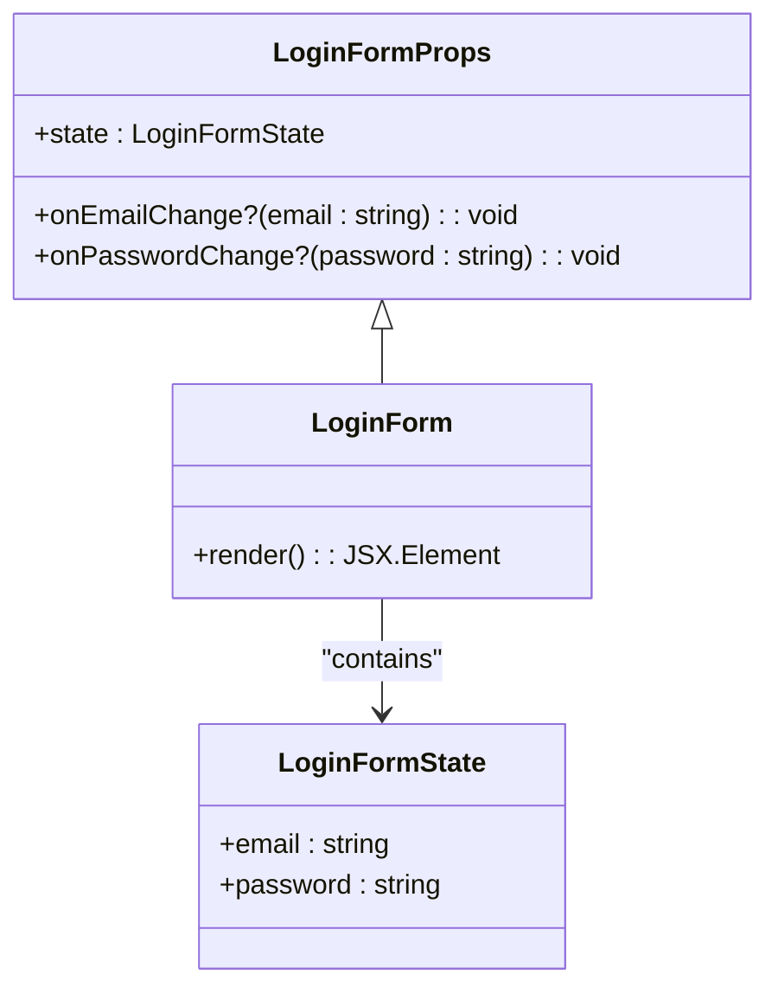
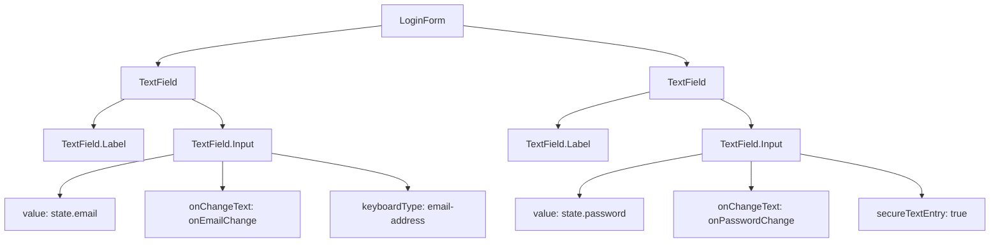
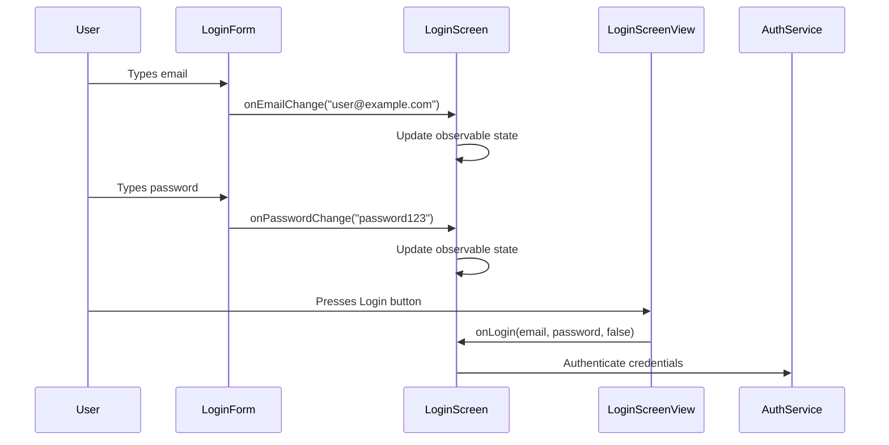

# Form Components

<cite>
**Referenced Files in This Document**   
- [LoginForm.tsx](file://components/form/LoginForm/LoginForm.tsx)
- [TextField.tsx](file://components/ui/inputs/TextField/TextField.tsx)
- [LoginScreen.tsx](file://components/screen/LoginScreen/LoginScreen.tsx)
- [LoginScreenView.tsx](file://components/screen/LoginScreen/LoginScreenView.tsx)
</cite>

## Table of Contents

1. [LoginForm Component Overview](#loginform-component-overview)
2. [State Management with MobX](#state-management-with-mobx)
3. [Interface and Domain Model](#interface-and-domain-model)
4. [Integration with TextField Components](#integration-with-textfield-components)
5. [Relationship with LoginScreen and Authentication](#relationship-with-loginscreen-and-authentication)
6. [Form Validation and Input Handling](#form-validation-and-input-handling)

## LoginForm Component Overview

The LoginForm component is a dedicated form container for handling user authentication through email and password inputs. It serves as a reusable, self-contained unit within the application's authentication flow, specifically designed to collect login credentials in a structured and accessible manner. The component renders two TextField instances wrapped in a Card container for visual grouping and styling consistency. Each TextField is configured with appropriate accessibility features, keyboard types, and input behaviors tailored to its specific purpose - email address entry and password entry respectively. The component maintains a clean separation of concerns by focusing solely on the presentation and interaction aspects of the login form without incorporating business logic or authentication processing.

**Section sources**

- [LoginForm.tsx](file://components/form/LoginForm/LoginForm.tsx#L1-L63)

## State Management with MobX

The LoginForm component utilizes MobX observables for state management through its integration with the parent LoginScreen component. While LoginForm itself is a presentational component that receives state via props, the actual observable state is created and managed in LoginScreen.tsx using MobX's `observable` function. The state object containing email and password fields is made reactive, allowing automatic UI updates when values change. This state is passed down to LoginForm as a prop, establishing a unidirectional data flow from the container component to the presentational component. The MobX integration enables efficient reactivity without requiring the LoginForm to implement its own state management logic, adhering to the container/presentational component pattern. This approach provides a clean separation between state logic and UI rendering while leveraging MobX's powerful reactivity system for seamless user interactions.

```mermaid
classDiagram
class LoginScreen {
+observable state : {email : string, password : string}
-use MobX observable()
-create LoginForm state
}
class LoginForm {
-receive state via props
-display email/password values
-trigger onChange callbacks
}
LoginScreen --> LoginForm : "passes state"
LoginForm ..> LoginScreen : "calls onChange callbacks"
```

**Diagram sources**

- [LoginScreen.tsx](file://components/screen/LoginScreen/LoginScreen.tsx#L1-L30)
- [LoginForm.tsx](file://components/form/LoginForm/LoginForm.tsx#L1-L63)

**Section sources**

- [LoginScreen.tsx](file://components/screen/LoginScreen/LoginScreen.tsx#L1-L30)
- [LoginForm.tsx](file://components/form/LoginForm/LoginForm.tsx#L1-L63)

## Interface and Domain Model

The LoginForm component defines a clear interface through its props and state structure, establishing a contract for how it interacts with parent components. The component accepts three primary props: `state`, `onEmailChange`, and `onPasswordChange`. The `state` prop is an object conforming to the LoginFormState interface, which contains email and password string fields that represent the current values of the form inputs. The `onEmailChange` and `onPasswordChange` props are optional callback functions that are invoked when the respective input fields receive new values from user interaction. This design follows the controlled component pattern, where the parent component maintains the source of truth for the form data and propagates changes downward while receiving updates through callback functions. The domain model is intentionally simple, focusing only on the essential authentication credentials without incorporating additional metadata or validation states.



**Diagram sources**

- [LoginForm.tsx](file://components/form/LoginForm/LoginForm.tsx#L6-L15)

**Section sources**

- [LoginForm.tsx](file://components/form/LoginForm/LoginForm.tsx#L6-L15)

## Integration with TextField Components

The LoginForm component integrates with the TextField components from heroui-native through a composition pattern that leverages the TextField's subcomponent API. Each TextField instance in the LoginForm contains a Label and Input subcomponent, creating a structured form element with proper accessibility semantics. The email TextField is configured with keyboardType "email-address", autoCapitalize "none", and autoComplete "email" to optimize the user experience for email entry on mobile devices. The password TextField uses secureTextEntry to mask input and autoComplete "password" for credential management integration. Both fields bind their value properties to the corresponding state fields (state.email and state.password) and connect their onChangeText events to the respective callback functions (onEmailChange and onPasswordChange). This integration demonstrates how higher-order form components can wrap and configure base input components with domain-specific behaviors and accessibility features.



**Diagram sources**

- [LoginForm.tsx](file://components/form/LoginForm/LoginForm.tsx#L24-L51)
- [TextField.tsx](file://components/ui/inputs/TextField/TextField.tsx#L1-L179)

**Section sources**

- [LoginForm.tsx](file://components/form/LoginForm/LoginForm.tsx#L24-L51)
- [TextField.tsx](file://components/ui/inputs/TextField/TextField.tsx#L1-L179)

## Relationship with LoginScreen and Authentication

The LoginForm component operates as a child component within the broader LoginScreen hierarchy, forming part of a multi-layered component architecture for user authentication. The LoginScreen component serves as the container that manages the observable state and provides it to the LoginForm through props. This relationship follows the container/presentational pattern, where LoginScreen handles state management and business logic while LoginForm focuses on UI rendering and user interaction. The LoginScreen also connects to the LoginScreenView component, which contains additional UI elements like the logo, header, and action buttons. When users interact with the LoginForm, changes are propagated up to LoginScreen, which can then coordinate with authentication services when the login process is initiated. This architectural separation allows for better code organization, easier testing, and more flexible component reuse across different authentication scenarios.



**Diagram sources**

- [LoginScreen.tsx](file://components/screen/LoginScreen/LoginScreen.tsx#L1-L30)
- [LoginScreenView.tsx](file://components/screen/LoginScreen/LoginScreenView.tsx#L1-L151)
- [LoginForm.tsx](file://components/form/LoginForm/LoginForm.tsx#L1-L63)

**Section sources**

- [LoginScreen.tsx](file://components/screen/LoginScreen/LoginScreen.tsx#L1-L30)
- [LoginScreenView.tsx](file://components/screen/LoginScreen/LoginScreenView.tsx#L1-L151)

## Form Validation and Input Handling

The LoginForm component addresses form validation and input handling through its integration with the parent LoginScreen's state management system and the underlying TextField components. While the LoginForm itself does not implement validation logic, it provides the necessary infrastructure for validation to occur at higher levels of the component hierarchy. The component handles input through the onChangeText callbacks, which are triggered by user interactions with the TextField components. These callbacks allow the parent component to validate input in real-time or upon form submission. The TextField components from heroui-native provide built-in accessibility features and input behavior optimizations, such as appropriate keyboard layouts and autocomplete functionality, which enhance the user experience. Common issues like input masking for passwords and proper email formatting are handled through the TextField configuration properties, ensuring consistent behavior across different devices and platforms.

**Section sources**

- [LoginForm.tsx](file://components/form/LoginForm/LoginForm.tsx#L24-L51)
- [TextField.tsx](file://components/ui/inputs/TextField/TextField.tsx#L1-L179)
