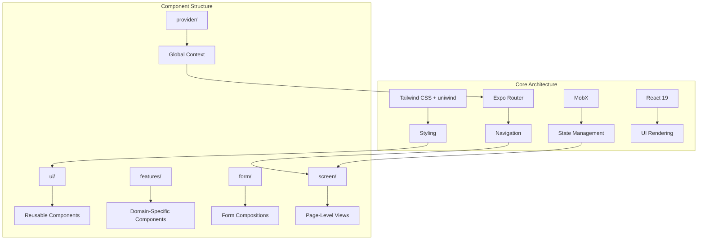
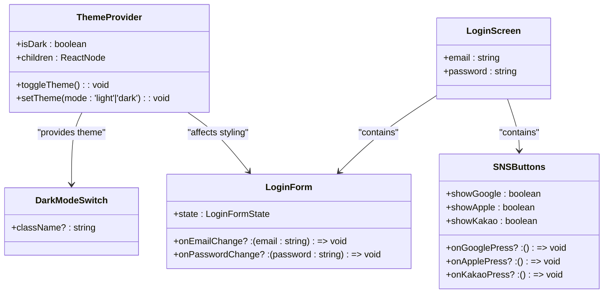
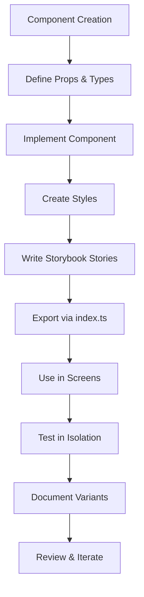
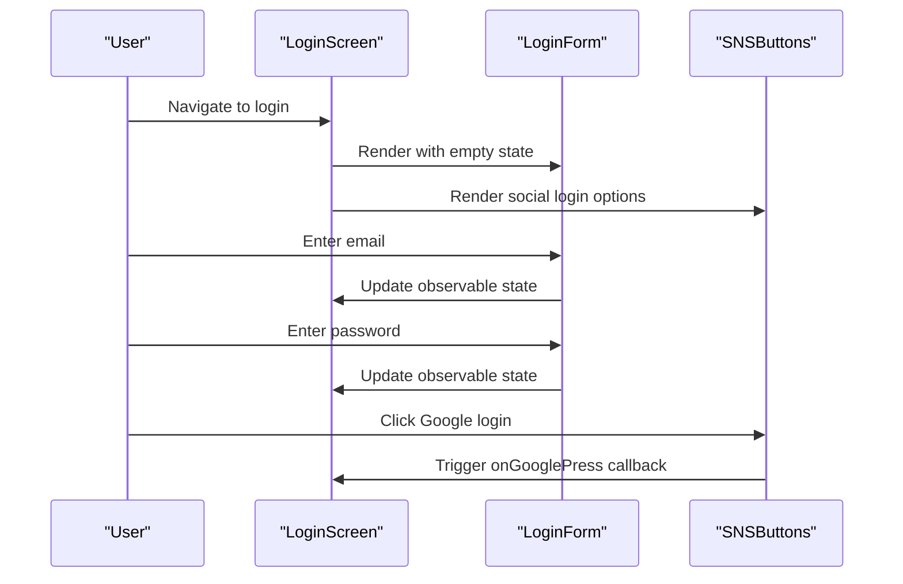
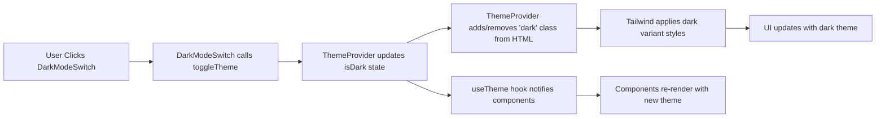

# Project Overview

<cite>
**Referenced Files in This Document**   
- [README.md](file://README.md)
- [package.json](file://package.json)
- [src/app/_layout.tsx](file://src/app/_layout.tsx)
- [components/provider/ThemeProvider/ThemeProvider.tsx](file://components/provider/ThemeProvider/ThemeProvider.tsx)
- [hooks/useTheme.ts](file://hooks/useTheme.ts)
- [constants/theme.ts](file://constants/theme.ts)
- [components/screen/LoginScreen/LoginScreen.tsx](file://components/screen/LoginScreen/LoginScreen.tsx)
- [components/form/LoginForm/LoginForm.tsx](file://components/form/LoginForm/LoginForm.tsx)
- [components/ui/inputs/Button/Button.tsx](file://components/ui/inputs/Button/Button.tsx)
- [components/ui/inputs/DarkModeSwitch/DarkModeSwitch.tsx](file://components/ui/inputs/DarkModeSwitch/DarkModeSwitch.tsx)
- [components/features/SNSButtons/SNSButtons.tsx](file://components/features/SNSButtons/SNSButtons.tsx)
- [unistyles.ts](file://unistyles.ts)
- [uniwind-types.d.ts](file://uniwind-types.d.ts)
</cite>

## Table of Contents
1. [Introduction](#introduction)
2. [Architecture Overview](#architecture-overview)
3. [Core Components](#core-components)
4. [Component-Driven Development with Storybook](#component-driven-development-with-storybook)
5. [Practical Examples](#practical-examples)
6. [Conclusion](#conclusion)

## Introduction

The Plate mobile application is a cross-platform fitness class booking and management system built with Expo, React Native, and React 19. Designed to support iOS, Android, and web platforms, Plate enables users to discover, book, and manage fitness classes seamlessly across devices. The application follows a component-driven architecture with a strong emphasis on reusability, maintainability, and developer experience.

Built using Expo Router for navigation, MobX for state management, and Tailwind CSS with uniwind for styling, Plate leverages modern React practices to deliver a responsive and accessible user interface. The project structure adheres to Material UI (MUI) standards, organizing components into logical categories such as inputs, display, surfaces, layouts, and feedback. This systematic approach ensures clarity and consistency across the codebase, making it easier for both beginners and experienced developers to navigate and extend functionality.

The application integrates Storybook for component documentation and testing, enabling isolated development and visual regression testing. With a focus on accessibility and theming, Plate supports dark mode switching and responsive design out of the box, ensuring a consistent experience across different user preferences and device types.

## Architecture Overview

Plate's architecture is structured around Expo's file-based routing system, where the `src/app/` directory defines the application's navigation structure. The root layout in `src/app/_layout.tsx` serves as the entry point, wrapping the application with global providers such as the ThemeProvider and SafeAreaView. This layout conditionally renders either the main application or Storybook interface based on the `EXPO_PUBLIC_STORYBOOK` environment variable, allowing seamless switching between development and documentation modes.

State management is handled using MobX, a reactive state management library that enables observable data structures and automatic UI updates. Components like `LoginScreen` use MobX's `observable` and `observer` to manage form state efficiently, reducing boilerplate and improving performance. The application's styling is powered by Tailwind CSS through the uniwind library, which extends Tailwind's capabilities with dynamic theme support and CSS variable integration.

The component hierarchy is organized into five main categories within the `components/` directory:
- **ui/**: Reusable, project-agnostic UI components following MUI guidelines
- **features/**: Project-specific components with domain logic, such as SNS login buttons
- **form/**: Composite components for user input forms
- **provider/**: Context providers for global state like theme management
- **screen/**: Full-page components representing application views

This modular structure promotes separation of concerns, making it easy to locate, reuse, and test components independently.

**Diagram sources**
- [src/app/_layout.tsx](file://src/app/_layout.tsx#L1-L44)
- [package.json](file://package.json#L80-L104)

## Core Components

The Plate application is built around a collection of reusable and composable components that follow a consistent design system. Each component is organized in its own directory with a standardized file structure, including the main component file, styles, stories, and an index export. This approach ensures that components are self-contained and easy to maintain.

The `ui/` directory contains foundational UI elements such as buttons, text fields, cards, and lists. These components are designed to be reusable across projects and follow MUI's classification system. For example, the `Button` component in `components/ui/inputs/Button/` extends the `heroui-native` Button with additional features like icon support and compound components. It automatically wraps string children in a `Button.Label` and supports `startIcon` and `endIcon` props for convenient icon placement.

Form components like `LoginForm` are composed from these basic UI elements, combining multiple inputs within a `Card` container. The form accepts a state object and callback functions for handling input changes, promoting controlled component patterns. Similarly, screen components like `LoginScreen` manage their own state using MobX observables and delegate rendering to presentational components like `LoginScreenView`.

Theme management is implemented through the `ThemeProvider` in `components/provider/ThemeProvider/`, which uses React Context to provide theme state and toggle functions to the entire application. The theme context is consumed by components like `DarkModeSwitch` to enable dynamic theme switching based on user preference or system settings.

**Diagram sources**
- [components/provider/ThemeProvider/ThemeProvider.tsx](file://components/provider/ThemeProvider/ThemeProvider.tsx#L10-L132)
- [components/ui/inputs/DarkModeSwitch/DarkModeSwitch.tsx](file://components/ui/inputs/DarkModeSwitch/DarkModeSwitch.tsx#L1-L33)
- [components/form/LoginForm/LoginForm.tsx](file://components/form/LoginForm/LoginForm.tsx#L7-L63)
- [components/screen/LoginScreen/LoginScreen.tsx](file://components/screen/LoginScreen/LoginScreen.tsx#L1-L30)
- [components/features/SNSButtons/SNSButtons.tsx](file://components/features/SNSButtons/SNSButtons.tsx#L6-L82)

**Section sources**
- [components/provider/ThemeProvider/ThemeProvider.tsx](file://components/provider/ThemeProvider/ThemeProvider.tsx#L1-L132)
- [components/ui/inputs/Button/Button.tsx](file://components/ui/inputs/Button/Button.tsx#L1-L91)
- [components/form/LoginForm/LoginForm.tsx](file://components/form/LoginForm/LoginForm.tsx#L1-L63)

## Component-Driven Development with Storybook

Plate integrates Storybook to support a component-driven development workflow, allowing developers to build and test UI components in isolation. Storybook stories are colocated with their components in `.stories.tsx` files, providing documentation and interactive examples for each component's variations and states.

The project supports both web and native Storybook environments. The web version runs on Vite and is accessible via `npm run storybook`, while the native version integrates directly into the Expo app and can be toggled using the `EXPO_PUBLIC_STORYBOOK` environment variable. This dual setup enables developers to preview components in both web and native contexts, ensuring cross-platform consistency.

Stories are written using the CSF (Component Story Format) and include multiple variants that demonstrate different props, states, and interactions. For example, the `Button` component has stories for different variants (primary, secondary, ghost), sizes (sm, md, lg), and states (with icons, loading). These stories serve as both documentation and regression tests, helping maintain visual consistency as the application evolves.

The component structure follows a strict naming and organization convention based on MUI's taxonomy. Components are grouped into categories like inputs, display, surfaces, and layouts, with each category containing only components of that type. This systematic approach makes it easy to discover and reuse components, reducing duplication and improving maintainability.

**Diagram sources**
- [components/ui/inputs/Button/Button.stories.tsx](file://components/ui/inputs/Button/Button.stories.tsx)
- [components/features/SNSButtons/SNSButtons.stories.tsx](file://components/features/SNSButtons/SNSButtons.stories.tsx)
- [components/form/LoginForm/LoginForm.stories.tsx](file://components/form/LoginForm/LoginForm.stories.tsx)

## Practical Examples

### User Authentication Flow

The user authentication flow in Plate demonstrates how multiple components work together to create a complete user experience. The `LoginScreen` serves as the entry point, managing form state using MobX observables. It contains a `LoginForm` component that handles email and password input, along with `SNSButtons` for social login options like Google, Apple, and Kakao.

When the user submits the form, the `LoginScreen` would typically call an authentication service (not shown in the provided code) to validate credentials. The form inputs are controlled components, with their values bound to the MobX observable state. This reactive approach ensures that the UI updates automatically when the state changes, without requiring manual re-renders.

**Diagram sources**
- [components/screen/LoginScreen/LoginScreen.tsx](file://components/screen/LoginScreen/LoginScreen.tsx#L1-L30)
- [components/form/LoginForm/LoginForm.tsx](file://components/form/LoginForm/LoginForm.tsx#L1-L63)
- [components/features/SNSButtons/SNSButtons.tsx](file://components/features/SNSButtons/SNSButtons.tsx#L1-L82)

### Theme Switching Implementation

Theme switching in Plate is implemented using a combination of React Context and CSS variables. The `ThemeProvider` component in `components/provider/ThemeProvider/` creates a context that provides the current theme mode (`light` or `dark`) and functions to toggle or set the theme. This context is consumed by the `useTheme` hook, which is used in components like `DarkModeSwitch` to display the current state and handle user interactions.

When the user toggles the dark mode switch, the `toggleTheme` function updates the React state and directly manipulates the DOM by adding or removing the `dark` class from the HTML element. This approach leverages Tailwind's `@variant dark` directive to apply different styles based on the presence of this class, ensuring that the theme change is reflected immediately across the entire application.

The theme configuration is defined in `unistyles.ts`, which exports light and dark theme objects containing color scales, spacing, typography, and other design tokens. These tokens are used throughout the application to maintain visual consistency and enable easy theme customization.

**Diagram sources**
- [components/provider/ThemeProvider/ThemeProvider.tsx](file://components/provider/ThemeProvider/ThemeProvider.tsx#L30-L114)
- [hooks/useTheme.ts](file://hooks/useTheme.ts#L19-L41)
- [components/ui/inputs/DarkModeSwitch/DarkModeSwitch.tsx](file://components/ui/inputs/DarkModeSwitch/DarkModeSwitch.tsx#L1-L33)

## Conclusion

The Plate mobile application exemplifies modern cross-platform development practices using Expo, React Native, and React 19. Its architecture combines Expo Router for navigation, MobX for efficient state management, and Tailwind CSS with uniwind for consistent, themeable styling. The component-driven approach, supported by Storybook integration, promotes reusability and maintainability across the codebase.

By organizing components according to MUI standards and following strict naming conventions, Plate ensures that developers can quickly understand and extend the application. The implementation of features like user authentication and theme switching demonstrates how individual components work together to create cohesive user experiences. With its focus on accessibility, responsiveness, and developer experience, Plate provides a solid foundation for building scalable fitness class management applications across multiple platforms.