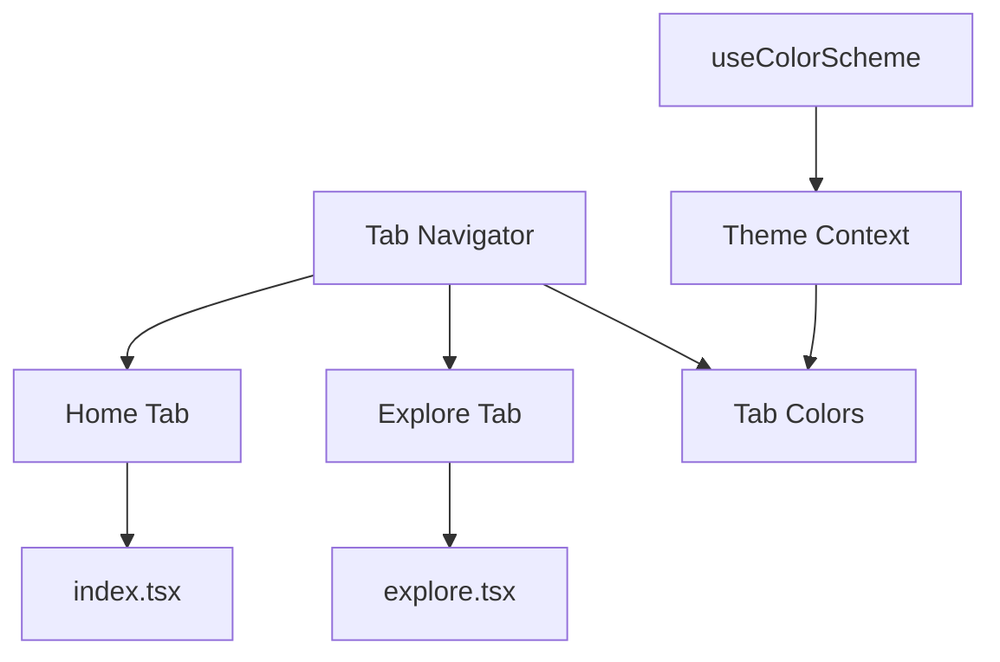
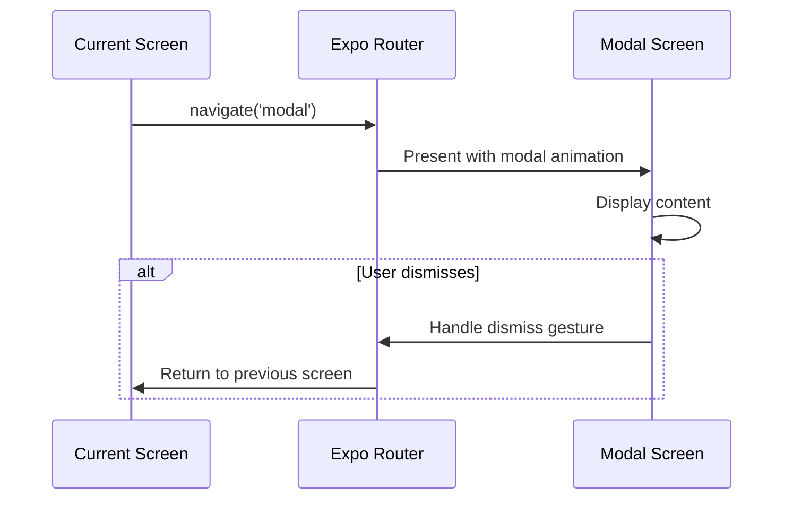
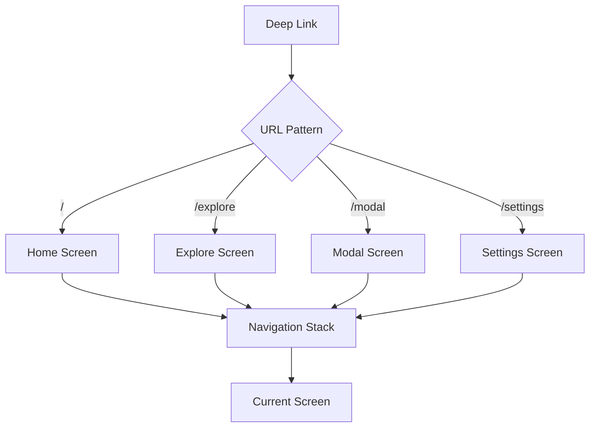

# Routing and Navigation

<cite>
**Referenced Files in This Document**   
- [src/app/_layout.tsx](file://src/app/_layout.tsx)
- [src/app/(tabs)/_layout.tsx](file://src/app/(tabs)/_layout.tsx)
- [src/app/modal.tsx](file://src/app/modal.tsx)
- [src/app/+html.tsx](file://src/app/+html.tsx)
- [src/app/(tabs)/index.tsx](file://src/app/(tabs)/index.tsx)
- [src/app/(tabs)/explore.tsx](file://src/app/(tabs)/explore.tsx)
</cite>

## Table of Contents
1. [Introduction](#introduction)
2. [File-Based Routing System](#file-based-routing-system)
3. [Tab Navigation Configuration](#tab-navigation-configuration)
4. [Modal Screen Implementation](#modal-screen-implementation)
5. [Navigation Patterns and Deep Linking](#navigation-patterns-and-deep-linking)
6. [Integration with Authentication Flows](#integration-with-authentication-flows)
7. [Best Practices for Route Organization](#best-practices-for-route-organization)
8. [Conclusion](#conclusion)

## Introduction
The Plate application implements a modern navigation system using Expo Router's file-based routing architecture. This approach provides a structured, intuitive way to define application routes through the filesystem hierarchy, enabling both stack-based navigation and tab-based interfaces. The routing system is designed to support multiple platforms (iOS, Android, web) while maintaining consistent navigation behavior across devices. This document details the implementation of the routing system, focusing on tab navigation, modal presentation, and integration with application state management.

## File-Based Routing System
The Plate application leverages Expo Router's file-based routing system, which maps the filesystem structure directly to navigable routes. The root route configuration is defined in `src/app/_layout.tsx`, where a stack navigator serves as the primary navigation container. This stack navigator configures the initial route to the `(tabs)` directory while also defining a modal route for overlay presentations. The `unstable_settings` export anchors the routing system to the `(tabs)` directory, establishing it as the default entry point for the application. This file-based approach eliminates the need for manual route configuration and enables automatic route discovery based on directory structure.

```mermaid
graph TB
A[src/app] --> B[_layout.tsx]
A --> C[(tabs)]
A --> D[modal.tsx]
A --> E[+html.tsx]
C --> F[_layout.tsx]
C --> G[index.tsx]
C --> H[explore.tsx]
B --> I[Stack Navigator]
I --> J[(tabs) route]
I --> K[modal route]
```

**Diagram sources**
- [src/app/_layout.tsx](file://src/app/_layout.tsx#L7-L33)
- [src/app/(tabs)/_layout.tsx](file://src/app/(tabs)/_layout.tsx#L1-L32)

**Section sources**
- [src/app/_layout.tsx](file://src/app/_layout.tsx#L1-L44)

## Tab Navigation Configuration
Tab navigation in the Plate application is implemented through the `(tabs)` directory, which contains a dedicated `_layout.tsx` file configuring the tab navigator. This layout file uses Expo Router's `Tabs` component to define multiple tab screens, including the home screen (`index.tsx`) and explore screen (`explore.tsx`). The tab navigator is configured with consistent styling through `screenOptions`, which sets the active tab color based on the current color scheme and hides the header bar for a cleaner interface. The tab titles are defined in each `Tabs.Screen` component, providing user-friendly labels for navigation.

The implementation leverages the application's theme system through the `useColorScheme` hook, ensuring that the active tab indicator color adapts to the user's preferred theme (light or dark mode). This dynamic theming creates a cohesive user experience that aligns with system-wide appearance settings. The tab navigation structure supports seamless switching between major application sections while maintaining the current navigation state within each tab.



**Diagram sources**
- [src/app/(tabs)/_layout.tsx](file://src/app/(tabs)/_layout.tsx#L1-L32)
- [constants/theme.ts](file://constants/theme.ts)

**Section sources**
- [src/app/(tabs)/_layout.tsx](file://src/app/(tabs)/_layout.tsx#L1-L32)
- [src/app/(tabs)/index.tsx](file://src/app/(tabs)/index.tsx#L1-L13)
- [src/app/(tabs)/explore.tsx](file://src/app/(tabs)/explore.tsx#L1-L14)

## Modal Screen Implementation
Modal screens in the Plate application are implemented as top-level route files, with the primary modal defined in `modal.tsx`. This file represents a standalone screen that can be presented as an overlay on top of the current navigation stack. The modal route is configured in the root layout with specific presentation options that define its behavior as a modal interface. The `presentation: 'modal'` option ensures that the screen appears as a centered overlay with appropriate platform-specific animations and dismissal gestures.

The modal implementation follows Expo Router's conventions for overlay screens, allowing for both programmatic and gesture-based dismissal. On mobile platforms, users can typically swipe down to dismiss the modal, while a dedicated close button or navigation header may be provided for accessibility. The modal screen can receive parameters through the route configuration, enabling dynamic content presentation based on context. This approach supports common use cases such as settings dialogs, confirmation prompts, and detailed content views without disrupting the main navigation flow.



**Diagram sources**
- [src/app/_layout.tsx](file://src/app/_layout.tsx#L26-L31)
- [src/app/modal.tsx](file://src/app/modal.tsx#L1-L10)

**Section sources**
- [src/app/_layout.tsx](file://src/app/_layout.tsx#L26-L31)
- [src/app/modal.tsx](file://src/app/modal.tsx#L1-L10)

## Navigation Patterns and Deep Linking
The Plate application supports various navigation patterns through Expo Router's built-in capabilities. Stack navigation enables hierarchical movement between screens, with proper back button behavior and transition animations. The file-based routing system automatically generates navigation paths based on the directory structure, allowing for deep linking to specific application states. For example, a URL like `/explore` directly navigates to the explore tab, while `/modal` opens the modal overlay.

Deep linking is facilitated by Expo Router's integration with the platform's linking system, allowing external URLs to open specific application screens. This capability supports use cases such as email verification links, push notification routing, and social sharing. The routing configuration in `_layout.tsx` defines the navigation hierarchy, ensuring that deep links maintain proper context within the application's navigation stack. Parameters can be passed through route URLs using standard query string syntax or dynamic route segments, enabling rich, stateful navigation patterns.



**Diagram sources**
- [src/app/_layout.tsx](file://src/app/_layout.tsx#L25-L32)
- [package.json](file://package.json)

**Section sources**
- [src/app/_layout.tsx](file://src/app/_layout.tsx#L25-L32)

## Integration with Authentication Flows
The routing system integrates with authentication flows by controlling access to protected routes based on the user's authentication state. While the current implementation does not explicitly show authentication guards, the structure supports such functionality through layout components and route interceptors. The Providers component in the root layout suggests a context-based approach to state management, which could include authentication state that influences navigation behavior.

Authentication integration typically involves conditional navigation based on login status, redirecting unauthenticated users to login screens while allowing authenticated users access to protected content. The tab navigation structure provides a natural separation between public and private sections of the application, with certain tabs potentially requiring authentication. Modal screens can be used for authentication prompts or account management, appearing over the current content without disrupting the navigation stack.

**Section sources**
- [src/app/_layout.tsx](file://src/app/_layout.tsx#L35-L43)
- [components/provider/ThemeProvider/](file://components/provider/ThemeProvider/)

## Best Practices for Route Organization
The Plate application demonstrates several best practices for route organization in Expo Router applications. The use of parentheses in directory names `(tabs)` creates route groups that don't appear in the URL path but provide logical organization for related screens. This pattern keeps the URL structure clean while maintaining a clear filesystem organization. Top-level route files like `modal.tsx` represent standalone screens that can be accessed from anywhere in the application.

The separation of layout files (`_layout.tsx`) from screen components promotes reusability and consistency across navigation levels. Each layout file configures navigation options and providers for its child routes, creating a hierarchical configuration system. The implementation also follows platform-specific conventions, with the `+html.tsx` file configuring web-specific HTML elements for static rendering. This attention to platform differences ensures consistent behavior across iOS, Android, and web environments.

Additional best practices include using descriptive route names, maintaining consistent navigation patterns, and leveraging Expo Router's built-in features for common use cases. The file-based approach reduces configuration overhead and makes the routing structure immediately apparent from the filesystem layout. Type safety is maintained through TypeScript, ensuring that route parameters and navigation props are properly defined and checked.

**Section sources**
- [src/app/_layout.tsx](file://src/app/_layout.tsx#L1-L44)
- [src/app/(tabs)/_layout.tsx](file://src/app/(tabs)/_layout.tsx#L1-L32)
- [src/app/+html.tsx](file://src/app/+html.tsx#L1-L32)

## Conclusion
The routing and navigation system in the Plate application effectively leverages Expo Router's file-based approach to create a structured, maintainable navigation architecture. By utilizing directory-based route groups, stack and tab navigators, and modal presentations, the application provides a comprehensive navigation experience across platforms. The implementation demonstrates best practices in route organization, theme integration, and platform-specific configuration. This foundation supports both current functionality and future expansion, allowing for the addition of new screens, navigation patterns, and authentication flows while maintaining a consistent user experience.