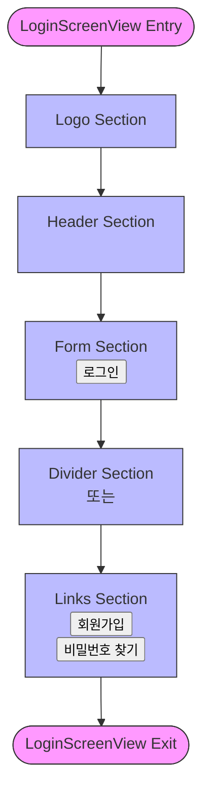

# Screen Components

<cite>
**Referenced Files in This Document**   
- [LoginScreen.tsx](file://components/screen/LoginScreen/LoginScreen.tsx)
- [LoginScreenView.tsx](file://components/screen/LoginScreen/LoginScreenView.tsx)
- [LoginForm.tsx](file://components/form/LoginForm/LoginForm.tsx)
- [SNSButtons.tsx](file://components/features/SNSButtons/SNSButtons.tsx)
- [index.ts](file://components/screen/LoginScreen/index.ts)
</cite>

## Table of Contents

1. [LoginScreen Component Architecture](#loginscreen-component-architecture)
2. [Component Composition and Relationships](#component-composition-and-relationships)
3. [State Management with MobX](#state-management-with-mobx)
4. [Layout and Presentation with LoginScreenView](#layout-and-presentation-with-loginscreenview)
5. [Navigation and Authentication Integration](#navigation-and-authentication-integration)
6. [Common Issues and Solutions](#common-issues-and-solutions)

## LoginScreen Component Architecture

The LoginScreen component follows a separation of concerns pattern by dividing responsibilities between state management and presentation. The architecture consists of two main components: LoginScreen (stateful) and LoginScreenView (stateless). This separation allows for better testability, reusability, and maintainability of the codebase. The LoginScreen component serves as the container that manages the state using MobX, while LoginScreenView handles the visual presentation and layout of the login interface.

**Section sources**

- [LoginScreen.tsx](file://components/screen/LoginScreen/LoginScreen.tsx#L1-L29)
- [LoginScreenView.tsx](file://components/screen/LoginScreen/LoginScreenView.tsx#L1-L150)

## Component Composition and Relationships

The LoginScreen component is composed of multiple sub-components that work together to create a complete login experience. The primary components include LoginForm for credential input and SNSButtons for social authentication options. These components are orchestrated through the LoginScreenView, which manages their positioning and visual hierarchy within the screen layout.

The LoginForm component provides a structured interface for users to enter their email and password credentials. It utilizes TextField components from the heroui-native library with appropriate validation attributes such as keyboardType="email-address" and secureTextEntry for password fields. The SNSButtons component offers social login options through Google, Apple, and Kakao services, with configurable visibility through boolean props (showGoogle, showApple, showKakao).

**Diagram sources**

- [LoginScreen.tsx](file://components/screen/LoginScreen/LoginScreen.tsx#L1-L29)
- [LoginScreenView.tsx](file://components/screen/LoginScreen/LoginScreenView.tsx#L1-L150)
- [LoginForm.tsx](file://components/form/LoginForm/LoginForm.tsx#L1-L62)
- [SNSButtons.tsx](file://components/features/SNSButtons/SNSButtons.tsx#L1-L81)

**Section sources**

- [LoginScreen.tsx](file://components/screen/LoginScreen/LoginScreen.tsx#L1-L29)
- [LoginScreenView.tsx](file://components/screen/LoginScreen/LoginScreenView.tsx#L1-L150)
- [LoginForm.tsx](file://components/form/LoginForm/LoginForm.tsx#L1-L62)
- [SNSButtons.tsx](file://components/features/SNSButtons/SNSButtons.tsx#L1-L81)

## State Management with MobX

The LoginScreen component implements state management using MobX, a reactive state management library. The component uses the observable decorator to create a reactive state object that contains email and password fields. This state is initialized within a React.useState hook that wraps the observable object, allowing React to properly manage the component's lifecycle while leveraging MobX's reactivity system.

The observer higher-order component from mobx-react-lite wraps the LoginScreen component, making it reactive to changes in the observable state. When the email or password values change, MobX automatically triggers a re-render of the connected components. The state is passed down to LoginScreenView through props, maintaining a unidirectional data flow from the stateful container to the stateless presentation component.

**Diagram sources**

- [LoginScreen.tsx](file://components/screen/LoginScreen/LoginScreen.tsx#L1-L29)
- [LoginScreenView.tsx](file://components/screen/LoginScreen/LoginScreenView.tsx#L1-L150)
- [LoginForm.tsx](file://components/form/LoginForm/LoginForm.tsx#L1-L62)
- [SNSButtons.tsx](file://components/features/SNSButtons/SNSButtons.tsx#L1-L81)

**Section sources**

- [LoginScreen.tsx](file://components/screen/LoginScreen/LoginScreen.tsx#L1-L29)
- [LoginScreenView.tsx](file://components/screen/LoginScreen/LoginScreenView.tsx#L1-L150)

## Layout and Presentation with LoginScreenView

The LoginScreenView component is responsible for the visual layout and presentation of the login interface. It implements a scrollable layout using the ScrollView component to ensure content remains accessible on smaller screens. The layout is organized into distinct sections: logo display, header information, login form, social login buttons, and navigation links.

The component uses a combination of View, Text, Button, and Divider components to create a visually appealing and user-friendly interface. Styling is managed through StyleSheet.create, with dynamic styles that respond to the current theme using the useTheme hook. The layout features proper spacing between elements, with marginBottom values creating visual hierarchy and contentContainerStyle ensuring appropriate padding within the scrollable area.

**Diagram sources**

- [LoginScreenView.tsx](file://components/screen/LoginScreen/LoginScreenView.tsx#L1-L150)

**Section sources**

- [LoginScreenView.tsx](file://components/screen/LoginScreen/LoginScreenView.tsx#L1-L150)

## Navigation and Authentication Integration

The LoginScreen component integrates with the application's navigation system through Expo Router and authentication services via callback props. The component exposes several callback functions through its interface, including onLogin, onSignUp, onForgotPassword, and social login handlers (onGoogleLogin, onAppleLogin, onKakaoLogin). These callbacks allow the parent component or screen to handle navigation and authentication logic appropriately.

The LoginScreen component is designed to work within the Expo Router navigation structure, as evidenced by the root layout configuration in the app directory. When authentication events occur, the component triggers the appropriate callback, which typically navigates to different routes or initiates authentication flows. This decoupled approach allows the LoginScreen to remain focused on presentation and state management while delegating navigation and authentication concerns to higher-level components.

**Section sources**

- [LoginScreen.tsx](file://components/screen/LoginScreen/LoginScreen.tsx#L1-L29)
- [LoginScreenView.tsx](file://components/screen/LoginScreen/LoginScreenView.tsx#L1-L150)
- [index.ts](file://components/screen/LoginScreen/index.ts#L1-L7)

## Common Issues and Solutions

Several common issues may arise when implementing and using the LoginScreen component, along with their corresponding solutions based on the existing implementation:

1. **Screen Layout Problems**: On smaller devices, form elements may be obscured by the keyboard. The implementation addresses this by using ScrollView with keyboardShouldPersistTaps="handled", allowing users to tap on form elements even when the keyboard is visible.

2. **State Synchronization Issues**: When using MobX with React, it's crucial to ensure proper reactivity. The implementation solves this by wrapping the component with the observer HOC and using observable state within useState, ensuring that state changes trigger the appropriate re-renders.

3. **Theme Integration**: The component properly integrates with the theme system through the useTheme hook, ensuring that colors and styling adapt to the current theme (light/dark mode) without requiring manual intervention.

4. **Accessibility Concerns**: The implementation includes proper accessibility attributes through the underlying UI components, ensuring that screen readers and other assistive technologies can properly interpret the login interface.

5. **Form Input Management**: The LoginForm component properly handles input validation attributes like autoComplete, autoCapitalize, and secureTextEntry, improving the user experience across different platforms and devices.

**Section sources**

- [LoginScreen.tsx](file://components/screen/LoginScreen/LoginScreen.tsx#L1-L29)
- [LoginScreenView.tsx](file://components/screen/LoginScreen/LoginScreenView.tsx#L1-L150)
- [LoginForm.tsx](file://components/form/LoginForm/LoginForm.tsx#L1-L62)
