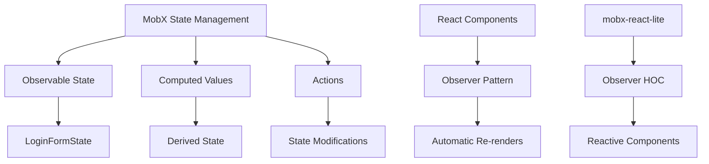
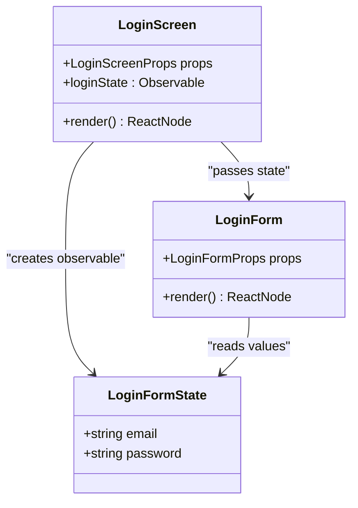
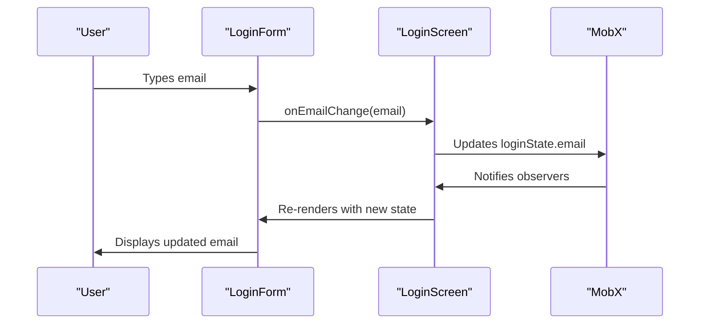

# State Management

<cite>
**Referenced Files in This Document**  
- [LoginForm.tsx](file://components/form/LoginForm/LoginForm.tsx)
- [LoginScreen.tsx](file://components/screen/LoginScreen/LoginScreen.tsx)
- [LoginScreenView.tsx](file://components/screen/LoginScreen/LoginScreenView.tsx)
- [TextField/index.tsx](file://components/ui/inputs/TextField/index.tsx)
- [ListSelect/index.tsx](file://components/ui/inputs/ListSelect/index.tsx)
- [Screen.tsx](file://components/ui/layouts/Screen/Screen.tsx)
- [package.json](file://package.json)
</cite>

## Table of Contents

1. [Introduction](#introduction)
2. [MobX Implementation Overview](#mobx-implementation-overview)
3. [Core State Management Patterns](#core-state-management-patterns)
4. [LoginFormState Implementation](#loginformstate-implementation)
5. [MobX-React Integration](#mobx-react-integration)
6. [Best Practices and Optimization](#best-practices-and-optimization)
7. [Common Issues and Solutions](#common-issues-and-solutions)

## Introduction

The Plate application implements a robust state management system using MobX for managing application state, particularly in form and screen components. This documentation provides a comprehensive analysis of the MobX implementation, focusing on the patterns used for observable state, computed values, and actions. The system demonstrates a clear separation of concerns between UI components and state management, with a particular emphasis on form state handling through the LoginFormState pattern. The integration of MobX with React is achieved through mobx-react-lite, leveraging the observer pattern to create reactive components that automatically update when observables change.

**Section sources**

- [package.json](file://package.json#L88-L89)

## MobX Implementation Overview

The Plate application utilizes MobX version 6.13.7 as its primary state management solution, with mobx-react-lite version 4.1.0 providing the React integration layer. This combination enables a transparent functional reactive programming (FRP) approach where application state can be modified directly while ensuring that all affected components are automatically updated. The implementation follows MobX best practices by creating observable state objects that can be consumed by observer components, which reactively re-render when the observed state changes. The state management architecture is designed to be lightweight and intuitive, avoiding the boilerplate typically associated with other state management solutions while maintaining excellent TypeScript support.

**Diagram sources**

- [package.json](file://package.json#L88-L89)

## Core State Management Patterns

The Plate application employs several key MobX patterns for effective state management. Observable state is created using the `observable` function from MobX, which makes objects, arrays, and primitive values reactive. Actions that modify state are wrapped with the `action` decorator to ensure atomic updates and optimal performance. The implementation also leverages computed values for derived state that automatically updates when its dependencies change. For form management, the application uses a pattern where form state is encapsulated in dedicated state objects (like LoginFormState) that are passed as props to form components. This approach promotes reusability and testability while maintaining a clear separation between UI and state logic.

**Section sources**

- [LoginForm.tsx](file://components/form/LoginForm/LoginForm.tsx#L7-L10)
- [TextField/index.tsx](file://components/ui/inputs/TextField/index.tsx#L1-L52)
- [ListSelect/index.tsx](file://components/ui/inputs/ListSelect/index.tsx#L1-L87)

## LoginFormState Implementation

The LoginFormState implementation demonstrates a practical application of MobX for form state management. The LoginFormState interface defines the structure of the login form state with email and password fields. This state object is created as an observable using MobX's `observable` function within the LoginScreen component. The LoginForm component receives this state object as a prop and directly accesses its properties to control the input fields. When user interactions occur, the state is updated through callback functions (onEmailChange, onPasswordChange) that are passed down from the parent component. This pattern ensures that form state is centralized and can be easily validated, serialized, or shared with other components as needed.

**Diagram sources**

- [LoginForm.tsx](file://components/form/LoginForm/LoginForm.tsx#L7-L10)
- [LoginScreen.tsx](file://components/screen/LoginScreen/LoginScreen.tsx#L1-L29)

**Section sources**

- [LoginForm.tsx](file://components/form/LoginForm/LoginForm.tsx#L7-L10)
- [LoginScreen.tsx](file://components/screen/LoginScreen/LoginScreen.tsx#L1-L29)

## MobX-React Integration

The integration of MobX with React in the Plate application is accomplished through the mobx-react-lite library, which provides the `observer` higher-order component (HOC). Components that need to react to state changes are wrapped with the `observer` function, making them reactive to any observables they consume during rendering. The LoginScreen component is a prime example of this pattern, being decorated with `observer` to automatically re-render when the loginState observable changes. Additionally, several UI components like TextField and ListSelect are also implemented as observer components, allowing them to respond to MobX state changes when used in form contexts. This integration pattern ensures efficient rendering by only updating components when the specific observables they depend on have changed, leveraging MobX's fine-grained reactivity system.

**Diagram sources**

- [LoginScreen.tsx](file://components/screen/LoginScreen/LoginScreen.tsx#L1-L29)
- [TextField/index.tsx](file://components/ui/inputs/TextField/index.tsx#L1-L52)

**Section sources**

- [LoginScreen.tsx](file://components/screen/LoginScreen/LoginScreen.tsx#L1-L29)
- [TextField/index.tsx](file://components/ui/inputs/TextField/index.tsx#L1-L52)
- [Screen.tsx](file://components/ui/layouts/Screen/Screen.tsx#L1-L13)

## Best Practices and Optimization

The Plate application follows several best practices for MobX state management and performance optimization. State is kept minimal and focused on what's necessary for the UI, with complex state logic encapsulated in dedicated state objects. The use of observable primitives and objects is balanced to ensure optimal performance, with larger state trees being carefully managed to avoid unnecessary re-renders. The implementation leverages MobX's built-in batching mechanism to group multiple state updates into a single re-render cycle. For form components, the pattern of passing state objects as props rather than individual values promotes reusability and makes state management more predictable. Additionally, the application uses TypeScript extensively to provide strong typing for state objects, reducing runtime errors and improving developer experience.

**Section sources**

- [LoginForm.tsx](file://components/form/LoginForm/LoginForm.tsx)
- [LoginScreen.tsx](file://components/screen/LoginScreen/LoginScreen.tsx)
- [TextField/index.tsx](file://components/ui/inputs/TextField/index.tsx)

## Common Issues and Solutions

While the MobX implementation in Plate is robust, developers should be aware of potential issues and their solutions. Memory leaks can occur if observer components are not properly unmounted, which is mitigated by ensuring that React component lifecycle is respected and MobX reactions are properly disposed. Performance issues may arise from excessive re-renders when too many observables are consumed by a single component, which can be addressed by breaking down large components into smaller, more focused observer components. Another common issue is the accidental modification of state outside of actions, which can lead to inconsistent state updates; this is prevented by consistently using the action decorator for state modifications. The use of TypeScript and proper linting rules helps catch many of these issues during development.

**Section sources**

- [LoginForm.tsx](file://components/form/LoginForm/LoginForm.tsx)
- [LoginScreen.tsx](file://components/screen/LoginScreen/LoginScreen.tsx)
- [TextField/index.tsx](file://components/ui/inputs/TextField/index.tsx)
