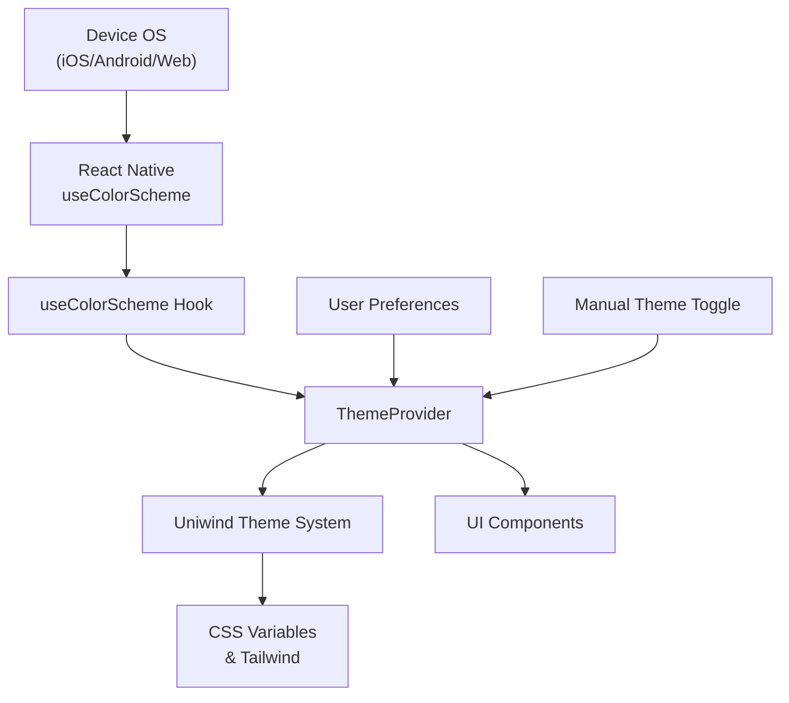
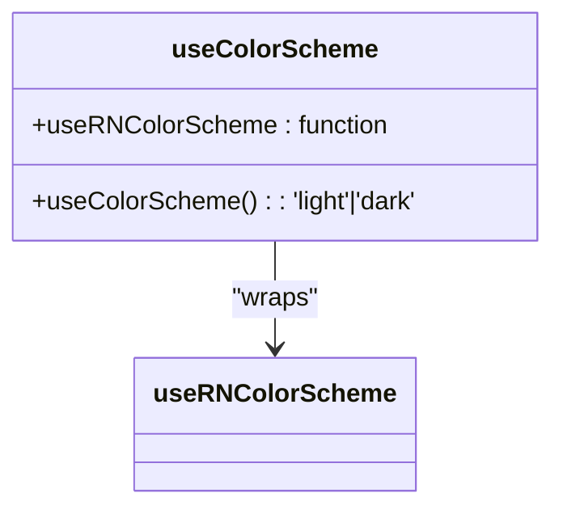
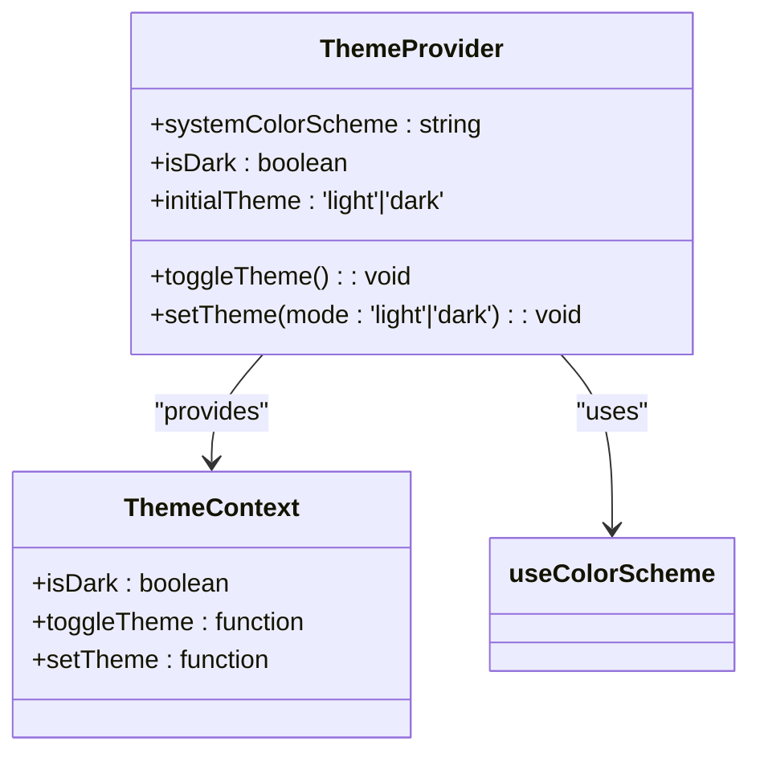
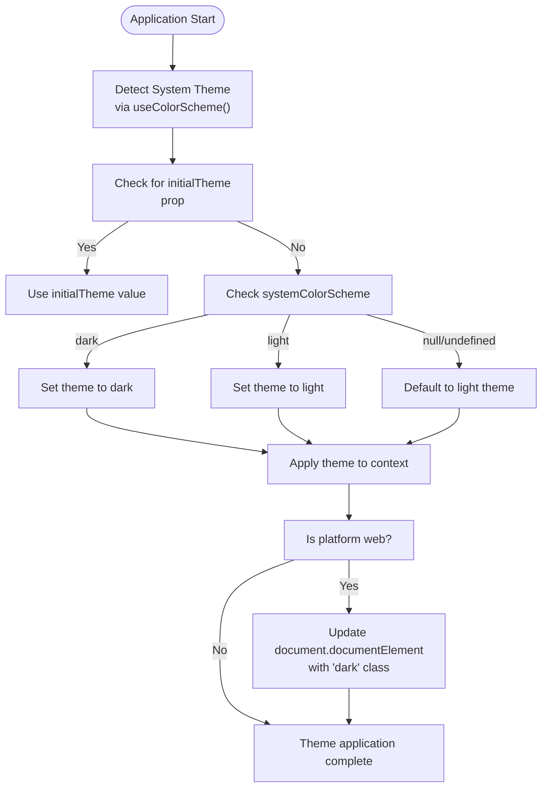
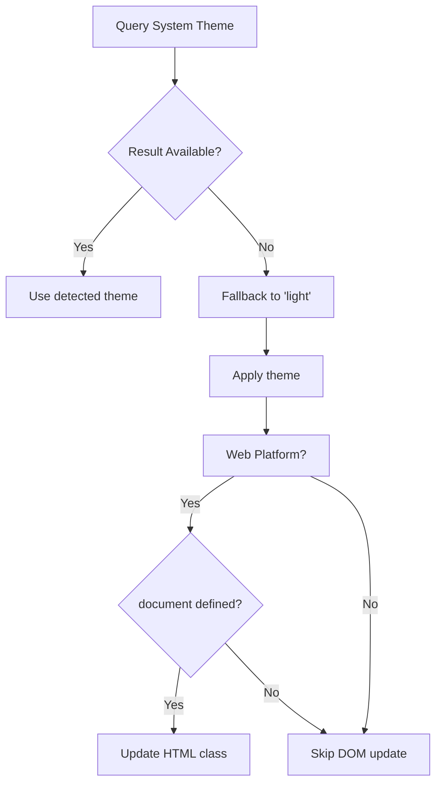

# System Theme Detection

<cite>
**Referenced Files in This Document**   
- [useColorScheme.ts](file://hooks/useColorScheme.ts)
- [ThemeProvider.tsx](file://components/provider/ThemeProvider/ThemeProvider.tsx)
- [unistyles.ts](file://unistyles.ts)
- [uniwind-types.d.ts](file://uniwind-types.d.ts)
- [globals.css](file://globals.css)
- [metro.config.js](file://metro.config.js)
</cite>

## Table of Contents
1. [Introduction](#introduction)
2. [Core Components](#core-components)
3. [Architecture Overview](#architecture-overview)
4. [Detailed Component Analysis](#detailed-component-analysis)
5. [Theme Detection Flow](#theme-detection-flow)
6. [Platform-Specific Behavior](#platform-specific-behavior)
7. [Event Handling and Updates](#event-handling-and-updates)
8. [Fallback Mechanisms and Edge Cases](#fallback-mechanisms-and-edge-cases)
9. [Integration with ThemeProvider](#integration-with-themeprovider)
10. [Common Issues and Troubleshooting](#common-issues-and-troubleshooting)
11. [Testing Best Practices](#testing-best-practices)
12. [Conclusion](#conclusion)

## Introduction
The Plate application implements a robust system theme detection mechanism that automatically adapts the UI to the user's device preference for light or dark mode. This document details how the `useColorScheme` hook leverages Expo and React Native platform APIs to detect system-level theme preferences across iOS, Android, and web platforms. The integration with `ThemeProvider` enables seamless theme switching based on both system settings and user preferences, using Uniwind for theme management. The system supports adaptive themes that respond to device color scheme changes in real-time while providing manual override capabilities.

## Core Components
The system theme detection functionality is implemented through several key components: the `useColorScheme` hook for detecting platform-level preferences, the `ThemeProvider` for managing theme state and context, and Uniwind for theme registration and switching. These components work together to provide a consistent theming experience across all platforms.

**Section sources**
- [useColorScheme.ts](file://hooks/useColorScheme.ts#L1-L6)
- [ThemeProvider.tsx](file://components/provider/ThemeProvider/ThemeProvider.tsx#L1-L132)

## Architecture Overview
The theme detection system follows a layered architecture where platform-specific APIs feed into a centralized theme management system. The `useColorScheme` hook acts as the entry point for system preference detection, which is then processed by the `ThemeProvider` to establish the initial theme state. Uniwind handles theme registration and provides runtime access to theme information.

**Diagram sources**
- [useColorScheme.ts](file://hooks/useColorScheme.ts#L1-L6)
- [ThemeProvider.tsx](file://components/provider/ThemeProvider/ThemeProvider.tsx#L1-L132)
- [unistyles.ts](file://unistyles.ts#L1-L445)

## Detailed Component Analysis

### useColorScheme Hook Analysis
The `useColorScheme` hook serves as a lightweight wrapper around React Native's built-in `useColorScheme` function, providing a consistent interface for theme detection across the application.

**Diagram sources**
- [useColorScheme.ts](file://hooks/useColorScheme.ts#L1-L6)

**Section sources**
- [useColorScheme.ts](file://hooks/useColorScheme.ts#L1-L6)

### ThemeProvider Analysis
The `ThemeProvider` component manages the application's theme state and provides context for theme-aware components. It integrates system detection with manual theme control and handles platform-specific DOM manipulation for web environments.

**Diagram sources**
- [ThemeProvider.tsx](file://components/provider/ThemeProvider/ThemeProvider.tsx#L1-L132)

**Section sources**
- [ThemeProvider.tsx](file://components/provider/ThemeProvider/ThemeProvider.tsx#L1-L132)

## Theme Detection Flow
The theme detection process begins when the application initializes and follows a specific sequence of operations to determine the appropriate theme. First, the `useColorScheme` hook queries the React Native platform API to detect the system's preferred color scheme. This value is then passed to the `ThemeProvider`, which evaluates both the system preference and any initial theme override. If an `initialTheme` is specified, it takes precedence over the system setting. Otherwise, the theme is set based on the system color scheme, defaulting to 'light' if no preference is detected.

**Diagram sources**
- [ThemeProvider.tsx](file://components/provider/ThemeProvider/ThemeProvider.tsx#L35-L59)

## Platform-Specific Behavior
The theme detection system exhibits different behaviors across platforms due to variations in API availability and rendering requirements. On iOS and Android, the system leverages React Native's Appearance API through `useColorScheme` to detect the device's theme preference. The web platform requires additional handling since it relies on CSS classes for Tailwind's `@variant dark` support. When running in a web environment (detected via `typeof document !== 'undefined'`), the system manipulates the DOM by adding or removing the 'dark' class from the document element, which triggers Tailwind's dark mode variants.

**Section sources**
- [ThemeProvider.tsx](file://components/provider/ThemeProvider/ThemeProvider.tsx#L51-L58)

## Event Handling and Updates
The system automatically responds to changes in the device's theme settings through React Native's built-in event system. When a user changes their device theme preference, the `useColorScheme` hook automatically re-renders components that consume it, triggering the `useEffect` in `ThemeProvider` to update the theme state. This change propagates through the context system to all theme-aware components. For web platforms, the effect also updates the DOM class attribute to maintain consistency with Tailwind's styling system.

**Section sources**
- [ThemeProvider.tsx](file://components/provider/ThemeProvider/ThemeProvider.tsx#L39-L59)

## Fallback Mechanisms and Edge Cases
The implementation includes several fallback mechanisms to handle edge cases and ensure a consistent user experience. The most critical fallback is the default to 'light' theme when the system color scheme cannot be determined (null or undefined). This prevents the application from entering an undefined state. The nullish coalescing operator (`??`) in the `useColorScheme` hook ensures this behavior. Additionally, the system gracefully handles environments where document manipulation is not available (non-web platforms) by conditionally applying DOM updates only when running in a browser context.

**Diagram sources**
- [useColorScheme.ts](file://hooks/useColorScheme.ts#L3-L4)
- [ThemeProvider.tsx](file://components/provider/ThemeProvider/ThemeProvider.tsx#L51-L58)

## Integration with ThemeProvider
The `useColorScheme` hook is tightly integrated with the `ThemeProvider` to create a cohesive theme management system. The detected system preference serves as the foundation for the initial theme state, which can be overridden by user preferences or manual selection. The `ThemeProvider` uses the system detection as one of its primary inputs in the initialization `useEffect`, combining it with the optional `initialTheme` prop to determine the starting theme. This integration allows the application to respect system preferences while still providing users with the ability to manually select their preferred theme.

**Section sources**
- [ThemeProvider.tsx](file://components/provider/ThemeProvider/ThemeProvider.tsx#L35-L48)

## Common Issues and Troubleshooting
Several common issues may arise with system theme detection that developers should be aware of. Delayed theme updates can occur when the React Native bridge takes time to communicate the system preference change to JavaScript. Incorrect detection on certain devices may happen if the platform API returns unexpected values or if there are timing issues during application startup. To address these issues, ensure that the theme detection logic is placed as close to the application root as possible and that components consuming theme context are properly optimized to prevent unnecessary re-renders. For forced theme modes, the system provides the `setTheme` function to programmatically override the detected theme.

**Section sources**
- [ThemeProvider.tsx](file://components/provider/ThemeProvider/ThemeProvider.tsx#L80-L93)
- [useTheme.ts](file://hooks/useTheme.ts#L27-L33)

## Testing Best Practices
Effective testing of system theme detection requires a multi-platform approach. For iOS and Android, use simulator/device settings to switch between light and dark modes while monitoring the application's response. On web platforms, test both OS-level theme changes and browser-level preferences. Implement unit tests that mock the `useColorScheme` return value to verify both light and dark theme rendering. Use integration tests to ensure that theme changes propagate correctly through the context system and that DOM updates occur as expected on web platforms. Test edge cases such as null/undefined system preferences and rapid theme switching to ensure system stability.

**Section sources**
- [useColorScheme.ts](file://hooks/useColorScheme.ts#L3-L4)
- [ThemeProvider.tsx](file://components/provider/ThemeProvider/ThemeProvider.tsx#L39-L59)

## Conclusion
The Plate application's system theme detection mechanism provides a robust solution for adapting to user preferences across multiple platforms. By leveraging React Native's `useColorScheme` hook and integrating it with Uniwind's theme system through the `ThemeProvider`, the application achieves seamless theme switching that respects both system settings and user choices. The implementation includes proper fallbacks, platform-specific handling, and efficient state management to ensure a consistent user experience. Developers should be aware of potential timing issues and test thoroughly across all target platforms to ensure reliable theme detection and application.