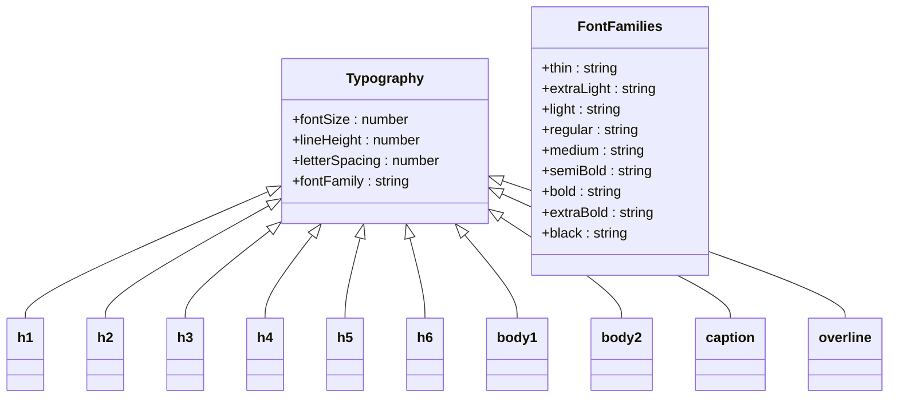
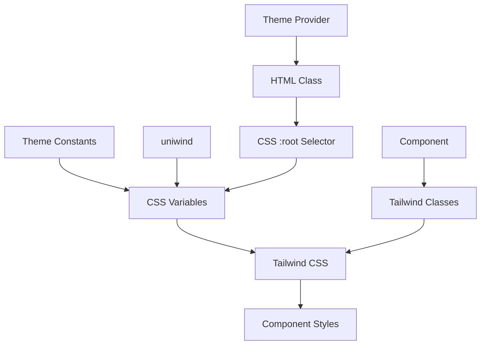
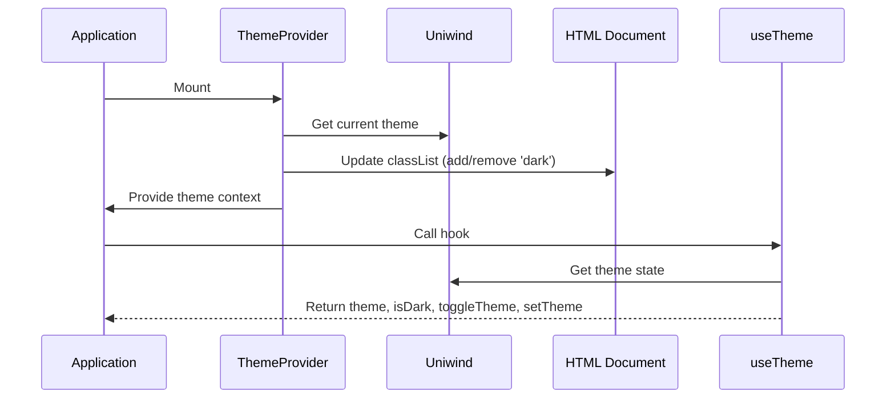

# Theme Constants

<cite>
**Referenced Files in This Document**   
- [constants/theme.ts](file://constants/theme.ts)
- [unistyles.ts](file://unistyles.ts)
- [globals.css](file://globals.css)
- [components/ui/display/Text/Text.tsx](file://components/ui/display/Text/Text.tsx)
- [components/ui/surfaces/Card/Card.tsx](file://components/ui/surfaces/Card/Card.tsx)
- [hooks/useTheme.ts](file://hooks/useTheme.ts)
- [components/provider/ThemeProvider/ThemeProvider.tsx](file://components/provider/ThemeProvider/ThemeProvider.tsx)
</cite>

## Table of Contents
1. [Introduction](#introduction)
2. [Theme Structure](#theme-structure)
3. [Color System](#color-system)
4. [Spacing and Layout](#spacing-and-layout)
5. [Typography System](#typography-system)
6. [CSS Variables and Tailwind Integration](#css-variables-and-tailwind-integration)
7. [Theme Provider and Context](#theme-provider-and-context)
8. [Component Implementation Examples](#component-implementation-examples)
9. [Extending the Theme](#extending-the-theme)
10. [Accessibility and Best Practices](#accessibility-and-best-practices)
11. [Troubleshooting Common Issues](#troubleshooting-common-issues)

## Introduction

The Plate application implements a comprehensive theme system that provides a consistent design language across all components. The theme constants are organized in a structured hierarchy that includes color palettes, spacing tokens, typography definitions, and other design tokens. This system integrates with both CSS custom properties and Tailwind CSS via the uniwind library, enabling a unified styling approach across web and native platforms. The theme supports both light and dark modes with carefully designed color scales that maintain visual harmony and accessibility standards.

## Theme Structure

The theme system in the Plate application is organized into several key categories: colors, spacing, border radius, shadows, typography, fonts, and opacity. These design tokens are defined in the `unistyles.ts` file and are structured to provide a consistent and scalable design system. The theme follows a modular approach where each category contains specific tokens that can be referenced throughout the application. The system is designed to be platform-agnostic, working seamlessly across web and native environments through the uniwind integration.

**Section sources**
- [unistyles.ts](file://unistyles.ts#L245-L399)

## Color System

The color system in the Plate application is built around a comprehensive palette that includes semantic color names and a 10-step color scale for each color family. The theme defines distinct color sets for light and dark modes, with careful consideration given to contrast ratios and visual accessibility. Each color family (primary, secondary, success, warning, danger) includes 10 shades (50-900) plus special "foreground" and "DEFAULT" values. The system also defines content colors (content1-content4) for layered UI elements, background and foreground colors, and special purpose colors like focus and overlay.

The color definitions use a consistent naming convention that makes it easy to understand the purpose and usage of each color. For example, `content1.DEFAULT` represents the primary background color for cards and surfaces, while `primary.DEFAULT` represents the main brand color. The color system is designed to ensure sufficient contrast between text and background elements in both light and dark modes, meeting WCAG accessibility guidelines.

```mermaid
erDiagram
COLOR_SCALE {
string 50
string 100
string 200
string 300
string 400
string 500
string 600
string 700
string 800
string 900
string foreground
string DEFAULT
}
THEME {
string background
string foreground
string focus
string overlay
}
CONTENT_COLOR {
string DEFAULT
string foreground
}
COLOR_SCALE ||--o{ THEME : "primary"
COLOR_SCALE ||--o{ THEME : "secondary"
COLOR_SCALE ||--o{ THEME : "success"
COLOR_SCALE ||--o{ THEME : "warning"
COLOR_SCALE ||--o{ THEME : "danger"
COLOR_SCALE ||--o{ THEME : "default"
CONTENT_COLOR ||--o{ THEME : "content1"
CONTENT_COLOR ||--o{ THEME : "content2"
CONTENT_COLOR ||--o{ THEME : "content3"
CONTENT_COLOR ||--o{ THEME : "content4"
```

**Diagram sources**
- [unistyles.ts](file://unistyles.ts#L25-L239)

**Section sources**
- [unistyles.ts](file://unistyles.ts#L25-L239)
- [constants/theme.ts](file://constants/theme.ts#L6-L22)

## Spacing and Layout

The spacing system in the Plate application follows a base-4 scale, providing a consistent rhythm for layout and component spacing. The spacing tokens are defined as multiples of 4 pixels, ranging from 0 to 128 pixels (0, 1, 2, 3, 4, 5, 6, 7, 8, 9, 10, 12, 14, 16, 20, 24, 28, 32). This creates a harmonious visual hierarchy and ensures consistent spacing across different components and layouts.

The system also includes predefined border radius values (none, sm, md, lg, xl, 2xl, 3xl, full) that correspond to common design patterns. Shadow definitions are provided for different elevation levels (none, sm, md, lg, xl), with appropriate shadow properties for both iOS and Android platforms. These design tokens enable developers to create visually consistent UI elements without hardcoding pixel values, promoting design system adherence and making future design updates easier to implement.

**Section sources**
- [unistyles.ts](file://unistyles.ts#L245-L277)

## Typography System

The typography system in the Plate application is comprehensive and covers all common text styles used in the interface. It includes definitions for heading levels (h1-h6), body text (body1, body2), captions, overlines, and labels. Each typography token specifies fontSize, lineHeight, letterSpacing, and fontFamily properties to ensure consistent text rendering across the application.

The system uses the Pretendard font family with different weights (thin, extraLight, light, regular, medium, semiBold, bold, extraBold, black) to create visual hierarchy and emphasis. The typography tokens are designed to work well with the spacing system, creating a cohesive visual language. The line heights are carefully chosen to ensure good readability, with larger text having proportionally larger line heights.



**Diagram sources**
- [unistyles.ts](file://unistyles.ts#L318-L393)

**Section sources**
- [unistyles.ts](file://unistyles.ts#L318-L393)

## CSS Variables and Tailwind Integration

The theme system integrates with CSS custom properties and Tailwind CSS through the uniwind library. The `globals.css` file imports both Tailwind CSS and uniwind, establishing the foundation for the styling system. The theme constants are automatically converted to CSS variables, which are then accessible through Tailwind classes.

The integration follows a specific pattern where the theme tokens are mapped to CSS custom properties with a consistent naming convention (e.g., `--colors-primary`, `--spacing-md`). These CSS variables are then referenced in Tailwind utility classes, allowing developers to use familiar Tailwind syntax while leveraging the design system tokens. The system supports both light and dark themes through CSS class toggling on the HTML root element, with the `dark` class being added or removed based on the current theme.

The uniwind configuration is defined in `uniwind-types.d.ts`, which specifies the available themes ('light', 'dark') and enables type safety for theme-related operations. This integration ensures that theme changes are reflected instantly across the entire application without requiring JavaScript re-renders, as the CSS engine handles the style updates.



**Diagram sources**
- [globals.css](file://globals.css#L1-L7)
- [uniwind-types.d.ts](file://uniwind-types.d.ts#L1-L10)
- [unistyles.ts](file://unistyles.ts#L405-L444)

**Section sources**
- [globals.css](file://globals.css#L1-L7)
- [uniwind-types.d.ts](file://uniwind-types.d.ts#L1-L10)
- [unistyles.ts](file://unistyles.ts#L405-L444)

## Theme Provider and Context

The theme system is managed through a combination of the ThemeProvider component and custom React hooks. The ThemeProvider, located in `components/provider/ThemeProvider/ThemeProvider.tsx`, uses React Context to make the current theme available to all components in the application. It listens to the system color scheme and manages the theme state, updating the HTML root element with the appropriate class ('dark' or no class) to trigger the corresponding CSS styles.

The `useTheme` hook, defined in `hooks/useTheme.ts`, provides a convenient way for components to access the current theme and theme-related functions. It wraps the uniwind `useUniwind` hook and provides additional functionality like `toggleTheme` and `setTheme`. The hook returns the current theme object, a boolean indicating whether dark mode is active, and functions to change the theme. This abstraction layer ensures compatibility with existing code while leveraging the uniwind theme management system.



**Diagram sources**
- [components/provider/ThemeProvider/ThemeProvider.tsx](file://components/provider/ThemeProvider/ThemeProvider.tsx#L1-L59)
- [hooks/useTheme.ts](file://hooks/useTheme.ts#L1-L41)

**Section sources**
- [components/provider/ThemeProvider/ThemeProvider.tsx](file://components/provider/ThemeProvider/ThemeProvider.tsx#L1-L59)
- [hooks/useTheme.ts](file://hooks/useTheme.ts#L1-L41)

## Component Implementation Examples

### Text Component

The Text component demonstrates how design tokens are applied through Tailwind classes. It uses the `tailwind-variants` library to define style variants for different text types (h1-h6, body1, body2, etc.) and colors. The component maps its variant prop to corresponding Tailwind classes that reference the theme's typography and color tokens. For example, the 'h1' variant applies 'text-5xl font-bold' classes, which are defined in the theme's typography system.

The component's implementation shows how semantic naming is used to connect component props with design tokens. The color prop maps to text color classes (text-foreground, text-primary, etc.) that reference the theme's color palette. This approach allows for consistent text styling across the application while maintaining flexibility for different use cases.

**Section sources**
- [components/ui/display/Text/Text.tsx](file://components/ui/display/Text/Text.tsx#L1-L79)

### Card Component

The Card component illustrates how design tokens are accessed programmatically through the `useTheme` hook. Unlike the Text component which relies on Tailwind classes, the Card component directly references theme tokens in its style object. It uses `theme.colors.content1.DEFAULT` for the background color, `theme.radius.md` for border radius, and `theme.colors.content3.DEFAULT` for the border color.

The component also demonstrates the use of spacing tokens through its padding prop. The padding values ('sm', 'md', 'lg') are mapped to specific spacing tokens (theme.spacing[2], theme.spacing[4], theme.spacing[6]) to ensure consistent spacing with the design system. This approach provides more control over styling while still adhering to the established design tokens.

```mermaid
flowchart TD
A[Card Component] --> B{Padding Prop}
B --> |number| C[Use as pixel value]
B --> |'sm'| D[theme.spacing[2]]
B --> |'md'| E[theme.spacing[4]]
B --> |'lg'| F[theme.spacing[6]]
A --> G[Style Object]
G --> H[backgroundColor: theme.colors.content1.DEFAULT]
G --> I[borderRadius: theme.radius.md]
G --> J[borderColor: theme.colors.content3.DEFAULT]
G --> K[padding: calculated value]
```

**Diagram sources**
- [components/ui/surfaces/Card/Card.tsx](file://components/ui/surfaces/Card/Card.tsx#L1-L51)

**Section sources**
- [components/ui/surfaces/Card/Card.tsx](file://components/ui/surfaces/Card/Card.tsx#L1-L51)

## Extending the Theme

To extend the theme with new properties, developers should modify the `unistyles.ts` file where the design tokens are defined. New color palettes can be added by creating additional color scale objects with the same structure as existing ones (50-900, foreground, DEFAULT). New spacing tokens can be added to the spacing object, following the base-4 scale pattern. Additional typography variants can be defined in the typography object with appropriate fontSize, lineHeight, and fontFamily values.

When adding new properties, it's important to maintain consistency with the existing naming conventions and design principles. New color families should follow the same 10-step scale pattern, and new spacing values should be multiples of 4. Any new theme properties should be added to both light and dark theme definitions to ensure consistent appearance across themes.

The theme extension process should also consider the impact on existing components and perform thorough testing to ensure that the new tokens work correctly in all contexts. Documentation should be updated to reflect the new tokens and their intended usage.

**Section sources**
- [unistyles.ts](file://unistyles.ts#L245-L399)

## Accessibility and Best Practices

The theme system in the Plate application prioritizes accessibility through careful color selection and contrast ratios. The color palettes for both light and dark modes are designed to meet WCAG 2.1 AA standards for text contrast, ensuring readability for users with visual impairments. The system uses semantic color names that indicate the purpose of each color, making it easier to use colors appropriately and maintain accessibility standards.

Best practices for using the theme include:
- Using semantic color names (primary, success, warning) rather than literal color names (blue, green, yellow)
- Leveraging the predefined spacing tokens instead of hardcoding pixel values
- Using the typography variants consistently for different text hierarchies
- Testing components in both light and dark modes to ensure visual consistency
- Following the established naming conventions when creating new components or extending the theme

The system also includes opacity tokens for common states like disabled (0.5) and hover (0.8), promoting consistency in interactive element behavior. These tokens help maintain a cohesive user experience across different components and interactions.

**Section sources**
- [unistyles.ts](file://unistyles.ts#L395-L399)
- [constants/theme.ts](file://constants/theme.ts#L6-L22)

## Troubleshooting Common Issues

### Missing Theme Variables

If theme variables are not being applied correctly, check the following:
1. Ensure the ThemeProvider is properly wrapped around the application or component tree
2. Verify that the HTML root element has the correct class ('dark' for dark mode, no class for light mode)
3. Check that the CSS variables are properly generated in the stylesheet
4. Confirm that the Tailwind classes are correctly mapped to the theme tokens

### Inconsistent Styling Across Components

Inconsistent styling typically occurs when components bypass the design system tokens. To resolve this:
1. Audit components to ensure they use theme tokens through Tailwind classes or the useTheme hook
2. Verify that all components use the same variant names for similar elements
3. Check for hardcoded colors, spacing, or typography values that don't align with the theme
4. Ensure that custom components properly extend existing theme variants when needed

### Theme Versioning and Updates

When updating design tokens, follow these guidelines:
1. Maintain backward compatibility by not removing existing tokens without a deprecation period
2. Update both light and dark theme definitions consistently
3. Test all components that use the updated tokens in both themes
4. Document changes in the theme system for other developers
5. Consider the impact on accessibility when changing color values
6. Use version control to track changes to the theme files and coordinate updates across the team

**Section sources**
- [components/provider/ThemeProvider/ThemeProvider.tsx](file://components/provider/ThemeProvider/ThemeProvider.tsx#L1-L59)
- [unistyles.ts](file://unistyles.ts#L245-L444)
- [hooks/useTheme.ts](file://hooks/useTheme.ts#L1-L41)