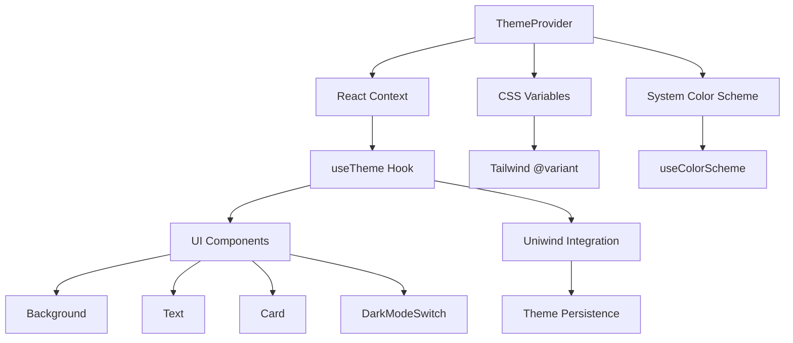
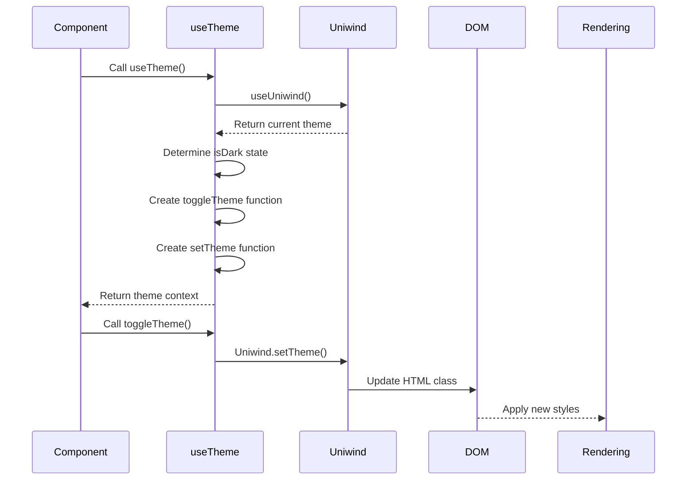
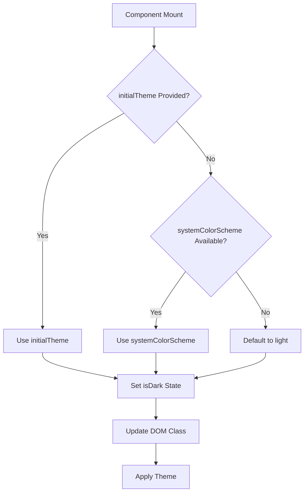

# Theme System

<cite>
**Referenced Files in This Document**   
- [ThemeProvider.tsx](file://components/provider/ThemeProvider/ThemeProvider.tsx)
- [useTheme.ts](file://hooks/useTheme.ts)
- [useColorScheme.ts](file://hooks/useColorScheme.ts)
- [theme.ts](file://constants/theme.ts)
- [unistyles.ts](file://unistyles.ts)
- [globals.css](file://globals.css)
- [DarkModeSwitch.tsx](file://components/ui/inputs/DarkModeSwitch/DarkModeSwitch.tsx)
- [Background.tsx](file://components/ui/display/Background/Background.tsx)
- [Text.tsx](file://components/ui/display/Text/Text.tsx)
- [Card.tsx](file://components/ui/surfaces/Card/Card.tsx)
- [_layout.tsx](file://src/app/_layout.tsx)
</cite>

## Table of Contents
1. [Introduction](#introduction)
2. [Theme Architecture Overview](#theme-architecture-overview)
3. [ThemeProvider Implementation](#themeprovider-implementation)
4. [useTheme Hook](#usetheme-hook)
5. [CSS Variable Integration](#css-variable-integration)
6. [System Preference Detection](#system-preference-detection)
7. [Theme Application in UI Components](#theme-application-in-ui-components)
8. [Theme Persistence and Performance](#theme-persistence-and-performance)
9. [Extending the Theme System](#extending-the-theme-system)
10. [Troubleshooting Common Issues](#troubleshooting-common-issues)

## Introduction
The Plate application implements a comprehensive theme system that supports both light and dark modes with seamless integration across web and native platforms. The system leverages CSS variables, React Context, and Uniwind for efficient theme management and rendering. This documentation details the architecture, implementation, and usage patterns of the theme system, providing developers with the knowledge needed to work effectively with and extend the theming capabilities.

## Theme Architecture Overview



**Diagram sources**
- [ThemeProvider.tsx](file://components/provider/ThemeProvider/ThemeProvider.tsx#L10-L119)
- [useTheme.ts](file://hooks/useTheme.ts#L18-L40)
- [unistyles.ts](file://unistyles.ts#L405-L444)

## ThemeProvider Implementation

The ThemeProvider component serves as the central state management system for theme state in the Plate application. It uses React Context to provide theme information and control functions to all components in the application tree. The provider initializes theme state based on either an explicit initial theme or the system's color scheme preference.

The implementation includes three primary functions:
- `isDark`: Boolean state indicating the current theme mode
- `toggleTheme`: Function to switch between light and dark modes
- `setTheme`: Function to explicitly set the theme mode

On web platforms, the provider manipulates the DOM by adding or removing the 'dark' class from the documentElement, which integrates with Tailwind's @variant directive for conditional styling.

**Section sources**
- [ThemeProvider.tsx](file://components/provider/ThemeProvider/ThemeProvider.tsx#L30-L119)

## useTheme Hook

The useTheme hook provides a convenient interface for components to access theme state and control functions. There are two implementations of this hook in the codebase, with the version in `/hooks/useTheme.ts` taking precedence due to its Uniwind integration.

The hook returns an object containing:
- `theme`: The current theme object with all design tokens
- `isDark`: Boolean indicating if dark mode is active
- `toggleTheme`: Function to toggle between themes
- `setTheme`: Function to set a specific theme mode

The implementation leverages Uniwind's theme system for persistence and efficient theme switching, while maintaining compatibility with existing code by exposing the unistyles theme object.



**Diagram sources**
- [useTheme.ts](file://hooks/useTheme.ts#L18-L40)
- [ThemeProvider.tsx](file://components/provider/ThemeProvider/ThemeProvider.tsx#L124-L130)

**Section sources**
- [useTheme.ts](file://hooks/useTheme.ts#L18-L40)

## CSS Variable Integration

The theme system integrates with CSS variables to enable efficient theme switching without requiring component re-renders. When the theme changes, Uniwind converts theme values to CSS variables and updates the root element's class, allowing the CSS engine to handle style changes.

For web platforms, the system adds or removes the 'dark' class from the documentElement, which works with Tailwind's @variant directive to apply conditional styles. This approach ensures that theme changes are reflected immediately across the entire application without the performance overhead of re-rendering all components.

The CSS variable approach is particularly effective for properties that can be expressed as CSS values, such as colors, spacing, and typography. Design tokens defined in `unistyles.ts` are automatically converted to CSS variables, making them available for use in Tailwind classes.

**Section sources**
- [ThemeProvider.tsx](file://components/provider/ThemeProvider/ThemeProvider.tsx#L50-L58)
- [unistyles.ts](file://unistyles.ts#L245-L444)
- [globals.css](file://globals.css#L1-L7)

## System Preference Detection

The theme system automatically detects the user's system preference for light or dark mode using React Native's useColorScheme hook. This hook is wrapped in a custom implementation in `/hooks/useColorScheme.ts` that provides a default value of 'light' when the system preference is unavailable.

The detection occurs during the initial mount of the ThemeProvider component through a useEffect hook that considers both the optional initialTheme prop and the system color scheme. If no initial theme is specified, the system preference is used to determine the starting theme mode.

This automatic detection ensures that the application respects the user's system-wide theme preferences, providing a consistent experience across applications.



**Diagram sources**
- [ThemeProvider.tsx](file://components/provider/ThemeProvider/ThemeProvider.tsx#L38-L59)
- [useColorScheme.ts](file://hooks/useColorScheme.ts#L3-L5)

**Section sources**
- [ThemeProvider.tsx](file://components/provider/ThemeProvider/ThemeProvider.tsx#L38-L59)
- [useColorScheme.ts](file://hooks/useColorScheme.ts#L3-L5)

## Theme Application in UI Components

UI components in the Plate application consume theme information through the useTheme hook or directly via CSS classes that reference design tokens. Several patterns are used across the component library:

### Background Component
The Background component uses a simple CSS class approach with `bg-background` to apply the theme's background color. This leverages Tailwind's theme configuration to automatically use the appropriate color based on the current theme.

### Text Component
The Text component uses tailwind-variants (tv) to define different typography styles based on the variant and color props. The component maps these variants to appropriate font sizes, weights, and colors from the theme.

### Card Component
The Card component demonstrates a more complex pattern by directly accessing theme tokens through the useTheme hook. It uses spacing, radius, and color tokens from the theme to style the component, allowing for consistent design language across the application.

```mermaid
classDiagram
class ThemeProvider {
+isDark : boolean
+toggleTheme() : void
+setTheme(mode : 'light'|'dark') : void
}
class useTheme {
+theme : UnistyleTheme
+isDark : boolean
+toggleTheme() : void
+setTheme(mode : 'light'|'dark') : void
}
class Background {
+className : string
+bg-background : CSS class
}
class Text {
+variant : TextVariant
+color : TextColor
+textVariants : tv function
}
class Card {
+padding : number | 'sm' | 'md' | 'lg'
+theme.spacing : object
+theme.radius : object
+theme.colors : object
}
ThemeProvider --> useTheme : "provides context"
useTheme --> Background : "not directly used"
useTheme --> Text : "not directly used"
useTheme --> Card : "consumes theme"
Background --> "globals.css" : "uses bg-background"
Text --> "tailwind-variants" : "uses textVariants"
Card --> useTheme : "calls hook"
```

**Diagram sources**
- [Background.tsx](file://components/ui/display/Background/Background.tsx#L24-L34)
- [Text.tsx](file://components/ui/display/Text/Text.tsx#L27-L57)
- [Card.tsx](file://components/ui/surfaces/Card/Card.tsx#L23-L43)

**Section sources**
- [Background.tsx](file://components/ui/display/Background/Background.tsx#L24-L34)
- [Text.tsx](file://components/ui/display/Text/Text.tsx#L27-L78)
- [Card.tsx](file://components/ui/surfaces/Card/Card.tsx#L17-L50)

## Theme Persistence and Performance

The theme system addresses both persistence and performance considerations through its integration with Uniwind. Theme state is persisted across sessions using Uniwind's theme management system, ensuring that user preferences are maintained between application launches.

Performance is optimized through several mechanisms:
- CSS variable usage minimizes re-renders during theme switching
- DOM manipulation is limited to web platforms only
- Theme state is managed at the root level, reducing prop drilling
- Uniwind's efficient theme switching avoids expensive style recalculations

The system avoids unnecessary re-renders by using CSS variables for style changes rather than React state updates for individual components. This approach ensures smooth theme transitions even in complex component trees.

**Section sources**
- [useTheme.ts](file://hooks/useTheme.ts#L27-L33)
- [ThemeProvider.tsx](file://components/provider/ThemeProvider/ThemeProvider.tsx#L61-L77)

## Extending the Theme System

Developers can extend the theme system by modifying the theme definitions in `unistyles.ts` or by creating new components that consume theme information. To add new theme properties, update the lightColors and darkColors objects in `unistyles.ts` with new color scales or design tokens.

When creating new components that need theme awareness, use the useTheme hook to access the current theme state and functions. For simple styling needs, leverage Tailwind classes that reference theme colors (e.g., bg-background, text-foreground). For more complex styling requirements, access specific theme tokens through the theme object returned by useTheme.

The system supports both CSS-in-JS and utility-first approaches, allowing developers to choose the pattern that best fits their component's needs.

**Section sources**
- [unistyles.ts](file://unistyles.ts#L25-L239)
- [useTheme.ts](file://hooks/useTheme.ts#L18-L40)

## Troubleshooting Common Issues

### Theme Not Persisting
Ensure that Uniwind is properly configured and that the theme is being set through Uniwind.setTheme rather than local state updates. Check that the unistyles configuration is correctly set up in the application.

### Incorrect Initial Theme
Verify that the systemColorScheme is being detected correctly and that the initialTheme prop (if provided) takes precedence over system preferences. Check that the useEffect dependency array includes both initialTheme and systemColorScheme.

### Web-Specific Styling Issues
Confirm that the 'dark' class is being properly added to the documentElement on theme change. Verify that Tailwind's @variant directive is correctly configured in globals.css to handle the dark class.

### Performance Problems During Theme Switching
Ensure that components are not unnecessarily re-rendering when the theme changes. Prefer CSS variable-based styling over inline styles that require re-renders. Use React.memo for components that are sensitive to theme changes.

**Section sources**
- [ThemeProvider.tsx](file://components/provider/ThemeProvider/ThemeProvider.tsx#L50-L58)
- [useTheme.ts](file://hooks/useTheme.ts#L27-L33)
- [globals.css](file://globals.css#L1-L7)