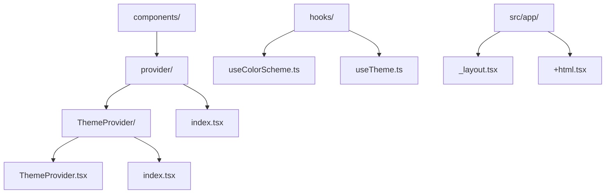
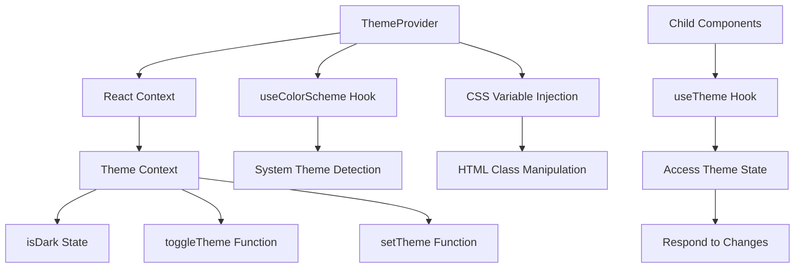
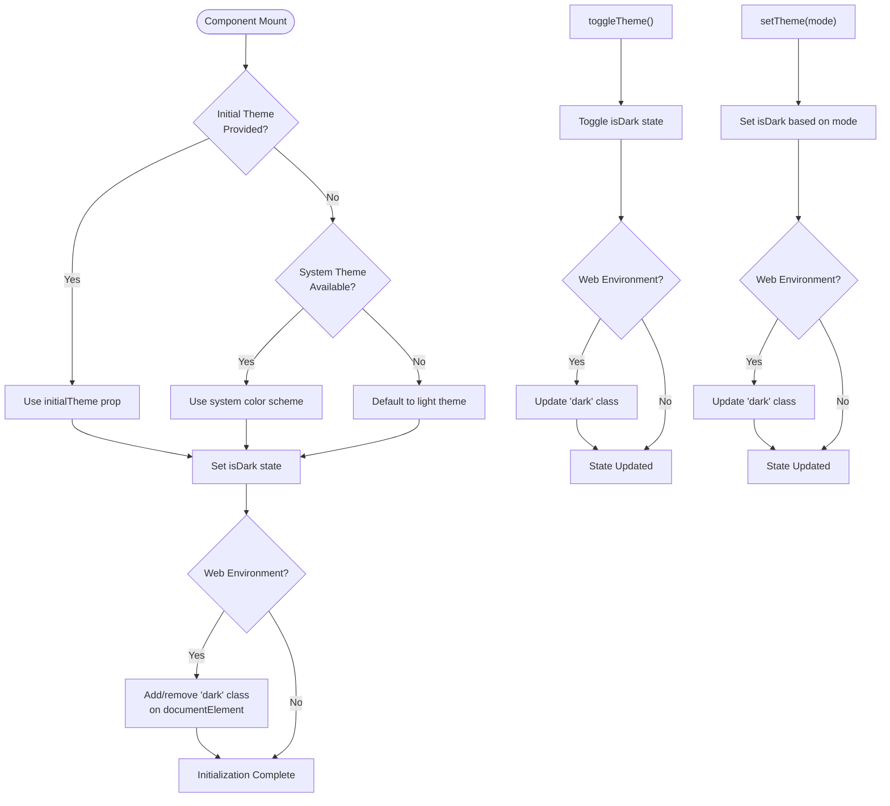
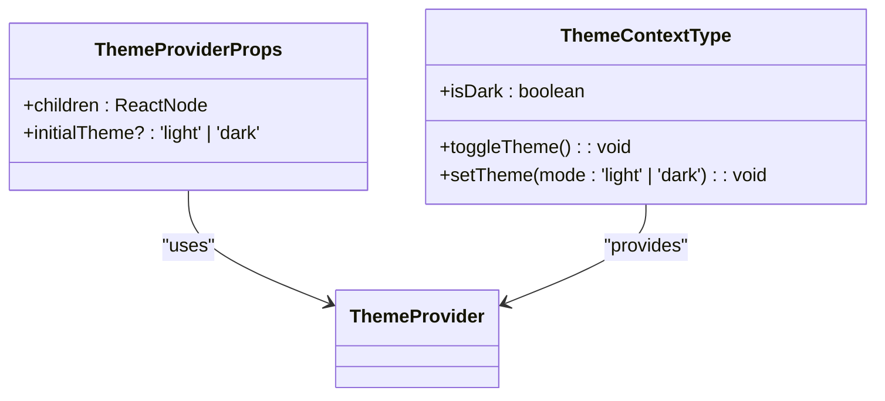
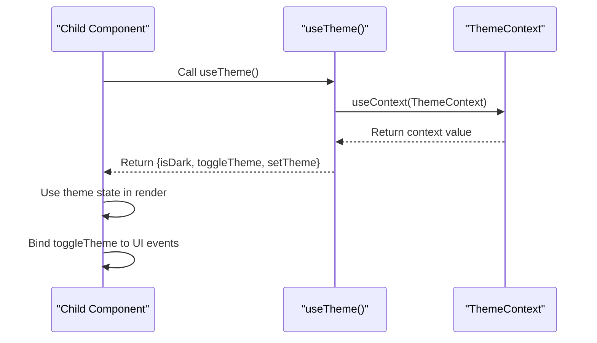
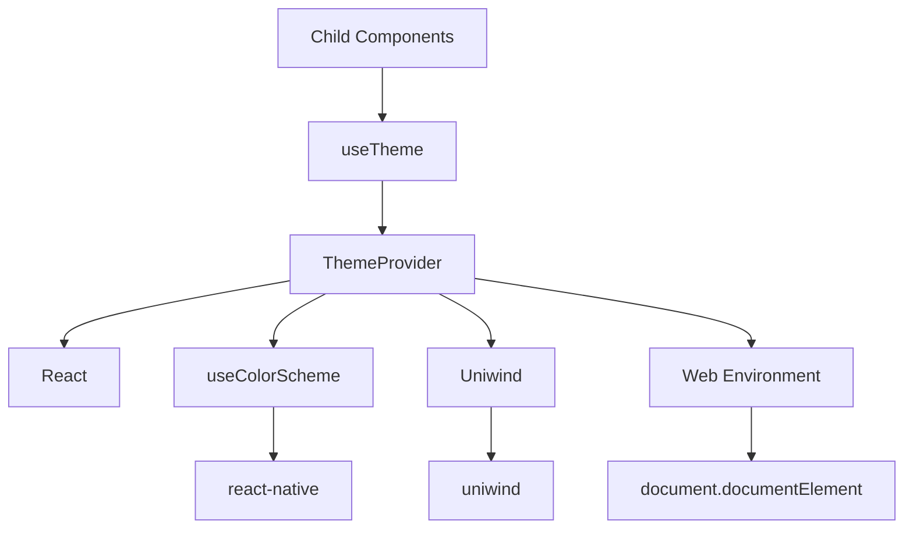

# ThemeProvider

<cite>
**Referenced Files in This Document**   
- [ThemeProvider.tsx](file://components/provider/ThemeProvider/ThemeProvider.tsx)
- [useColorScheme.ts](file://hooks/useColorScheme.ts)
- [useTheme.ts](file://hooks/useTheme.ts)
- [unistyles.ts](file://unistyles.ts)
- [index.tsx](file://components/provider/index.tsx)
- [+html.tsx](file://src/app/+html.tsx)
- [globals.css](file://globals.css)
</cite>

## Table of Contents

1. [Introduction](#introduction)
2. [Project Structure](#project-structure)
3. [Core Components](#core-components)
4. [Architecture Overview](#architecture-overview)
5. [Detailed Component Analysis](#detailed-component-analysis)
6. [Dependency Analysis](#dependency-analysis)
7. [Performance Considerations](#performance-considerations)
8. [Troubleshooting Guide](#troubleshooting-guide)
9. [Conclusion](#conclusion)

## Introduction

The ThemeProvider component in the Plate application serves as a React Context provider for managing dark/light theme state across the entire application. It enables consistent theme management by injecting CSS variables, detecting system theme preferences through the useColorScheme hook, and supporting theme persistence. The provider wraps the application root and makes theme state accessible to all consuming components via React Context. This documentation details its implementation, integration patterns, and best practices for extension and optimization.

## Project Structure

The ThemeProvider is organized within a well-structured component hierarchy that follows modular design principles. It resides in the provider directory alongside other global context providers and is integrated into the application through a centralized Providers wrapper.

**Diagram sources**

- [ThemeProvider.tsx](file://components/provider/ThemeProvider/ThemeProvider.tsx)
- [index.tsx](file://components/provider/index.tsx)
- [useColorScheme.ts](file://hooks/useColorScheme.ts)

**Section sources**

- [ThemeProvider.tsx](file://components/provider/ThemeProvider/ThemeProvider.tsx)
- [index.tsx](file://components/provider/index.tsx)

## Core Components

The ThemeProvider implementation consists of several core components that work together to manage theme state. The primary component is the ThemeProvider itself, which uses React Context to expose theme state and control functions. It integrates with the useColorScheme hook for system theme detection and manipulates CSS classes for web-based theme application. The component also provides a useTheme hook that allows child components to access theme context and respond to theme changes.

**Section sources**

- [ThemeProvider.tsx](file://components/provider/ThemeProvider/ThemeProvider.tsx#L1-L132)
- [useTheme.ts](file://hooks/useTheme.ts#L1-L42)

## Architecture Overview

The ThemeProvider architecture follows a clean separation of concerns, with distinct responsibilities for state management, DOM manipulation, and context provision. It leverages React Context for state distribution while maintaining compatibility with both native and web environments through conditional logic.

**Diagram sources**

- [ThemeProvider.tsx](file://components/provider/ThemeProvider/ThemeProvider.tsx#L16-L114)
- [useColorScheme.ts](file://hooks/useColorScheme.ts#L1-L6)

## Detailed Component Analysis

### ThemeProvider Implementation

The ThemeProvider component implements a comprehensive theme management solution that handles initialization, state updates, and DOM integration. It uses React's useState and useEffect hooks to manage theme state and synchronize it with the DOM when running in a web environment.

**Diagram sources**

- [ThemeProvider.tsx](file://components/provider/ThemeProvider/ThemeProvider.tsx#L30-L114)

**Section sources**

- [ThemeProvider.tsx](file://components/provider/ThemeProvider/ThemeProvider.tsx#L30-L114)

### Theme Context Interface

The ThemeProvider exposes a well-defined context interface that provides both state and control mechanisms for theme management. This interface ensures consistent access patterns across all consuming components.

**Diagram sources**

- [ThemeProvider.tsx](file://components/provider/ThemeProvider/ThemeProvider.tsx#L9-L13)
- [ThemeProvider.tsx](file://components/provider/ThemeProvider/ThemeProvider.tsx#L20-L22)

### Theme Consumption Pattern

Child components consume theme context through the useTheme hook, which provides a consistent interface for accessing theme state and control functions. This pattern enables components to respond dynamically to theme changes.

**Diagram sources**

- [ThemeProvider.tsx](file://components/provider/ThemeProvider/ThemeProvider.tsx#L124-L130)
- [useTheme.ts](file://hooks/useTheme.ts#L19-L41)

## Dependency Analysis

The ThemeProvider has well-defined dependencies that enable its functionality while maintaining separation of concerns. These dependencies include React for core functionality, platform-specific hooks for theme detection, and styling libraries for theme application.

**Diagram sources**

- [ThemeProvider.tsx](file://components/provider/ThemeProvider/ThemeProvider.tsx)
- [useColorScheme.ts](file://hooks/useColorScheme.ts)
- [useTheme.ts](file://hooks/useTheme.ts)

**Section sources**

- [ThemeProvider.tsx](file://components/provider/ThemeProvider/ThemeProvider.tsx)
- [useColorScheme.ts](file://hooks/useColorScheme.ts)
- [useTheme.ts](file://hooks/useTheme.ts)

## Performance Considerations

The ThemeProvider implementation includes several performance optimizations to minimize unnecessary re-renders and ensure smooth theme transitions. The component uses React's context API efficiently by memoizing the context value and only updating when theme state changes.

When theme changes occur, the provider updates the React state and conditionally modifies the DOM class list only in web environments. This approach prevents unnecessary DOM manipulations in native environments while ensuring proper CSS variable application in web contexts.

The use of the useColorScheme hook from react-native provides efficient system theme detection without polling, and the context provider pattern ensures that only components that consume theme state are affected by theme changes.

**Section sources**

- [ThemeProvider.tsx](file://components/provider/ThemeProvider/ThemeProvider.tsx#L35-L59)
- [ThemeProvider.tsx](file://components/provider/ThemeProvider/ThemeProvider.tsx#L61-L77)

## Troubleshooting Guide

Common issues with the ThemeProvider typically relate to hydration mismatches, improper integration, or unexpected theme behavior. The most frequent issue is hydration mismatch between server and client, which occurs when the initial theme does not match between server-side rendering and client-side hydration.

To resolve hydration issues, ensure that the initialTheme prop matches the expected theme state during SSR, or rely on the system theme detection when no initial theme is specified. For web environments, verify that the 'dark' class is properly applied to the html element during hydration.

When integrating with Expo's app lifecycle, ensure that the ThemeProvider is wrapped at the appropriate level in the component hierarchy, typically within the root layout component. Verify that the Providers wrapper in index.tsx correctly composes the ThemeProvider with other necessary providers.

For debugging theme state, use the useTheme hook in development components to log the current isDark state and verify that toggleTheme and setTheme functions are working as expected.

**Section sources**

- [ThemeProvider.tsx](file://components/provider/ThemeProvider/ThemeProvider.tsx#L39-L59)
- [index.tsx](file://components/provider/index.tsx#L8-L16)
- [+html.tsx](file://src/app/+html.tsx#L1-L32)

## Conclusion

The ThemeProvider component provides a robust solution for managing dark/light theme state in the Plate application. By leveraging React Context, system theme detection, and CSS variable injection, it enables consistent theme management across both native and web platforms. The component's architecture supports efficient updates, proper integration with the application lifecycle, and easy consumption by child components. With its well-defined interface and clear dependency structure, the ThemeProvider serves as a reliable foundation for theme management in the application.
