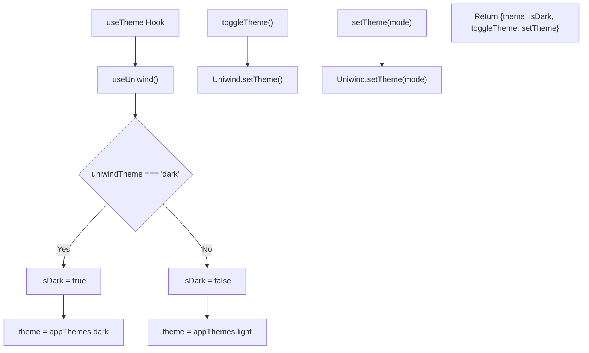
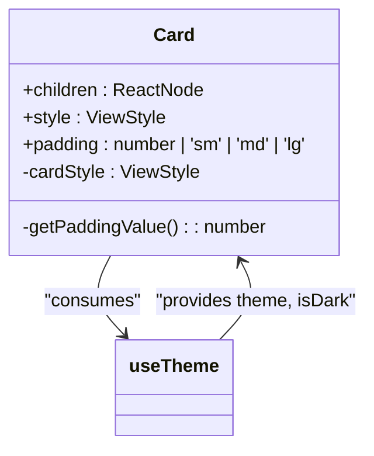
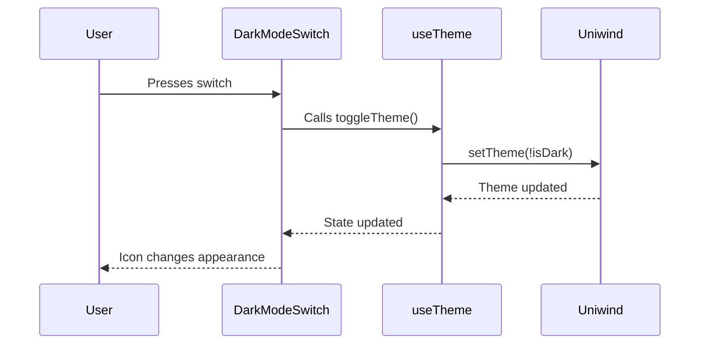
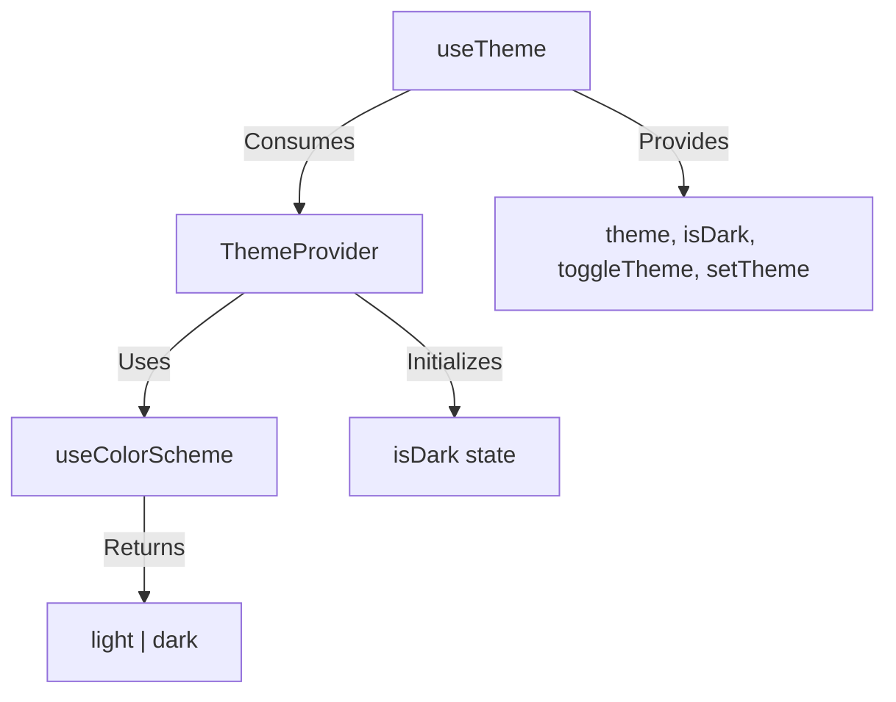

# useTheme Hook

<cite>
**Referenced Files in This Document**   
- [useTheme.ts](file://hooks/useTheme.ts)
- [ThemeProvider.tsx](file://components/provider/ThemeProvider/ThemeProvider.tsx)
- [Card.tsx](file://components/ui/surfaces/Card/Card.tsx)
- [DarkModeSwitch.tsx](file://components/ui/inputs/DarkModeSwitch/DarkModeSwitch.tsx)
- [useColorScheme.ts](file://hooks/useColorScheme.ts)
</cite>

## Table of Contents

1. [Introduction](#introduction)
2. [Implementation Pattern](#implementation-pattern)
3. [Error Handling](#error-handling)
4. [Theme State and Control Functions](#theme-state-and-control-functions)
5. [Component Integration Examples](#component-integration-examples)
6. [Relationship with useColorScheme](#relationship-with-usecolorscheme)
7. [Common Issues and Best Practices](#common-issues-and-best-practices)

## Introduction

The `useTheme` custom hook in the Plate application provides a centralized mechanism for theme management across functional components. It enables components to access the current theme state and control functions for theme manipulation, facilitating consistent UI behavior across light and dark modes. This hook serves as a critical abstraction layer between the application's UI components and the underlying theme management system.

**Section sources**

- [useTheme.ts](file://hooks/useTheme.ts#L1-L41)
- [ThemeProvider.tsx](file://components/provider/ThemeProvider/ThemeProvider.tsx#L1-L131)

## Implementation Pattern

The `useTheme` hook follows a composition pattern by wrapping the `useUniwind` hook from the Uniwind library to retrieve the current theme. It extracts the theme value and determines whether the current mode is dark by comparing the theme value to 'dark'. The hook then returns an object containing the theme state, a boolean indicating dark mode status, and two control functions: `toggleTheme` and `setTheme`.

The implementation leverages Uniwind's theme management capabilities while maintaining compatibility with existing code that expects Unistyles themes. This is achieved by mapping the Uniwind theme to corresponding Unistyles themes based on the current mode.

**Diagram sources**

- [useTheme.ts](file://hooks/useTheme.ts#L18-L40)

**Section sources**

- [useTheme.ts](file://hooks/useTheme.ts#L18-L40)

## Error Handling

The `useTheme` hook includes robust error handling to prevent misuse. When the hook is used outside of a `ThemeProvider` context, it throws a descriptive error message: "useTheme must be used within a ThemeProvider". This error occurs because the hook attempts to access the `ThemeContext` via `useContext`, and if the context is undefined (indicating the component is not wrapped in a provider), the error is triggered.

This error handling mechanism ensures that developers are immediately notified of incorrect usage patterns, preventing runtime issues that could arise from undefined theme values.

**Section sources**

- [ThemeProvider.tsx](file://components/provider/ThemeProvider/ThemeProvider.tsx#L124-L130)

## Theme State and Control Functions

The `useTheme` hook exposes three primary elements to consuming components:

1. **theme**: The current theme object, compatible with Unistyles, providing access to theme-specific values like colors, spacing, and radii.
2. **isDark**: A boolean value indicating whether the current theme is dark mode.
3. **toggleTheme**: A function that switches between light and dark modes.
4. **setTheme**: A function that explicitly sets the theme to either 'light' or 'dark'.

These elements enable components to adapt their appearance based on the current theme state and provide user interfaces for theme manipulation.

**Section sources**

- [useTheme.ts](file://hooks/useTheme.ts#L10-L15)

## Component Integration Examples

Several UI components in the application leverage the `useTheme` hook to achieve theme-aware behavior.

### Card Component

The `Card` component uses the `useTheme` hook to determine its background color, border color, and padding values based on the current theme. The component accesses the theme's color palette and spacing tokens to ensure visual consistency with the overall design system.

**Diagram sources**

- [Card.tsx](file://components/ui/surfaces/Card/Card.tsx#L16-L49)

**Section sources**

- [Card.tsx](file://components/ui/surfaces/Card/Card.tsx#L16-L49)

### DarkModeSwitch Component

The `DarkModeSwitch` component demonstrates a control interface for theme manipulation. It uses the `useTheme` hook to access both the current theme state (`isDark`) and the `toggleTheme` function. The component renders an icon that changes based on the current mode (moon for dark, sunny for light) and triggers theme toggling when pressed.

**Diagram sources**

- [DarkModeSwitch.tsx](file://components/ui/inputs/DarkModeSwitch/DarkModeSwitch.tsx#L9-L29)

**Section sources**

- [DarkModeSwitch.tsx](file://components/ui/inputs/DarkModeSwitch/DarkModeSwitch.tsx#L9-L29)

## Relationship with useColorScheme

The `useTheme` hook works in conjunction with the `useColorScheme` hook to provide comprehensive theme management. While `useTheme` manages the application's theme state and provides control functions, `useColorScheme` serves as a thin wrapper around React Native's `useColorScheme` to safely handle cases where the system color scheme might be null.

The `useColorScheme` hook ensures that a valid color scheme value is always returned, defaulting to 'light' when the system value is unavailable. This reliability is crucial during the initialization phase of the `ThemeProvider`, which uses the system color scheme to determine the initial theme when no explicit initial theme is provided.

**Diagram sources**

- [useColorScheme.ts](file://hooks/useColorScheme.ts#L3-L5)
- [ThemeProvider.tsx](file://components/provider/ThemeProvider/ThemeProvider.tsx#L35-L49)

**Section sources**

- [useColorScheme.ts](file://hooks/useColorScheme.ts#L3-L5)
- [ThemeProvider.tsx](file://components/provider/ThemeProvider/ThemeProvider.tsx#L35-L49)

## Common Issues and Best Practices

### Hook Usage Errors

The most common error occurs when `useTheme` is used outside of a `ThemeProvider` wrapper. This results in the "useTheme must be used within a ThemeProvider" error. To prevent this, ensure that all components using `useTheme` are rendered within the `ThemeProvider` component, typically at the root level of the application.

### Stale Closures

Since the `toggleTheme` and `setTheme` functions depend on the current `isDark` value, there's a potential for stale closures if not properly managed. However, the implementation correctly captures the current state through the closure created by the hook, ensuring that the functions always operate on the most recent theme state.

### Testing Best Practices

When testing components that depend on `useTheme`, mock the hook to control the returned values. This allows testing both light and dark mode scenarios without relying on global state. Create a test utility that wraps components in a `ThemeProvider` with a specified initial theme, enabling consistent and isolated testing.

### Performance Considerations

The `useTheme` hook is optimized for performance as it only re-renders when the theme context value changes. Components that consume the hook will re-render when the theme changes, but this is typically desired behavior for theme-aware UIs. For components that only need theme values for initialization, consider using memoization to prevent unnecessary re-renders.

**Section sources**

- [useTheme.ts](file://hooks/useTheme.ts#L18-L40)
- [ThemeProvider.tsx](file://components/provider/ThemeProvider/ThemeProvider.tsx#L124-L130)
