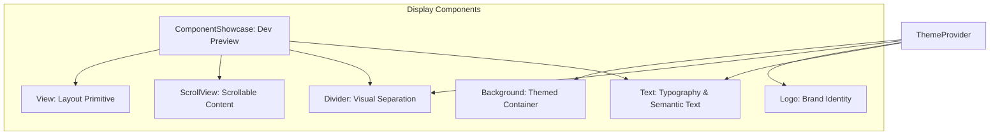
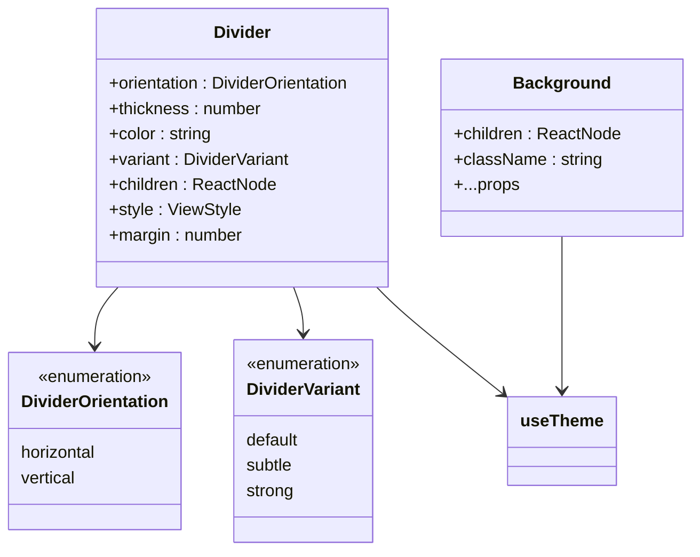
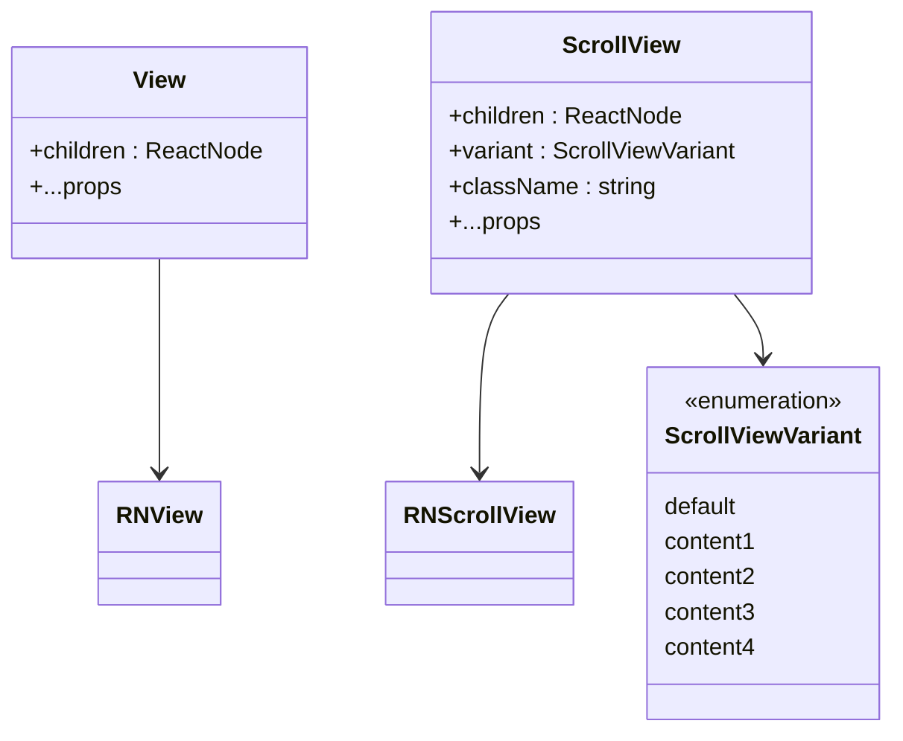
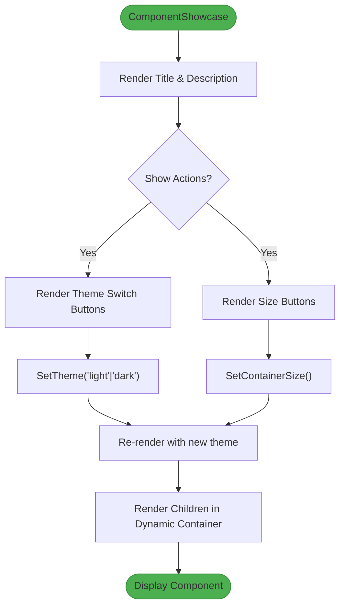

# Display

<cite>
**Referenced Files in This Document**   
- [Text.tsx](file://components/ui/display/Text/Text.tsx)
- [Logo.tsx](file://components/ui/display/Logo/Logo.tsx)
- [Divider.tsx](file://components/ui/display/Divider/Divider.tsx)
- [ScrollView.tsx](file://components/ui/display/ScrollView/ScrollView.tsx)
- [Background.tsx](file://components/ui/display/Background/Background.tsx)
- [View.tsx](file://components/ui/display/View/View.tsx)
- [ComponentShowcase.tsx](file://components/ui/display/ComponentShowcase/ComponentShowcase.tsx)
- [theme.ts](file://constants/theme.ts)
- [useTheme.ts](file://hooks/useTheme.ts)
</cite>

## Table of Contents

1. [Introduction](#introduction)
2. [Core Components](#core-components)
3. [Typography System with Text Component](#typography-system-with-text-component)
4. [Branding with Logo Component](#branding-with-logo-component)
5. [Visual Hierarchy with Divider and Background](#visual-hierarchy-with-divider-and-background)
6. [Layout Composition with View and ScrollView](#layout-composition-with-view-and-scrollview)
7. [Component Showcase for Development and Documentation](#component-showcase-for-development-and-documentation)
8. [Accessibility Features](#accessibility-features)
9. [Conclusion](#conclusion)

## Introduction

The Display category in the Plate application encompasses UI components designed for presenting information and structuring visual layouts. These components—Text, Logo, Divider, ScrollView, Background, View, and ComponentShowcase—serve as foundational building blocks for creating consistent, accessible, and visually coherent user interfaces. They are part of the `ui/display` module, which follows the Material UI (MUI) standard for reusable components, ensuring cross-project compatibility and adherence to design system principles.

**Section sources**

- [README.md](file://README.md#L286-L292)

## Core Components

The Display components provide essential functionality for rendering content and organizing layout structure. Each component is designed with customization, responsiveness, and theme integration in mind. They are built on React Native primitives but enhanced with Tailwind-style utility classes and Uniwind theming for consistent styling across platforms.



**Diagram sources**

- [Text.tsx](file://components/ui/display/Text/Text.tsx#L65-L77)
- [Logo.tsx](file://components/ui/display/Logo/Logo.tsx#L16-L26)
- [Divider.tsx](file://components/ui/display/Divider/Divider.tsx#L31-L104)
- [ScrollView.tsx](file://components/ui/display/ScrollView/ScrollView.tsx#L19-L32)
- [Background.tsx](file://components/ui/display/Background/Background.tsx#L23-L33)
- [View.tsx](file://components/ui/display/View/View.tsx#L7-L9)
- [ComponentShowcase.tsx](file://components/ui/display/ComponentShowcase/ComponentShowcase.tsx#L35-L207)

**Section sources**

- [index.ts](file://components/ui/display/index.ts)

## Typography System with Text Component

The `Text` component serves as the foundation for all typographic elements in the application. It integrates with the theme system to provide consistent font styles, colors, and scaling across different text variants such as headings (h1–h6), body text, captions, and labels. The component supports semantic roles and dynamic type scaling for accessibility.

It leverages `tailwind-variants` (tv) to map high-level props like `variant` and `color` to corresponding CSS classes, ensuring performance and consistency. The default variants are set to `body1` for typography and `foreground` for color, aligning with the application's design system.

The component accepts standard React Native `TextProps` and extends them with custom props for variant selection and color theming, making it flexible for both simple and complex use cases.

```mermaid
classDiagram
class Text {
+variant : TextVariant
+color : TextColor
+className : string
+children : ReactNode
}
class TextVariant {
<<enumeration>>
h1
h2
h3
h4
h5
h6
body1
body2
caption
overline
label
}
class TextColor {
<<enumeration>>
foreground
primary
secondary
success
warning
danger
default
}
Text --> TextVariant
Text --> TextColor
Text --> "tailwind-variants"
```

**Diagram sources**

- [Text.tsx](file://components/ui/display/Text/Text.tsx#L4-L15)
- [Text.tsx](file://components/ui/display/Text/Text.tsx#L17-L24)
- [Text.tsx](file://components/ui/display/Text/Text.tsx#L58-L63)

**Section sources**

- [Text.tsx](file://components/ui/display/Text/Text.tsx#L65-L77)

## Branding with Logo Component

The `Logo` component encapsulates the application's brand identity by rendering the text "플레이트" (Plate) with predefined size and color variants. It is built on top of the `Text` component, inheriting its theming and styling capabilities while providing a simplified API focused on branding use cases.

The component supports three size variants—small (`sm`), medium (`md`), and large (`lg`)—which map to specific typographic styles (h6, h3, h1 respectively) through the `sizeVariants` lookup object. By default, the logo renders in the primary color, reinforcing brand consistency.

This compositional approach ensures that the logo automatically adapts to theme changes (light/dark mode) and maintains visual harmony with the rest of the UI.

```mermaid
classDiagram
class Logo {
+size : LogoSize
+color : TextColor
+...props
}
class LogoSize {
<<enumeration>>
sm
md
lg
}
Logo --> LogoSize
Logo --> Text
Text --> TextVariant
Text --> TextColor
note right of Logo
Composed using Text component
Maps size to variant :
sm → h6, md → h3, lg → h1
end note
```

**Diagram sources**

- [Logo.tsx](file://components/ui/display/Logo/Logo.tsx#L4-L4)
- [Logo.tsx](file://components/ui/display/Logo/Logo.tsx#L6-L8)
- [Logo.tsx](file://components/ui/display/Logo/Logo.tsx#L16-L26)

**Section sources**

- [Logo.tsx](file://components/ui/display/Logo/Logo.tsx#L16-L26)

## Visual Hierarchy with Divider and Background

The `Divider` and `Background` components enhance visual structure and hierarchy within the UI. The `Divider` provides horizontal or vertical separation between content sections, supporting multiple variants (default, subtle, strong) and optional embedded text. It adapts its color based on the current theme (light/dark mode) for optimal contrast.

The `Background` component acts as a themed container that applies the application's background color from the Uniwind theme system. It ensures consistent background styling across different screens and components, serving as a foundational wrapper for page-level layouts.

Both components integrate with the theme system via the `useTheme` hook, allowing dynamic color adjustments based on user preferences or system settings.



**Diagram sources**

- [Divider.tsx](file://components/ui/display/Divider/Divider.tsx#L5-L6)
- [Divider.tsx](file://components/ui/display/Divider/Divider.tsx#L8-L16)
- [Divider.tsx](file://components/ui/display/Divider/Divider.tsx#L31-L104)
- [Background.tsx](file://components/ui/display/Background/Background.tsx#L7-L10)
- [Background.tsx](file://components/ui/display/Background/Background.tsx#L23-L33)

**Section sources**

- [Divider.tsx](file://components/ui/display/Divider/Divider.tsx#L31-L104)
- [Background.tsx](file://components/ui/display/Background/Background.tsx#L23-L33)

## Layout Composition with View and ScrollView

The `View` and `ScrollView` components provide the structural foundation for layout composition. `View` is a primitive container component that wraps React Native's `View`, enabling flexible layout arrangements using utility classes and inline styles.

`ScrollView` extends React Native's `ScrollView` with theme-aware background variants (`default`, `content1`–`content4`), allowing developers to create scrollable content areas with consistent styling. It supports custom class names and standard scroll properties, making it suitable for both simple and complex scrolling interfaces.

These components are frequently used in combination with others (e.g., `Background`, `Text`, `Divider`) to build complete screen layouts, as seen in components like `LoginScreenView`.



**Diagram sources**

- [View.tsx](file://components/ui/display/View/View.tsx#L3-L5)
- [View.tsx](file://components/ui/display/View/View.tsx#L7-L9)
- [ScrollView.tsx](file://components/ui/display/ScrollView/ScrollView.tsx#L6-L11)
- [ScrollView.tsx](file://components/ui/display/ScrollView/ScrollView.tsx#L13-L17)
- [ScrollView.tsx](file://components/ui/display/ScrollView/ScrollView.tsx#L19-L32)

**Section sources**

- [View.tsx](file://components/ui/display/View/View.tsx#L7-L9)
- [ScrollView.tsx](file://components/ui/display/ScrollView/ScrollView.tsx#L19-L32)

## Component Showcase for Development and Documentation

The `ComponentShowcase` component is a development and documentation tool designed to preview UI components in isolation. It provides interactive controls for theme switching (light/dark), container resizing (small, medium, large, full), and alignment options, enabling designers and developers to evaluate component behavior under various conditions.

It renders a titled section with description, actions toolbar, and a dynamic container that wraps the target component. A visual indicator displays the current container width, aiding responsive design evaluation. The component uses `Background`, `ScrollView`, `View`, and `Text` internally, demonstrating composition of display components.

This utility is particularly valuable in Storybook environments, where it facilitates visual regression testing and design system documentation.



**Diagram sources**

- [ComponentShowcase.tsx](file://components/ui/display/ComponentShowcase/ComponentShowcase.tsx#L10-L33)
- [ComponentShowcase.tsx](file://components/ui/display/ComponentShowcase/ComponentShowcase.tsx#L35-L207)

**Section sources**

- [ComponentShowcase.tsx](file://components/ui/display/ComponentShowcase/ComponentShowcase.tsx#L35-L207)

## Accessibility Features

The Display components support key accessibility features including semantic text roles, dynamic type scaling, and proper contrast ratios. The `Text` component respects system font scaling through React Native's text styling system, ensuring readability for users with visual impairments.

Semantic variants (e.g., `h1`–`h6`, `caption`, `label`) provide meaningful structure to screen readers, while color variants use theme-defined palettes that maintain sufficient contrast in both light and dark modes. The `Divider` component with embedded text provides contextual separation that is perceivable to all users.

These components work in conjunction with the `useTheme` hook and Uniwind's theming system to ensure accessible color combinations across different modes and user preferences.

**Section sources**

- [Text.tsx](file://components/ui/display/Text/Text.tsx#L65-L77)
- [useTheme.ts](file://hooks/useTheme.ts#L19-L41)
- [theme.ts](file://constants/theme.ts#L6-L22)

## Conclusion

The Display category components form the visual backbone of the Plate application's user interface. Through thoughtful composition, theme integration, and accessibility support, they enable the creation of consistent, responsive, and branded experiences. From typographic hierarchy with `Text` to layout structuring with `View` and `ScrollView`, each component serves a distinct yet interconnected role in building polished UIs. The `ComponentShowcase` utility further enhances developer experience by providing an interactive environment for component evaluation and documentation.
