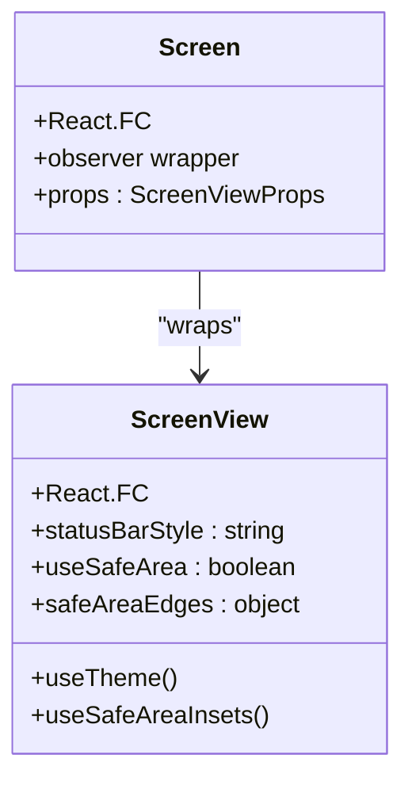
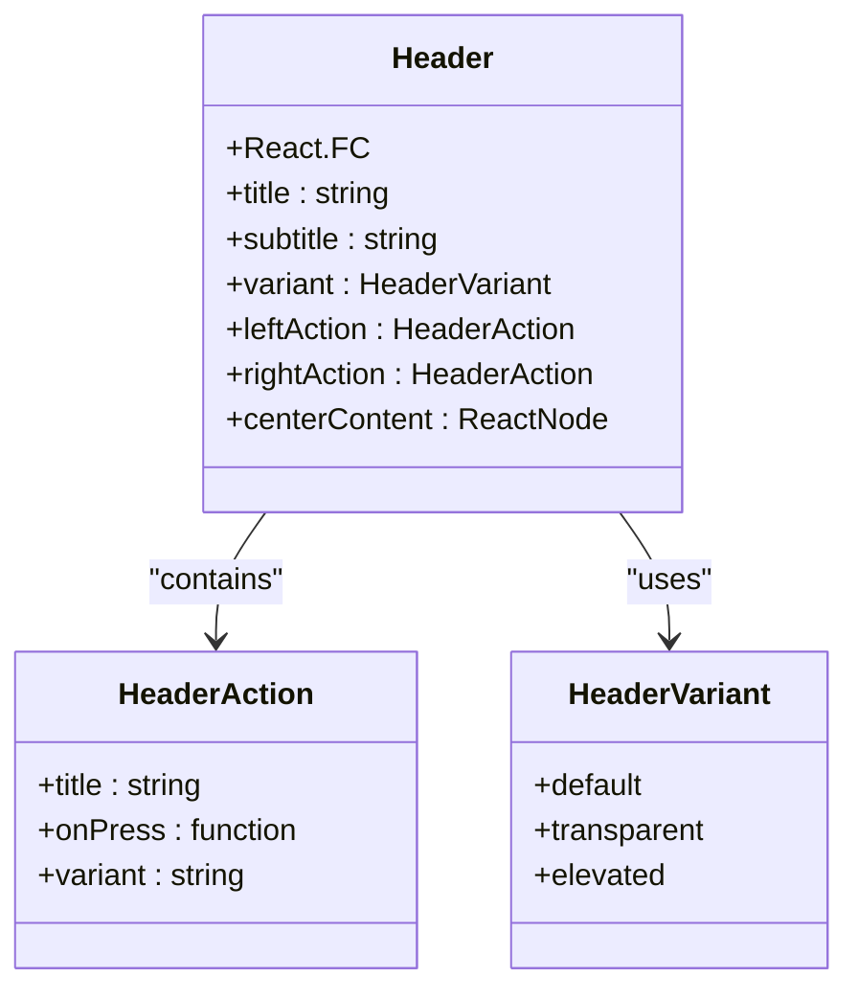
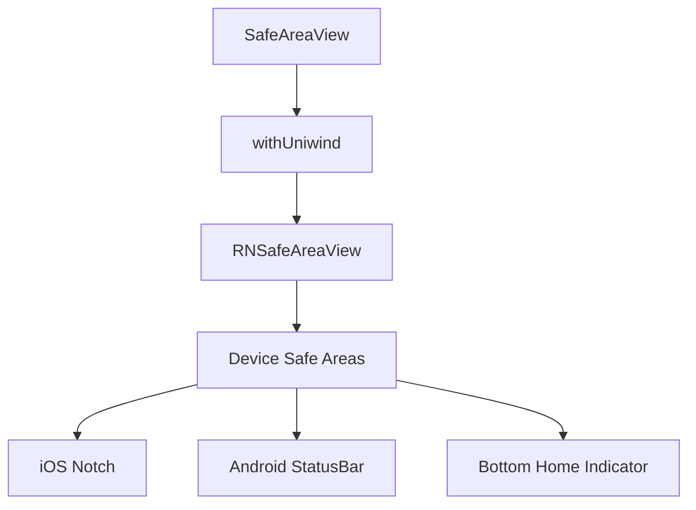
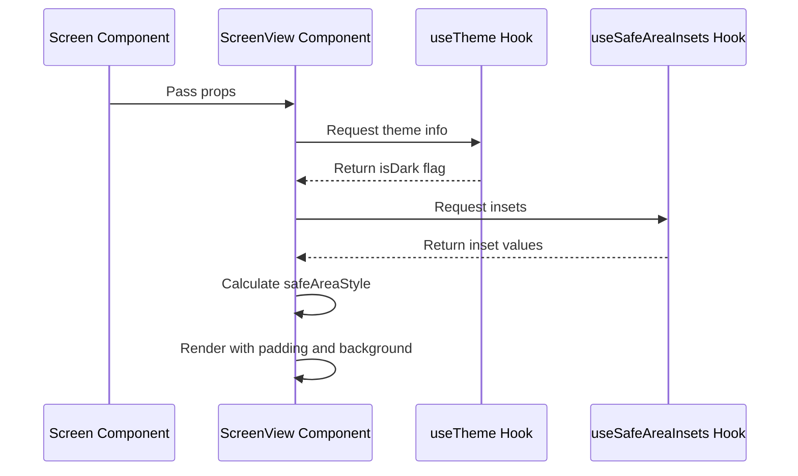
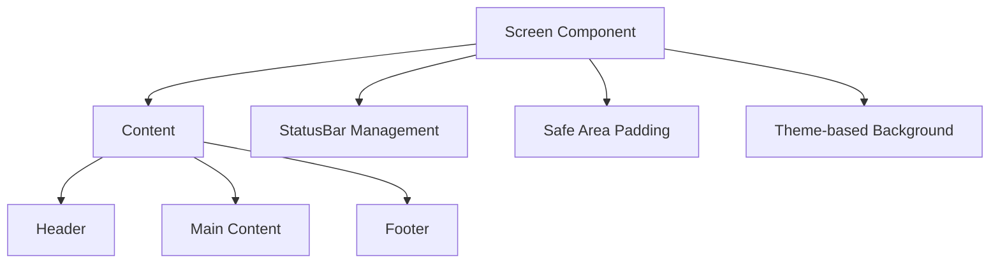
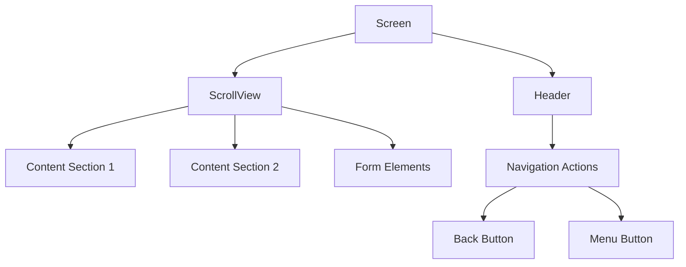
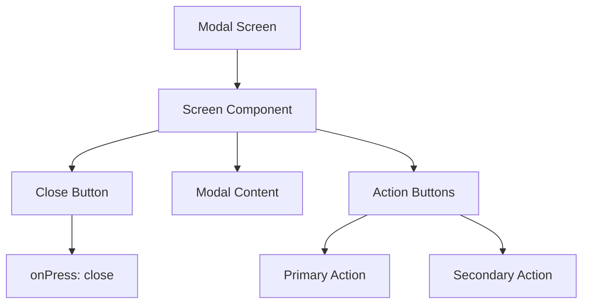
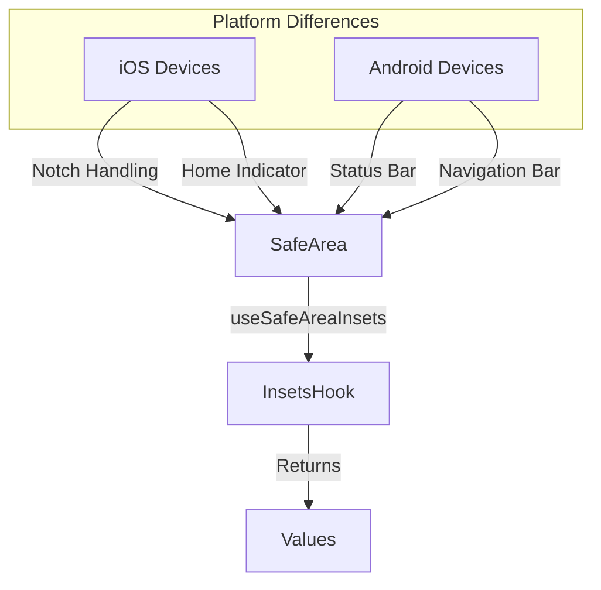
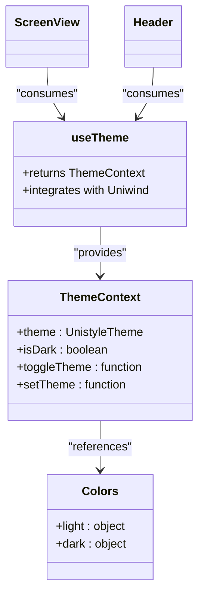
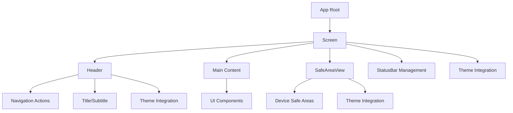

# Layouts

<cite>
**Referenced Files in This Document**   
- [Screen.tsx](file://components/ui/layouts/Screen/Screen.tsx)
- [ScreenView.tsx](file://components/ui/layouts/Screen/ScreenView.tsx)
- [Header.tsx](file://components/ui/layouts/Header/Header.tsx)
- [SafeAreaView.tsx](file://components/ui/layouts/SafeAreaView/SafeAreaView.tsx)
- [useTheme.ts](file://hooks/useTheme.ts)
- [_layout.tsx](file://src/app/_layout.tsx)
- [theme.ts](file://constants/theme.ts)
</cite>

## Table of Contents
1. [Introduction](#introduction)
2. [Core Layout Components](#core-layout-components)
3. [Screen Component](#screen-component)
4. [Header Component](#header-component)
5. [SafeAreaView Component](#safeareaview-component)
6. [ScreenView Pattern](#screenview-pattern)
7. [Usage Examples](#usage-examples)
8. [Platform-Specific Considerations](#platform-specific-considerations)
9. [Theme Integration](#theme-integration)
10. [Component Relationships](#component-relationships)

## Introduction
The Layouts category in the Plate application provides foundational UI components for structuring app views. These components establish consistent visual hierarchy, handle safe area insets across devices, and integrate with navigation systems. The core layout components—Screen, Header, and SafeAreaView—work together to create responsive, platform-adaptive interfaces that maintain visual consistency across different screen sizes and device types.

## Core Layout Components
The Plate application's layout system consists of three primary components that form the structural foundation of all screens:

- **Screen**: A wrapper component that provides consistent padding, background, and status bar management
- **Header**: A navigation and branding component that integrates with Expo Router
- **SafeAreaView**: A utility component that handles device-specific safe area insets

These components work in concert to create a cohesive user experience while allowing for flexible customization through props and theme integration.

**Section sources**
- [Screen.tsx](file://components/ui/layouts/Screen/Screen.tsx)
- [Header.tsx](file://components/ui/layouts/Header/Header.tsx)
- [SafeAreaView.tsx](file://components/ui/layouts/SafeAreaView/SafeAreaView.tsx)

## Screen Component
The Screen component serves as the primary container for all application views, providing a consistent wrapper with built-in padding, background management, and safe area handling. It acts as a MobX observer wrapper around ScreenView, enabling future state integration while maintaining a clean separation of concerns.

The Screen component automatically applies appropriate padding based on device safe areas and manages the status bar appearance according to the current theme. It uses Uniwind's className system for styling with a default "flex-1 bg-background" class that ensures the screen fills the available space with the appropriate background color.

**Diagram sources**
- [Screen.tsx](file://components/ui/layouts/Screen/Screen.tsx#L1-L13)
- [ScreenView.tsx](file://components/ui/layouts/Screen/ScreenView.tsx#L5-L19)

**Section sources**
- [Screen.tsx](file://components/ui/layouts/Screen/Screen.tsx#L1-L13)
- [ScreenView.tsx](file://components/ui/layouts/Screen/ScreenView.tsx#L5-L19)

## Header Component
The Header component provides a flexible navigation and branding interface that integrates seamlessly with Expo Router. It supports multiple variants (default, transparent, elevated) and allows for customizable left and right actions, making it suitable for various navigation patterns.

The Header component automatically adapts to the current theme, using the useTheme hook to access color values and applying appropriate styling based on platform-specific requirements. It handles safe area insets by incorporating the status bar height into its top padding, ensuring content doesn't overlap with system UI elements.

**Diagram sources**
- [Header.tsx](file://components/ui/layouts/Header/Header.tsx#L8-L33)
- [Header.tsx](file://components/ui/layouts/Header/Header.tsx#L35-L115)

**Section sources**
- [Header.tsx](file://components/ui/layouts/Header/Header.tsx#L8-L115)

## SafeAreaView Component
The SafeAreaView component is a wrapper around react-native-safe-area-context's SafeAreaView with Uniwind className support. It ensures that content is properly positioned within the safe area boundaries of different devices, accounting for notches, status bars, and other screen cutouts.

This component is particularly important for maintaining consistent layout across iOS and Android devices with varying screen geometries. By using the withUniwind higher-order component, it integrates seamlessly with the application's styling system while providing the necessary safe area management functionality.

**Diagram sources**
- [SafeAreaView.tsx](file://components/ui/layouts/SafeAreaView/SafeAreaView.tsx#L1-L15)

**Section sources**
- [SafeAreaView.tsx](file://components/ui/layouts/SafeAreaView/SafeAreaView.tsx#L1-L15)

## ScreenView Pattern
The ScreenView component implements a presentation-logic separation pattern, where Screen handles state integration (via MobX observer) while ScreenView manages the visual presentation. This pattern allows for cleaner code organization and easier testing of UI components.

ScreenView accepts several props for customization:
- **statusBarStyle**: Controls the status bar text color (auto, light-content, dark-content)
- **backgroundColor**: Optional custom background color override
- **useSafeArea**: Boolean to enable/disable safe area padding
- **safeAreaEdges**: Object to individually control safe area application on each edge

The component calculates appropriate padding based on the device's safe area insets and applies them conditionally, ensuring content is properly positioned across different device types.

**Diagram sources**
- [ScreenView.tsx](file://components/ui/layouts/Screen/ScreenView.tsx#L21-L56)
- [useTheme.ts](file://hooks/useTheme.ts#L19-L41)

**Section sources**
- [ScreenView.tsx](file://components/ui/layouts/Screen/ScreenView.tsx#L5-L57)

## Usage Examples
### Basic Screen Implementation
The most common usage pattern involves wrapping content with the Screen component, which automatically handles safe areas and theming:

**Diagram sources**
- [Screen.tsx](file://components/ui/layouts/Screen/Screen.tsx#L11-L13)
- [ScreenView.tsx](file://components/ui/layouts/Screen/ScreenView.tsx#L52-L55)

### Nested Layouts
Components can be nested to create complex layouts while maintaining proper safe area handling:

**Diagram sources**
- [Screen.tsx](file://components/ui/layouts/Screen/Screen.tsx)
- [Header.tsx](file://components/ui/layouts/Header/Header.tsx)
- [Screen.stories.tsx](file://components/ui/layouts/Screen/Screen.stories.tsx#L128-L148)

### Modal Screen Integration
Modal screens can be implemented by combining Screen with specific presentation options:

**Section sources**
- [Screen.tsx](file://components/ui/layouts/Screen/Screen.tsx)
- [ScreenView.tsx](file://components/ui/layouts/Screen/ScreenView.tsx)

## Platform-Specific Considerations
### iOS Safe Areas
On iOS devices, the SafeAreaView component accounts for:
- Status bar notch on iPhone X and later
- Bottom home indicator
- Dynamic island on iPhone 14 Pro and later
- Camera cutout areas

The component automatically applies appropriate padding to ensure content doesn't overlap with these system UI elements.

### Android Safe Areas
On Android devices, the layout system handles:
- Status bar height variations
- Navigation bar (soft keys) at bottom
- Edge-to-edge display support
- Different screen aspect ratios

The implementation follows Android's edge-to-edge layout principles, allowing content to extend behind system bars while maintaining readability through appropriate padding.

**Diagram sources**
- [ScreenView.tsx](file://components/ui/layouts/Screen/ScreenView.tsx#L32-L49)
- [unistyle.txt](file://unistyle.txt#L2542-L2579)

**Section sources**
- [ScreenView.tsx](file://components/ui/layouts/Screen/ScreenView.tsx#L32-L49)

## Theme Integration
The layout components integrate with the application's theme system through the useTheme hook, which provides access to current theme values and dark mode status. This enables automatic background color management and appropriate text styling based on the current theme.

The theme system uses Uniwind for styling, with predefined color values in the constants/theme.ts file. Components automatically adapt their appearance based on whether the user has selected light or dark mode, ensuring visual consistency across the application.

**Diagram sources**
- [useTheme.ts](file://hooks/useTheme.ts#L19-L41)
- [theme.ts](file://constants/theme.ts#L6-L23)
- [ScreenView.tsx](file://components/ui/layouts/Screen/ScreenView.tsx#L31-L32)

**Section sources**
- [useTheme.ts](file://hooks/useTheme.ts#L19-L41)
- [theme.ts](file://constants/theme.ts#L6-L23)

## Component Relationships
The layout components form a hierarchical relationship where each component serves a specific purpose in the overall structure:

This architecture ensures that layout responsibilities are properly distributed, with Screen handling overall container responsibilities, Header managing navigation, and SafeAreaView addressing device-specific layout requirements. All components share theme integration through the useTheme hook, maintaining visual consistency across the application.

**Diagram sources**
- [Screen.tsx](file://components/ui/layouts/Screen/Screen.tsx)
- [Header.tsx](file://components/ui/layouts/Header/Header.tsx)
- [SafeAreaView.tsx](file://components/ui/layouts/SafeAreaView/SafeAreaView.tsx)
- [_layout.tsx](file://src/app/_layout.tsx#L1-L44)

**Section sources**
- [Screen.tsx](file://components/ui/layouts/Screen/Screen.tsx)
- [Header.tsx](file://components/ui/layouts/Header/Header.tsx)
- [SafeAreaView.tsx](file://components/ui/layouts/SafeAreaView/SafeAreaView.tsx)