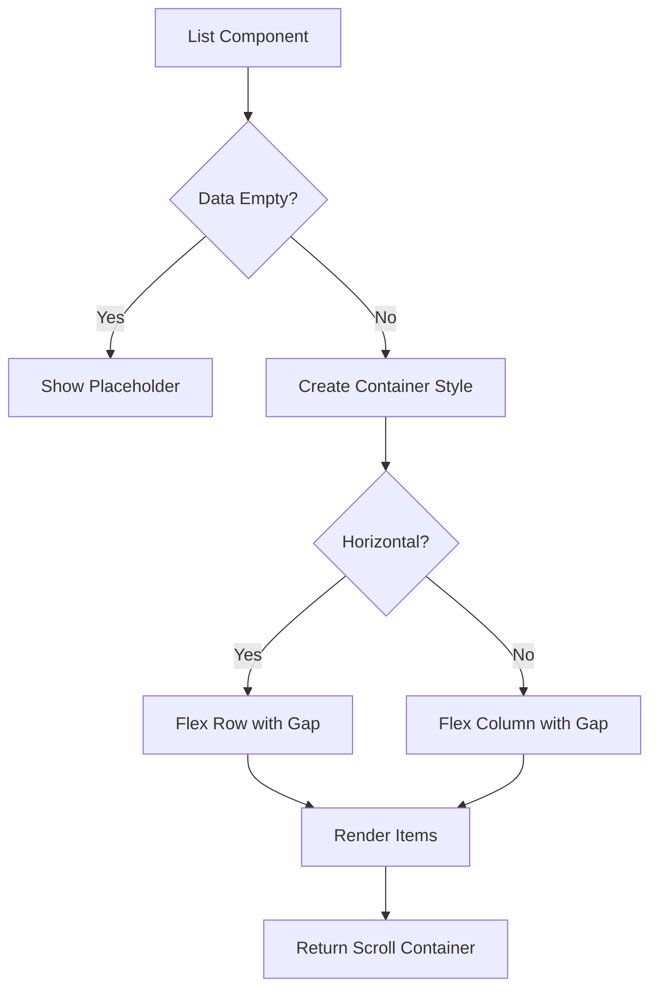
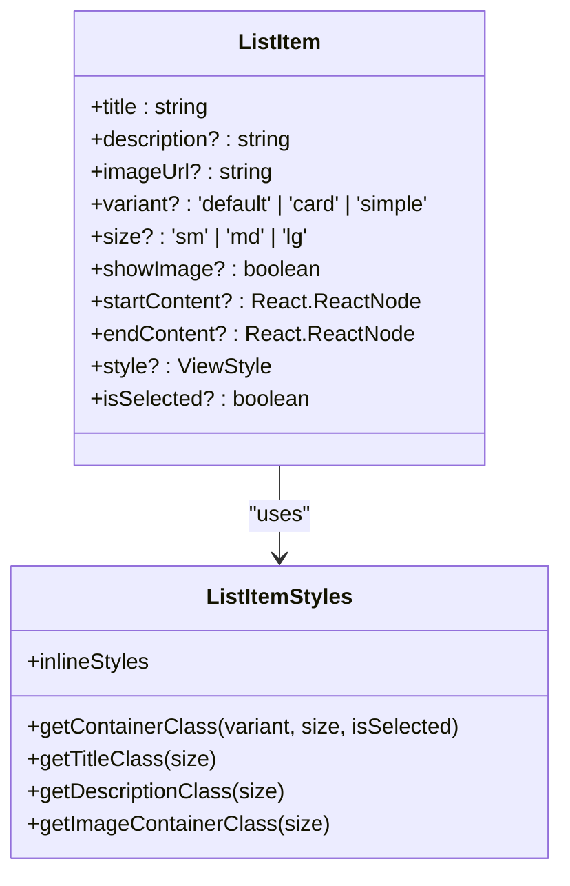

# Surfaces

<cite>
**Referenced Files in This Document**   
- [Card.tsx](file://components/ui/surfaces/Card/Card.tsx)
- [Card.stories.tsx](file://components/ui/surfaces/Card/Card.stories.tsx)
- [List.tsx](file://components/ui/surfaces/List/List.tsx)
- [List.web.tsx](file://components/ui/surfaces/List/List.web.tsx)
- [List.stories.tsx](file://components/ui/surfaces/List/List.stories.tsx)
- [ListItem.tsx](file://components/ui/surfaces/ListItem/ListItem.tsx)
- [ListItem.styles.ts](file://components/ui/surfaces/ListItem/ListItem.styles.ts)
- [ListItem.stories.tsx](file://components/ui/surfaces/ListItem/ListItem.stories.tsx)
- [unistyles.ts](file://unistyles.ts)
- [useTheme.ts](file://hooks/useTheme.ts)
</cite>

## Table of Contents

1. [Card](#card)
2. [List](#list)
3. [ListItem](#listitem)
4. [Composition and Integration](#composition-and-integration)
5. [Accessibility Considerations](#accessibility-considerations)

## Card

The Card component provides a visual container with elevation and rounded corners for grouping related content. It uses Tailwind classes through Uniwind for styling and supports configurable padding options.

The Card's background color is set to `content1.DEFAULT` from the theme, with a border using `content3.DEFAULT`. The component automatically applies `theme.radius.md` for rounded corners and uses the theme's spacing tokens to determine padding values. The `padding` prop accepts 'sm', 'md', or 'lg' values, which map to theme spacing values of 8, 16, and 24 pixels respectively.

**Section sources**

- [Card.tsx](file://components/ui/surfaces/Card/Card.tsx#L1-L50)
- [unistyles.ts](file://unistyles.ts#L112-L115)
- [useTheme.ts](file://hooks/useTheme.ts#L18-L40)

## List

The List component manages item spacing and scrolling for collections of content. It renders items using a ScrollView on native platforms and div elements on web, with configurable gap spacing between items.

On native platforms, the List uses React Native's ScrollView with `contentContainerStyle` to manage item layout and spacing. The web implementation uses CSS Flexbox with gap properties. The component supports both horizontal and vertical layouts through the `horizontal` prop. When the data array is empty, it can display a placeholder element.

The web-specific implementation in List.web.tsx includes additional CSS properties to control scrollbar visibility based on the `showsHorizontalScrollIndicator` and `showsVerticalScrollIndicator` props, using `msOverflowStyle` and `scrollbarWidth` for cross-browser compatibility.

**Diagram sources**

- [List.tsx](file://components/ui/surfaces/List/List.tsx#L16-L56)
- [List.web.tsx](file://components/ui/surfaces/List/List.web.tsx#L15-L66)

**Section sources**

- [List.tsx](file://components/ui/surfaces/List/List.tsx#L1-L58)
- [List.web.tsx](file://components/ui/surfaces/List/List.web.tsx#L1-L67)

## ListItem

The ListItem component handles selection states and leading/trailing elements for list entries. It supports three variants (default, card, simple) and three sizes (sm, md, lg), with configurable start and end content.

The component uses Uniwind helper functions to generate Tailwind class strings for styling. The `getContainerClass` function determines the visual appearance based on variant, size, and selection state. Selected items receive a 2px primary color border and subtle shadow effect. The component supports image display with configurable size based on the item size.

The `startContent` and `endContent` props allow for custom leading and trailing elements such as icons or badges. The text content is automatically truncated with ellipsis when it exceeds the available space, with title text limited to one line and description text limited to one or two lines depending on size.

**Diagram sources**

- [ListItem.tsx](file://components/ui/surfaces/ListItem/ListItem.tsx#L13-L24)
- [ListItem.styles.ts](file://components/ui/surfaces/ListItem/ListItem.styles.ts#L34-L91)

**Section sources**

- [ListItem.tsx](file://components/ui/surfaces/ListItem/ListItem.tsx#L1-L101)
- [ListItem.styles.ts](file://components/ui/surfaces/ListItem/ListItem.styles.ts#L1-L133)

## Composition and Integration

Cards and Lists can be composed together to create complex UI layouts. Lists can contain Card components as items, creating card-based list layouts. The components integrate with navigation through touch feedback mechanisms.

The ListItem component uses Pressable on native platforms and button elements on web to provide touch feedback and handle selection. The selection state is managed through the `isSelected` prop, which affects both visual styling and accessibility attributes.

For navigation integration, ListItems can be wrapped in Touchable components or use navigation hooks to handle route changes. The consistent spacing and alignment provided by these components ensure a cohesive user experience across different screen sizes and orientations.

**Section sources**

- [List.tsx](file://components/ui/surfaces/List/List.tsx#L16-L56)
- [ListItem.tsx](file://components/ui/surfaces/ListItem/ListItem.tsx#L27-L99)
- [Card.tsx](file://components/ui/surfaces/Card/Card.tsx#L17-L49)

## Accessibility Considerations

The surface components include accessibility features for screen readers and keyboard navigation. The web implementations use semantic HTML elements and ARIA attributes to ensure proper accessibility.

On web platforms, the List component uses div elements for containers and button elements for interactive ListItems, providing proper keyboard navigation and screen reader support. The button elements include appropriate cursor styles and disabled states for accessibility.

The components follow platform-specific accessibility guidelines, with native implementations using React Native's accessibility props and web implementations using proper HTML semantics. Focus management and keyboard navigation are handled appropriately for each platform.

**Section sources**

- [List.web.tsx](file://components/ui/surfaces/List/List.web.tsx#L15-L66)
- [ListItem.tsx](file://components/ui/surfaces/ListItem/ListItem.tsx#L27-L99)
- [unistyle.txt](file://unistyle.txt#L932-L991)
