# UI Components

<cite>
**Referenced Files in This Document**   
- [Button.tsx](file://components/ui/inputs/Button/Button.tsx)
- [TextField.tsx](file://components/ui/inputs/TextField/TextField.tsx)
- [Card.tsx](file://components/ui/surfaces/Card/Card.tsx)
- [Screen.tsx](file://components/ui/layouts/Screen/Screen.tsx)
- [ScreenView.tsx](file://components/ui/layouts/Screen/ScreenView.tsx)
- [Text.tsx](file://components/ui/display/Text/Text.tsx)
- [Button.stories.tsx](file://components/ui/inputs/Button/Button.stories.tsx)
- [TextField.stories.tsx](file://components/ui/inputs/TextField/TextField.stories.tsx)
- [Card.stories.tsx](file://components/ui/surfaces/Card/Card.stories.tsx)
- [Screen.stories.tsx](file://components/ui/layouts/Screen/Screen.stories.tsx)
- [Text.stories.tsx](file://components/ui/display/Text/Text.stories.tsx)
- [unistyles.ts](file://unistyles.ts)
- [theme.ts](file://constants/theme.ts)
- [README.md](file://README.md)
</cite>

## Table of Contents
1. [Component Categorization](#component-categorization)
2. [Implementation Details](#implementation-details)
3. [Practical Examples](#practical-examples)
4. [Accessibility and Responsive Design](#accessibility-and-responsive-design)
5. [Theming Support](#theming-support)
6. [Component Composition and Best Practices](#component-composition-and-best-practices)

## Component Categorization

The Plate application follows the Material UI (MUI) standard classification system for organizing UI components into four main categories: inputs, display, surfaces, and layouts. This structured approach ensures consistency, reusability, and clear responsibility separation across the codebase.

The categorization system is designed to provide a logical grouping of components based on their primary function within the user interface. Input components handle user interactions, display components present information, surface components provide containers for content, and layout components manage the overall page structure.

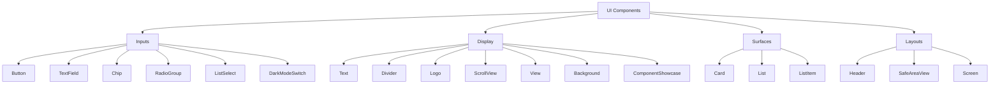

**Diagram sources**
- [README.md](file://README.md#L270-L352)

**Section sources**
- [README.md](file://README.md#L270-L352)

## Implementation Details

### Button Component

The Button component is implemented as a stateless wrapper around the heroui-native Button component, extending its functionality with additional convenience props. It supports the compound component pattern through the Button.Label subcomponent, allowing for flexible composition.

Key implementation features include:
- Automatic wrapping of string children with Button.Label
- Support for startIcon and endIcon props for convenient icon placement
- ForwardRef usage for DOM access
- Full compatibility with heroui-native Button variants and sizes

The component follows the stateless component pattern, focusing purely on presentation without managing internal state.

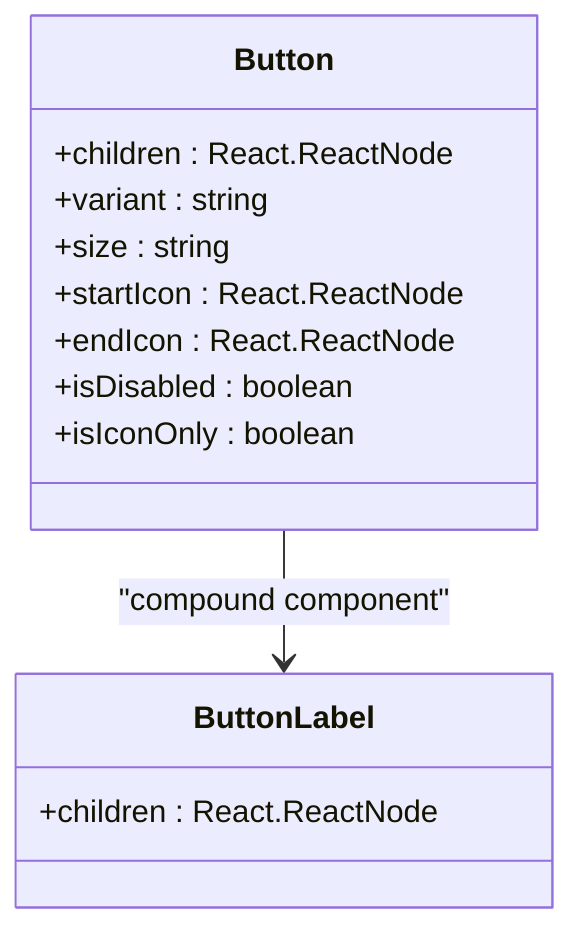

**Diagram sources**
- [Button.tsx](file://components/ui/inputs/Button/Button.tsx#L7-L12)
- [Button.tsx](file://components/ui/inputs/Button/Button.tsx#L48-L87)

### TextField Component

The TextField component implements a stateful pattern with a clear separation between UI presentation and state management. The implementation consists of two parts: TextField.tsx (pure UI) and index.ts (MobX integration).

Key implementation features include:
- Support for variant ('default' | 'outlined') and size ('sm' | 'md' | 'lg') props
- Subcomponents for structured composition: Label, Input, InputStartContent, InputEndContent, Description, ErrorMessage
- Flexible content ordering with guaranteed sequence: Label → Input → Description → ErrorMessage
- Support for both prop-based and child-based configuration

The component uses the compound component pattern to provide a structured API while maintaining flexibility in composition.

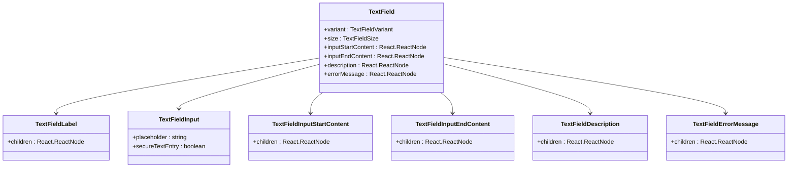

**Diagram sources**
- [TextField.tsx](file://components/ui/inputs/TextField/TextField.tsx#L15-L37)
- [TextField.tsx](file://components/ui/inputs/TextField/TextField.tsx#L76-L141)

### Card Component

The Card component serves as a surface component providing a container with consistent styling and spacing. It implements responsive padding options and follows the design token system for consistent visual hierarchy.

Key implementation features include:
- Configurable padding options: 'sm' (8px), 'md' (16px), 'lg' (24px)
- Background color from theme.colors.content1.DEFAULT
- Border with color from theme.colors.content3.DEFAULT
- Rounded corners with theme.radius.md
- Support for custom styles via the style prop

The component uses the useTheme hook to access the current theme and applies styling based on design tokens.

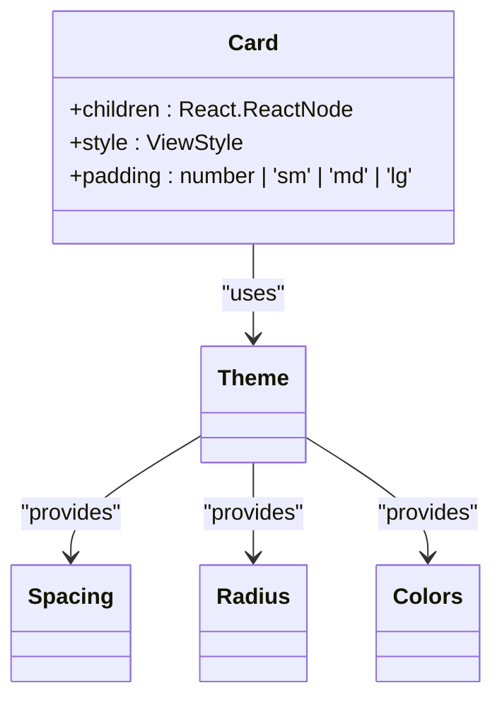

**Diagram sources**
- [Card.tsx](file://components/ui/surfaces/Card/Card.tsx#L5-L9)
- [Card.tsx](file://components/ui/surfaces/Card/Card.tsx#L17-L49)

### Screen Component

The Screen component serves as a layout component that wraps the entire screen content, handling safe area insets and status bar styling. It follows a pattern where Screen.tsx provides the MobX-integrated version while ScreenView.tsx contains the pure UI implementation.

Key implementation features include:
- Automatic safe area handling with configurable edges
- Dynamic status bar style based on theme (auto mode)
- Support for custom background color
- Full-screen layout with flex-1 styling
- Integration with react-native-safe-area-context

The component uses the useSafeAreaInsets hook to determine safe area values and the useTheme hook for theme-based styling decisions.

```mermaid
classDiagram
class Screen {
+children : React.ReactNode
+statusBarStyle : 'light-content' | 'dark-content' | 'auto'
+backgroundColor : string
+style : ViewStyle
+useSafeArea : boolean
+safeAreaEdges : { top? : boolean, bottom? : boolean, left? : boolean, right? : boolean }
}
class ScreenView {
+children : React.ReactNode
+statusBarStyle : 'light-content' | 'dark-content' | 'auto'
+backgroundColor : string
+style : ViewStyle
+useSafeArea : boolean
+safeAreaEdges : { top? : boolean, bottom? : boolean, left? : boolean, right? : boolean }
}
Screen --> ScreenView : "wraps"
ScreenView --> useSafeAreaInsets : "uses"
ScreenView --> useTheme : "uses"
```

**Diagram sources**
- [Screen.tsx](file://components/ui/layouts/Screen/Screen.tsx#L4-L4)
- [ScreenView.tsx](file://components/ui/layouts/Screen/ScreenView.tsx#L5-L19)
- [Screen.tsx](file://components/ui/layouts/Screen/Screen.tsx#L11-L12)
- [ScreenView.tsx](file://components/ui/layouts/Screen/ScreenView.tsx#L21-L56)

## Practical Examples

### Button Usage

The Button component can be used in various contexts with different variants, sizes, and icon configurations. The following examples demonstrate common usage patterns:

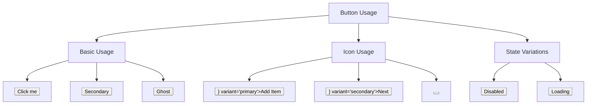

**Diagram sources**
- [Button.stories.tsx](file://components/ui/inputs/Button/Button.stories.tsx#L29-L74)
- [Button.stories.tsx](file://components/ui/inputs/Button/Button.stories.tsx#L141-L196)

### TextField Usage

The TextField component supports multiple usage patterns, from simple prop-based configuration to full manual composition with subcomponents. The following examples demonstrate various scenarios:

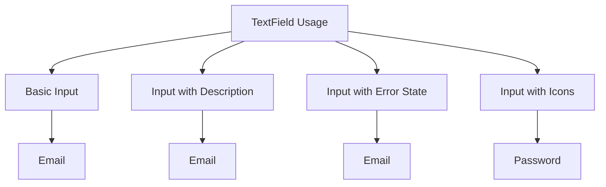

**Diagram sources**
- [TextField.stories.tsx](file://components/ui/inputs/TextField/TextField.stories.tsx#L28-L82)

### Card Usage

The Card component provides a consistent container for content with configurable padding. The following examples demonstrate different padding options and content configurations:

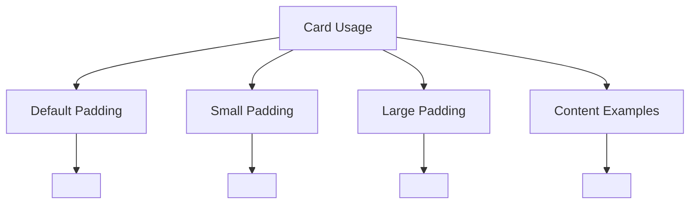

**Diagram sources**
- [Card.stories.tsx](file://components/ui/surfaces/Card/Card.stories.tsx#L38-L102)

### Screen Usage

The Screen component serves as the root container for pages, handling layout and system UI elements. The following examples demonstrate various configuration options:

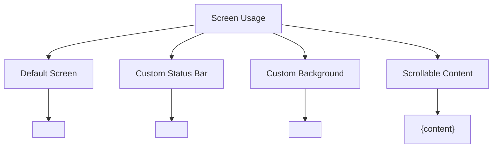

**Diagram sources**
- [Screen.stories.tsx](file://components/ui/layouts/Screen/Screen.stories.tsx#L52-L148)

## Accessibility and Responsive Design

### Accessibility Considerations

The UI components library prioritizes accessibility through several key practices:

1. **Semantic Structure**: Components use appropriate semantic elements and ARIA attributes where applicable
2. **Keyboard Navigation**: Interactive components support keyboard navigation and focus management
3. **Screen Reader Support**: Components provide proper labels and roles for screen readers
4. **Color Contrast**: The theme system ensures sufficient color contrast between text and background
5. **Content Size Category**: The application respects system content size settings for users with visual impairments

The Text component, for example, implements proper text scaling based on system preferences, ensuring readability across different device settings.

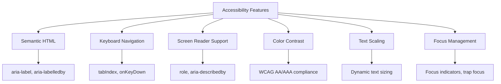

**Diagram sources**
- [unistyles.txt](file://unistyle.txt#L2226-L2265)
- [Text.tsx](file://components/ui/display/Text/Text.tsx#L5-L16)

### Responsive Design Patterns

The components library implements responsive design through a combination of flexible layouts, adaptive styling, and platform-specific considerations:

1. **Flexible Layouts**: Components use flexbox and responsive units to adapt to different screen sizes
2. **Breakpoint System**: The theme system includes responsive breakpoints for different device sizes
3. **Platform Adaptations**: Components adjust their appearance and behavior based on the platform (iOS, Android, web)
4. **Orientation Support**: Layouts respond appropriately to device orientation changes
5. **Density Independence**: Measurements use density-independent pixels (dp) for consistent appearance across devices

The Screen component, for instance, automatically handles safe areas on different devices, ensuring content is properly positioned regardless of notch or home indicator presence.

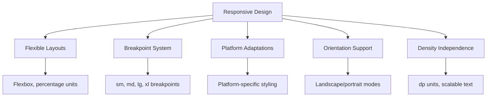

**Diagram sources**
- [ScreenView.tsx](file://components/ui/layouts/Screen/ScreenView.tsx#L31-L49)
- [unistyles.txt](file://unistyle.txt#L2291-L2331)

## Theming Support

### Theme Architecture

The theming system in the Plate application is built on Unistyles 3.0, providing a comprehensive solution for managing visual styles across platforms. The theme architecture consists of several key components:

1. **Design Tokens**: Centralized values for colors, spacing, typography, and other visual properties
2. **Theme Objects**: Complete theme definitions for light and dark modes
3. **Runtime Access**: Dynamic access to theme values and device dimensions
4. **CSS Variables**: Automatic generation of CSS variables for web compatibility

The theme system follows a token-based approach, ensuring consistency and making it easy to update visual styles across the entire application.

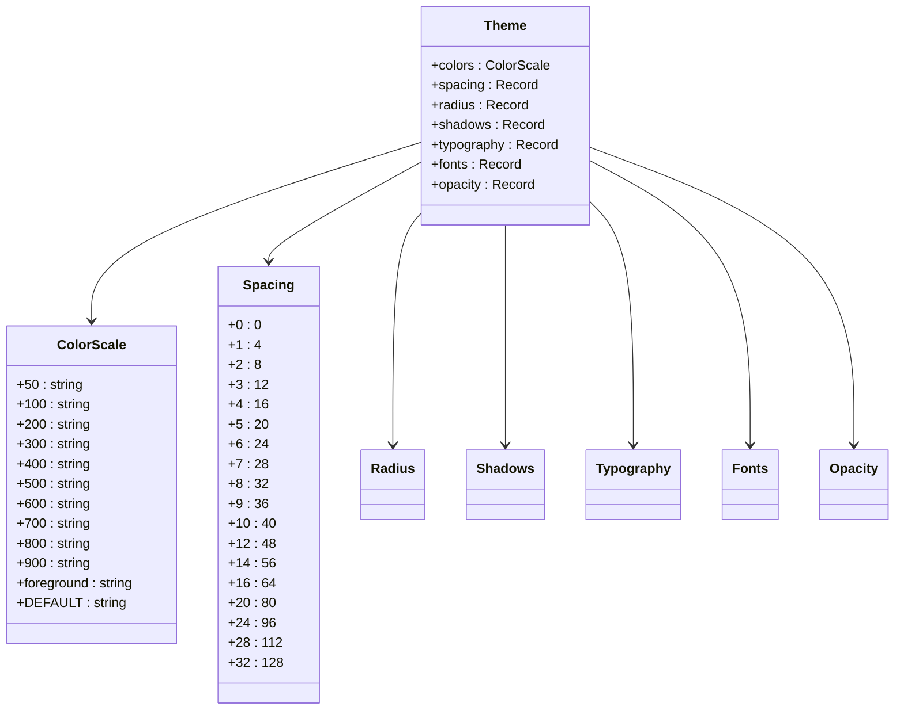

**Diagram sources**
- [unistyles.ts](file://unistyles.ts#L5-L444)

### Dark Mode Implementation

The application supports both light and dark themes with a sophisticated implementation that ensures visual consistency across all components. The dark mode system includes:

1. **Automatic Detection**: The application detects the system's preferred color scheme using the useColorScheme hook
2. **Theme Switching**: Users can manually switch between light and dark themes
3. **Consistent Color Palette**: Each theme has a complete color palette with semantic names (primary, secondary, success, warning, danger)
4. **Adaptive Components**: Components automatically adjust their appearance based on the current theme

The theme system uses React Native's color scheme detection and provides a seamless transition between themes without requiring a restart.

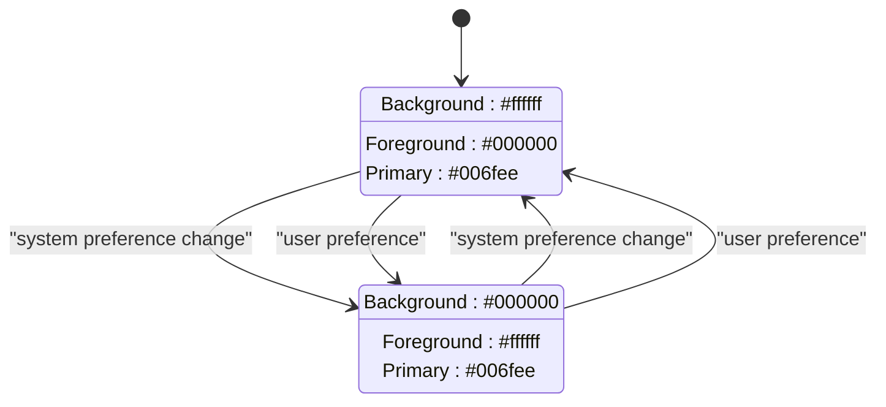

**Diagram sources**
- [unistyles.ts](file://unistyles.ts#L25-L239)
- [theme.ts](file://constants/theme.ts#L6-L23)

## Component Composition and Best Practices

### Composition Patterns

The UI components library follows several composition patterns to ensure flexibility and reusability:

1. **Compound Components**: Components like Button and TextField use the compound component pattern, allowing for structured composition with subcomponents
2. **Stateless vs Stateful**: Clear separation between stateless presentation components and stateful container components
3. **Prop Collection**: Components accept props that are then distributed to subcomponents
4. **Children Manipulation**: Components can manipulate their children to inject props or modify structure

The Button component, for example, demonstrates the compound component pattern by exposing Button.Label as a subcomponent, allowing for flexible text styling within the button.

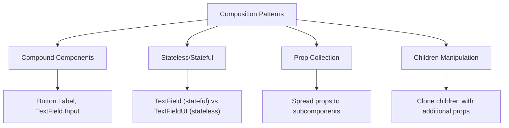

**Diagram sources**
- [Button.tsx](file://components/ui/inputs/Button/Button.tsx#L85-L87)
- [TextField.tsx](file://components/ui/inputs/TextField/TextField.tsx#L149-L156)

### Best Practices for Customization

When customizing components in the Plate application, follow these best practices:

1. **Use Theme Tokens**: Always use design tokens from the theme system rather than hardcoded values
2. **Extend Rather Than Modify**: Create new variants or extend existing components instead of modifying core components
3. **Maintain Accessibility**: Ensure customizations do not compromise accessibility features
4. **Test Across Themes**: Verify that customizations work correctly in both light and dark themes
5. **Document Customizations**: Add documentation for any custom components or variants

For example, when creating a custom button variant, extend the existing Button component using the theme tokens for colors and spacing rather than defining new values.

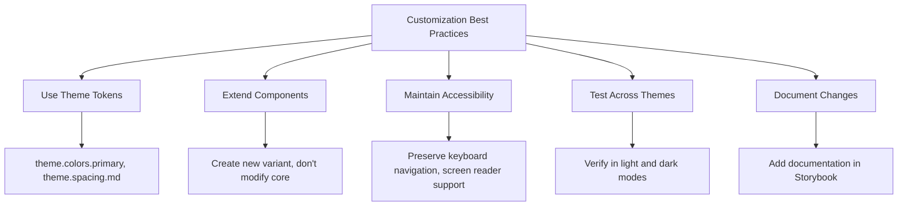

**Section sources**
- [README.md](file://README.md#L490-L557)
- [unistyles.ts](file://unistyles.ts#L245-L444)