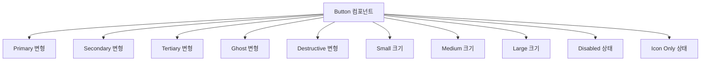
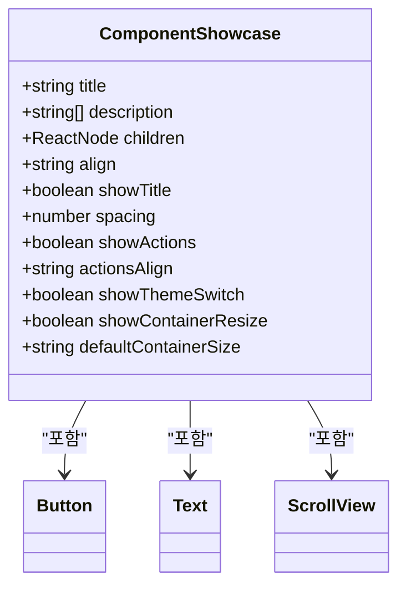

# 개발 도구

<cite>
**이 문서에서 참조된 파일**   
- [package.json](file://package.json)
- [README.md](file://README.md)
- [metro.config.js](file://metro.config.js)
- [src/app/_layout.tsx](file://src/app/_layout.tsx)
- [components/ui/display/ComponentShowcase/ComponentShowcase.tsx](file://components/ui/display/ComponentShowcase/ComponentShowcase.tsx)
- [components/ui/display/ComponentShowcase/ComponentShowcase.stories.tsx](file://components/ui/display/ComponentShowcase/ComponentShowcase.stories.tsx)
- [components/ui/inputs/Button/Button.stories.tsx](file://components/ui/inputs/Button/Button.stories.tsx)
- [components/ui/display/Text/Text.stories.tsx](file://components/ui/display/Text/Text.stories.tsx)
- [components/form/LoginForm/LoginForm.stories.tsx](file://components/form/LoginForm/LoginForm.stories.tsx)
- [components/screen/LoginScreen/LoginScreen.stories.tsx](file://components/screen/LoginScreen/LoginScreen.stories.tsx)
- [components/features/SNSButtons/SNSButtons.stories.tsx](file://components/features/SNSButtons/SNSButtons.stories.tsx)
- [components/ui/inputs/TextField/TextField.stories.tsx](file://components/ui/inputs/TextField/TextField.stories.tsx)
</cite>

## 목차

1. [Storybook 통합](#storybook-통합)
2. [컴포넌트 개발 워크플로우](#컴포넌트-개발-워크플로우)
3. [웹 및 네이티브 Storybook 환경](#웹-및-네이티브-storybook-환경)
4. [Storybook 사용의 실전 예제](#storybook-사용의-실전-예제)
5. [컴포넌트 주도 개발의 이점](#컴포넌트-주도-개발의-이점)
6. [스토리 작성 모범 사례](#스토리-작성-모범-사례)

## Storybook 통합

Plate 애플리케이션은 컴포넌트 개발 및 문서화를 위한 포괄적인 도구로 Storybook을 통합합니다. Storybook을 사용하면 개발자가 격리된 환경에서 UI 컴포넌트를 빌드하고, 다양한 상태를 테스트하며, 사용 패턴을 문서화할 수 있습니다. 통합은 웹 개발을 위한 Vite와 모바일 플랫폼을 위한 React Native를 활용하는 통합 구성을 통해 웹 및 네이티브 환경 모두를 지원합니다.

Storybook은 `package.json` 스크립트를 통해 구성되며 루트 레이아웃의 조건부 로직을 통해 애플리케이션의 라우팅 시스템에 통합됩니다. `EXPO_PUBLIC_STORYBOOK` 환경 변수가 `true`로 설정되면 애플리케이션은 기본 앱 레이아웃 대신 Storybook 인터페이스를 로드하여 개발 모드 간의 원활한 전환을 가능하게 합니다.

**섹션 출처**

- [package.json](file://package.json#L49-L58)
- [README.md](file://README.md#L225-L258)
- [metro.config.js](file://metro.config.js#L8-L23)
- [src/app/\_layout.tsx](file://src/app/_layout.tsx#L11-L42)

## 컴포넌트 개발 워크플로우

Plate 애플리케이션의 컴포넌트 개발 워크플로우는 Storybook을 중심으로 한 구조화된 접근 방식을 따릅니다. `components/` 디렉토리의 각 컴포넌트에는 테스트 및 문서화를 위한 다양한 시나리오 및 상태를 정의하는 해당 `.stories.tsx` 파일이 있습니다. 이 패턴은 애플리케이션의 비즈니스 로직과 독립적으로 컴포넌트를 개발하여 재사용성과 유지보수성을 촉진합니다.

워크플로우는 MUI에서 영감을 받은 분류 시스템에 따라 적절한 카테고리 폴더(`ui/`, `features/`, `form/` 등)에 새 컴포넌트를 만드는 것으로 시작됩니다. 그런 다음 개발자는 다양한 props, 변형 및 상태로 컴포넌트의 사용법을 보여주는 스토리 파일을 만듭니다. 스토리는 문서화 및 자동화된 테스트 케이스 역할을 모두 수행하여 개발 및 리팩토링 중 컴포넌트 동작을 쉽게 확인할 수 있습니다.

워크플로우의 주요 측면:

- **격리된 개발**: 컴포넌트는 메인 애플리케이션 플로우와 독립적으로 개발됩니다
- **상태 테스트**: 여러 컴포넌트 상태가 스토리에서 시연됩니다 (예: 기본, 비활성화, 로딩)
- **Props 탐색**: Storybook 컨트롤을 통해 컴포넌트 props의 대화식 테스트가 가능합니다
- **시각적 회귀**: 컴포넌트 변경사항을 모든 정의된 시나리오에서 시각적으로 검사할 수 있습니다

**섹션 출처**

- [README.md](file://README.md#L268-L557)
- [components/ui/inputs/Button/Button.stories.tsx](file://components/ui/inputs/Button/Button.stories.tsx#L29-L196)
- [components/ui/display/Text/Text.stories.tsx](file://components/ui/display/Text/Text.stories.tsx#L62-L112)

## 웹 및 네이티브 Storybook 환경

Plate 애플리케이션은 웹 및 네이티브 환경 모두에서 Storybook을 지원하여 플랫폼 전반에 걸친 일관된 개발 경험을 제공합니다. 웹 버전은 Vite에서 실행되며 브라우저를 통해 액세스할 수 있고, 네이티브 버전은 React Native 애플리케이션에 직접 통합됩니다.

### 웹 Storybook

웹 Storybook 환경은 `npm run storybook` 명령으로 시작되며 포트 6006에서 개발 서버를 시작합니다. 이 환경은 빠른 컴포넌트 개발에 이상적이며 다음과 같은 기능을 제공합니다:

- 실시간 핫 모듈 교체
- props 조작을 위한 대화형 컨트롤
- 액션, 컨트롤 및 문서화를 위한 애드온
- 반응형 디자인 테스트

### 네이티브 Storybook

네이티브 Storybook 환경은 `EXPO_PUBLIC_STORYBOOK` 환경 변수를 `true`로 설정하여 활성화됩니다. 이 모드는 Storybook을 React Native 앱에 직접 통합하여 개발자가 실제 모바일 환경에서 컴포넌트를 테스트할 수 있도록 합니다. 네이티브 버전은 다음 명령을 사용하여 iOS, Android 또는 Expo Go 앱에서 시작할 수 있습니다:

- `npm run storybook:native` - 기본 기기에서 시작
- `npm run storybook:native:ios` - iOS 시뮬레이터에서 시작
- `npm run storybook:native:android` - Android 에뮬레이터에서 시작

통합은 환경 변수에 따라 Storybook 인터페이스 또는 메인 애플리케이션을 조건부로 렌더링하는 루트 레이아웃 컴포넌트에서 처리됩니다. 이 접근 방식을 통해 개발자는 코드 변경 없이 컴포넌트 개발과 전체 애플리케이션 테스트 간을 전환할 수 있습니다.

**섹션 출처**

- [package.json](file://package.json#L49-L58)
- [README.md](file://README.md#L229-L258)
- [metro.config.js](file://metro.config.js#L8-L23)
- [src/app/\_layout.tsx](file://src/app/_layout.tsx#L11-L42)

## Storybook 사용의 실전 예제

Storybook은 Plate 애플리케이션 전체에서 컴포넌트를 문서화하고 테스트하는 데 광범위하게 사용됩니다. 다음 예제는 실용적인 사용 패턴을 보여줍니다:

### Button 컴포넌트 스토리

Button 컴포넌트 스토리는 다양한 변형, 크기 및 상태를 보여줍니다. 스토리는 "변형*전체"(모든 변형), "크기*전체"(모든 크기), "상태\_전체"(모든 상태)와 같은 카테고리로 구성되어 컴포넌트의 유연성을 보여줍니다. 각 스토리는 특정 props로 버튼을 렌더링하여 개발자가 다양한 구성이 모양과 동작에 어떻게 영향을 미치는지 볼 수 있도록 합니다.

**다이어그램 출처**

- [components/ui/inputs/Button/Button.stories.tsx](file://components/ui/inputs/Button/Button.stories.tsx#L29-L196)

### Text 컴포넌트 문서화

Text 컴포넌트 스토리는 다양한 변형(h1-h6, body1, body2, caption, overline) 및 색상 옵션으로 타이포그래피 시스템을 보여줍니다. 스토리에는 개별 예제와 모든 변형을 함께 보여주는 포괄적인 디스플레이가 포함되어 애플리케이션의 타이포그래피 스케일에 대한 완전한 참조를 제공합니다.

### Form 컴포넌트 테스트

LoginForm 컴포넌트 스토리는 복잡한 폼 컴포넌트를 격리된 환경에서 테스트하는 방법을 보여줍니다. 스토리는 MobX observable을 사용하여 상태 관리를 보여주며 빈 상태와 미리 채워진 상태를 모두 표시합니다. 이 접근 방식을 통해 개발자는 애플리케이션을 탐색하지 않고도 폼 유효성 검사, 오류 상태 및 사용자 상호작용을 테스트할 수 있습니다.

### 화면 레벨 컴포넌트

LoginScreen 스토리는 전체 화면을 문서화하고 테스트하는 방법을 보여줍니다. 이러한 스토리에는 액션을 콘솔에 기록하는 콜백 함수가 포함되어 개발자가 이벤트 처리를 확인할 수 있습니다. 스토리는 또한 화면이 다양한 입력 상태 및 사용자 상호작용에 어떻게 응답하는지 보여줍니다.

**섹션 출처**

- [components/ui/inputs/Button/Button.stories.tsx](file://components/ui/inputs/Button/Button.stories.tsx#L29-L196)
- [components/ui/display/Text/Text.stories.tsx](file://components/ui/display/Text/Text.stories.tsx#L62-L112)
- [components/form/LoginForm/LoginForm.stories.tsx](file://components/form/LoginForm/LoginForm.stories.tsx#L22-L53)
- [components/screen/LoginScreen/LoginScreen.stories.tsx](file://components/screen/LoginScreen/LoginScreen.stories.tsx#L48-L86)

## 컴포넌트 주도 개발의 이점

Storybook을 사용한 컴포넌트 주도 개발은 Plate 애플리케이션에 여러 중요한 이점을 제공합니다:

### 향상된 협업

Storybook은 UI 컴포넌트에 대한 단일 진실 공급원 역할을 하여 디자이너와 개발자 간의 격차를 해소합니다. 디자이너는 문서화된 컴포넌트를 디자인 시스템의 참조로 사용할 수 있고, 개발자는 올바른 컴포넌트를 사용하고 있다는 확신을 가지고 기능을 구현할 수 있습니다. Storybook의 시각적 특성은 비기술적 이해관계자도 접근할 수 있게 하여 더 나은 커뮤니케이션과 피드백을 촉진합니다.

### 향상된 재사용성

격리된 환경에서 컴포넌트를 개발함으로써 팀은 각 컴포넌트가 독립적이고 애플리케이션의 다른 부분에서 재사용 가능하도록 보장합니다. 엄격한 분류 시스템(ui/, features/, form/ 등)은 일반적인 UI 컴포넌트와 프로젝트별 컴포넌트를 명확하게 구분하여 이 원칙을 강화합니다.

### 빠른 개발

개발자는 특정 화면에 도달하기 위해 애플리케이션을 탐색할 필요 없이 UI 컴포넌트를 작업할 수 있습니다. 이러한 격리는 특히 애플리케이션 플로우 깊숙이 나타나는 컴포넌트의 경우 개발 시간을 크게 줄입니다. Storybook에서 변경사항을 즉시 볼 수 있는 기능은 반복적인 탐색 및 페이지 새로고침의 필요성을 제거합니다.

### 더 나은 테스트

Storybook은 컴포넌트 상태 및 엣지 케이스의 포괄적인 테스트를 장려합니다. 다양한 시나리오(로딩, 오류, 비활성화 등)를 문서화함으로써 팀은 컴포넌트가 강력하고 모든 예상 조건을 처리하도록 보장합니다. 스토리의 시각적 특성은 회귀 및 의도하지 않은 변경사항을 쉽게 발견할 수 있게 합니다.

### 살아있는 문서

스토리는 코드베이스와 함께 진화하는 살아있는 문서 역할을 합니다. 빠르게 구식이 되는 정적 문서와 달리 Storybook 스토리는 문서화하는 컴포넌트와 함께 유지 관리되어 정확성과 관련성을 보장합니다.

**섹션 출처**

- [README.md](file://README.md#L534-L557)
- [components/ui/display/ComponentShowcase/ComponentShowcase.tsx](file://components/ui/display/ComponentShowcase/ComponentShowcase.tsx#L35-L207)

## 스토리 작성 모범 사례

Plate 애플리케이션은 효과적인 Storybook 스토리 작성을 위한 여러 모범 사례를 따릅니다:

### ComponentShowcase 래퍼 사용

많은 스토리가 `ComponentShowcase` 컴포넌트를 래퍼로 사용하며, 이는 일관된 스타일링과 테마 전환 및 컨테이너 크기 조정과 같은 추가 기능을 제공합니다. 이 래퍼는 모든 컴포넌트가 적절한 문서화와 함께 표준화된 형식으로 제공되도록 보장합니다.

**다이어그램 출처**

- [components/ui/display/ComponentShowcase/ComponentShowcase.tsx](file://components/ui/display/ComponentShowcase/ComponentShowcase.tsx#L10-L33)
- [components/ui/display/ComponentShowcase/ComponentShowcase.stories.tsx](file://components/ui/display/ComponentShowcase/ComponentShowcase.stories.tsx#L64-L162)

### 포괄적인 상태 커버리지

스토리는 다음을 포함한 모든 관련 컴포넌트 상태를 커버해야 합니다:

- 기본 상태
- 비활성화 상태
- 로딩 상태(해당되는 경우)
- 오류 상태
- 다양한 크기 및 변형 조합

### 설명적인 스토리 이름

스토리 이름은 시연되는 시나리오를 명확하게 설명해야 합니다. Plate 애플리케이션은 제공된 예제에서 한국어 명명 규칙을 사용합니다(예: "변형*전체", "크기*전체").

### 대화형 컨트롤

여러 props가 있는 컴포넌트의 경우 Storybook의 argTypes를 사용하여 대화형 컨트롤을 만듭니다. 이를 통해 사용자는 props를 동적으로 변경하고 실시간으로 효과를 볼 수 있어 문서화가 더욱 매력적이고 유용해집니다.

### 현실적인 데이터

스토리에서 현실적인 데이터를 사용하여 컴포넌트가 실제 애플리케이션에서 어떻게 표시될지 보여줍니다. 폼 컴포넌트의 경우 그럴듯한 플레이스홀더 텍스트와 예제 값을 사용합니다.

### Meta에 문서화

`meta` 객체를 사용하여 다음을 포함한 포괄적인 문서를 제공합니다:

- 컴포넌트 설명
- Props 설명
- 사용 가이드라인
- 접근성 정보

### 일관된 구조

스토리에 대해 일관된 구조를 따르며, 일반적으로 카테고리(변형, 크기, 상태)별로 구성하고 개별 예제와 포괄적인 디스플레이를 모두 제공합니다.

**섹션 출처**

- [components/ui/display/ComponentShowcase/ComponentShowcase.tsx](file://components/ui/display/ComponentShowcase/ComponentShowcase.tsx)
- [components/ui/inputs/Button/Button.stories.tsx](file://components/ui/inputs/Button/Button.stories.tsx)
- [components/ui/display/Text/Text.stories.tsx](file://components/ui/display/Text/Text.stories.tsx)
