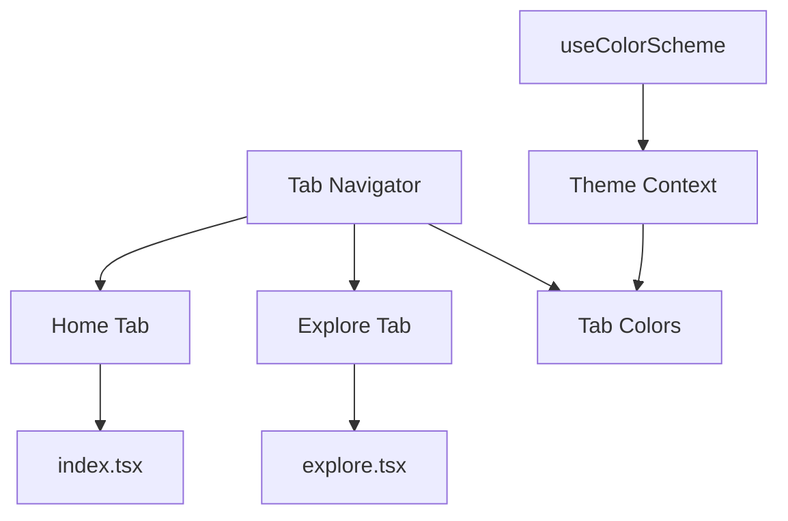
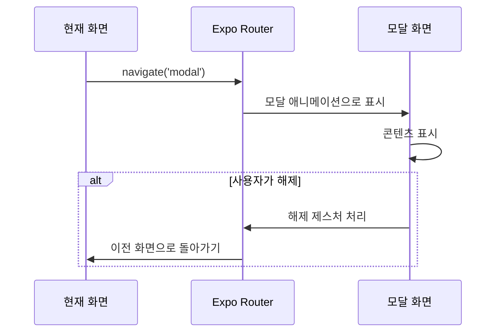
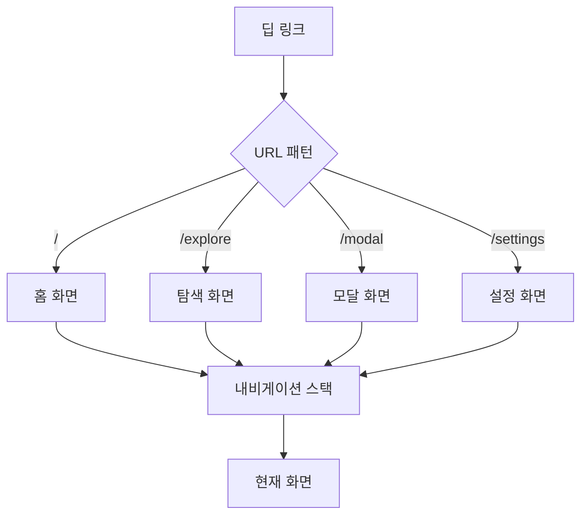

# 라우팅 및 내비게이션

<cite>
**이 문서에서 참조된 파일**   
- [src/app/_layout.tsx](file://src/app/_layout.tsx)
- [src/app/(tabs)/_layout.tsx](file://src/app/(tabs)/_layout.tsx)
- [src/app/modal.tsx](file://src/app/modal.tsx)
- [src/app/+html.tsx](file://src/app/+html.tsx)
- [src/app/(tabs)/index.tsx](file://src/app/(tabs)/index.tsx)
- [src/app/(tabs)/explore.tsx](file://src/app/(tabs)/explore.tsx)
</cite>

## 목차

1. [소개](#소개)
2. [파일 기반 라우팅 시스템](#파일-기반-라우팅-시스템)
3. [탭 내비게이션 구성](#탭-내비게이션-구성)
4. [모달 화면 구현](#모달-화면-구현)
5. [내비게이션 패턴 및 딥 링크](#내비게이션-패턴-및-딥-링크)
6. [인증 플로우와의 통합](#인증-플로우와의-통합)
7. [라우트 구성 모범 사례](#라우트-구성-모범-사례)
8. [결론](#결론)

## 소개

Plate 애플리케이션은 Expo Router의 파일 기반 라우팅 아키텍처를 사용하여 현대적인 내비게이션 시스템을 구현합니다. 이 접근 방식은 파일 시스템 계층 구조를 통해 애플리케이션 라우트를 정의하는 구조화되고 직관적인 방법을 제공하여 스택 기반 내비게이션과 탭 기반 인터페이스를 모두 가능하게 합니다. 라우팅 시스템은 여러 플랫폼(iOS, Android, 웹)을 지원하도록 설계되었으며 기기 전반에 걸쳐 일관된 내비게이션 동작을 유지합니다. 이 문서는 탭 내비게이션, 모달 프레젠테이션 및 애플리케이션 상태 관리와의 통합에 초점을 맞춰 라우팅 시스템의 구현을 자세히 설명합니다.

## 파일 기반 라우팅 시스템

Plate 애플리케이션은 Expo Router의 파일 기반 라우팅 시스템을 활용하여 파일 시스템 구조를 직접 탐색 가능한 라우트에 매핑합니다. 루트 라우트 구성은 `src/app/_layout.tsx`에 정의되어 있으며, 스택 네비게이터가 기본 내비게이션 컨테이너 역할을 합니다. 이 스택 네비게이터는 초기 라우트를 `(tabs)` 디렉토리로 구성하고 오버레이 프레젠테이션을 위한 모달 라우트도 정의합니다. `unstable_settings` export는 라우팅 시스템을 `(tabs)` 디렉토리에 고정하여 애플리케이션의 기본 진입점으로 설정합니다. 이 파일 기반 접근 방식은 수동 라우트 구성의 필요성을 제거하고 디렉토리 구조를 기반으로 자동 라우트 검색을 가능하게 합니다.

```mermaid
graph TB
A[src/app] --> B[_layout.tsx]
A --> C[(tabs)]
A --> D[modal.tsx]
A --> E[+html.tsx]
C --> F[_layout.tsx]
C --> G[index.tsx]
C --> H[explore.tsx]
B --> I[Stack Navigator]
I --> J[(tabs) route]
I --> K[modal route]
```

**다이어그램 출처**

- [src/app/\_layout.tsx](file://src/app/_layout.tsx#L7-L33)
- [src/app/(tabs)/\_layout.tsx](<file://src/app/(tabs)/_layout.tsx#L1-L32>)

**섹션 출처**

- [src/app/\_layout.tsx](file://src/app/_layout.tsx#L1-L44)

## 탭 내비게이션 구성

Plate 애플리케이션의 탭 내비게이션은 탭 네비게이터를 구성하는 전용 `_layout.tsx` 파일을 포함하는 `(tabs)` 디렉토리를 통해 구현됩니다. 이 레이아웃 파일은 Expo Router의 `Tabs` 컴포넌트를 사용하여 홈 화면(`index.tsx`) 및 탐색 화면(`explore.tsx`)을 포함한 여러 탭 화면을 정의합니다. 탭 네비게이터는 현재 색상 scheme에 따라 활성 탭 색상을 설정하고 더 깔끔한 인터페이스를 위해 헤더 바를 숨기는 `screenOptions`를 통해 일관된 스타일링으로 구성됩니다. 탭 제목은 각 `Tabs.Screen` 컴포넌트에서 정의되어 내비게이션을 위한 사용자 친화적인 레이블을 제공합니다.

구현은 `useColorScheme` 훅을 통해 애플리케이션의 테마 시스템을 활용하여 활성 탭 표시기 색상이 사용자의 선호 테마(라이트 또는 다크 모드)에 적응하도록 보장합니다. 이러한 동적 테마 설정은 시스템 전체 모양 설정과 일치하는 응집력 있는 사용자 경험을 만듭니다. 탭 내비게이션 구조는 각 탭 내에서 현재 내비게이션 상태를 유지하면서 주요 애플리케이션 섹션 간의 원활한 전환을 지원합니다.



**다이어그램 출처**

- [src/app/(tabs)/\_layout.tsx](<file://src/app/(tabs)/_layout.tsx#L1-L32>)
- [constants/theme.ts](file://constants/theme.ts)

**섹션 출처**

- [src/app/(tabs)/\_layout.tsx](<file://src/app/(tabs)/_layout.tsx#L1-L32>)
- [src/app/(tabs)/index.tsx](<file://src/app/(tabs)/index.tsx#L1-L13>)
- [src/app/(tabs)/explore.tsx](<file://src/app/(tabs)/explore.tsx#L1-L14>)

## 모달 화면 구현

Plate 애플리케이션의 모달 화면은 최상위 라우트 파일로 구현되며, 주요 모달은 `modal.tsx`에 정의됩니다. 이 파일은 현재 내비게이션 스택 위에 오버레이로 표시될 수 있는 독립형 화면을 나타냅니다. 모달 라우트는 루트 레이아웃에서 모달 인터페이스로서의 동작을 정의하는 특정 프레젠테이션 옵션으로 구성됩니다. `presentation: 'modal'` 옵션은 화면이 적절한 플랫폼별 애니메이션 및 해제 제스처와 함께 중앙 오버레이로 나타나도록 보장합니다.

모달 구현은 오버레이 화면에 대한 Expo Router의 규칙을 따르며 프로그래밍 방식 및 제스처 기반 해제를 모두 허용합니다. 모바일 플랫폼에서 사용자는 일반적으로 아래로 스와이프하여 모달을 해제할 수 있으며, 접근성을 위해 전용 닫기 버튼 또는 내비게이션 헤더가 제공될 수 있습니다. 모달 화면은 라우트 구성을 통해 매개변수를 받을 수 있어 컨텍스트에 따라 동적 콘텐츠 프레젠테이션이 가능합니다. 이 접근 방식은 설정 대화 상자, 확인 프롬프트 및 상세 콘텐츠 보기와 같은 일반적인 사용 사례를 지원하며 주요 내비게이션 플로우를 방해하지 않습니다.



**다이어그램 출처**

- [src/app/\_layout.tsx](file://src/app/_layout.tsx#L26-L31)
- [src/app/modal.tsx](file://src/app/modal.tsx#L1-L10)

**섹션 출처**

- [src/app/\_layout.tsx](file://src/app/_layout.tsx#L26-L31)
- [src/app/modal.tsx](file://src/app/modal.tsx#L1-L10)

## 내비게이션 패턴 및 딥 링크

Plate 애플리케이션은 Expo Router의 내장 기능을 통해 다양한 내비게이션 패턴을 지원합니다. 스택 내비게이션은 적절한 뒤로 버튼 동작 및 전환 애니메이션과 함께 화면 간의 계층적 이동을 가능하게 합니다. 파일 기반 라우팅 시스템은 디렉토리 구조를 기반으로 내비게이션 경로를 자동으로 생성하여 특정 애플리케이션 상태로의 딥 링크를 허용합니다. 예를 들어, `/explore`와 같은 URL은 탐색 탭으로 직접 탐색하고, `/modal`은 모달 오버레이를 엽니다.

딥 링크는 Expo Router의 플랫폼 링크 시스템과의 통합을 통해 촉진되어 외부 URL이 특정 애플리케이션 화면을 열 수 있도록 합니다. 이 기능은 이메일 확인 링크, 푸시 알림 라우팅 및 소셜 공유와 같은 사용 사례를 지원합니다. `_layout.tsx`의 라우팅 구성은 내비게이션 계층 구조를 정의하여 딥 링크가 애플리케이션의 내비게이션 스택 내에서 적절한 컨텍스트를 유지하도록 보장합니다. 매개변수는 표준 쿼리 문자열 구문 또는 동적 라우트 세그먼트를 사용하여 라우트 URL을 통해 전달될 수 있어 풍부하고 상태 유지 내비게이션 패턴을 가능하게 합니다.



**다이어그램 출처**

- [src/app/\_layout.tsx](file://src/app/_layout.tsx#L25-L32)
- [package.json](file://package.json)

**섹션 출처**

- [src/app/\_layout.tsx](file://src/app/_layout.tsx#L25-L32)

## 인증 플로우와의 통합

라우팅 시스템은 사용자의 인증 상태에 따라 보호된 라우트에 대한 액세스를 제어하여 인증 플로우와 통합됩니다. 현재 구현이 명시적으로 인증 가드를 표시하지는 않지만, 구조는 레이아웃 컴포넌트 및 라우트 인터셉터를 통해 이러한 기능을 지원합니다. 루트 레이아웃의 Providers 컴포넌트는 내비게이션 동작에 영향을 미치는 인증 상태를 포함할 수 있는 컨텍스트 기반 상태 관리 접근 방식을 제안합니다.

인증 통합은 일반적으로 로그인 상태에 따른 조건부 내비게이션을 포함하며, 인증되지 않은 사용자를 로그인 화면으로 리디렉션하면서 인증된 사용자에게는 보호된 콘텐츠에 대한 액세스를 허용합니다. 탭 내비게이션 구조는 애플리케이션의 공개 및 비공개 섹션 간의 자연스러운 분리를 제공하며, 특정 탭은 잠재적으로 인증을 요구할 수 있습니다. 모달 화면은 내비게이션 스택을 방해하지 않고 현재 콘텐츠 위에 나타나는 인증 프롬프트 또는 계정 관리에 사용될 수 있습니다.

**섹션 출처**

- [src/app/\_layout.tsx](file://src/app/_layout.tsx#L35-L43)
- [components/provider/ThemeProvider/](file://components/provider/ThemeProvider/)

## 라우트 구성 모범 사례

Plate 애플리케이션은 Expo Router 애플리케이션에서 라우트 구성에 대한 여러 모범 사례를 보여줍니다. 디렉토리 이름에 괄호 `(tabs)`를 사용하면 URL 경로에 표시되지 않지만 관련 화면에 대한 논리적 구성을 제공하는 라우트 그룹이 생성됩니다. 이 패턴은 명확한 파일 시스템 구성을 유지하면서 URL 구조를 깔끔하게 유지합니다. `modal.tsx`와 같은 최상위 라우트 파일은 애플리케이션의 어디에서나 액세스할 수 있는 독립형 화면을 나타냅니다.

레이아웃 파일(`_layout.tsx`)을 화면 컴포넌트와 분리하면 내비게이션 레벨 전반에 걸쳐 재사용성과 일관성이 촉진됩니다. 각 레이아웃 파일은 하위 라우트에 대한 내비게이션 옵션 및 프로바이더를 구성하여 계층적 구성 시스템을 만듭니다. 구현은 또한 정적 렌더링을 위한 웹 특정 HTML 요소를 구성하는 `+html.tsx` 파일과 함께 플랫폼별 규칙을 따릅니다. 플랫폼 차이에 대한 이러한 주의는 iOS, Android 및 웹 환경 전반에 걸쳐 일관된 동작을 보장합니다.

추가 모범 사례에는 설명적인 라우트 이름 사용, 일관된 내비게이션 패턴 유지 및 일반적인 사용 사례에 대한 Expo Router의 내장 기능 활용이 포함됩니다. 파일 기반 접근 방식은 구성 오버헤드를 줄이고 파일 시스템 레이아웃에서 라우팅 구조를 즉시 명확하게 만듭니다. TypeScript를 통해 타입 안전성이 유지되어 라우트 매개변수 및 내비게이션 props가 적절히 정의되고 확인됩니다.

**섹션 출처**

- [src/app/\_layout.tsx](file://src/app/_layout.tsx#L1-L44)
- [src/app/(tabs)/\_layout.tsx](<file://src/app/(tabs)/_layout.tsx#L1-L32>)
- [src/app/+html.tsx](file://src/app/+html.tsx#L1-L32)

## 결론

Plate 애플리케이션의 라우팅 및 내비게이션 시스템은 Expo Router의 파일 기반 접근 방식을 효과적으로 활용하여 구조화되고 유지보수 가능한 내비게이션 아키텍처를 만듭니다. 디렉토리 기반 라우트 그룹, 스택 및 탭 네비게이터, 모달 프레젠테이션을 활용하여 애플리케이션은 플랫폼 전반에 걸쳐 포괄적인 내비게이션 경험을 제공합니다. 구현은 라우트 구성, 테마 통합 및 플랫폼별 구성에서 모범 사례를 보여줍니다. 이 기반은 현재 기능과 향후 확장을 모두 지원하여 일관된 사용자 경험을 유지하면서 새로운 화면, 내비게이션 패턴 및 인증 플로우를 추가할 수 있도록 합니다.
