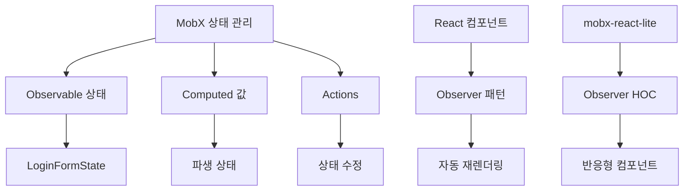
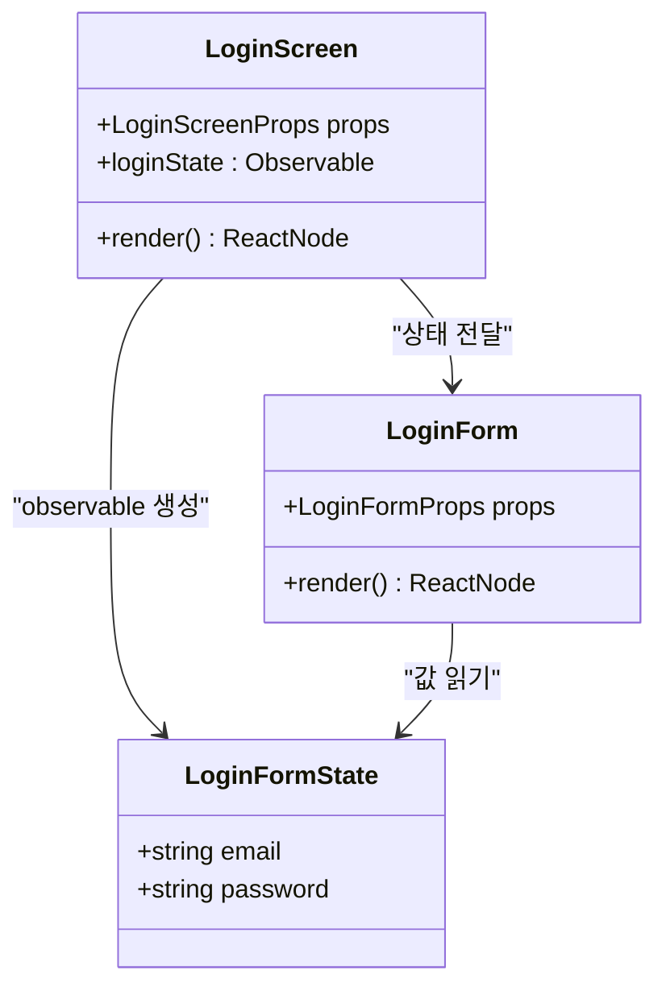
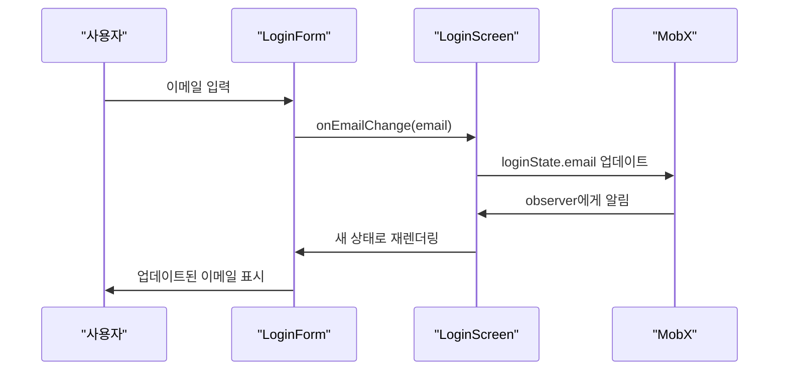

# 상태 관리

<cite>
**이 문서에서 참조된 파일**  
- [LoginForm.tsx](file://components/form/LoginForm/LoginForm.tsx)
- [LoginScreen.tsx](file://components/screen/LoginScreen/LoginScreen.tsx)
- [LoginScreenView.tsx](file://components/screen/LoginScreen/LoginScreenView.tsx)
- [TextField/index.tsx](file://components/ui/inputs/TextField/index.tsx)
- [ListSelect/index.tsx](file://components/ui/inputs/ListSelect/index.tsx)
- [Screen.tsx](file://components/ui/layouts/Screen/Screen.tsx)
- [package.json](file://package.json)
</cite>

## 목차
1. [소개](#소개)
2. [MobX 구현 개요](#mobx-구현-개요)
3. [핵심 상태 관리 패턴](#핵심-상태-관리-패턴)
4. [LoginFormState 구현](#loginformstate-구현)
5. [MobX-React 통합](#mobx-react-통합)
6. [모범 사례 및 최적화](#모범-사례-및-최적화)
7. [일반적인 문제 및 해결책](#일반적인-문제-및-해결책)

## 소개

Plate 애플리케이션은 MobX를 사용하여 애플리케이션 상태, 특히 폼 및 화면 컴포넌트의 상태를 관리하는 강력한 상태 관리 시스템을 구현합니다. 이 문서는 observable 상태, computed 값, action에 사용되는 패턴에 초점을 맞춰 MobX 구현에 대한 포괄적인 분석을 제공합니다. 시스템은 UI 컴포넌트와 상태 관리 간의 명확한 관심사 분리를 보여주며, 특히 LoginFormState 패턴을 통한 폼 상태 처리에 중점을 둡니다. MobX와 React의 통합은 mobx-react-lite를 통해 달성되며, observer 패턴을 활용하여 observable이 변경될 때 자동으로 업데이트되는 반응형 컴포넌트를 만듭니다.

**섹션 출처**
- [package.json](file://package.json#L88-L89)

## MobX 구현 개요

Plate 애플리케이션은 MobX 버전 6.13.7을 주요 상태 관리 솔루션으로 사용하며, mobx-react-lite 버전 4.1.0이 React 통합 계층을 제공합니다. 이 조합은 애플리케이션 상태를 직접 수정할 수 있으면서도 영향을 받는 모든 컴포넌트가 자동으로 업데이트되도록 보장하는 투명한 함수형 반응형 프로그래밍(FRP) 접근 방식을 가능하게 합니다. 구현은 observer 컴포넌트가 소비할 수 있는 observable 상태 객체를 생성하여 MobX 모범 사례를 따르며, 관찰된 상태가 변경되면 반응적으로 재렌더링됩니다. 상태 관리 아키텍처는 가볍고 직관적으로 설계되어 다른 상태 관리 솔루션과 일반적으로 관련된 보일러플레이트를 피하면서 우수한 TypeScript 지원을 유지합니다.

**다이어그램 출처**
- [package.json](file://package.json#L88-L89)

## 핵심 상태 관리 패턴

Plate 애플리케이션은 효과적인 상태 관리를 위해 여러 주요 MobX 패턴을 사용합니다. Observable 상태는 MobX의 `observable` 함수를 사용하여 생성되며, 이는 객체, 배열 및 원시 값을 반응형으로 만듭니다. 상태를 수정하는 action은 `action` 데코레이터로 래핑되어 원자적 업데이트 및 최적의 성능을 보장합니다. 구현은 또한 종속성이 변경될 때 자동으로 업데이트되는 파생 상태에 대한 computed 값을 활용합니다. 폼 관리의 경우, 애플리케이션은 폼 상태가 폼 컴포넌트에 props로 전달되는 전용 상태 객체(LoginFormState와 같은)에 캡슐화되는 패턴을 사용합니다. 이 접근 방식은 UI와 상태 로직 간의 명확한 분리를 유지하면서 재사용성과 테스트 가능성을 촉진합니다.

**섹션 출처**
- [LoginForm.tsx](file://components/form/LoginForm/LoginForm.tsx#L7-L10)
- [TextField/index.tsx](file://components/ui/inputs/TextField/index.tsx#L1-L52)
- [ListSelect/index.tsx](file://components/ui/inputs/ListSelect/index.tsx#L1-L87)

## LoginFormState 구현

LoginFormState 구현은 폼 상태 관리를 위한 MobX의 실용적인 적용을 보여줍니다. LoginFormState 인터페이스는 이메일 및 비밀번호 필드로 로그인 폼 상태의 구조를 정의합니다. 이 상태 객체는 LoginScreen 컴포넌트 내에서 MobX의 `observable` 함수를 사용하여 생성됩니다. LoginForm 컴포넌트는 이 상태 객체를 prop으로 받아 입력 필드를 제어하기 위해 속성에 직접 액세스합니다. 사용자 상호작용이 발생하면 상태는 부모 컴포넌트에서 전달된 콜백 함수(onEmailChange, onPasswordChange)를 통해 업데이트됩니다. 이 패턴은 폼 상태가 중앙 집중화되어 필요에 따라 쉽게 유효성 검사, 직렬화 또는 다른 컴포넌트와 공유할 수 있도록 보장합니다.

**다이어그램 출처**
- [LoginForm.tsx](file://components/form/LoginForm/LoginForm.tsx#L7-L10)
- [LoginScreen.tsx](file://components/screen/LoginScreen/LoginScreen.tsx#L1-L29)

**섹션 출처**
- [LoginForm.tsx](file://components/form/LoginForm/LoginForm.tsx#L7-L10)
- [LoginScreen.tsx](file://components/screen/LoginScreen/LoginScreen.tsx#L1-L29)

## MobX-React 통합

Plate 애플리케이션에서 MobX와 React의 통합은 `observer` 고차 컴포넌트(HOC)를 제공하는 mobx-react-lite 라이브러리를 통해 달성됩니다. 상태 변경에 반응해야 하는 컴포넌트는 `observer` 함수로 래핑되어 렌더링 중에 소비하는 모든 observable에 대해 반응형이 됩니다. LoginScreen 컴포넌트는 이 패턴의 주요 예로, `observer`로 데코레이트되어 loginState observable이 변경될 때 자동으로 재렌더링됩니다. 또한 TextField 및 ListSelect와 같은 여러 UI 컴포넌트도 observer 컴포넌트로 구현되어 폼 컨텍스트에서 사용될 때 MobX 상태 변경에 응답할 수 있습니다. 이 통합 패턴은 MobX의 세밀한 반응성 시스템을 활용하여 의존하는 특정 observable이 변경된 경우에만 컴포넌트를 업데이트하여 효율적인 렌더링을 보장합니다.

**다이어그램 출처**
- [LoginScreen.tsx](file://components/screen/LoginScreen/LoginScreen.tsx#L1-L29)
- [TextField/index.tsx](file://components/ui/inputs/TextField/index.tsx#L1-L52)

**섹션 출처**
- [LoginScreen.tsx](file://components/screen/LoginScreen/LoginScreen.tsx#L1-L29)
- [TextField/index.tsx](file://components/ui/inputs/TextField/index.tsx#L1-L52)
- [Screen.tsx](file://components/ui/layouts/Screen/Screen.tsx#L1-L13)

## 모범 사례 및 최적화

Plate 애플리케이션은 MobX 상태 관리 및 성능 최적화를 위한 여러 모범 사례를 따릅니다. 상태는 UI에 필요한 것으로 최소화되고 집중되며, 복잡한 상태 로직은 전용 상태 객체에 캡슐화됩니다. observable 원시 값과 객체의 사용은 최적의 성능을 보장하기 위해 균형을 이루며, 더 큰 상태 트리는 불필요한 재렌더링을 피하기 위해 신중하게 관리됩니다. 구현은 MobX의 내장 배칭 메커니즘을 활용하여 여러 상태 업데이트를 단일 재렌더링 사이클로 그룹화합니다. 폼 컴포넌트의 경우, 개별 값보다 상태 객체를 props로 전달하는 패턴은 재사용성을 촉진하고 상태 관리를 더 예측 가능하게 만듭니다. 또한 애플리케이션은 TypeScript를 광범위하게 사용하여 상태 객체에 강력한 타입을 제공하고 런타임 오류를 줄이며 개발자 경험을 향상시킵니다.

**섹션 출처**
- [LoginForm.tsx](file://components/form/LoginForm/LoginForm.tsx)
- [LoginScreen.tsx](file://components/screen/LoginScreen/LoginScreen.tsx)
- [TextField/index.tsx](file://components/ui/inputs/TextField/index.tsx)

## 일반적인 문제 및 해결책

Plate의 MobX 구현은 강력하지만 개발자는 잠재적인 문제와 해결책을 알고 있어야 합니다. observer 컴포넌트가 제대로 언마운트되지 않으면 메모리 누수가 발생할 수 있으며, 이는 React 컴포넌트 라이프사이클을 준수하고 MobX reaction이 적절히 dispose되도록 보장함으로써 완화됩니다. 단일 컴포넌트가 너무 많은 observable을 소비하면 과도한 재렌더링으로 인한 성능 문제가 발생할 수 있으며, 이는 대형 컴포넌트를 더 작고 집중된 observer 컴포넌트로 분해하여 해결할 수 있습니다. 또 다른 일반적인 문제는 action 외부에서 상태를 실수로 수정하여 일관되지 않은 상태 업데이트가 발생하는 것입니다. 이는 상태 수정에 대해 일관되게 action 데코레이터를 사용함으로써 방지됩니다. TypeScript 및 적절한 린팅 규칙의 사용은 개발 중에 이러한 문제의 많은 부분을 포착하는 데 도움이 됩니다.

**섹션 출처**
- [LoginForm.tsx](file://components/form/LoginForm/LoginForm.tsx)
- [LoginScreen.tsx](file://components/screen/LoginScreen/LoginScreen.tsx)
- [TextField/index.tsx](file://components/ui/inputs/TextField/index.tsx)
