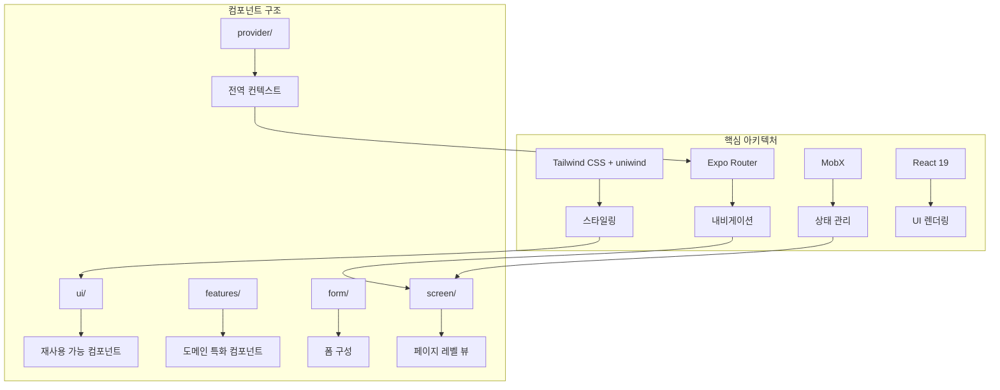
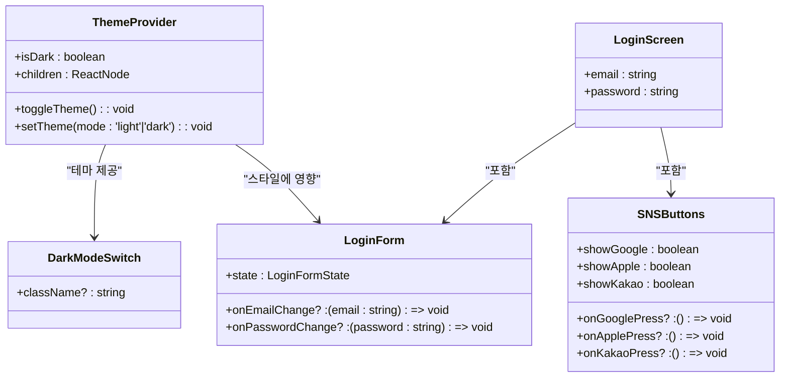
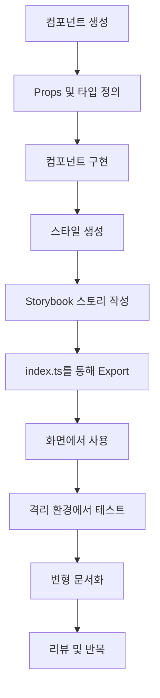
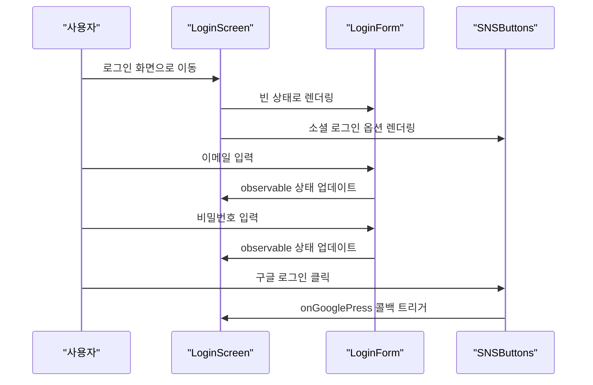
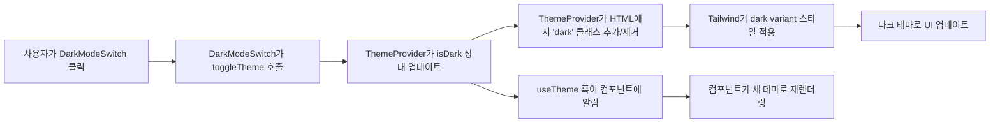

# 프로젝트 개요

<cite>
**이 문서에서 참조된 파일**   
- [README.md](file://README.md)
- [package.json](file://package.json)
- [src/app/_layout.tsx](file://src/app/_layout.tsx)
- [components/provider/ThemeProvider/ThemeProvider.tsx](file://components/provider/ThemeProvider/ThemeProvider.tsx)
- [hooks/useTheme.ts](file://hooks/useTheme.ts)
- [constants/theme.ts](file://constants/theme.ts)
- [components/screen/LoginScreen/LoginScreen.tsx](file://components/screen/LoginScreen/LoginScreen.tsx)
- [components/form/LoginForm/LoginForm.tsx](file://components/form/LoginForm/LoginForm.tsx)
- [components/ui/inputs/Button/Button.tsx](file://components/ui/inputs/Button/Button.tsx)
- [components/ui/inputs/DarkModeSwitch/DarkModeSwitch.tsx](file://components/ui/inputs/DarkModeSwitch/DarkModeSwitch.tsx)
- [components/features/SNSButtons/SNSButtons.tsx](file://components/features/SNSButtons/SNSButtons.tsx)
- [unistyles.ts](file://unistyles.ts)
- [uniwind-types.d.ts](file://uniwind-types.d.ts)
</cite>

## 목차

1. [소개](#소개)
2. [아키텍처 개요](#아키텍처-개요)
3. [핵심 컴포넌트](#핵심-컴포넌트)
4. [Storybook을 활용한 컴포넌트 주도 개발](#storybook을-활용한-컴포넌트-주도-개발)
5. [실전 예제](#실전-예제)
6. [결론](#결론)

## 소개

Plate 모바일 애플리케이션은 Expo, React Native, React 19로 구축된 크로스 플랫폼 피트니스 수업 예약 및 관리 시스템입니다. iOS, Android, 웹 플랫폼을 지원하도록 설계된 Plate는 사용자가 모든 기기에서 원활하게 피트니스 수업을 검색하고, 예약하고, 관리할 수 있도록 합니다. 애플리케이션은 재사용성, 유지보수성 및 개발자 경험에 중점을 둔 컴포넌트 주도 아키텍처를 따릅니다.

내비게이션을 위한 Expo Router, 상태 관리를 위한 MobX, 스타일링을 위한 Tailwind CSS와 uniwind를 사용하여 구축된 Plate는 현대적인 React 관행을 활용하여 반응형이고 접근 가능한 사용자 인터페이스를 제공합니다. 프로젝트 구조는 Material UI(MUI) 표준을 따르며, 컴포넌트를 inputs, display, surfaces, layouts, feedback과 같은 논리적 카테고리로 구성합니다. 이러한 체계적인 접근 방식은 코드베이스 전반의 명확성과 일관성을 보장하여 초보자와 숙련된 개발자 모두가 기능을 탐색하고 확장하기 쉽게 만듭니다.

애플리케이션은 컴포넌트 문서화 및 테스트를 위해 Storybook을 통합하여 격리된 개발 및 시각적 회귀 테스트를 가능하게 합니다. 접근성과 테마 설정에 중점을 둔 Plate는 기본적으로 다크 모드 전환 및 반응형 디자인을 지원하여 다양한 사용자 선호도와 기기 유형에서 일관된 경험을 보장합니다.

## 아키텍처 개요

Plate의 아키텍처는 Expo의 파일 기반 라우팅 시스템을 중심으로 구조화되어 있으며, `src/app/` 디렉토리가 애플리케이션의 내비게이션 구조를 정의합니다. `src/app/_layout.tsx`의 루트 레이아웃은 진입점 역할을 하며, ThemeProvider 및 SafeAreaView와 같은 전역 프로바이더로 애플리케이션을 감쌉니다. 이 레이아웃은 `EXPO_PUBLIC_STORYBOOK` 환경 변수에 따라 메인 애플리케이션 또는 Storybook 인터페이스를 조건부로 렌더링하여 개발 모드와 문서화 모드 간의 원활한 전환을 가능하게 합니다.

상태 관리는 MobX를 사용하여 처리됩니다. MobX는 관찰 가능한 데이터 구조와 자동 UI 업데이트를 가능하게 하는 반응형 상태 관리 라이브러리입니다. `LoginScreen`과 같은 컴포넌트는 MobX의 `observable` 및 `observer`를 사용하여 폼 상태를 효율적으로 관리하고, 보일러플레이트를 줄이며 성능을 향상시킵니다. 애플리케이션의 스타일링은 uniwind 라이브러리를 통한 Tailwind CSS로 구동되며, 동적 테마 지원 및 CSS 변수 통합으로 Tailwind의 기능을 확장합니다.

컴포넌트 계층 구조는 `components/` 디렉토리 내에서 5가지 주요 카테고리로 구성됩니다:

- **ui/**: MUI 가이드라인을 따르는 재사용 가능한 프로젝트 독립적 UI 컴포넌트
- **features/**: SNS 로그인 버튼과 같은 도메인 로직이 포함된 프로젝트 특화 컴포넌트
- **form/**: 사용자 입력 폼을 위한 복합 컴포넌트
- **provider/**: 테마 관리와 같은 전역 상태를 위한 컨텍스트 프로바이더
- **screen/**: 애플리케이션 뷰를 나타내는 전체 페이지 컴포넌트

이러한 모듈식 구조는 관심사의 분리를 촉진하여 컴포넌트를 독립적으로 찾고, 재사용하고, 테스트하기 쉽게 만듭니다.

**다이어그램 출처**

- [src/app/\_layout.tsx](file://src/app/_layout.tsx#L1-L44)
- [package.json](file://package.json#L80-L104)

## 핵심 컴포넌트

Plate 애플리케이션은 일관된 디자인 시스템을 따르는 재사용 가능하고 조합 가능한 컴포넌트 모음을 중심으로 구축됩니다. 각 컴포넌트는 메인 컴포넌트 파일, 스타일, 스토리 및 인덱스 export를 포함하는 표준화된 파일 구조로 자체 디렉토리에 구성됩니다. 이러한 접근 방식은 컴포넌트가 독립적이고 유지보수하기 쉽도록 보장합니다.

`ui/` 디렉토리에는 버튼, 텍스트 필드, 카드, 리스트와 같은 기본 UI 요소가 포함되어 있습니다. 이러한 컴포넌트는 프로젝트 전반에서 재사용 가능하도록 설계되었으며 MUI의 분류 시스템을 따릅니다. 예를 들어, `components/ui/inputs/Button/`의 `Button` 컴포넌트는 아이콘 지원 및 컴파운드 컴포넌트와 같은 추가 기능으로 `heroui-native` Button을 확장합니다. 문자열 children을 자동으로 `Button.Label`로 래핑하고 편리한 아이콘 배치를 위한 `startIcon` 및 `endIcon` props를 지원합니다.

`LoginForm`과 같은 폼 컴포넌트는 이러한 기본 UI 요소로 구성되어 `Card` 컨테이너 내에 여러 입력을 결합합니다. 폼은 상태 객체와 입력 변경을 처리하기 위한 콜백 함수를 받아 제어된 컴포넌트 패턴을 촉진합니다. 마찬가지로 `LoginScreen`과 같은 화면 컴포넌트는 MobX observable을 사용하여 자체 상태를 관리하고 `LoginScreenView`와 같은 프레젠테이션 컴포넌트에 렌더링을 위임합니다.

테마 관리는 `components/provider/ThemeProvider/`의 `ThemeProvider`를 통해 구현되며, React Context를 사용하여 전체 애플리케이션에 테마 상태 및 토글 함수를 제공합니다. 테마 컨텍스트는 `DarkModeSwitch`와 같은 컴포넌트에서 사용되어 사용자 선호도 또는 시스템 설정에 따라 동적 테마 전환을 가능하게 합니다.

**다이어그램 출처**

- [components/provider/ThemeProvider/ThemeProvider.tsx](file://components/provider/ThemeProvider/ThemeProvider.tsx#L10-L132)
- [components/ui/inputs/DarkModeSwitch/DarkModeSwitch.tsx](file://components/ui/inputs/DarkModeSwitch/DarkModeSwitch.tsx#L1-L33)
- [components/form/LoginForm/LoginForm.tsx](file://components/form/LoginForm/LoginForm.tsx#L7-L63)
- [components/screen/LoginScreen/LoginScreen.tsx](file://components/screen/LoginScreen/LoginScreen.tsx#L1-L30)
- [components/features/SNSButtons/SNSButtons.tsx](file://components/features/SNSButtons/SNSButtons.tsx#L6-L82)

**섹션 출처**

- [components/provider/ThemeProvider/ThemeProvider.tsx](file://components/provider/ThemeProvider/ThemeProvider.tsx#L1-L132)
- [components/ui/inputs/Button/Button.tsx](file://components/ui/inputs/Button/Button.tsx#L1-L91)
- [components/form/LoginForm/LoginForm.tsx](file://components/form/LoginForm/LoginForm.tsx#L1-L63)

## Storybook을 활용한 컴포넌트 주도 개발

Plate는 Storybook을 통합하여 컴포넌트 주도 개발 워크플로우를 지원하고, 개발자가 격리된 환경에서 UI 컴포넌트를 빌드하고 테스트할 수 있도록 합니다. Storybook 스토리는 `.stories.tsx` 파일로 컴포넌트와 함께 배치되어 각 컴포넌트의 변형 및 상태에 대한 문서화 및 인터랙티브 예제를 제공합니다.

프로젝트는 웹 및 네이티브 Storybook 환경을 모두 지원합니다. 웹 버전은 Vite에서 실행되며 `npm run storybook`을 통해 액세스할 수 있으며, 네이티브 버전은 Expo 앱에 직접 통합되어 `EXPO_PUBLIC_STORYBOOK` 환경 변수를 사용하여 토글할 수 있습니다. 이러한 이중 설정을 통해 개발자는 웹 및 네이티브 컨텍스트 모두에서 컴포넌트를 미리 볼 수 있어 크로스 플랫폼 일관성을 보장합니다.

스토리는 CSF(Component Story Format)를 사용하여 작성되며 다양한 props, 상태 및 상호작용을 보여주는 여러 변형을 포함합니다. 예를 들어, `Button` 컴포넌트에는 다양한 variant(primary, secondary, ghost), 크기(sm, md, lg) 및 상태(아이콘 포함, 로딩)에 대한 스토리가 있습니다. 이러한 스토리는 문서화 및 회귀 테스트 역할을 모두 수행하여 애플리케이션이 발전함에 따라 시각적 일관성을 유지하는 데 도움이 됩니다.

컴포넌트 구조는 MUI의 분류 체계를 기반으로 한 엄격한 명명 및 구성 규칙을 따릅니다. 컴포넌트는 inputs, display, surfaces, layouts와 같은 카테고리로 그룹화되며, 각 카테고리에는 해당 유형의 컴포넌트만 포함됩니다. 이러한 체계적인 접근 방식은 컴포넌트를 쉽게 검색하고 재사용할 수 있게 하여 중복을 줄이고 유지보수성을 향상시킵니다.

**다이어그램 출처**

- [components/ui/inputs/Button/Button.stories.tsx](file://components/ui/inputs/Button/Button.stories.tsx)
- [components/features/SNSButtons/SNSButtons.stories.tsx](file://components/features/SNSButtons/SNSButtons.stories.tsx)
- [components/form/LoginForm/LoginForm.stories.tsx](file://components/form/LoginForm/LoginForm.stories.tsx)

## 실전 예제

### 사용자 인증 플로우

Plate의 사용자 인증 플로우는 여러 컴포넌트가 함께 작동하여 완전한 사용자 경험을 만드는 방법을 보여줍니다. `LoginScreen`은 진입점 역할을 하며 MobX observable을 사용하여 폼 상태를 관리합니다. 이메일 및 비밀번호 입력을 처리하는 `LoginForm` 컴포넌트와 Google, Apple, Kakao와 같은 소셜 로그인 옵션을 위한 `SNSButtons`를 포함합니다.

사용자가 폼을 제출하면 `LoginScreen`은 일반적으로 인증 서비스(제공된 코드에는 표시되지 않음)를 호출하여 자격 증명의 유효성을 검사합니다. 폼 입력은 제어된 컴포넌트로, 값이 MobX observable 상태에 바인딩됩니다. 이러한 반응형 접근 방식은 상태가 변경될 때 수동 재렌더링 없이 UI가 자동으로 업데이트되도록 보장합니다.

**다이어그램 출처**

- [components/screen/LoginScreen/LoginScreen.tsx](file://components/screen/LoginScreen/LoginScreen.tsx#L1-L30)
- [components/form/LoginForm/LoginForm.tsx](file://components/form/LoginForm/LoginForm.tsx#L1-L63)
- [components/features/SNSButtons/SNSButtons.tsx](file://components/features/SNSButtons/SNSButtons.tsx#L1-L82)

### 테마 전환 구현

Plate의 테마 전환은 React Context와 CSS 변수의 조합을 사용하여 구현됩니다. `components/provider/ThemeProvider/`의 `ThemeProvider` 컴포넌트는 현재 테마 모드(`light` 또는 `dark`)와 테마를 토글하거나 설정하는 함수를 제공하는 컨텍스트를 생성합니다. 이 컨텍스트는 `useTheme` 훅에서 소비되며, `DarkModeSwitch`와 같은 컴포넌트에서 현재 상태를 표시하고 사용자 상호작용을 처리하는 데 사용됩니다.

사용자가 다크 모드 스위치를 토글하면 `toggleTheme` 함수가 React 상태를 업데이트하고 HTML 요소에서 `dark` 클래스를 추가하거나 제거하여 DOM을 직접 조작합니다. 이 접근 방식은 Tailwind의 `@variant dark` 지시문을 활용하여 이 클래스의 존재 여부에 따라 다른 스타일을 적용하므로 테마 변경이 전체 애플리케이션에 즉시 반영됩니다.

테마 구성은 `unistyles.ts`에 정의되어 있으며, 색상 스케일, 간격, 타이포그래피 및 기타 디자인 토큰을 포함하는 라이트 및 다크 테마 객체를 export합니다. 이러한 토큰은 애플리케이션 전체에서 사용되어 시각적 일관성을 유지하고 쉬운 테마 사용자 정의를 가능하게 합니다.

**다이어그램 출처**

- [components/provider/ThemeProvider/ThemeProvider.tsx](file://components/provider/ThemeProvider/ThemeProvider.tsx#L30-L114)
- [hooks/useTheme.ts](file://hooks/useTheme.ts#L19-L41)
- [components/ui/inputs/DarkModeSwitch/DarkModeSwitch.tsx](file://components/ui/inputs/DarkModeSwitch/DarkModeSwitch.tsx#L1-L33)

## 결론

Plate 모바일 애플리케이션은 Expo, React Native, React 19를 사용한 현대적인 크로스 플랫폼 개발 관행을 exemplify합니다. 이 아키텍처는 내비게이션을 위한 Expo Router, 효율적인 상태 관리를 위한 MobX, 일관되고 테마 설정 가능한 스타일링을 위한 Tailwind CSS와 uniwind를 결합합니다. Storybook 통합으로 지원되는 컴포넌트 주도 접근 방식은 코드베이스 전반에서 재사용성과 유지보수성을 촉진합니다.

MUI 표준에 따라 컴포넌트를 구성하고 엄격한 명명 규칙을 따름으로써 Plate는 개발자가 애플리케이션을 빠르게 이해하고 확장할 수 있도록 보장합니다. 사용자 인증 및 테마 전환과 같은 기능의 구현은 개별 컴포넌트가 어떻게 함께 작동하여 응집력 있는 사용자 경험을 만드는지 보여줍니다. 접근성, 반응성 및 개발자 경험에 중점을 둔 Plate는 여러 플랫폼에서 확장 가능한 피트니스 수업 관리 애플리케이션을 구축하기 위한 탄탄한 기반을 제공합니다.
